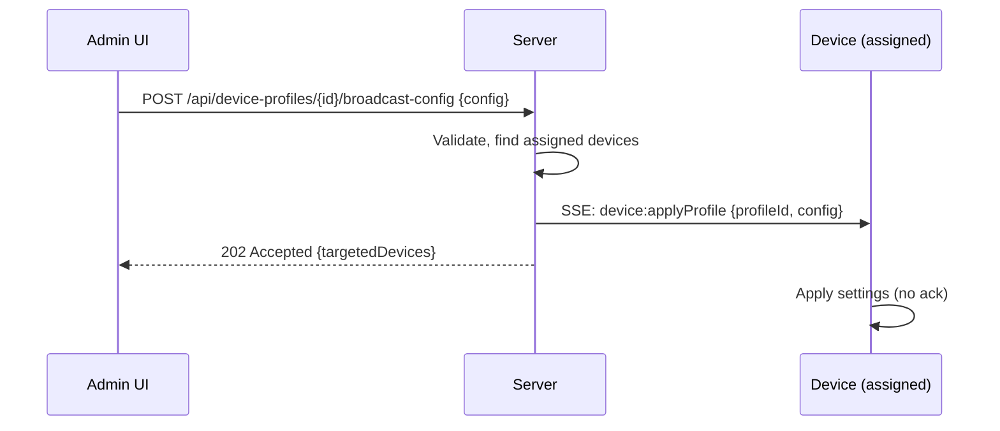
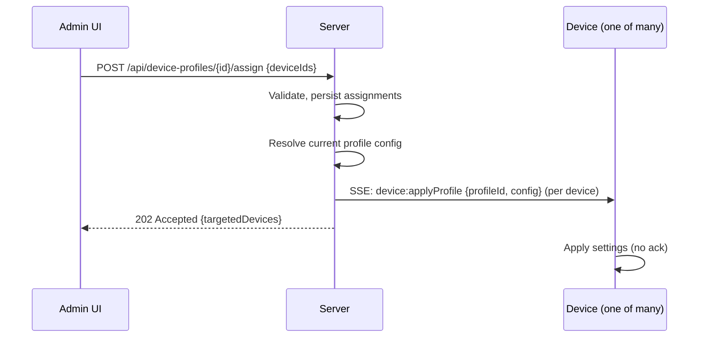

## Real-Time Device Profile Broadcast Architecture (One-Way)

### Overview

This document defines the one-way, server-initiated mechanism for broadcasting device profile settings to devices in real time. It complements `REAL_TIME_ARCHITECTURE.md` by focusing specifically on device profile changes and device-to-profile assignments.

Key principles:
- **Server-led, one-way**: Server pushes profile settings to device(s) via SSE. No device response is required.
- **Stateless on device**: Device applies received settings immediately, without negotiation or acknowledgement.
- **Unified messages**: A single SSE message type conveys profile settings in JSON.

### Triggers

1) **Profile config updated**
- When a device profile’s configuration changes, an API is called with the full device configuration payload.
- Server publishes an SSE message to all devices bound to that profile containing the settings JSON.

2) **Device(s) assigned to a profile**
- Single or bulk assignment of devices to a profile calls an API that accepts one or more `deviceId`s.
- Server resolves the profile’s current config and publishes an SSE message to each device with the settings JSON.

### Communication Pattern

```
Client (Admin UI / System) → Server API → Server SSE Publisher → Device(s)
```

- One-way only. Devices do not post back status for profile broadcasts.
- Delivery is best-effort with server-managed retries (optional). Devices apply last received settings.

### APIs

1) Update Profile Config

```http
POST /api/device-profiles/{profileId}/broadcast-config
Content-Type: application/json

{
  "config": {
    // device profile configuration (JSON), complete/authoritative
  }
}
```

Behavior:
- Validates permissions and profile.
- Identifies all devices currently assigned to `profileId`.
- Publishes one SSE message per device with the provided `config`.
- Returns 202 (accepted) with a summary of targeted devices.

2) Assign Device(s) to Profile (Single or Bulk)

```http
POST /api/device-profiles/{profileId}/assign
Content-Type: application/json

{
  "deviceIds": ["device-1", "device-2", "..."]
}
```

Behavior:
- Validates permissions and profile.
- Records assignment of devices to `profileId`.
- Resolves the profile’s current configuration.
- Publishes one SSE message per device with the settings JSON.
- Returns 202 (accepted) with a summary of targeted devices.

### SSE Message

- Channel: server → device
- Type: `device:applyProfile`

```json
{
  "type": "device:applyProfile",
  "profileId": "abc123",
  "sentAt": "2025-09-29T12:34:56Z",
  "config": {
    // Full, authoritative device settings to apply
  }
}
```

Notes:
- `config` is authoritative and should be applied as-is by the device.
- No `logId` or status exchange is required.

### Sequence Diagrams

1) Profile Config Update → Broadcast to Assigned Devices



2) Assign Single/Bulk Devices → Broadcast Profile Config



### Device Responsibilities

- Listen for `device:applyProfile` messages.
- Apply the provided `config` atomically and idempotently.
- Prefer last-write-wins: the most recent `sentAt` supersedes earlier messages.
- No response to the server is required.

### Server Responsibilities

- Authoritative source of truth for profile configuration.
- On update or assignment, publish `device:applyProfile` with full `config`.
- Optionally implement retry/backoff if the device SSE connection is transiently unavailable.
- Maintain audit logs of broadcasts (who, when, targets, payload hash), but do not await device acknowledgements.

### Frontend (Admin UI) Behavior

- Use API calls to trigger broadcasts or assignments.
- Show non-blocking confirmations (202 Accepted) indicating broadcast has been queued/sent.
- For visibility, display targeted device counts and last broadcast time;
  do not wait for device acks.

### Delivery and Idempotency

- Messages are best-effort. Devices should tolerate duplicate or out-of-order delivery by comparing `sentAt` and applying last-write-wins.
- Include a payload hash on the server side for auditing, deduplication, and diagnostics.

### Security

- Enforce RBAC/ABAC on update and assign APIs.
- Sign SSE streams at connection time (e.g., short-lived tokens) and scope to device.
- Avoid sensitive secrets in `config`; if required, encrypt fields with device-held keys.

### Observability

- Log broadcast issuance (time, profileId, device count, payload hash).
- Track delivery attempts and SSE connection health per device.
- Expose metrics: broadcasts/sec, devices/ broadcast, retry counts.

### Failure Modes

- If a device is offline or disconnected from SSE, the message will not be delivered until reconnect.
- Optional server retry policy on reconnect can re-send the latest profile `config` (last-known-good) to the device.
- Admin UI should reflect broadcast issuance, not device application state.

### Relation to `REAL_TIME_ARCHITECTURE.md`

- Uses the same server-led principle and SSE transport as other real-time features.
- Distinct from action flows: there is no `status`/`progress` exchange; broadcasts are one-way and authoritative.


