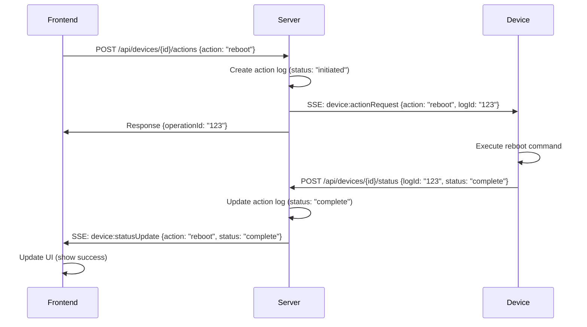
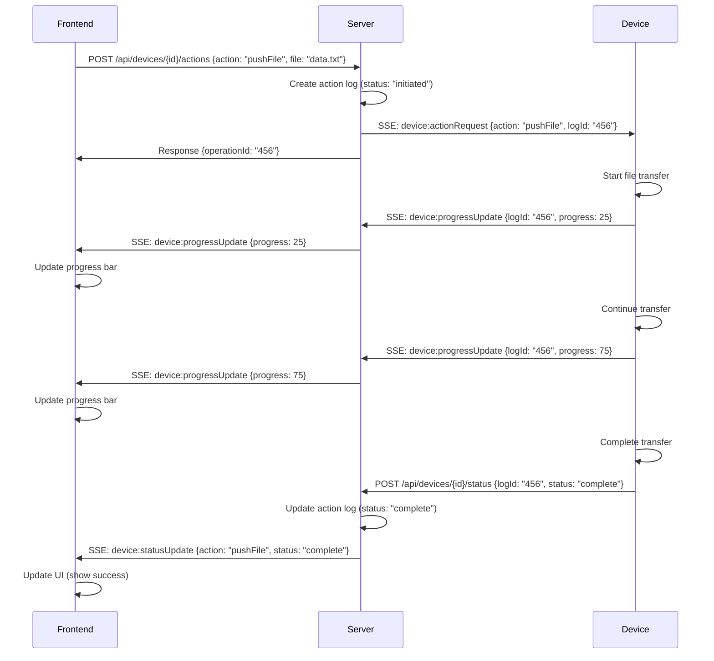
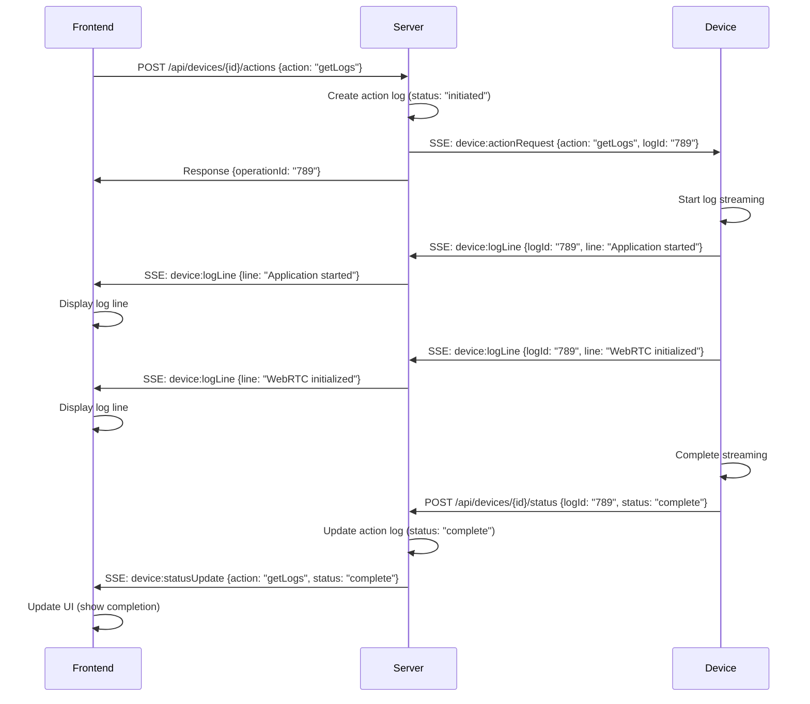

# Real-Time Device Communication Architecture

## Overview

This document outlines the **centralized, server-driven architecture** for real-time device communication. The key principle is that the **server centralizes all logic** and the **device follows server commands** with simple status reporting.

## Core Principles

1. **Server-Centric Design**: Server leads, device follows
2. **Centralized Logic**: All business logic resides on the server
3. **Simple Device Responses**: Device only reports status, never makes decisions
4. **Unified Communication**: Single patterns for similar operations
5. **Real-time UI Updates**: Server pushes updates to frontend via SSE

## Communication Patterns

### 1. Device Actions (API-Based)
**Purpose**: All device operations that require execution and status tracking

**Flow**:
```
Frontend → Server API → Device SSE → Device Handler → Device API Response → Server → Frontend SSE
```

**Examples**:
- Reboot, Restart, Install App
- File Push, File Pull
- Firmware Update
- Log Retrieval

### 2. Real-Time Streaming (SSE-Based)
**Purpose**: Continuous data streams that require real-time updates

**Flow**:
```
Device → Server SSE → Frontend SSE
```

**Examples**:
- Terminal/Remote Desktop
- Screenshot/Snapshot streaming
- Real-time log streaming
- File transfer progress

## Detailed Architecture

### Server Side Components

#### 1. Unified Action API (`/api/devices/[id]/actions`)
```typescript
POST /api/devices/{deviceId}/actions
{
  "action": "reboot|restart|installApp|pushFile|pullFile|updateFirmware|getLogs",
  "payload": { /* action-specific data */ }
}
```

**Responsibilities**:
- Validates device and user permissions
- Creates action log entry
- Publishes SSE message to device
- Sets up timeout handling
- Returns operation ID

#### 2. Device Status API (`/api/devices/[id]/status`)
```typescript
POST /api/devices/{deviceId}/status
{
  "logId": "operation-id",
  "action": "action-name",
  "status": "in_progress|complete|failed",
  "message": "status message",
  "progress": 50 // optional
}
```

**Responsibilities**:
- Receives device status updates
- Updates action log in database
- Publishes SSE message to frontend
- Triggers real-time UI updates

#### 3. SSE Message Publisher
**Message Types**:
- `device:actionRequest` - Server → Device (action command)
- `device:statusUpdate` - Server → Frontend (status update)
- `device:progressUpdate` - Server → Frontend (progress update)

### Device Side Components

#### 1. Device Action Handler
**Responsibilities**:
- Receives action commands via SSE
- Executes device operations
- Sends status updates via API
- Handles all device actions uniformly

**Supported Actions**:
- `reboot`, `restart` - System operations
- `installApp` - Application management
- `pushFile`, `pullFile` - File operations
- `updateFirmware` - System updates
- `getLogs` - Log retrieval

#### 2. Real-Time Handlers
**Responsibilities**:
- Handle continuous data streams
- Send real-time updates via SSE
- Manage streaming connections

**Handlers**:
- `screenshot_handler.go` - Screenshot capture
- `webrtc_handler.go` - Terminal/Remote desktop
- `streaming_logs_handler.go` - Real-time log streaming

### Frontend Components

#### 1. Action Handler Manager
**Responsibilities**:
- Routes messages to appropriate handlers
- Manages handler lifecycle
- Handles both API responses and SSE streams

#### 2. Unified Action Handlers
**Base Classes**:
- `SimpleActionHandler` - For simple actions (reboot, restart)
- `ProgressActionHandler` - For actions with progress (install, firmware)
- `StreamActionHandler` - For streaming actions (logs, files)
- `FileOperationHandler` - For file operations (push, pull)

## Message Flow Examples

### Example 1: Device Reboot



### Example 2: File Push with Progress



### Example 3: Real-Time Log Streaming



## Implementation Guidelines

### 1. Centralized Handler Pattern

All device actions should use the same handler pattern:

```go
type DeviceActionHandler struct {
    // Handles all device actions uniformly
    // Sends API responses for status updates
    // No business logic, just execution and reporting
}
```

### 2. Unified Frontend Handlers

All frontend handlers should extend base classes:

```typescript
// Simple actions (reboot, restart)
class SimpleActionHandler extends BaseHandler {
    // Handles device:statusUpdate messages
    // Shows success/error states
}

// Progress actions (install, firmware)
class ProgressActionHandler extends BaseHandler {
    // Handles device:statusUpdate + progress messages
    // Shows progress bars
}

// Streaming actions (logs, files)
class StreamActionHandler extends BaseHandler {
    // Handles real-time streaming data
    // Manages continuous updates
}
```

### 3. Message Type Standards

**Device → Server (API)**:
- `POST /api/devices/{id}/status` - Status updates
- Always includes `logId`, `action`, `status`, `message`

**Server → Device (SSE)**:
- `device:actionRequest` - Action commands
- Always includes `action`, `logId`, `payload`

**Server → Frontend (SSE)**:
- `device:statusUpdate` - Status updates
- `device:progressUpdate` - Progress updates
- `device:logLine` - Log streaming
- `device:fileProgress` - File transfer progress

## Benefits of This Architecture

### 1. **Centralized Control**
- All business logic on server
- Device follows simple commands
- Easy to audit and maintain

### 2. **Unified Patterns**
- Same handler pattern for all actions
- Consistent message formats
- Reusable components

### 3. **Real-Time Updates**
- Server pushes updates to frontend
- No polling required
- Immediate UI feedback

### 4. **Scalable Design**
- Easy to add new actions
- Consistent error handling
- Centralized logging and monitoring

### 5. **Clean Separation**
- API for actions and status
- SSE for real-time streaming
- Clear responsibilities

## Migration from Current Implementation

### Phase 1: Clean Up Current Code
1. Remove old SSE handlers for device actions
2. Implement unified DeviceActionHandler
3. Update frontend to use unified patterns

### Phase 2: Implement New Architecture
1. Create unified action API
2. Implement device status API
3. Update frontend handlers

### Phase 3: Add Real-Time Features
1. Implement progress tracking
2. Add file operation streaming
3. Enhance log streaming

## Implementation Status

### ✅ **Completed Features**

#### 1. Unified Communication Patterns
**Status**: ✅ Implemented
- All device actions use API-based flow
- Real-time streaming uses SSE
- Consistent message handling across all actions

#### 2. Unified Message Handling
**Status**: ✅ Implemented
- Single DeviceActionHandler for all device actions
- Unified frontend handlers with base classes
- Consistent message processing

#### 3. Centralized Status Updates
**Status**: ✅ Implemented
- Device sends status via API
- Server publishes SSE updates to frontend
- Complete audit trail and logging

#### 4. Real-Time UI Updates
**Status**: ✅ Implemented
- Server pushes updates via SSE
- No polling required
- Immediate feedback for all actions

### 🔄 **Current Working Features**

#### Device Actions
- ✅ Reboot/Restart with real-time updates
- ✅ Single log entry per action
- ✅ Server-calculated duration
- ✅ Progress tracking for file operations

#### Real-Time Streaming
- ✅ Screenshot streaming
- ✅ Log streaming with real-time updates
- ✅ Terminal/Remote desktop via WebRTC

#### Frontend Integration
- ✅ Real-time UI updates
- ✅ Progress bars for file operations
- ✅ Status indicators for all actions
- ✅ Clean action history

### 📋 **Next Steps**

1. **Test file operations** end-to-end (push/pull)
2. **Verify progress tracking** accuracy for all operations
3. **Add timeout handling** for long-running operations
4. **Enhance error handling** and recovery mechanisms
5. **Optimize performance** for high-frequency updates
6. **Implement distributed publish layer** so routing events can fan out safely across horizontally scaled nodes
   - Replace in-memory shared stores with Redis-backed implementations (connections, subscriptions, node ownership)
   - Broadcast routing messages via Redis pub/sub and let each node deliver only to its local SSE/WebSocket clients
   - Add heartbeat + TTL cleanup to expire orphaned connections when a node goes offline

This architecture provides a clean, scalable foundation for real-time device communication while maintaining the principle that the server leads and the device follows.
