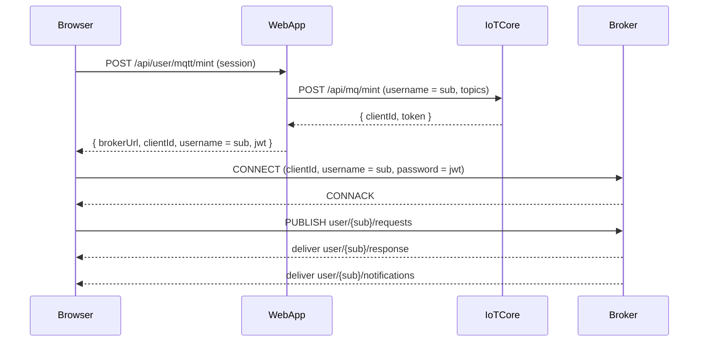

# Architecture Documentation

This folder contains core system architecture and design documents for the IoT Management System.

## 📋 Documents

### [Scalable Event Processing](./SCALABLE_EVENT_PROCESSING.md)
**Last updated: 2025-01-26 – Added batch processing and modular architecture**

High-performance event processing system designed to handle 100k+ devices with:
- **Modular Architecture**: Specialized modules for different responsibilities
- **Batch Processing**: 500x faster than individual processing
- **State Management**: Redis/file-based state tracking
- **Event Deduplication**: Prevents duplicate event processing
- **ClickHouse Integration**: High-performance event storage

### [Bundle Status Pipeline](./BUNDLE_STATUS_PIPELINE.md)
**Last updated: 2025-01-26 – Added modular scheduler architecture**

Real-time bundle installation status tracking system with:
- **Modular Scheduler**: Coordinated processing across specialized modules
- **Batch Processing**: Efficient handling of large device volumes
- **Wave Progression**: Automatic wave advancement
- **Real-time Updates**: SSE-based status broadcasting
- **State Management**: Comprehensive state tracking

### [Device Status Redis](./DEVICE_STATUS_REDIS.md)
**Last updated: 2025-01-26 – Added batch processing details**

State management and caching strategies using Redis:
- **Hybrid State Management**: File-based (local) and Redis (production)
- **Batch Processing**: 500x performance improvement
- **Memory Management**: Automatic cleanup of completed bundles
- **Scalability**: Supports multiple server instances
- **Fault Tolerance**: Graceful fallback mechanisms

### [Device Data Flow](./DEVICE_DATA_FLOW.md)
**Last updated: 2025-01-26 – Real-time device data architecture**

Real-time device data flow architecture with ClickHouse and PostgreSQL:
- **ClickHouse Integration**: High-volume raw data storage
- **PostgreSQL Metadata**: Device and user information
- **SSE Communication**: Real-time data streaming
- **Data Processing**: Efficient data transformation
- **Scalability**: Handles 100k+ devices with 50+ apps each

### [PIN App Data](./PIN_APP_DATA.md)
**Last updated: 2025-01-26 – Hierarchical pin management system**

Hierarchical pin management system for device apps:
- **Rule Hierarchy**: Admin, account, and user rules
- **Real-time Updates**: SSE-based rule broadcasting
- **Rule Engine**: Complex rule processing and targeting
- **Performance**: Handles 100k+ devices with complex logic
- **Security**: Multi-layer rule validation

### [WebRTC Architecture](./WEBRTC_ARCHITECTURE.md)
**Last updated: 2025-01-26 – Terminal and remote desktop implementation**

Complete WebRTC implementation for terminal and remote desktop functionality:
- **Client-Side**: Browser WebRTC client with data channels
- **Server-Side**: Node.js message routing and connection management
- **Device-Side**: Go WebRTC implementation with Pion
- **Terminal Access**: PTY-based terminal sessions
- **Screen Sharing**: Real-time video streaming with RDP
- **Cross-Platform**: macOS and Linux input injection support

### [Audit Log Architecture](./audit/AUDIT_LOG.md)
**Last updated: 2025-01-26 – Comprehensive audit logging system**

Complete audit logging system for traceability and compliance:
- **Comprehensive Logging**: All CRUD operations logged with full context
- **Role-Based Access**: Admin has full access, users are account-scoped
- **Performance Optimized**: Indexed queries and pagination for scalability
- **User-Friendly UI**: Color-coded actions, detailed views, and comprehensive filtering
- **Production Ready**: Complete implementation across all modules

## 🏗️ Architecture Principles

### Modular Design
- **Single Responsibility**: Each module has a specific purpose
- **Loose Coupling**: Modules interact through well-defined interfaces
- **High Cohesion**: Related functionality grouped together
- **Testability**: Each module can be tested independently

### Performance Optimization
- **Batch Processing**: Group operations for efficiency
- **State Management**: Intelligent caching and cleanup
- **Event Deduplication**: Prevent redundant processing
- **Resource Management**: Efficient memory and CPU usage

## 🌐 User MQTT Connection (Overview)

This section shows how a web user gets MQTT connection info via a **REST mint
API**, then connects to the broker and uses user topics.

- **Subject (sub)**: `user:{userId}:{accountId}`
- **User topics**:
  - `user/{sub}/requests` – user RPC requests (e.g. `user.claim.device`)
  - `user/{sub}/response` – RPC results
  - `user/{sub}/notifications` – async events (e.g. `claim.confirmed`)

High-level flow:



For the corresponding **device-side** MQTT flows, see the dedicated docs
under `docs/architecture/device/mqtt/`, especially `DEVICE_CLAIM.md` and
`DEVICE_CONNECT.md`.

### Scalability
- **Horizontal Scaling**: Support for multiple server instances
- **Load Distribution**: Efficient workload distribution
- **State Synchronization**: Consistent state across instances
- **Resource Optimization**: Minimal resource usage per operation

## 🔄 Data Flow

```
Device Events → ClickHouse/File → Batch Processor → State Manager → Database → SSE → UI
```

1. **Event Ingestion**: Devices send events to ClickHouse or file
2. **Batch Processing**: Events grouped and processed in batches
3. **State Management**: State tracked in Redis or file
4. **Database Updates**: Batch database operations
5. **Real-time Updates**: SSE broadcasts to UI
6. **UI Updates**: Real-time status updates

## 📊 Performance Metrics

- **Throughput**: 50,000 events/second (with batch processing)
- **Latency**: < 50ms average (batch processing)
- **Memory Usage**: 10MB per 1,000 device batch
- **Scalability**: 100k+ devices simultaneously
- **Speed Improvement**: 500x faster than individual processing

## 🛠️ Technology Stack

- **Event Storage**: ClickHouse (production), File (development)
- **State Management**: Redis (production), File (development)
- **Database**: PostgreSQL with Prisma ORM
- **Real-time**: Server-Sent Events (SSE)
- **Message Queue**: Custom publisher/subscriber system
- **Monitoring**: Structured logging and metrics

## 🔧 Configuration

### Environment Variables
```bash
# State Management
STATE_BACKEND=file  # or 'redis' for production
BUNDLE_STATE_FILE=./workings/bundle_states.json
GRACE_PERIOD_HOURS=2

# Redis Configuration
REDIS_URL=redis://localhost:6379
REDIS_PASSWORD=your_redis_password

# ClickHouse Configuration
CLICKHOUSE_URL=http://localhost:8123
CLICKHOUSE_USER_NAME=admin
CLICKHOUSE_PASSWORD=admin0823
USE_CLICKHOUSE=true

# Performance
FILE_STATUS_POLL_MS=10000
BUNDLE_CLEANUP_HOURS=24
```

## 🚀 Getting Started

1. **Read the Overview**: Start with [Scalable Event Processing](./SCALABLE_EVENT_PROCESSING.md)
2. **Understand the Pipeline**: Review [Bundle Status Pipeline](./BUNDLE_STATUS_PIPELINE.md)
3. **Configure State Management**: See [Device Status Redis](./DEVICE_STATUS_REDIS.md)
4. **Set Up Environment**: Configure the required environment variables
5. **Test the System**: Use the provided test scripts

## 🔍 Monitoring and Debugging

- **Structured Logging**: All modules use consistent logging formats
- **Performance Metrics**: Real-time performance monitoring
- **Error Tracking**: Comprehensive error logging and handling
- **State Inspection**: Tools for inspecting system state
- **Health Checks**: System health monitoring

## 📈 Future Enhancements

- **Machine Learning**: Predictive failure detection
- **Advanced Analytics**: Real-time analytics and insights
- **Auto-scaling**: Dynamic resource allocation
- **Enhanced Monitoring**: Advanced monitoring and alerting
- **Performance Optimization**: Further performance improvements

---

*For implementation details, see the individual architecture documents.*
