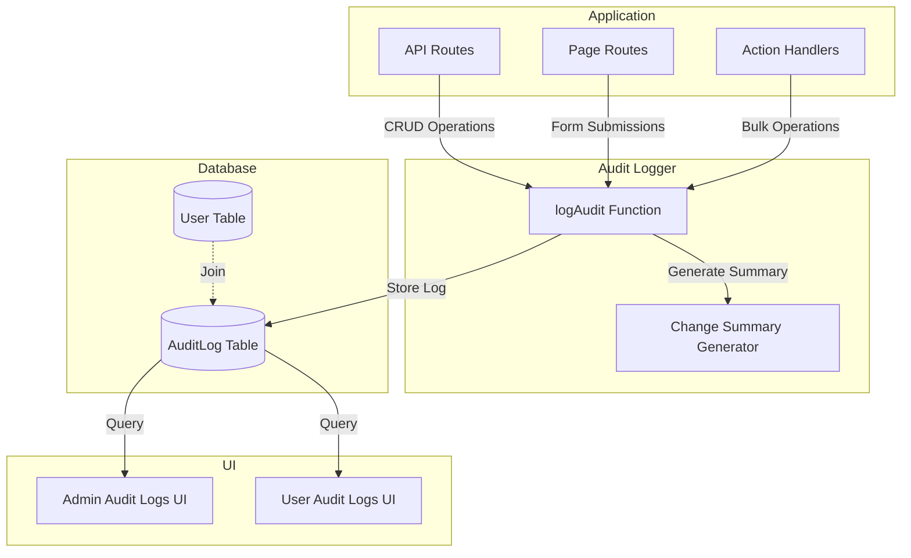

# Audit Log Architecture

**Last Updated**: 2025-01-26  
**Status**: ✅ Production Ready

## Overview

This document describes the **audit logging system** for comprehensive traceability of all CRUD operations across the application. The audit log system ensures compliance, security monitoring, and accountability by recording all data changes with full context including user, timestamp, IP address, and change details.

---

## 🏗️ High-Level Architecture

### Audit Log Flow Diagram



### System Components

| Component | Technology | Purpose | File Location |
|-----------|------------|---------|---------------|
| **Audit Logger** | TypeScript | Core logging function | `src/lib/server/audit-logger.ts` |
| **Database Schema** | PostgreSQL + Prisma | Audit log storage | `prisma/schema.prisma` |
| **Admin UI** | SvelteKit | Admin audit log viewer | `src/routes/admin/debug/audit-logs/` |
| **User UI** | SvelteKit | User audit log viewer | `src/routes/user/debug/audit-logs/` |
| **Constants** | TypeScript | Action type definitions | `src/lib/constants/system.ts` |

---

## 🗄️ Database Schema

### AuditLog Model

**File**: `prisma/schema.prisma`

```prisma
model AuditLog {
  id            String   @id() @default(cuid())
  userId        String
  user          User?    @relation(fields: [userId], references: [id], onDelete: SetNull)
  ipAddress     String?
  actionType    String   // INSERT, UPDATE, DELETE
  tableName     String   // Name of the table being modified
  recordId      String   // ID of the record being modified
  oldData       Json?    // Previous state (for UPDATE/DELETE)
  newData       Json?    // New state (for INSERT/UPDATE)
  changeSummary String?  // Human-readable summary of changes
  timestamp     DateTime @default(now())

  @@index([userId])
  @@index([actionType])
  @@index([tableName])
  @@index([timestamp])
  @@index([tableName, actionType, timestamp])
}
```

### Schema Details

| Field | Type | Description |
|-------|------|-------------|
| `id` | String (CUID) | Unique identifier for the audit log entry |
| `userId` | String | ID of the user who performed the action |
| `user` | User (Relation) | User relation for joining user data |
| `ipAddress` | String? | IP address of the user (optional) |
| `actionType` | String | Type of action: `INSERT`, `UPDATE`, or `DELETE` |
| `tableName` | String | Name of the database table being modified |
| `recordId` | String | ID of the specific record being modified |
| `oldData` | Json? | Previous state of the record (null for INSERT) |
| `newData` | Json? | New state of the record (null for DELETE) |
| `changeSummary` | String? | Human-readable summary of changes |
| `timestamp` | DateTime | When the action occurred (auto-generated) |

### Indexes

The schema includes optimized indexes for common query patterns:
- **User queries**: `@@index([userId])` - Fast filtering by user
- **Action type queries**: `@@index([actionType])` - Fast filtering by action type
- **Table queries**: `@@index([tableName])` - Fast filtering by table
- **Time-based queries**: `@@index([timestamp])` - Fast date range queries
- **Composite queries**: `@@index([tableName, actionType, timestamp])` - Optimized for common filter combinations

---

## 🔧 Implementation Details

### Core Audit Logger

**File**: `src/lib/server/audit-logger.ts`

#### Interface

```typescript
export interface LogAuditOptions {
    prisma: PrismaClient | Omit<PrismaClient, "$connect" | "$disconnect" | "$on" | "$transaction" | "$use" | "$extends">;
    actionType: AuditActionType;  // INSERT, UPDATE, DELETE
    tableName: string;
    recordId: string | string[];  // Supports bulk operations
    oldData: Record<string, any> | null;
    newData: Record<string, any> | null;
    userId: string;
    ipAddress?: string;
    changeSummary?: string;  // Optional custom summary
}
```

#### Main Function

```typescript
export async function logAudit(options: LogAuditOptions): Promise<void> {
    const {
        actionType,
        tableName,
        recordId,
        oldData,
        newData,
        userId,
        ipAddress,
        prisma,
        changeSummary
    } = options;

    // Generate change summary if not provided
    const generatedChangeSummary = changeSummary || 
        generateChangeSummary(oldData || {}, newData || {});

    // Support bulk operations (array of recordIds)
    if (Array.isArray(recordId)) {
        await prisma.auditLog.createMany({
            data: recordId.map(id => ({
                actionType,
                tableName,
                recordId: id,
                userId,
                ipAddress,
                changeSummary: generatedChangeSummary,
                oldData: oldData === null ? Prisma.JsonNull : oldData,
                newData: newData === null ? Prisma.JsonNull : newData
            }))
        });
    } else {
        await prisma.auditLog.create({
            data: {
                actionType,
                tableName,
                recordId,
                userId,
                ipAddress,
                changeSummary: generatedChangeSummary,
                oldData: oldData === null ? Prisma.JsonNull : oldData,
                newData: newData === null ? Prisma.JsonNull : newData
            }
        });
    }
}
```

#### Change Summary Generator

```typescript
function generateChangeSummary(
    oldData: Record<string, any>, 
    newData: Record<string, any>
): string {
    const ignoredFields = ['createdAt', 'updatedAt'];
    const changes: string[] = [];

    for (const key of Object.keys({ ...oldData, ...newData })) {
        if (ignoredFields.includes(key)) continue;

        const oldVal = oldData?.[key];
        const newVal = newData?.[key];

        // Skip if both values are null or undefined
        if (
            (oldVal === null || oldVal === undefined) &&
            (newVal === null || newVal === undefined)
        ) {
            continue;
        }

        // Skip nested objects or arrays
        if (typeof oldVal === 'object' || typeof newVal === 'object') {
            continue;
        }

        if (oldVal !== newVal) {
            changes.push(`${key}: '${oldVal}' → '${newVal}'`);
        }
    }

    return changes.length > 0 ? changes.join(", ") : "No changes";
}
```

### Action Types

**File**: `src/lib/constants/system.ts`

```typescript
export enum AuditActionType {
  INSERT = 'INSERT',  // Record created
  UPDATE = 'UPDATE',  // Record modified
  DELETE = 'DELETE'   // Record deleted
}
```

---

## 📝 Usage Examples

### Example 1: Logging a CREATE Operation

```typescript
import { logAudit } from '$lib/server/audit-logger';
import { AuditActionType } from '$lib/constants/system';

// In a create route handler
export const POST = restrict(..., [SystemRole.ADMIN])(
    async ({ request, locals }) => {
        const formData = await request.formData();
        const name = formData.get('name');
        
        // Create the record
        const newRecord = await locals.prisma.device.create({
            data: { name, accountId: locals.user.accountId }
        });
        
        // Log the audit
        await logAudit({
            prisma: locals.prisma,
            actionType: AuditActionType.INSERT,
            tableName: 'Device',
            recordId: newRecord.id,
            oldData: null,
            newData: { name, accountId: locals.user.accountId },
            userId: locals.user.id,
            ipAddress: getClientAddress(request)
        });
        
        return json({ success: true });
    }
);
```

### Example 2: Logging an UPDATE Operation

```typescript
// In an update route handler
export const POST = restrict(..., [SystemRole.ADMIN])(
    async ({ request, locals, params }) => {
        const { id } = params;
        const formData = await request.formData();
        
        // Get existing record
        const oldRecord = await locals.prisma.device.findUnique({
            where: { id }
        });
        
        // Update the record
        const updatedRecord = await locals.prisma.device.update({
            where: { id },
            data: { name: formData.get('name') }
        });
        
        // Log the audit
        await logAudit({
            prisma: locals.prisma,
            actionType: AuditActionType.UPDATE,
            tableName: 'Device',
            recordId: id,
            oldData: { name: oldRecord.name },
            newData: { name: updatedRecord.name },
            userId: locals.user.id,
            ipAddress: getClientAddress(request)
        });
        
        return json({ success: true });
    }
);
```

### Example 3: Logging a DELETE Operation

```typescript
// In a delete action handler
export async function deleteDevice(
    prisma: PrismaClient,
    deviceId: string,
    userId: string,
    ipAddress?: string
) {
    // Get existing record before deletion
    const oldRecord = await prisma.device.findUnique({
        where: { id: deviceId }
    });
    
    // Delete the record
    await prisma.device.delete({
        where: { id: deviceId }
    });
    
    // Log the audit
    await logAudit({
        prisma,
        actionType: AuditActionType.DELETE,
        tableName: 'Device',
        recordId: deviceId,
        oldData: oldRecord,
        newData: null,
        userId,
        ipAddress
    });
}
```

### Example 4: Bulk Operations

```typescript
// Logging multiple records at once
const recordIds = ['id1', 'id2', 'id3'];

await logAudit({
    prisma: locals.prisma,
    actionType: AuditActionType.DELETE,
    tableName: 'DeviceTag',
    recordId: recordIds,  // Array for bulk operations
    oldData: { /* common old data */ },
    newData: null,
    userId: locals.user.id,
    ipAddress: getClientAddress(request),
    changeSummary: 'Bulk deletion of device tags'
});
```

---

## 🖥️ UI Implementation

### Admin Audit Logs Page

**File**: `src/routes/admin/debug/audit-logs/+page.svelte`

#### Features

- **Comprehensive Filtering**:
  - Account filter (all accounts)
  - User filter (all users)
  - Action type filter (INSERT, UPDATE, DELETE)
  - Table name filter (searchable)
  - Date range filter
  - Text search (summary, record ID, table, user)

- **Data Table**:
  - Sortable columns (Timestamp, User, Action, Table, IP Address)
  - Pagination
  - Color-coded action types:
    - INSERT: Green text
    - UPDATE: Blue text
    - DELETE: Red text
  - Truncated change summaries with tooltips
  - View button for detailed modal

- **Detail Modal**:
  - Full audit log details
  - JSON viewer for oldData and newData
  - Structured change summary display
  - Special handling for DELETE operations

#### Server-Side Logic

**File**: `src/routes/admin/debug/audit-logs/+page.server.ts`

```typescript
export const load = restrict(..., [SystemRole.ADMIN])(
    async ({ url, locals }) => {
        const page = parseInt(url.searchParams.get('page') || '1');
        const pageSize = parseInt(url.searchParams.get('pageSize') || '50');
        const accountId = url.searchParams.get('accountId');
        const userId = url.searchParams.get('userId');
        const actionType = url.searchParams.get('actionType');
        const tableName = url.searchParams.get('tableName');
        const startDate = url.searchParams.get('startDate');
        const endDate = url.searchParams.get('endDate');
        const search = url.searchParams.get('search');

        // Build where clause
        const where: Prisma.AuditLogWhereInput = {};

        if (accountId) {
            // Filter by account through user memberships
            const accountMemberships = await locals.prisma.accountMembership.findMany({
                where: { accountId },
                select: { userId: true }
            });
            where.userId = { in: accountMemberships.map(am => am.userId) };
        }

        if (userId) {
            where.userId = userId;
        }

        if (actionType) {
            where.actionType = actionType;
        }

        if (tableName) {
            where.tableName = tableName;
        }

        if (startDate || endDate) {
            where.timestamp = {};
            if (startDate) where.timestamp.gte = new Date(startDate);
            if (endDate) where.timestamp.lte = new Date(endDate);
        }

        if (search) {
            where.OR = [
                { changeSummary: { contains: search, mode: 'insensitive' } },
                { recordId: { contains: search, mode: 'insensitive' } },
                { tableName: { contains: search, mode: 'insensitive' } },
                { user: { name: { contains: search, mode: 'insensitive' } } },
                { user: { email: { contains: search, mode: 'insensitive' } } }
            ];
        }

        // Fetch audit logs with pagination
        const [auditLogs, total] = await Promise.all([
            locals.prisma.auditLog.findMany({
                where,
                include: { user: true },
                orderBy: { timestamp: 'desc' },
                skip: (page - 1) * pageSize,
                take: pageSize
            }),
            locals.prisma.auditLog.count({ where })
        ]);

        // Fetch filter options
        const accounts = await locals.prisma.account.findMany({
            orderBy: { name: 'asc' }
        });

        const users = await locals.prisma.user.findMany({
            orderBy: { email: 'asc' }
        });

        const tableNames = await locals.prisma.auditLog.findMany({
            select: { tableName: true },
            distinct: ['tableName'],
            orderBy: { tableName: 'asc' }
        });

        return {
            auditLogs,
            total,
            page,
            pageSize,
            accounts,
            users,
            tableNames: tableNames.map(t => t.tableName)
        };
    }
);
```

### User Audit Logs Page

**File**: `src/routes/user/debug/audit-logs/+page.svelte`

#### Features

- **Account-Scoped Access**: Users can only view audit logs for their current account
- **Filtered User List**: Only shows users from the current account
- **Read-only Account Display**: Shows current account (not filterable)
- **Same UI Components**: Uses the same filter and table components as admin

#### Server-Side Logic

**File**: `src/routes/user/debug/audit-logs/+page.server.ts`

```typescript
export const load = restrict(..., [SystemRole.USER])(
    async ({ url, locals }) => {
        // Get current account from user's membership
        const membership = await locals.prisma.accountMembership.findFirst({
            where: { userId: locals.user.id },
            include: { account: true }
        });

        const currentAccountId = membership?.accountId;

        // Get all user IDs in the current account
        const accountMemberships = await locals.prisma.accountMembership.findMany({
            where: { accountId: currentAccountId },
            select: { userId: true }
        });
        const accountUserIds = accountMemberships.map(am => am.userId);

        // Build where clause - restrict to account users
        const where: Prisma.AuditLogWhereInput = {
            userId: { in: accountUserIds }
        };

        // Additional filters...
        // (similar to admin, but always scoped to account)

        return {
            auditLogs,
            total,
            currentAccount: membership?.account,
            // ... other data
        };
    }
);
```

---

## 🔐 Security & Access Control

### Role-Based Access

| Role | Access Level | Description |
|------|-------------|-------------|
| **ADMIN** | Full Access | Can view all audit logs across all accounts |
| **USER** | Account-Scoped | Can only view audit logs for their current account |

### Implementation

```typescript
// Admin route - full access
export const load = restrict(..., [SystemRole.ADMIN])(...);

// User route - account-scoped
export const load = restrict(..., [SystemRole.USER])(...);
```

### Data Filtering

- **Admin**: No automatic filtering; can filter by any account/user
- **User**: Automatically filtered to current account's users only
- **IP Address**: Only visible to admins (not shown in user UI)

---

## 📊 Performance Considerations

### Indexing Strategy

The schema includes optimized indexes for common query patterns:

```prisma
@@index([userId])                    // User-based queries
@@index([actionType])                // Action type filtering
@@index([tableName])                 // Table-based queries
@@index([timestamp])                  // Time-based queries
@@index([tableName, actionType, timestamp])  // Composite queries
```

### Query Optimization

- **Pagination**: All queries use pagination (default 50 records per page)
- **Selective Fields**: Only fetch necessary fields in list views
- **Eager Loading**: Use `include` for related data (user) to avoid N+1 queries
- **Debounced Search**: Text search uses debouncing to reduce query frequency

### Best Practices

1. **Bulk Operations**: Use `createMany` for multiple records
2. **Async Logging**: Audit logging is non-blocking (doesn't affect main operation)
3. **Indexed Queries**: Always filter by indexed fields when possible
4. **Pagination**: Always use pagination for large result sets

---

## 📁 Key File References

### Core Implementation

- **Audit Logger**: [`src/lib/server/audit-logger.ts`](../../../src/lib/server/audit-logger.ts)
- **Action Types**: [`src/lib/constants/system.ts`](../../../src/lib/constants/system.ts)
- **Database Schema**: [`prisma/schema.prisma`](../../../prisma/schema.prisma)

### UI Components

- **Admin Page**: [`src/routes/admin/debug/audit-logs/+page.svelte`](../../../src/routes/admin/debug/audit-logs/+page.svelte)
- **Admin Server**: [`src/routes/admin/debug/audit-logs/+page.server.ts`](../../../src/routes/admin/debug/audit-logs/+page.server.ts)
- **User Page**: [`src/routes/user/debug/audit-logs/+page.svelte`](../../../src/routes/user/debug/audit-logs/+page.svelte)
- **User Server**: [`src/routes/user/debug/audit-logs/+page.server.ts`](../../../src/routes/user/debug/audit-logs/+page.server.ts)

### Navigation

- **Admin Sidebar**: [`src/lib/components/admin/AdminSidebar.svelte`](../../../src/lib/components/admin/AdminSidebar.svelte)
- **User Sidebar**: [`src/lib/components/user/UserSidebar.svelte`](../../../src/lib/components/user/UserSidebar.svelte)

### Implementation Examples

See [`TODO/audit_log/README.md`](../../../TODO/audit_log/README.md) for comprehensive implementation examples across all modules.

---

## 🎨 UI/UX Best Practices

### Visual Design

1. **Color-Coded Actions**:
   - INSERT: Green text (`text-green-600`)
   - UPDATE: Blue text (`text-blue-600`)
   - DELETE: Red text (`text-red-600`)

2. **Change Summary Display**:
   - Truncated in table view (80 characters max)
   - Full text in tooltip on hover
   - Special handling for DELETE operations (simplified message)
   - Bulleted list in detail modal

3. **Detail Modal**:
   - Accordion-based JSON viewer
   - Scrollable containers for long data
   - Special styling for DELETE operations

### User Experience

1. **Filtering**: All filters persist in URL for shareability
2. **Search**: Debounced text search across multiple fields
3. **Pagination**: Clear page controls with total count
4. **Loading States**: Skeleton loaders during data fetch
5. **Empty States**: Helpful messages when no results found

---

## 📈 Implementation Status

### Completed Modules

| Module | CREATE | UPDATE | DELETE | Status |
|--------|--------|--------|--------|--------|
| PreclaimSet | ✅ | N/A | N/A | ✅ Complete |
| PreclaimDevice | ✅ | ✅ | N/A | ✅ Complete |
| Device | ✅ | ✅ | ✅ | ✅ Complete |
| Resource | ✅ | ✅ | ✅ | ✅ Complete |
| DeviceTag | ✅ | ✅ | ✅ | ✅ Complete |
| DeviceProfile | ✅ | ✅ | N/A | ✅ Complete |
| FactoryToken | ✅ | N/A | ✅ | ✅ Complete |
| Bundle | ✅ | ✅ | N/A | ✅ Complete |
| License | ✅ | ✅ | ✅ | ✅ Complete |
| Account | ✅ | ✅ | N/A | ✅ Complete |
| User | ✅ | ✅ | N/A | ✅ Complete |

For detailed implementation status, see [`TODO/audit_log/README.md`](../../../TODO/audit_log/README.md).

---

## 🔑 Key Takeaways

1. **Comprehensive Logging**: All CRUD operations are logged with full context
2. **Role-Based Access**: Admin has full access, users are account-scoped
3. **Performance Optimized**: Indexed queries and pagination for scalability
4. **User-Friendly UI**: Color-coded actions, detailed views, and comprehensive filtering
5. **Production Ready**: Complete implementation across all modules

---

**Status**: ✅ Production ready with comprehensive audit logging across all modules.

