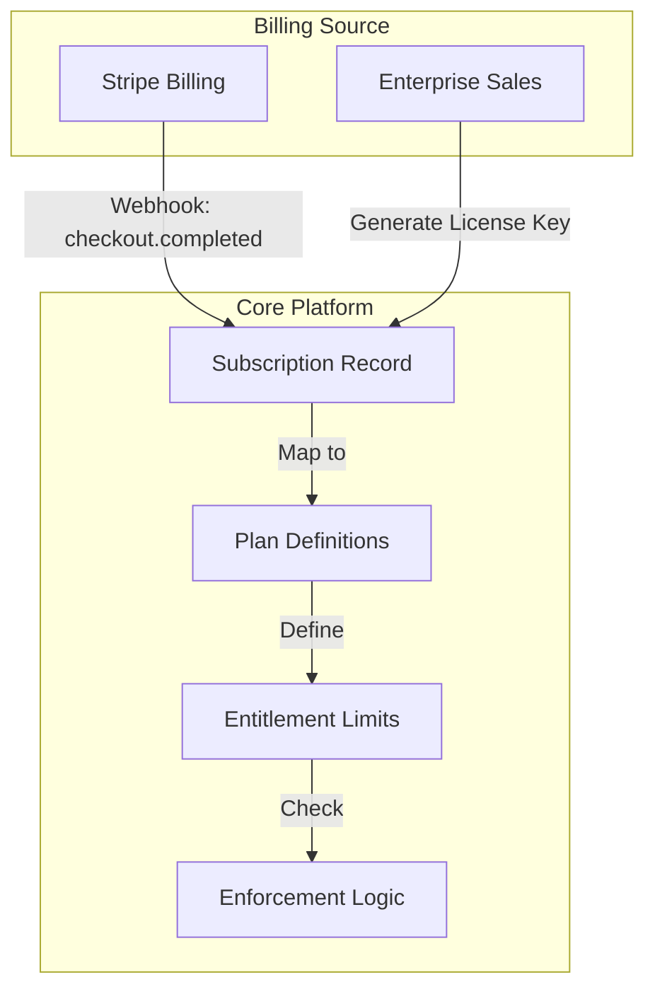
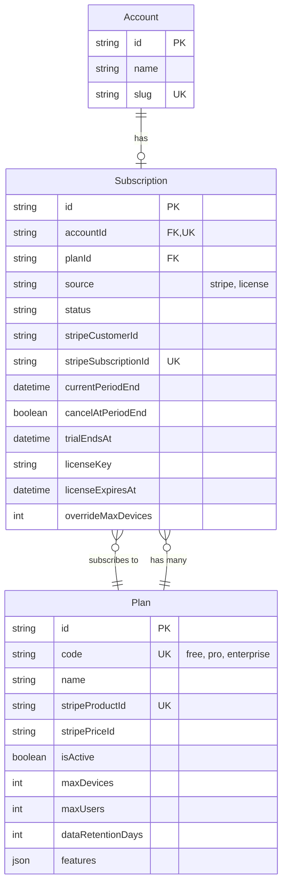
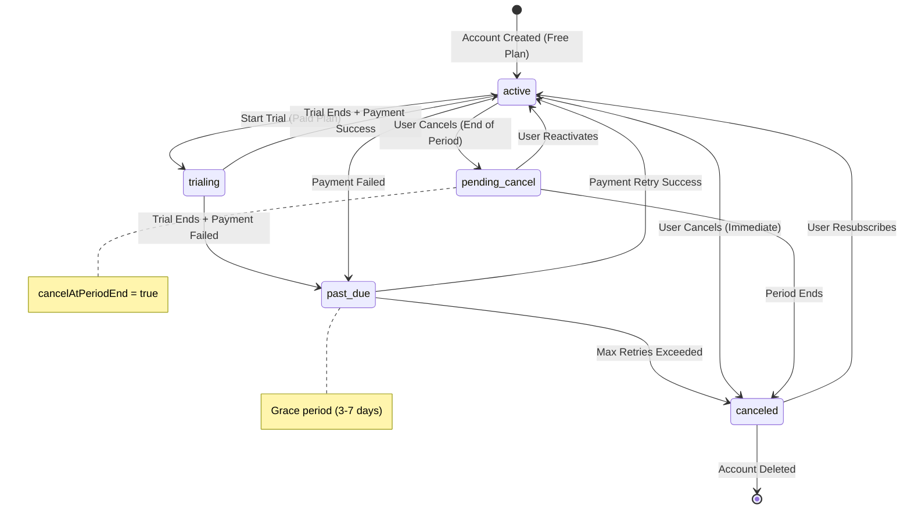
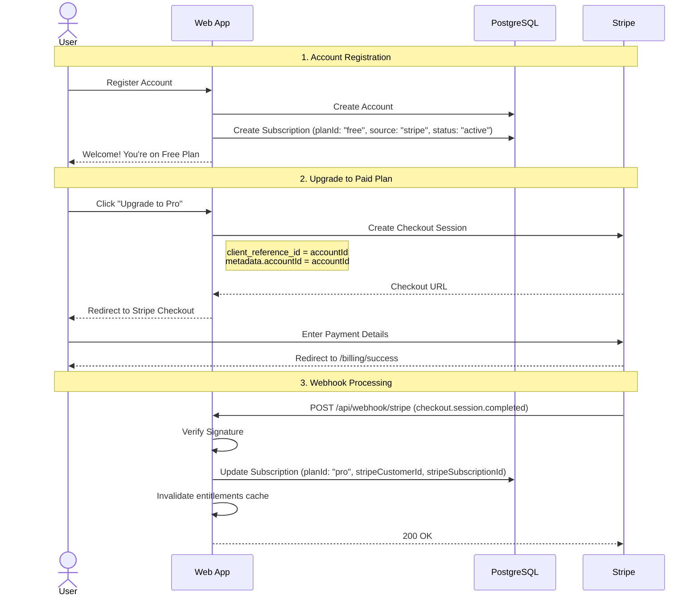
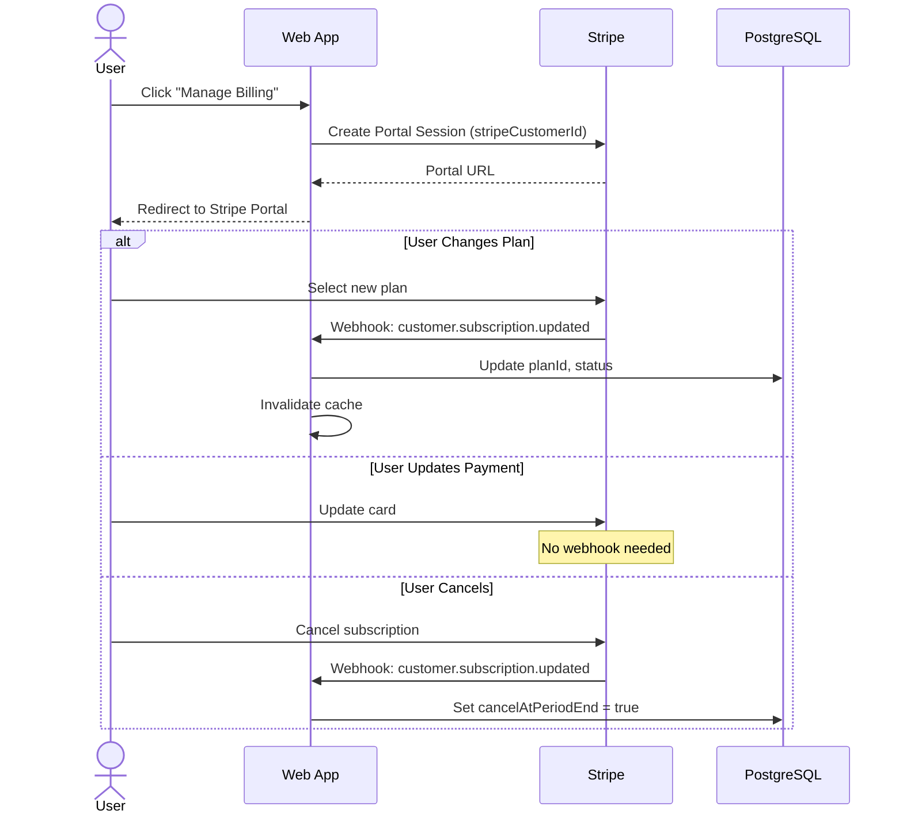
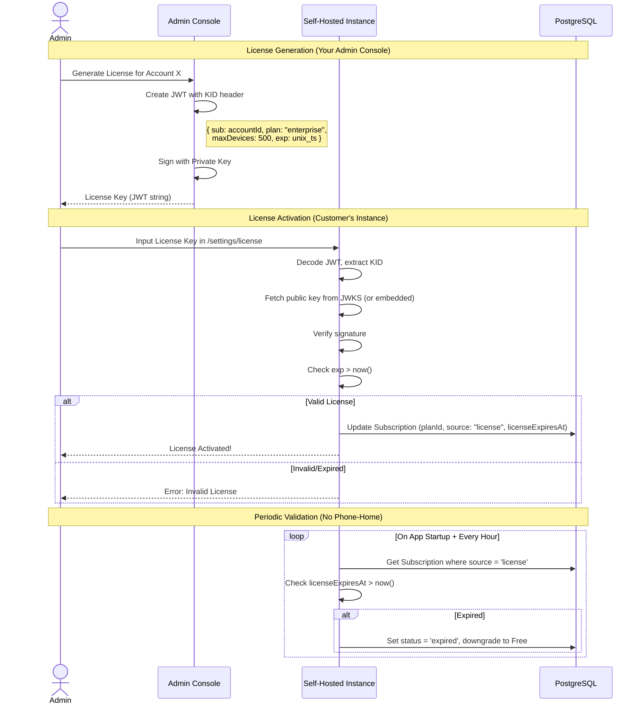
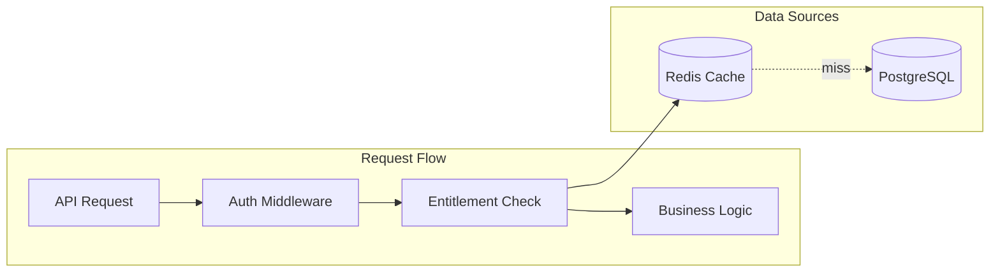

# Subscription & Billing System Design

## Design Rationale

> [!NOTE]
> **Why this architecture?**
> 1. **Billing ≠ Entitlements**: Stripe is the source of truth for *payments*; your platform is the source of truth for *what users can do*. This separation lets you handle edge cases (grace periods, enterprise deals, offline licenses) without hacking Stripe.
> 2. **Database-First Entitlements**: Limits live in DB columns (`maxDevices`), not config files. Sales can create custom deals via `overrideMaxDevices` without deploying code.
> 3. **Unified Subscription Model**: Both SaaS (Stripe) and Self-Hosted (License Key) flow into the same `Subscription` table. Business logic only checks `getEntitlements()`.

---

## Overview

This document outlines the design for implementing subscriptions, plans, and entitlement enforcement for the FS04 platform. The design supports both **Hosted SaaS** (cloud) and **Self-Hosted** (on-premise/enterprise) models, utilizing **Stripe** as the payment processor and source of truth for billing.

---

## 1. High-Level Architecture

The system distinguishes between **Billing** (handling payments/invoices) and **Entitlements** (what features/limits a user has).

*   **Hosted SaaS**: Uses **Stripe Billing** directly. Plans = Stripe Products.
*   **Self-Hosted**: Uses **Signed License Keys**. The key encodes expiration and entitlements.



---

## 2. Data Model (ERD)



### Prisma Schema

```prisma
// Represents a billing tier (Syncs from Stripe Product/Price)
model Plan {
  id              String   @id @default(cuid())
  code            String   @unique // 'free', 'pro', 'enterprise' - stable lookup key
  name            String   // Display name: "Free Tier", "Pro Plan"
  stripeProductId String?  @unique
  stripePriceId   String?  // Monthly price ID for Checkout
  isActive        Boolean  @default(true)
  
  // Entitlements defined by this plan
  maxDevices      Int      @default(5)
  maxUsers        Int      @default(1)
  dataRetentionDays Int    @default(7)
  features        Json     @default("[]") // e.g., ["sso", "audit_logs", "white_label"]
  
  subscriptions   Subscription[]
  
  createdAt       DateTime @default(now())
  updatedAt       DateTime @updatedAt

  @@allow('all', auth().systemRole == 'ADMIN')
  @@allow('read', auth() != null && isActive == true)
  
  @@index([isActive])
  @@index([code])
}

// Connects an Account to a Plan
model Subscription {
  id              String   @id @default(cuid())
  accountId       String   @unique // One entry per account
  account         Account  @relation(fields: [accountId], references: [id], onDelete: Cascade)
  
  planId          String
  plan            Plan     @relation(fields: [planId], references: [id])
  
  source          String   @default("stripe") // 'stripe' | 'license'
  status          String   @default("active") // See state diagram below
  
  // Stripe Data (for SaaS, source='stripe')
  stripeCustomerId     String?
  stripeSubscriptionId String? @unique
  currentPeriodEnd     DateTime?
  cancelAtPeriodEnd    Boolean @default(false)
  trialEndsAt          DateTime? // For trial periods
  
  // License Data (for Self-Hosted, source='license')
  licenseKey           String?
  licenseExpiresAt     DateTime? // Expiration for offline validation
  
  // Overrides (for custom deals)
  overrideMaxDevices   Int?
  overrideMaxUsers     Int?
  
  createdAt       DateTime @default(now())
  updatedAt       DateTime @updatedAt

  @@allow('all', auth().systemRole == 'ADMIN')
  @@allow('read', account.members?[userId == auth().id])
  
  @@index([status])
  @@index([planId])
  @@index([source])
}
```

---

## 3. Subscription Status State Machine



### Status Definitions

| Status | Source | Description | User Access |
|--------|--------|-------------|-------------|
| `active` | Both | Subscription is current | Full access |
| `trialing` | Both | Within trial period | Full access |
| `past_due` | Stripe | Payment failed, retrying | Full access (grace) |
| `pending_cancel` | Stripe | Will cancel at period end | Full access |
| `canceled` | Both | Subscription ended | Downgrade to Free |
| `incomplete` | Stripe | Initial payment failed | No paid access |
| `expired` | License | License expired (self-hosted) | Downgrade to Free |

### Self-Hosted Status Semantics

For `source = 'license'`:
- **Active**: `licenseExpiresAt > now()` → `status = 'active'`
- **Trialing**: License JWT contains `trial: true` → `status = 'trialing'`
- **Expired**: `licenseExpiresAt <= now()` → `status = 'expired'`, auto-downgrade to Free

> [!IMPORTANT]
> Self-hosted instances check `licenseExpiresAt` on startup and periodically. No phone-home required.

---

## 4. Sign-Up & Upgrade Flow



---

## 5. Billing Management Flow



---

## 6. Self-Hosted License Flow



### License Key Structure (JWT)

```json
{
  "header": {
    "alg": "RS256",
    "kid": "key-2024-01"
  },
  "payload": {
    "iss": "fs04.io",
    "sub": "account_cuid123",
    "plan": "enterprise",
    "maxDevices": 500,
    "maxUsers": 100,
    "features": ["sso", "audit_logs"],
    "trial": false,
    "exp": 1735689600,
    "iat": 1704067200
  }
}
```

### License Signing Keys (JWKS)

For production-grade license validation:

| Field | Description |
|-------|-------------|
| `kid` | Key ID in JWT header (e.g., `key-2024-01`) |
| **Public Keys** | Embedded in app binary OR fetched from `https://license.fs04.io/.well-known/jwks.json` |
| **Rotation Policy** | Rotate annually; old keys remain valid for existing licenses |
| **Compromise Response** | Revoke kid, issue new licenses with new key |

---

## 7. Entitlement Enforcement

### Enforcement Architecture



### Implementation

```typescript
// lib/server/entitlements.ts
import { redis } from '$lib/server/redis';
import { prisma } from '$lib/server/prisma';

interface AccountEntitlements {
  planCode: string;
  maxDevices: number;
  maxUsers: number;
  features: string[];
  status: string;
  source: 'stripe' | 'license';
}

const CACHE_TTL = 300; // 5 minutes

// Cache the free plan baseline to avoid hardcoding defaults
let freePlanCache: { maxDevices: number; maxUsers: number } | null = null;

async function getFreePlanDefaults() {
  if (freePlanCache) return freePlanCache;
  const freePlan = await prisma.plan.findUnique({ where: { code: 'free' } });
  freePlanCache = {
    maxDevices: freePlan?.maxDevices ?? 5,
    maxUsers: freePlan?.maxUsers ?? 1
  };
  return freePlanCache;
}

export async function getEntitlements(accountId: string): Promise<AccountEntitlements> {
  const cacheKey = `entitlements:${accountId}`;
  
  // Check cache first
  const cached = await redis.get(cacheKey);
  if (cached) return JSON.parse(cached);
  
  // Fetch from DB
  const sub = await prisma.subscription.findUnique({
    where: { accountId },
    include: { plan: true }
  });
  
  if (!sub) {
    // Default to free tier (fetch from DB, not hardcoded)
    const defaults = await getFreePlanDefaults();
    return { 
      planCode: 'free', 
      maxDevices: defaults.maxDevices, 
      maxUsers: defaults.maxUsers, 
      features: [], 
      status: 'active',
      source: 'stripe'
    };
  }
  
  const entitlements: AccountEntitlements = {
    planCode: sub.plan.code,
    maxDevices: sub.overrideMaxDevices ?? sub.plan.maxDevices,
    maxUsers: sub.overrideMaxUsers ?? sub.plan.maxUsers,
    features: sub.plan.features as string[],
    status: sub.status,
    source: sub.source as 'stripe' | 'license'
  };
  
  // Cache result
  await redis.set(cacheKey, JSON.stringify(entitlements), 'EX', CACHE_TTL);
  
  return entitlements;
}

export async function checkFeature(accountId: string, feature: string): Promise<boolean> {
  const entitlements = await getEntitlements(accountId);
  const validStatuses = ['active', 'trialing', 'past_due', 'pending_cancel'];
  if (!validStatuses.includes(entitlements.status)) return false;
  return entitlements.features.includes(feature);
}

export async function checkDeviceLimit(accountId: string): Promise<{ allowed: boolean; current: number; max: number }> {
  const entitlements = await getEntitlements(accountId);
  const current = await prisma.device.count({ where: { accountId } });
  return {
    allowed: current < entitlements.maxDevices,
    current,
    max: entitlements.maxDevices
  };
}

export async function checkUserLimit(accountId: string): Promise<{ allowed: boolean; current: number; max: number }> {
  const entitlements = await getEntitlements(accountId);
  const current = await prisma.accountMembership.count({ where: { accountId } });
  return {
    allowed: current < entitlements.maxUsers,
    current,
    max: entitlements.maxUsers
  };
}

// Invalidate cache when subscription changes
export async function invalidateEntitlements(accountId: string): Promise<void> {
  await redis.del(`entitlements:${accountId}`);
}
```

### Usage Examples

```typescript
// In device creation API
const { allowed, current, max } = await checkDeviceLimit(accountId);
if (!allowed) {
  throw error(403, `Device limit reached (${current}/${max}). Please upgrade your plan.`);
}

// In user invitation flow
const { allowed } = await checkUserLimit(accountId);
if (!allowed) {
  throw error(403, 'User limit reached. Please upgrade to add more team members.');
}

// In SSO login check
const hasSSO = await checkFeature(accountId, 'sso');
if (!hasSSO) {
  throw redirect(302, '/settings/billing?upgrade=sso');
}
```

---

## 8. Webhook Security & Handling

> [!IMPORTANT]
> Always verify Stripe webhook signatures to prevent spoofing attacks.

### Stripe Binding Best Practice

Always set these when creating Checkout Sessions:
```typescript
const session = await stripe.checkout.sessions.create({
  client_reference_id: accountId,  // For webhook matching
  customer_email: user.email,
  metadata: { accountId },         // For reconciliation from Stripe Dashboard
  subscription_data: {
    metadata: { accountId }        // Also on the subscription object
  },
  // ...
});
```

### Webhook Handler

```typescript
// routes/api/webhook/stripe/+server.ts
import Stripe from 'stripe';
import { STRIPE_SECRET_KEY, STRIPE_WEBHOOK_SECRET } from '$env/static/private';
import { prisma } from '$lib/server/prisma';
import { invalidateEntitlements } from '$lib/server/entitlements';

const stripe = new Stripe(STRIPE_SECRET_KEY);

export async function POST({ request }) {
  const payload = await request.text();
  const sig = request.headers.get('stripe-signature');
  
  // 1. Verify signature
  let event: Stripe.Event;
  try {
    event = stripe.webhooks.constructEvent(payload, sig!, STRIPE_WEBHOOK_SECRET);
  } catch (err) {
    console.error('Webhook signature verification failed:', err);
    return new Response('Invalid signature', { status: 400 });
  }
  
  // 2. Idempotency check
  const existing = await prisma.webhookEvent.findUnique({ where: { id: event.id } });
  if (existing) {
    return new Response('Already processed', { status: 200 });
  }
  
  // 3. Handle event
  try {
    switch (event.type) {
      case 'checkout.session.completed':
        await handleCheckoutComplete(event.data.object as Stripe.Checkout.Session);
        break;
      case 'customer.subscription.updated':
        await handleSubscriptionUpdated(event.data.object as Stripe.Subscription);
        break;
      case 'customer.subscription.deleted':
        await handleSubscriptionDeleted(event.data.object as Stripe.Subscription);
        break;
      case 'invoice.payment_failed':
        await handlePaymentFailed(event.data.object as Stripe.Invoice);
        break;
    }
    
    // 4. Mark as processed (with event type for debugging)
    await prisma.webhookEvent.create({ 
      data: { 
        id: event.id, 
        type: event.type,
        objectId: (event.data.object as any).id
      } 
    });
    
  } catch (err) {
    console.error('Webhook handler error:', err);
    return new Response('Handler error', { status: 500 });
  }
  
  return new Response('OK', { status: 200 });
}

async function handleCheckoutComplete(session: Stripe.Checkout.Session) {
  const accountId = session.client_reference_id ?? session.metadata?.accountId;
  if (!accountId) throw new Error('No accountId in session');
  
  const subscriptionId = session.subscription as string;
  const stripeSub = await stripe.subscriptions.retrieve(subscriptionId);
  const priceId = stripeSub.items.data[0].price.id;
  
  // Find matching plan by stable code or priceId
  const plan = await prisma.plan.findFirst({ where: { stripePriceId: priceId } });
  if (!plan) throw new Error(`No plan found for price ${priceId}`);
  
  await prisma.subscription.update({
    where: { accountId },
    data: {
      planId: plan.id,
      source: 'stripe',
      status: stripeSub.status,
      stripeCustomerId: session.customer as string,
      stripeSubscriptionId: subscriptionId,
      currentPeriodEnd: new Date(stripeSub.current_period_end * 1000),
      trialEndsAt: stripeSub.trial_end ? new Date(stripeSub.trial_end * 1000) : null
    }
  });
  
  await invalidateEntitlements(accountId);
}

async function handleSubscriptionUpdated(stripeSub: Stripe.Subscription) {
  const sub = await prisma.subscription.findFirst({
    where: { stripeSubscriptionId: stripeSub.id }
  });
  if (!sub) return;
  
  const priceId = stripeSub.items.data[0].price.id;
  const plan = await prisma.plan.findFirst({ where: { stripePriceId: priceId } });
  
  await prisma.subscription.update({
    where: { id: sub.id },
    data: {
      planId: plan?.id ?? sub.planId,
      status: stripeSub.cancel_at_period_end ? 'pending_cancel' : stripeSub.status,
      currentPeriodEnd: new Date(stripeSub.current_period_end * 1000),
      cancelAtPeriodEnd: stripeSub.cancel_at_period_end
    }
  });
  
  await invalidateEntitlements(sub.accountId);
}

async function handleSubscriptionDeleted(stripeSub: Stripe.Subscription) {
  const sub = await prisma.subscription.findFirst({
    where: { stripeSubscriptionId: stripeSub.id }
  });
  if (!sub) return;
  
  // Downgrade to free using stable code lookup
  const freePlan = await prisma.plan.findUnique({ where: { code: 'free' } });
  
  await prisma.subscription.update({
    where: { id: sub.id },
    data: {
      planId: freePlan?.id ?? sub.planId,
      status: 'canceled',
      stripeSubscriptionId: null
    }
  });
  
  await invalidateEntitlements(sub.accountId);
}

async function handlePaymentFailed(invoice: Stripe.Invoice) {
  console.warn('Payment failed for invoice:', invoice.id, invoice.customer);
  // TODO: Send notification email to account owner
}
```

---

## 9. Menu Structure & Navigation

### Admin Dashboard
Located under `Settings > Billing`.

| Menu Item | Route | Description |
|-----------|-------|-------------|
| Plans | `/admin/billing/plans` | View/Sync plans from Stripe |
| Subscriptions | `/admin/billing/subscriptions` | List customer subscriptions, status, overrides |
| Invoices | `/admin/billing/invoices` | Link to Stripe Dashboard |

### Customer Portal
Located under `Account Settings`.

| Menu Item | Route | Description |
|-----------|-------|-------------|
| Billing | `/user/settings/billing` | Current Plan, Usage, Payment Method, "Manage" button |

---

## 10. Plan Evolution Strategy

### A. The "Generous Global Lift" (Value Change)
*   **Action**: Update `maxDevices` in the `Plan` table row.
*   **Effect**: All users on that plan instantly get the new limit.
*   **Use Case**: Minor improvements, inflation adjustments.

### B. The "Legacy Plan" Pattern (New Definition)
*   **Action**: Mark old plan `isActive: false`, create new `Plan` record with new `code`.
*   **Effect**: Existing users grandfathered. New users see new plan.
*   **Use Case**: Price increases, breaking changes.

---

## 11. Implementation Checklist

### Phase 1: Foundation
- [ ] Add `Plan` and `Subscription` models to `schema.zmodel`
- [ ] Add `WebhookEvent` model for idempotency
- [ ] Run `npx zenstack generate && npx prisma db push`
- [ ] Create `scripts/seed-plans.ts` with Free, Pro, Enterprise (using `code` field)
- [ ] Run seed script

### Phase 2: Stripe Integration
- [ ] Set up Stripe account (Test Mode)
- [ ] Create Products and Prices in Stripe Dashboard
- [ ] Update `Plan` records with `stripeProductId` and `stripePriceId`
- [ ] Implement `POST /api/billing/checkout` (with `metadata.accountId`)
- [ ] Implement `POST /api/billing/portal`
- [ ] Implement `POST /api/webhook/stripe` with signature verification
- [ ] Test webhook locally with Stripe CLI

### Phase 3: Entitlements
- [ ] Implement `lib/server/entitlements.ts` with Redis caching
- [ ] Add `checkDeviceLimit()` call to Device creation API
- [ ] Add `checkUserLimit()` call to User invitation flow
- [ ] Add feature checks where needed (SSO, Audit Logs)

### Phase 4: Frontend
- [ ] Build `/user/settings/billing` page
- [ ] Build `/admin/billing/plans` page
- [ ] Build `/admin/billing/subscriptions` page
- [ ] Add upgrade prompts when limits reached

### Phase 5: Self-Hosted (Optional)
- [ ] Create license generation script with JWKS support
- [ ] Build `/settings/license` page
- [ ] Implement license validation middleware
- [ ] Add periodic license expiry check (cron job)

---

## 12. User Interface & Experience

### User Billing Portal


### Admin Plan Manager


---

## 13. Best Practices & Reference

| Topic | Recommendation |
|-------|----------------|
| **Idempotency** | Store `event.id` + `objectId` in DB to prevent double-processing |
| **Grace Periods** | Handle `past_due` gracefully - warn 3 days before locking out |
| **Signature Verification** | Always verify Stripe webhook signatures |
| **Caching** | Cache entitlements in Redis (5 min TTL), invalidate on sub change |
| **Trial Abuse** | Limit one trial per email/payment method |
| **Plan Lookup** | Use `code` field, never display `name` for logic |
| **Stripe Metadata** | Always set `accountId` in session, customer, and subscription metadata |

### Comparison with Industry Leaders
*   **Supabase / Vercel**: Usage-based billing. We start with flat tiers (simpler).
*   **PostHog (Open Core)**: Features locked behind license keys. We follow this for self-hosted.

---

## 14. Future Considerations (V2+)

- [ ] **Per-Seat Pricing**: Charge per `maxUsers` instead of flat.
- [ ] **Usage-Based Billing**: Meter API calls or device-hours via Stripe Metered Billing.
- [ ] **Coupons/Discounts**: Handle promo codes via Stripe Coupons API.
- [ ] **Multi-Currency**: Support regional pricing with Stripe Price localization.
- [ ] **Annual Billing**: Offer discounted yearly plans (separate `stripePriceId`).
- [ ] **Invoicing for Enterprise**: Wire transfer + manual invoice via Stripe Invoicing.

---

## Appendix A: WebhookEvent Model

Add this to `schema.zmodel` for idempotency:

```prisma
model WebhookEvent {
  id        String   @id // Stripe event ID
  type      String
  objectId  String?  // For debugging (e.g., subscription ID)
  createdAt DateTime @default(now())
  
  @@allow('all', auth().systemRole == 'ADMIN')
  @@index([type])
}
```

---

## Appendix B: Default Plans Seed

```typescript
// scripts/seed-plans.ts
const defaultPlans = [
  { code: 'free', name: 'Free Tier', maxDevices: 5, maxUsers: 1, dataRetentionDays: 7, features: [] },
  { code: 'pro', name: 'Pro Plan', maxDevices: 50, maxUsers: 5, dataRetentionDays: 30, features: ['priority_support', 'email_alerts'] },
  { code: 'enterprise', name: 'Enterprise', maxDevices: 999999, maxUsers: 999999, dataRetentionDays: 365, features: ['sso', 'audit_logs', 'white_label', 'sla'] }
];

for (const plan of defaultPlans) {
  await prisma.plan.upsert({
    where: { code: plan.code },
    create: { ...plan, features: JSON.stringify(plan.features) },
    update: { name: plan.name, maxDevices: plan.maxDevices, maxUsers: plan.maxUsers, dataRetentionDays: plan.dataRetentionDays }
  });
}
```
