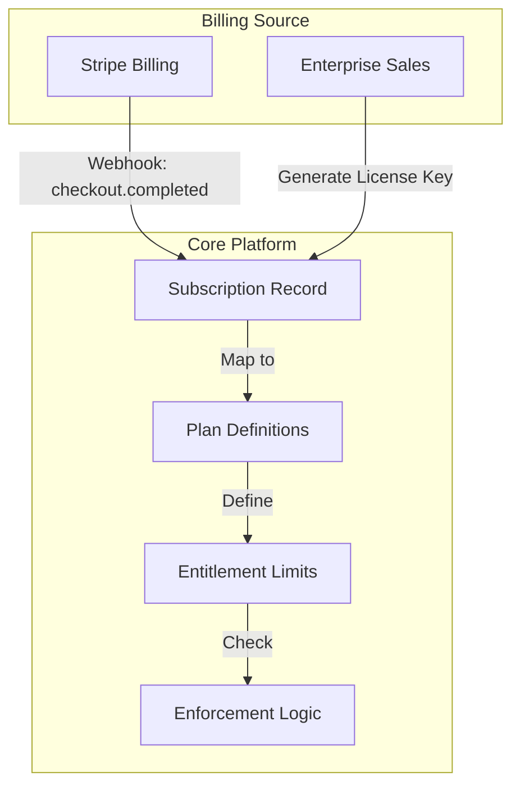
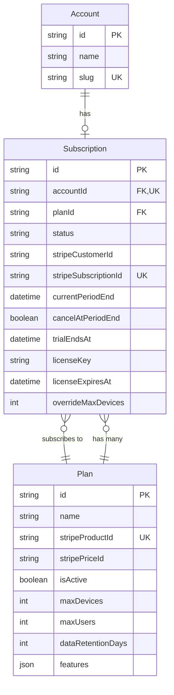
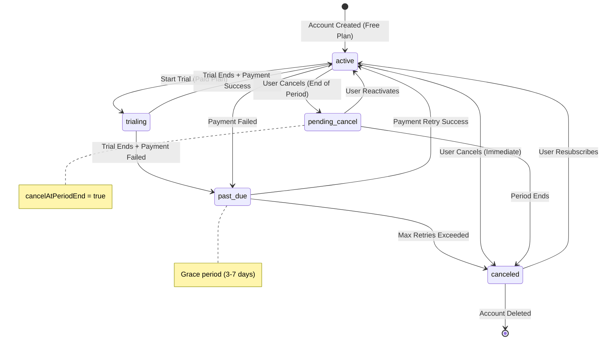
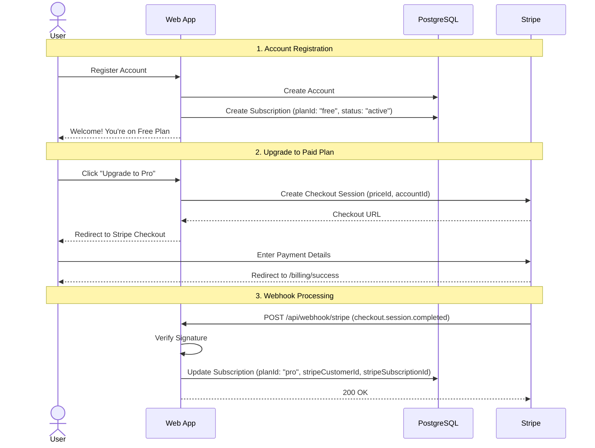
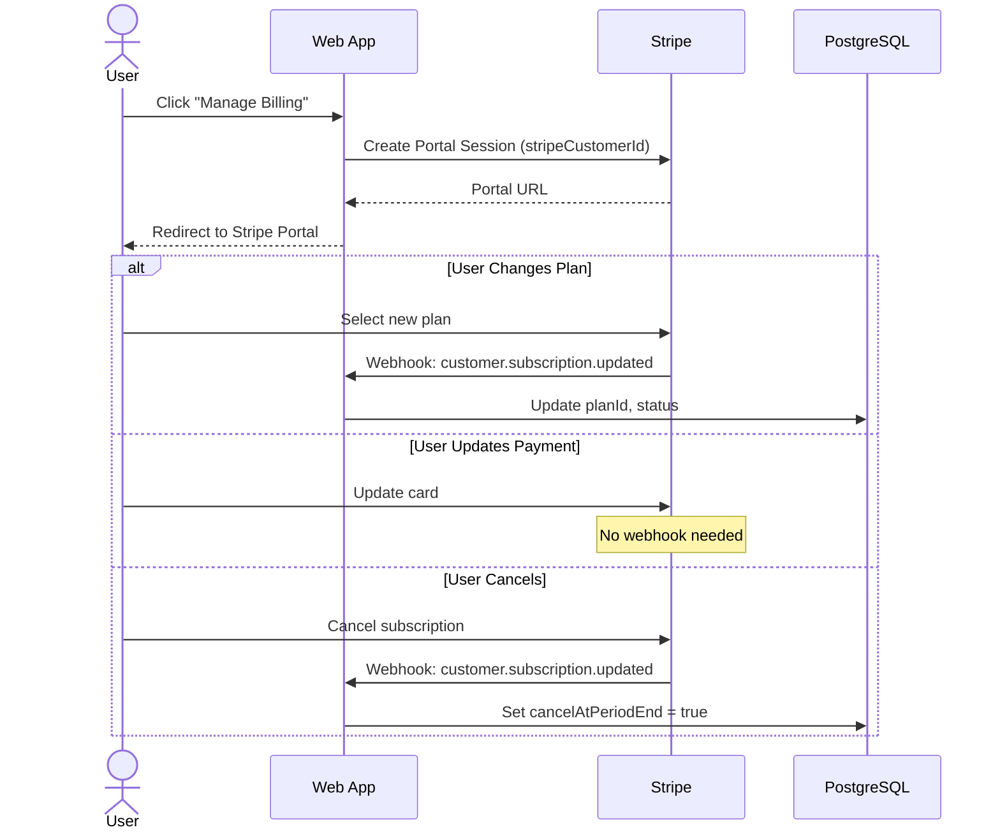
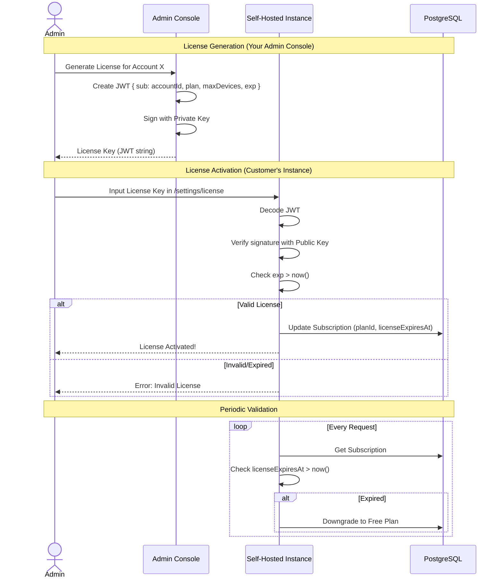
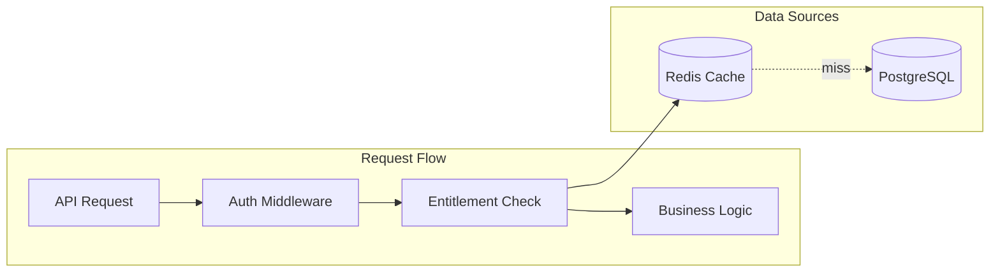

# Subscription & Billing System Design

## Overview

This document outlines the design for implementing subscriptions, plans, and entitlement enforcement for the FS04 platform. The design supports both **Hosted SaaS** (cloud) and **Self-Hosted** (on-premise/enterprise) models, utilizing **Stripe** as the payment processor and source of truth for billing.

---

## 1. High-Level Architecture

The system distinguishes between **Billing** (handling payments/invoices) and **Entitlements** (what features/limits a user has).

*   **Hosted SaaS**: Uses **Stripe Billing** directly. Plans = Stripe Products.
*   **Self-Hosted**: Uses **Signed License Keys**. The key encodes expiration and entitlements.



---

## 2. Data Model (ERD)



### Prisma Schema

```prisma
// Represents a billing tier (Syncs from Stripe Product/Price)
model Plan {
  id              String   @id @default(cuid())
  name            String   // e.g., "Free", "Pro", "Enterprise"
  stripeProductId String?  @unique
  stripePriceId   String?  // Monthly price ID for Checkout
  isActive        Boolean  @default(true)
  
  // Entitlements defined by this plan
  maxDevices      Int      @default(5)
  maxUsers        Int      @default(1)
  dataRetentionDays Int    @default(7)
  features        Json     @default("[]") // e.g., ["sso", "audit_logs", "white_label"]
  
  subscriptions   Subscription[]
  
  createdAt       DateTime @default(now())
  updatedAt       DateTime @updatedAt

  @@allow('all', auth().systemRole == 'ADMIN')
  @@allow('read', auth() != null && isActive == true)
  
  @@index([isActive])
}

// Connects an Account to a Plan
model Subscription {
  id              String   @id @default(cuid())
  accountId       String   @unique // One entry per account
  account         Account  @relation(fields: [accountId], references: [id], onDelete: Cascade)
  
  planId          String
  plan            Plan     @relation(fields: [planId], references: [id])
  
  status          String   @default("active") // See state diagram below
  
  // Stripe Data (for SaaS)
  stripeCustomerId     String?
  stripeSubscriptionId String? @unique
  currentPeriodEnd     DateTime?
  cancelAtPeriodEnd    Boolean @default(false)
  trialEndsAt          DateTime? // For trial periods
  
  // License Data (for Self-Hosted)
  licenseKey           String?
  licenseExpiresAt     DateTime? // Expiration for offline validation
  
  // Overrides (for custom deals)
  overrideMaxDevices   Int?
  
  createdAt       DateTime @default(now())
  updatedAt       DateTime @updatedAt

  @@allow('all', auth().systemRole == 'ADMIN')
  @@allow('read', account.members?[userId == auth().id])
  
  @@index([status])
  @@index([planId])
}
```

---

## 3. Subscription Status State Machine



### Status Definitions

| Status | Description | User Access |
|--------|-------------|-------------|
| `active` | Subscription is current and paid | Full access |
| `trialing` | Within trial period | Full access |
| `past_due` | Payment failed, retrying | Full access (grace period) |
| `pending_cancel` | Will cancel at period end | Full access until period ends |
| `canceled` | Subscription ended | Downgrade to Free |
| `incomplete` | Initial payment failed | No paid access |

---

## 4. Sign-Up & Upgrade Flow



---

## 5. Billing Management Flow



---

## 6. Self-Hosted License Flow



### License Key Structure (JWT)

```json
{
  "iss": "fs04.io",
  "sub": "account_cuid123",
  "plan": "enterprise",
  "maxDevices": 500,
  "features": ["sso", "audit_logs"],
  "exp": 1735689600,
  "iat": 1704067200
}
```

---

## 7. Entitlement Enforcement

### Enforcement Architecture



### Implementation

```typescript
// lib/server/entitlements.ts
import { redis } from '$lib/server/redis';
import { prisma } from '$lib/server/prisma';

interface AccountEntitlements {
  planId: string;
  maxDevices: number;
  maxUsers: number;
  features: string[];
  status: string;
}

const CACHE_TTL = 300; // 5 minutes

export async function getEntitlements(accountId: string): Promise<AccountEntitlements> {
  const cacheKey = `entitlements:${accountId}`;
  
  // Check cache first
  const cached = await redis.get(cacheKey);
  if (cached) return JSON.parse(cached);
  
  // Fetch from DB
  const sub = await prisma.subscription.findUnique({
    where: { accountId },
    include: { plan: true }
  });
  
  if (!sub) {
    // Default to free tier
    return { planId: 'free', maxDevices: 5, maxUsers: 1, features: [], status: 'active' };
  }
  
  const entitlements: AccountEntitlements = {
    planId: sub.planId,
    maxDevices: sub.overrideMaxDevices ?? sub.plan.maxDevices,
    maxUsers: sub.plan.maxUsers,
    features: sub.plan.features as string[],
    status: sub.status
  };
  
  // Cache result
  await redis.set(cacheKey, JSON.stringify(entitlements), 'EX', CACHE_TTL);
  
  return entitlements;
}

export async function checkFeature(accountId: string, feature: string): Promise<boolean> {
  const entitlements = await getEntitlements(accountId);
  if (entitlements.status !== 'active' && entitlements.status !== 'trialing') return false;
  return entitlements.features.includes(feature);
}

export async function checkDeviceLimit(accountId: string): Promise<{ allowed: boolean; current: number; max: number }> {
  const entitlements = await getEntitlements(accountId);
  const current = await prisma.device.count({ where: { accountId } });
  return {
    allowed: current < entitlements.maxDevices,
    current,
    max: entitlements.maxDevices
  };
}

// Invalidate cache when subscription changes
export async function invalidateEntitlements(accountId: string): Promise<void> {
  await redis.del(`entitlements:${accountId}`);
}
```

---

## 8. Webhook Security & Handling

> [!IMPORTANT]
> Always verify Stripe webhook signatures to prevent spoofing attacks.

```typescript
// routes/api/webhook/stripe/+server.ts
import Stripe from 'stripe';
import { STRIPE_SECRET_KEY, STRIPE_WEBHOOK_SECRET } from '$env/static/private';
import { prisma } from '$lib/server/prisma';
import { invalidateEntitlements } from '$lib/server/entitlements';

const stripe = new Stripe(STRIPE_SECRET_KEY);

export async function POST({ request }) {
  const payload = await request.text();
  const sig = request.headers.get('stripe-signature');
  
  // 1. Verify signature
  let event: Stripe.Event;
  try {
    event = stripe.webhooks.constructEvent(payload, sig!, STRIPE_WEBHOOK_SECRET);
  } catch (err) {
    console.error('Webhook signature verification failed:', err);
    return new Response('Invalid signature', { status: 400 });
  }
  
  // 2. Idempotency check
  const existing = await prisma.webhookEvent.findUnique({ where: { id: event.id } });
  if (existing) {
    return new Response('Already processed', { status: 200 });
  }
  
  // 3. Handle event
  try {
    switch (event.type) {
      case 'checkout.session.completed':
        await handleCheckoutComplete(event.data.object as Stripe.Checkout.Session);
        break;
      case 'customer.subscription.updated':
        await handleSubscriptionUpdated(event.data.object as Stripe.Subscription);
        break;
      case 'customer.subscription.deleted':
        await handleSubscriptionDeleted(event.data.object as Stripe.Subscription);
        break;
      case 'invoice.payment_failed':
        await handlePaymentFailed(event.data.object as Stripe.Invoice);
        break;
    }
    
    // 4. Mark as processed
    await prisma.webhookEvent.create({ data: { id: event.id, type: event.type } });
    
  } catch (err) {
    console.error('Webhook handler error:', err);
    return new Response('Handler error', { status: 500 });
  }
  
  return new Response('OK', { status: 200 });
}

async function handleCheckoutComplete(session: Stripe.Checkout.Session) {
  const accountId = session.client_reference_id!;
  const subscriptionId = session.subscription as string;
  
  // Fetch subscription to get plan
  const stripeSub = await stripe.subscriptions.retrieve(subscriptionId);
  const priceId = stripeSub.items.data[0].price.id;
  
  // Find matching plan
  const plan = await prisma.plan.findFirst({ where: { stripePriceId: priceId } });
  if (!plan) throw new Error(`No plan found for price ${priceId}`);
  
  await prisma.subscription.update({
    where: { accountId },
    data: {
      planId: plan.id,
      status: stripeSub.status,
      stripeCustomerId: session.customer as string,
      stripeSubscriptionId: subscriptionId,
      currentPeriodEnd: new Date(stripeSub.current_period_end * 1000),
      trialEndsAt: stripeSub.trial_end ? new Date(stripeSub.trial_end * 1000) : null
    }
  });
  
  await invalidateEntitlements(accountId);
}

async function handleSubscriptionUpdated(stripeSub: Stripe.Subscription) {
  const sub = await prisma.subscription.findFirst({
    where: { stripeSubscriptionId: stripeSub.id }
  });
  if (!sub) return;
  
  const priceId = stripeSub.items.data[0].price.id;
  const plan = await prisma.plan.findFirst({ where: { stripePriceId: priceId } });
  
  await prisma.subscription.update({
    where: { id: sub.id },
    data: {
      planId: plan?.id ?? sub.planId,
      status: stripeSub.status,
      currentPeriodEnd: new Date(stripeSub.current_period_end * 1000),
      cancelAtPeriodEnd: stripeSub.cancel_at_period_end
    }
  });
  
  await invalidateEntitlements(sub.accountId);
}

async function handleSubscriptionDeleted(stripeSub: Stripe.Subscription) {
  const sub = await prisma.subscription.findFirst({
    where: { stripeSubscriptionId: stripeSub.id }
  });
  if (!sub) return;
  
  // Downgrade to free
  const freePlan = await prisma.plan.findFirst({ where: { name: 'Free Tier' } });
  
  await prisma.subscription.update({
    where: { id: sub.id },
    data: {
      planId: freePlan?.id ?? sub.planId,
      status: 'canceled',
      stripeSubscriptionId: null
    }
  });
  
  await invalidateEntitlements(sub.accountId);
}

async function handlePaymentFailed(invoice: Stripe.Invoice) {
  // Send notification, update status to past_due handled by subscription.updated
  console.log('Payment failed for invoice:', invoice.id);
}
```

---

## 9. Menu Structure & Navigation

### Admin Dashboard
Located under `Settings > Billing`.

| Menu Item | Route | Description |
|-----------|-------|-------------|
| Plans | `/admin/billing/plans` | View/Sync plans from Stripe |
| Subscriptions | `/admin/billing/subscriptions` | List customer subscriptions, status, overrides |
| Invoices | `/admin/billing/invoices` | Link to Stripe Dashboard |

### Customer Portal
Located under `Account Settings`.

| Menu Item | Route | Description |
|-----------|-------|-------------|
| Billing | `/user/settings/billing` | Current Plan, Usage, Payment Method, "Manage" button |

---

## 10. Plan Evolution Strategy

### A. The "Generous Global Lift" (Value Change)
*   **Action**: Update `maxDevices` in the `Plan` table row.
*   **Effect**: All users on that plan instantly get the new limit.
*   **Use Case**: Minor improvements, inflation adjustments.

### B. The "Legacy Plan" Pattern (New Definition)
*   **Action**: Mark old plan `isActive: false`, create new `Plan` record.
*   **Effect**: Existing users grandfathered. New users see new plan.
*   **Use Case**: Price increases, breaking changes.

---

## 11. Implementation Checklist

### Phase 1: Foundation
- [ ] Add `Plan` and `Subscription` models to `schema.zmodel`
- [ ] Add `WebhookEvent` model for idempotency
- [ ] Run `npx zenstack generate && npx prisma db push`
- [ ] Create `scripts/seed-plans.ts` with Free, Pro, Enterprise
- [ ] Run seed script

### Phase 2: Stripe Integration
- [ ] Set up Stripe account (Test Mode)
- [ ] Create Products and Prices in Stripe Dashboard
- [ ] Update `Plan` records with `stripeProductId` and `stripePriceId`
- [ ] Implement `POST /api/billing/checkout`
- [ ] Implement `POST /api/billing/portal`
- [ ] Implement `POST /api/webhook/stripe` with signature verification

### Phase 3: Entitlements
- [ ] Implement `lib/server/entitlements.ts` with Redis caching
- [ ] Add entitlement checks to Device creation
- [ ] Add entitlement checks to User invitation

### Phase 4: Frontend
- [ ] Build `/user/settings/billing` page
- [ ] Build `/admin/billing/plans` page
- [ ] Build `/admin/billing/subscriptions` page
- [ ] Add upgrade prompts when limits reached

### Phase 5: Self-Hosted (Optional)
- [ ] Create license generation script
- [ ] Build `/settings/license` page
- [ ] Implement license validation middleware

---

## 12. User Interface & Experience

### User Billing Portal


### Admin Plan Manager


---

## 13. Best Practices & Reference

| Topic | Recommendation |
|-------|----------------|
| **Idempotency** | Store `event.id` in DB to prevent double-processing webhooks |
| **Grace Periods** | Handle `past_due` gracefully - warn 3 days before locking out |
| **Signature Verification** | Always verify Stripe webhook signatures |
| **Caching** | Cache entitlements in Redis (5 min TTL), invalidate on sub change |
| **Trial Abuse** | Limit one trial per email/payment method |

### Comparison with Industry Leaders
*   **Supabase / Vercel**: Usage-based billing. We start with flat tiers (simpler).
*   **PostHog (Open Core)**: Features locked behind license keys. We follow this for self-hosted.

---

## 14. Future Considerations (V2+)

- [ ] **Per-Seat Pricing**: Charge per `maxUsers` instead of flat.
- [ ] **Usage-Based Billing**: Meter API calls or device-hours.
- [ ] **Coupons/Discounts**: Handle promo codes via Stripe.
- [ ] **Multi-Currency**: Support regional pricing.
- [ ] **Annual Billing**: Offer discounted yearly plans.

---

## Appendix: WebhookEvent Model

Add this to `schema.zmodel` for idempotency:

```prisma
model WebhookEvent {
  id        String   @id // Stripe event ID
  type      String
  createdAt DateTime @default(now())
  
  @@allow('all', auth().systemRole == 'ADMIN')
}
```
