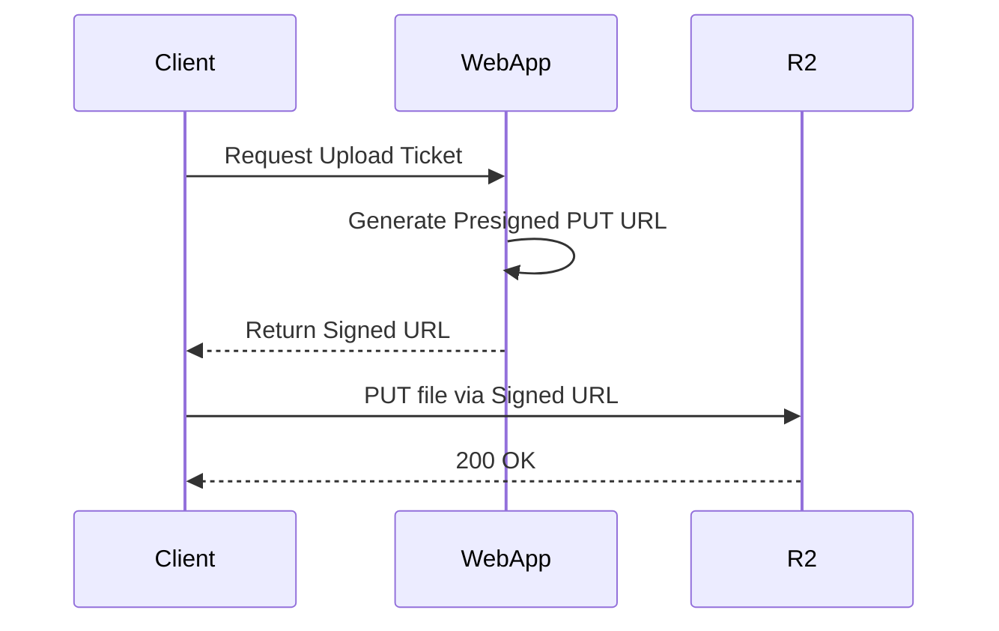
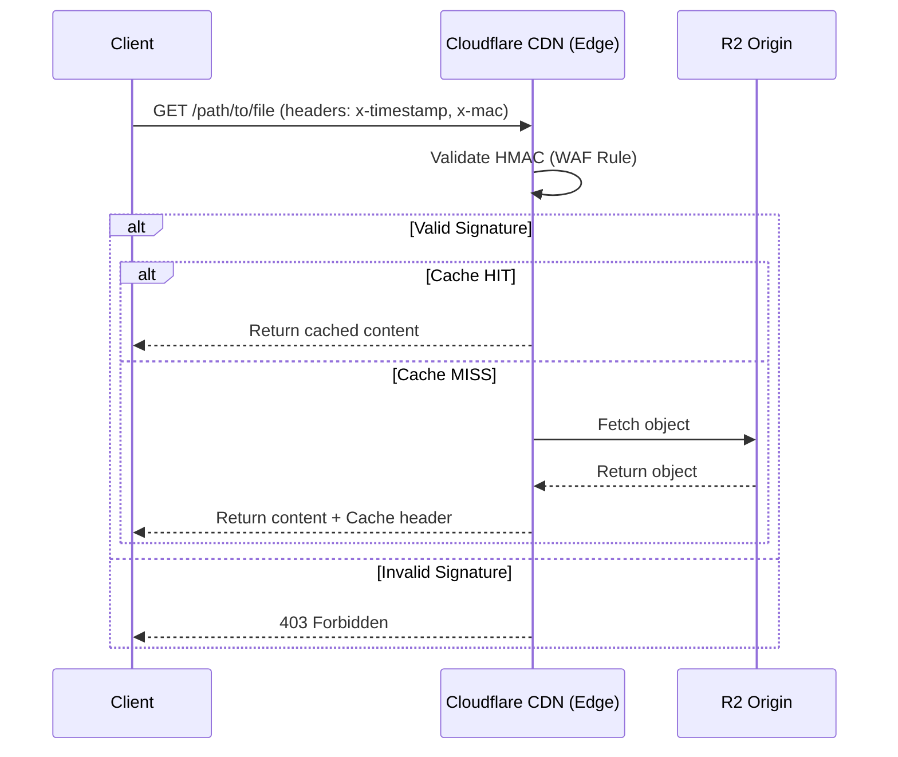

# CDN Architecture (Cloudflare R2)

This document describes the architecture and integration of the Content Delivery Network (CDN) using Cloudflare R2 storage and Cloudflare CDN services.

## 📋 Overview

The system uses **Cloudflare R2** as its primary object storage backend, providing S3-compatible storage with zero egress fees. Content is delivered through **Cloudflare CDN**, which provides globally distributed edge caching and security.

### Key Components

- **Cloudflare R2**: Object storage for assets (firmware, media, logs, etc.).
- **Cloudflare CDN**: Edge delivery layer for low latency and caching.
- **Cloudflare WAF**: Security layer implementing HMAC-based download authentication.
- **S3 SDK**: Node.js integration for managing R2 objects and generating presigned URLs.

## 🔐 Authentication & Security

The CDN implements two distinct authentication flows for security:

### 1. Uploads (Presigned URLs)
To allow secure uploads directly from clients or internal services without exposing master credentials:
- The Web App generates a **Presigned PUT URL** using the R2 Access Key and Secret.
- The client performs a standard `PUT` request to this URL.
- No master credentials ever leave the server environment.

### 2. Downloads (HMAC Authentication)
Public downloads are secured via **HMAC authentication** handled at the Cloudflare edge (WAF):
- The application generates a message composed of `filePath + timestamp`.
- An HMAC-SHA256 signature is generated using a shared secret (`CLOUDFLARE_R2_ACCESS_HMAC`).
- Requests to the CDN must include `x-timestamp` and `x-mac` headers.
- Cloudflare WAF validates the signature before serving the content from cache or origin.

## 🔄 Data Flows

### Upload Flow


### Download Flow (Authenticated)


## 🛠️ Configuration

### Environment Variables

The following variables are required for CDN operations:

| Variable | Description |
|----------|-------------|
| `CLOUDFLARE_R2_BUCKET_NAME` | The name of the R2 bucket |
| `CLOUDFLARE_R2_ACCESS_KEY_ID` | R2 Access Key |
| `CLOUDFLARE_R2_SECRET_ACCESS_KEY` | R2 Secret Access Key |
| `CLOUDFLARE_R2_ENDPOINT` | R2 S3-compatible endpoint URL |
| `CLOUDFLARE_R2_ACCESS_HMAC` | Shared secret for HMAC generation |

### CDN URLs
- **Internal/Direct**: `${CLOUDFLARE_R2_ENDPOINT}/${BUCKET_NAME}/${KEY}`
- **Public/CDN**: `https://cdn-dev.datarealities.com/${KEY}`

## 🧪 Testing

Integration tests for R2 and CDN functionality are located at:
`tests/integrations/cloudflare/cloudflare_r2_e2e.test.ts`

These tests verify:
1. Signed URL generation.
2. Successful upload to R2.
3. HMAC generation and authenticated download.

To run the tests:
```bash
npx dotenv-cli -- vitest run tests/integrations/cloudflare/cloudflare_r2_e2e.test.ts
```
