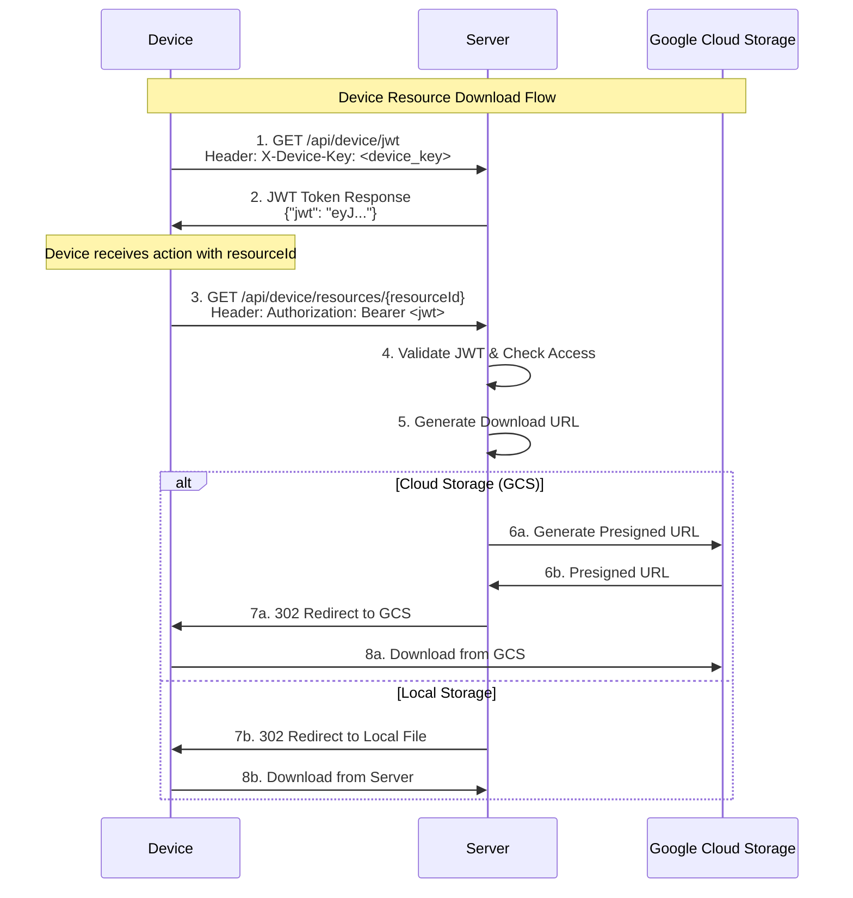

# Device Management Architecture

**Last Updated**: 2025-10-12  
**Status**: ✅ Production Ready

## Overview

This document provides a comprehensive guide to device management, covering device registration, authentication, lifecycle management, API endpoints, and security features for handling 100k+ devices in production.

---

## 🏗️ Device Management Architecture

### Complete Device Lifecycle Flow

```
┌─────────────────────────────────────────────────────────────────────────────────┐
│                        DEVICE LIFECYCLE MANAGEMENT                             │
├─────────────────────────────────────────────────────────────────────────────────┤
│                                                                                 │
│  ┌─────────────────────────────────────────────────────────────────────────┐    │
│  │                        DEVICE REGISTRATION                            │    │
│  │                                                                         │    │
│  │  ┌─────────────┐  ┌─────────────┐  ┌─────────────┐  ┌─────────────┐    │    │
│  │  │   Factory   │  │   Device    │  │   PIN       │  │   SSE       │    │    │
│  │  │    JWT      │  │   Client    │  │ Generation  │  │ Connection  │    │    │
│  │  │src/lib/     │  │   (Go)      │  │src/lib/     │  │src/routes/  │    │    │
│  │  │server/      │  │             │  │server/      │  │api/device/  │    │    │
│  │  │device/      │  │ • Factory   │  │device/      │  │register/    │    │    │
│  │  │deviceJWT    │  │   JWT       │  │devicePin    │  │+server.ts   │    │    │
│  │  │Checker.ts   │  │ • PIN       │  │Checker.ts   │  │             │    │    │
│  │  │             │  │ • MAC       │  │             │  │ • Verify    │    │    │
│  │  │ • Verify    │  │ • Device    │  │ • Validate  │  │   JWT       │    │    │
│  │  │   JWT       │  │   Info      │  │   PIN       │  │ • Create    │    │    │
│  │  │ • Extract   │  │             │  │   Format    │  │   Device    │    │    │
│  │  │   Claims    │  │             │  │   Strength  │  │ • SSE       │    │    │
│  │  └─────────────┘  └─────────────┘  └─────────────┘  └─────────────┘    │    │
│  └─────────────────────────────────────────────────────────────────────────┘    │
│                                    │                                             │
│                                    ▼                                             │
│  ┌─────────────────────────────────────────────────────────────────────────┐    │
│  │                        DEVICE CLAIMING                                │    │
│  │                                                                         │    │
│  │  ┌─────────────┐  ┌─────────────┐  ┌─────────────┐  ┌─────────────┐    │    │
│  │  │     UI      │  │   Device    │  │   Device    │  │   Device    │    │    │
│  │  │   Claim     │  │  Manager    │  │  Database   │  │  Response   │    │    │
│  │  │src/routes/  │  │src/lib/     │  │prisma/      │  │src/routes/  │    │    │
│  │  │admin/iot/   │  │server/      │  │schema.prisma│  │api/device/  │    │    │
│  │  │devices/     │  │device/      │  │             │  │add/         │    │    │
│  │  │claim/       │  │deviceManager│  │ • Device    │  │+server.ts   │    │    │
│  │  │+page.svelte │  │.ts          │  │   Table     │  │             │    │    │
│  │  │             │  │             │  │ • API Key   │  │ • Update    │    │    │
│  │  │ • Enter     │  │ • Claim     │  │   Generation│  │   Device    │    │    │
│  │  │   PIN       │  │   Device    │  │ • User      │  │ • Send      │    │    │
│  │  │ • Validate  │  │ • Generate  │  │   Assignment│  │   API Key   │    │    │
│  │  │   Access    │  │   API Key   │  │ • Account   │  │ • Notify    │    │    │
│  │  └─────────────┘  └─────────────┘  └─────────────┘  └─────────────┘    │    │
│  └─────────────────────────────────────────────────────────────────────────┘    │
│                                    │                                             │
│                                    ▼                                             │
│  ┌─────────────────────────────────────────────────────────────────────────┐    │
│  │                        DEVICE AUTHENTICATION                          │    │
│  │                                                                         │    │
│  │  ┌─────────────┐  ┌─────────────┐  ┌─────────────┐  ┌─────────────┐    │    │
│  │  │   Device    │  │   API Key   │  │   Device    │  │   JWT       │    │    │
│  │  │   Client    │  │   Auth      │  │   Service   │  │   Token     │    │    │
│  │  │   (Go)      │  │src/lib/     │  │src/lib/     │  │src/routes/  │    │    │
│  │  │             │  │server/      │  │server/      │  │api/device/  │    │    │
│  │  │ • API Key   │  │device/      │  │deviceService│  │jwt/         │    │    │
│  │  │   Header    │  │deviceAuth.ts│  │.ts          │  │+server.ts   │    │    │
│  │  │ • Device    │  │             │  │             │  │             │    │    │
│  │  │   Info      │  │ • Validate  │  │ • Get       │  │ • Generate  │    │    │
│  │  │ • Status    │  │   API Key   │  │   Device    │  │   JWT       │    │    │
│  │  │   Updates   │  │ • Get       │  │   Info      │  │ • Device    │    │    │
│  │  │             │  │   Device    │  │             │  │   Claims    │    │    │
│  │  └─────────────┘  └─────────────┘  └─────────────┘  └─────────────┘    │    │
│  └─────────────────────────────────────────────────────────────────────────┘    │
│                                    │                                             │
│                                    ▼                                             │
│  ┌─────────────────────────────────────────────────────────────────────────┐    │
│  │                        DEVICE OPERATIONS                              │    │
│  │                                                                         │    │
│  │  ┌─────────────┐  ┌─────────────┐  ┌─────────────┐  ┌─────────────┐    │    │
│  │  │   Apps      │  │  Resources  │  │   Status    │  │   Messages  │    │    │
│  │  │ Management  │  │  Download   │  │ Management  │  │   & Data    │    │    │
│  │  │src/routes/  │  │src/routes/  │  │src/lib/     │  │src/routes/  │    │    │
│  │  │api/device/  │  │api/device/  │  │server/      │  │api/device/  │    │    │
│  │  │apps/        │  │resources/   │  │device/      │  │message/     │    │    │
│  │  │available/   │  │[id]/        │  │deviceStatus │  │+server.ts   │    │    │
│  │  │+server.ts   │  │+server.ts   │  │Manager.ts   │  │             │    │    │
│  │  │             │  │             │  │             │  │ • Receive   │    │    │
│  │  │ • List      │  │ • Download  │  │ • Track     │  │   Messages  │    │    │
│  │  │   Apps      │  │   Files     │  │   Status    │  │ • Push      │    │    │
│  │  │ • Rate      │  │ • Access    │  │ • Update    │  │   Data      │    │    │
│  │  │   Limit     │  │   Control   │  │   Database  │  │ • Real-time │    │    │
│  │  └─────────────┘  └─────────────┘  └─────────────┘  └─────────────┘    │    │
│  └─────────────────────────────────────────────────────────────────────────┘    │
└─────────────────────────────────────────────────────────────────────────────────┘
```

### Core Components

1. **Device Registration**: Factory JWT validation, PIN generation, SSE connection
2. **Device Claiming**: User PIN entry, device assignment, API key generation
3. **Device Authentication**: API key validation, JWT token generation
4. **Device Operations**: App management, resource downloads, status tracking

---

## 📦 Device Resource Download Workflow

### Overview

Devices can download resources (apps, firmware, files) using a secure JWT-based authentication system. The workflow involves two main steps:

1. **JWT Token Acquisition** - Device gets a JWT token using its API key
2. **Resource Download** - Device uses JWT token to download specific resources

### Complete Workflow



### Step-by-Step Process

#### Step 1: Device Gets JWT Token

... (content unchanged from original, with GET /api/device/jwt and "jwt" field) ...

---

## 📱 Complete Device Flow: Register → Listen → JWT

... (content unchanged) ...

### Device Authentication

#### `GET /api/device/jwt`

... (response uses "jwt") ...

---

## 🔐 Device Authentication

... (content unchanged) ...

## 🏷️ Device Lifecycle Management

... (content unchanged) ...

## 📊 Device Database Schema

... (content unchanged) ...

## 🔌 Device API Endpoints

... (content unchanged, with GET /api/device/jwt) ...

## 📨 Server-to-Device Actions & Device Responses

... (content unchanged) ...

## 🔒 Security Features

... (content unchanged) ...

## 📈 Performance & Scalability

... (content unchanged) ...

## 🧪 Testing & Monitoring

... (content unchanged) ...

## 🔧 Troubleshooting

... (content unchanged) ...

## 📚 Related Documentation

- [System Architecture](../system/SYSTEM_ARCHITECTURE.md) - Complete system design
- [Real-Time Communication](../real-time/REAL_TIME_COMMUNICATION.md) - SSE, WebSocket, and WebRTC
- [Troubleshooting](./TROUBLESHOOTING.md) - All fixes and debugging guides

---

## 🔑 Key Takeaways

... (content unchanged) ...

