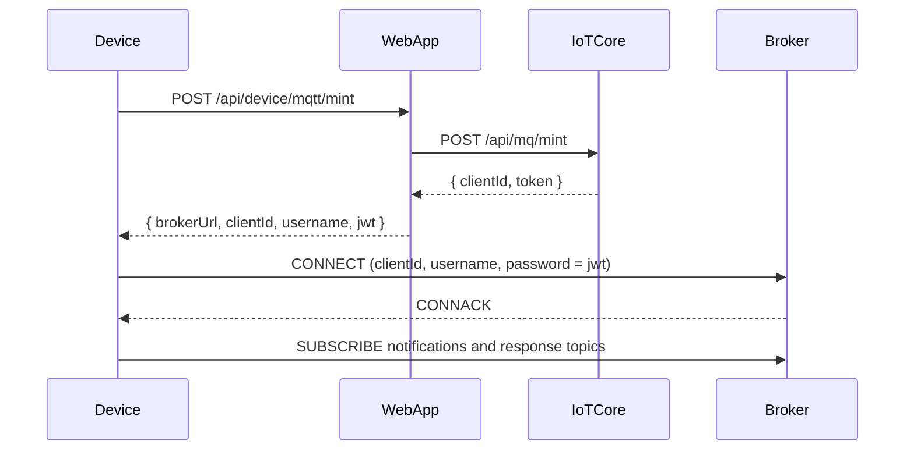

## Device Connection (post-claim)

This document describes how a **claimed device** connects to FS04 over
MQTT using its `deviceId` and API key.

---

## 1. Minting a device link JWT

Once a factory device has been claimed (see `DEVICE_CLAIM.md` – step 7), the
backend issues a real `Device` record with:

- `id` – the `deviceId` used for subsequent connections
- `apiKey` – the secret used to authenticate the device

To connect over MQTT, the device (or a provisioning script) **exchanges** its
`apiKey` for a short-lived **link JWT** and broker URL via the mint endpoint:

- `POST /api/device/mqtt/mint`

Request (HTTP-level contract):

- Headers:
  - `X-API-Key: <apiKey>`
  - `X-Device-Id: <deviceId>`
  - `Content-Type: application/json`
- Body:

```jsonc
{}
```

Response (standard MQTT mint payload):

```jsonc
{
  "brokerUrl": "wss://mq.datarealities.com/mqtt", // from MQTT_BROKER_URL
  "clientId": "device:<deviceId>_<suffix>",        // minted by IoT Core
  "username": "device:<deviceId>",               // effective MQTT username
  "jwt": "<link-jwt>",                           // MQTT password/token
  "mqttUsername": "device:<deviceId>"            // legacy alias (optional)
}
```

The link JWT has a subject and claims similar to:

- `sub = device:<deviceId>`
- `scope = device:mqtt`
- `exp` = short expiry window (e.g. 15 minutes)

The device uses:

- MQTT **username** = `sub` (e.g. `device:cmi123...`)
- MQTT **password** = the link JWT

Broker ACLs then map `sub` to the allowed device topics.

### 1.1 End-to-end mint + connect sequence

This sequence continues from the claim flow in `DEVICE_CLAIM.md`, after the
device has received its `deviceId` and `apiKey` via `device.claim.confirm`.



---

## 2. Device topics after claim

For a claimed device with id `<deviceId>`, topics are:

- RPC-style:
  - `device/device:<deviceId>/requests`
  - `device/device:<deviceId>/response`
  - `device/device:<deviceId>/loopback` (diagnostic channel)

- Notification-style:
  - `device/device:<deviceId>/notifications`
  - `device/device:<deviceId>/replies`

In practice, most flows follow the same pattern used by the factory link:

1. Device sends RPCs (e.g. telemetry requests) on
   `device/device:<deviceId>/requests` and reads responses on
   `device/device:<deviceId>/response`.
2. Worker sends notifications on `device/device:<deviceId>/notifications`
   (e.g. configuration updates, commands). When a reply is needed, the device
   either:
   - responds with an RPC on the `.../requests` topic, or
   - for ticket-based flows like screenshots, replies on the
     `device/device:<deviceId>/replies` topic,
   using signed tickets as described in `DEVICE_MQTT.md`.

The exact set of RPC operations and notifications for post-claim device
management will be documented as they are implemented.
