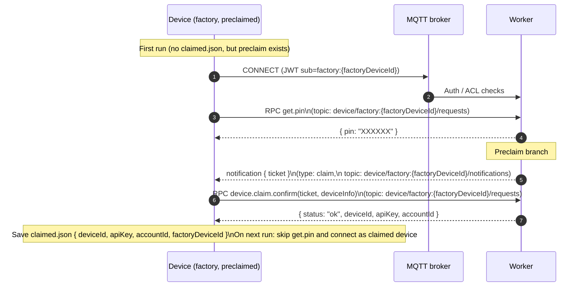

## Pre-claimed devices & MQTT

This document describes how **pre-claimed devices** integrate with the existing
MQTT architecture. A pre-claimed device is one that is **assigned to an
account before it ever comes online**, so there is no interactive claim step
for the end user.

The design intentionally reuses the existing claimed-device MQTT model and the
`/api/device/mqtt/mint` endpoint, so there is no special MQTT behavior: a
pre-claimed device looks like a normal claimed device at the protocol level.

---

## 1. Goals

- Allow ops/manufacturing to pre-assign devices to accounts before shipping.
- Avoid introducing a new MQTT identity or topic scheme.
- Keep all access control in the same place as dynamically-claimed devices
  (Zenstack policies on `Device` and account membership).
- Preserve the existing factory claim flow for devices that are not
  pre-claimed.

---

## 2. Data model (conceptual)

The **APK only knows a shared factory key** plus a hardware identifier (e.g.
`mac_id`). All pre-claim state lives on the server side.

Key pieces:

- **PreclaimSet** (existing Zenstack model):
  - Belongs to an `Account`.
  - Groups a set of pre-claimed devices for that account.
  - Has `expiresAt` / status so pre-claim entries can expire.

- **PreclaimDevice** (existing Zenstack model):
  - Belongs to a `PreclaimSet`.
  - Stores a hardware identifier (e.g. `macId` or serial) that the factory app
    can report.
  - Optionally references a `factoryDeviceId` or planned `deviceId`.

- **Device** row (what MQTT ultimately cares about):
  - `Device.id` – the `deviceId` used as `device:<deviceId>` in MQTT.
  - `Device.accountId` – target account (from the owning `PreclaimSet`).
  - `Device.apiKey` – per-device secret used with `/api/device/mqtt/mint`,
    generated by the backend.
  - `Device.status` – e.g. `PRECLAIMED` → `ACTIVE` after first connect.

> From MQTT's point of view, the **`Device` row is the source of truth**.
> `PreclaimSet` and `PreclaimDevice` only influence *when* and *to which
> account* the `Device` is created/attached.

Row-level security (see project docs) continues to ensure that only members of
`Device.accountId` can read/update the device, regardless of whether it was
pre-claimed or dynamically claimed.

---

## 3. Provisioning flow (offline)

1. **Create PreclaimSets for an account**
   - An admin or provisioning pipeline creates `PreclaimSet` records under an
     `Account` with:
     - Human-readable label/metadata.
     - `expiresAt` (and/or `isActive`) to limit when pre-claims are valid.

2. **Populate PreclaimDevices**
   - For each physical unit to be pre-assigned, create a `PreclaimDevice` in a
     set with:
     - `hardwareId` / `macId` matching what the APK can report.
     - Optional planned `deviceId` / tags.

3. **Embed only factory credentials in the APK**
   - The build/CI pipeline bakes a **factory API key/JWT** into the APK.
   - No per-device `apiKey` or account ID is embedded in the binary.

At this point, pre-claimed devices exist only as `PreclaimDevice` rows tied to
accounts via `PreclaimSet`. No `Device` rows or per-device API keys exist yet.

---

## 4. First online interaction (factory flow)

When a device boots in the field for the first time, it only knows the factory
credentials. It uses the **existing factory MQTT flow**; pre-claim simply
changes how the worker handles `get.pin` and how the claim is kicked off.

1. **Mint factory MQTT credentials & connect**
   - Device calls the factory mint endpoint using its embedded factory key.
   - Connects to the broker as `factory:<factoryDeviceId>` on
     `device/factory:<factoryDeviceId>/requests|response|notifications|replies|loopback`.

2. **Call `get.pin` RPC (unchanged from device perspective)**
   - Device sends `get.pin` on `device/factory:<factoryDeviceId>/requests`.
   - The worker resolves the `factoryDevice` record (which should carry a
     `hardwareId` / `macId`).
   - The worker looks up a **valid PreclaimDevice** for this hardware ID:
     - `PreclaimDevice.hardwareId == factoryDevice.hardwareId`.
     - Parent `PreclaimSet` belongs to an `Account`.
     - `PreclaimSet.expiresAt` not passed and set is active.

3. **Branching inside `get.pin`**
   - **No matching or expired pre-claim** → **standard dynamic claim**:
     - Worker generates a PIN, records the mapping, and returns:

       ```jsonc
       { "pin": "XXXXXX" }
       ```

     - User later performs the PIN-based claim flow as documented in
       `DEVICE_CLAIM.md` (user publishes `user.claim.device`, device receives
       a claim notification, then calls `device.claim.confirm`).

   - **Valid pre-claim found** → **auto-start claim flow (device-confirmed)**:
     1. Worker still returns the same `{ pin: "XXXXXX" }` payload to the
        factory so the client behavior is unchanged.
     2. In parallel, worker uses the preclaim context to resolve the
        **intended owner** (`userId` + `accountId`) and immediately sends a
        `claim` notification ticket to the *factory device*:

        - `sub = user:{userId}:{accountId}` (from `PreclaimSet` / `claimedBy`).
        - `recipient = factory:{factoryDeviceId}`.
        - `type = 'claim'`.
        - `params` include `factoryDeviceId`, `preclaimDeviceId`, `accountId`.
        - Published on `device/factory:{factoryDeviceId}/notifications` using
          the same ticket format as the normal claim flow.

     3. The device receives `{ ticket }` on
        `device/factory:{factoryDeviceId}/notifications` and, just like in the
        normal flow, calls `device.claim.confirm` with the ticket (and optional
        `deviceInfo`) on `device/factory:{factoryDeviceId}/requests`.

     4. `handle_claim_confirm` verifies the ticket and, for the preclaim case,
        creates the `Device` and fulfills the preclaim:

        - Creates a `Device` row with `id`, `accountId`, and `apiKey` using the
          account/user from the ticket and any hints from `PreclaimDevice`.
        - Updates `PreclaimDevice` to `FULFILLED` and links it to the
          created `Device`.
        - Updates `FactoryDevice` (`claimedDeviceId`, `accountId`, `claimedAt`).
        - Responds to the device with

          ```jsonc
          { "status": "ok", "deviceId": "...", "apiKey": "...", "accountId": "..." }
          ```

     5. The device stores the returned credentials (e.g. `claimed.json`) and on
        the next run connects as a normal claimed device using `/api/device/mqtt/mint`.

### End-to-end preclaim sequence



## 5. Interaction with dynamic claim & claimed devices

Dynamic claim (factory link + PIN) and pre-claim **share the same runtime
model once completed**:

- Both end up with a `Device` row with `id`, `accountId`, and `apiKey`.
- Both use `/api/device/mqtt/mint` and the `device:<deviceId>` MQTT subject
  for post-claim connections (see `DEVICE_CONNECT.md`).

The only difference is **who starts the claim flow** and when `device.claim.confirm`
is called:

- Dynamic claim:
  - `get.pin` generates a PIN and returns `{ pin }`.
  - User explicitly calls `user.claim.device` over MQTT using that PIN.
  - Device receives a `claim` notification and calls `device.claim.confirm`.

- Pre-claim:
  - `get.pin` still returns `{ pin }` to the factory.
  - When a valid, non-expired preclaim exists for the hardware ID, the worker
    immediately sends a `claim` notification to the factory device with a
    ticket bound to the intended user/account.
  - The device then calls `device.claim.confirm` with that ticket; the worker
    creates the `Device` and fulfills the preclaim.

Once claimed (either way), ongoing MQTT behavior (topics, screenshots,
resets, etc.) is identical, keeping the protocol surface **simple and
uniform** while allowing pre-assignment of devices to accounts.

