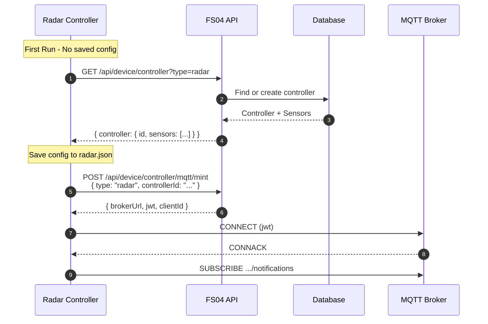
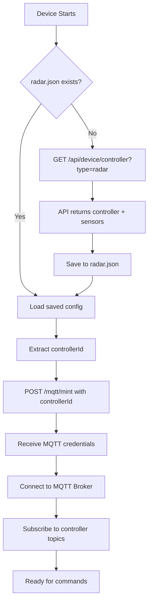
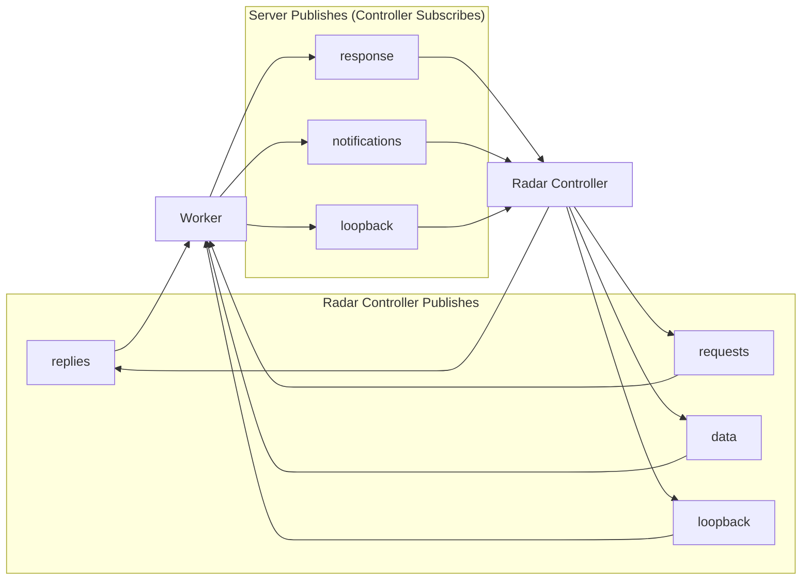

# Radar Controller Configuration & MQTT Integration

## Recommended Flow

**Step 1: Get/Create Controller Configuration**  
**Step 2: Mint MQTT Credentials**

This separation allows devices to:
- Retrieve controller and sensor config once
- Persist the controllerId locally
- Mint MQTT credentials multiple times without recreation



---

## 1. Controller Configuration API

### Endpoint
`GET /api/device/controller?type=radar`

### Purpose
- Retrieves existing radar controller for the device
- Auto-creates controller if it doesn't exist
- Returns controller info, associated sensors, and radar-specific config

### Request
```bash
GET /api/device/controller?type=radar
Headers:
  X-API-Key: <device-api-key>
```

### Response
```json
{
  "success": true,
  "data": {
    "controller": {
      "id": "ctrl-abc-123",
      "name": "Auto-created Radar Controller",
      "type": "radar",
      "serialNumber": "RADAR-DEV123AB-LV8X2M",
      "status": "ACTIVE",
      "description": "Auto-created during config retrieval",
      "createdAt": "2025-12-22T08:00:00Z",
      "updatedAt": "2025-12-22T08:00:00Z",
      "sensors": [
        {
          "id": "sensor-xyz-456",
          "name": "Radar Sensor 1",
          "type": "radar",
          "status": "ACTIVE",
          "config": {
            "detectionZones": [],
            "sensitivity": 50,
            "range": 10
          },
          "createdAt": "2025-12-22T08:00:00Z",
          "updatedAt": "2025-12-22T08:00:00Z"
        }
      ]
    }
  }
}
```

### Device Should:
1. Call this endpoint on first initialization
2. Save the `controllerId` to `workings/controller/radar.json`
3. Use the saved `controllerId` for all subsequent MQTT mints

---

## 2. MQTT Credentials Minting

### Endpoint
`POST /api/device/controller/mqtt/mint`

### Purpose
Mints scoped MQTT credentials for the controller

### Request (With Controller ID)
```bash
POST /api/device/controller/mqtt/mint
Headers:
  X-API-Key: <device-api-key>
  Content-Type: application/json

Body:
{
  "type": "radar",
  "controllerId": "ctrl-abc-123"  // From config endpoint
}
```

### Request (Auto-Create - Optional)
```bash
{
  "type": "radar"
  // controllerId omitted - will find or create
}
```

### Response
```json
{
  "success": true,
  "data": {
    "brokerUrl": "wss://mq.datarealities.com/mqtt",
    "clientId": "device:device-123_a1b2c3",
    "username": "device:device-123",
    "jwt": "<signed-jwt-token>",
    "mqttUsername": "device:device-123",
    "controllerId": "ctrl-abc-123"
  }
}
```

---

## Device Implementation Pattern

### Initialization Flow



### File Structure
```
workings/
├── claimed.json           # Device claim info
└── controller/
    ├── radar.json         # { "controllerId": "ctrl-abc-123" }
    ├── camera.json        # { "controllerId": "ctrl-def-456" }
    └── ble.json           # { "controllerId": "ctrl-ghi-789" }
```

### radar.json Format
```json
{
  "controller": {
    "id": "ctrl-abc-123",
    "name": "Auto-created Radar Controller",
    "type": "radar",
    "serialNumber": "RADAR-DEV123AB-LV8X2M",
    "status": "ACTIVE",
    "sensors": [
      {
        "id": "sensor-xyz-456",
        "name": "Radar Sensor 1",
        "type": "radar",
        "status": "ACTIVE",
        "config": {
          "detectionZones": [],
          "sensitivity": 50,
          "range": 10
        }
      }
    ]
  },
  "savedAt": "2025-12-22T08:00:00Z"
}
```

---

## Topic Structure

For radar controller `ctrl-abc` on device `dev-123`:



**Publish (Controller → Server)**:
- `device:dev-123/controller/radar:ctrl-abc/replies`
- `device:dev-123/controller/radar:ctrl-abc/requests`
- `device:dev-123/controller/radar:ctrl-abc/data`
- `device:dev-123/controller/radar:ctrl-abc/loopback`

**Subscribe (Server → Controller)**:
- `device:dev-123/controller/radar:ctrl-abc/response`
- `device:dev-123/controller/radar:ctrl-abc/notifications`
- `device:dev-123/controller/radar:ctrl-abc/loopback`

---

## Auto-Creation Behavior

### Config Endpoint (`GET /controller`)
- **Always idempotent** - safe to call multiple times
- Creates controller if it doesn't exist
- Returns existing controller if it does
- One controller per (device, type) combination

### Mint Endpoint (`POST /controller/mqtt/mint`)
- **Preferred**: Provide `controllerId` from config endpoint
- **Optional**: Omit `controllerId` to auto-find/create
- Returns `controllerId` in response regardless

---

## Multiple Controllers (Advanced)

For devices with multiple controllers of the same type:

1. Create controllers explicitly via UI/API
2. Call config endpoint to get all controllers
3. Save multiple controller IDs
4. Specify `controllerId` when minting for each

---

## Benefits of This Design

✅ **Separation of Concerns**: Config retrieval separate from credential minting  
✅ **Efficiency**: Fetch config once, mint many times  
✅ **Flexibility**: Supports multiple controllers per device  
✅ **Simplicity**: Devices can auto-create on first run  
✅ **RESTful**: Clear, predictable API design  
✅ **Extensible**: Easy to add camera, BLE, etc.  

---

## When the list is empty (User / Admin Radar page: "No sensors found")

Radar sensors appear in the **User → Controllers → Radar** (and Admin) list only when there is at least one **Sensor** record for the current account with `type: 'radar'` and a non-deleted controller. Two ways to get sensors:

1. **Device flow (auto-create)**  
   A **device** that is claimed to this account calls `GET /api/device/controller?type=radar` (with its API key). The API finds or creates a Controller for that device and **auto-creates one Sensor**. So as soon as a real or emulated device in this account has called that config endpoint, one controller and one sensor exist and show up in the list.

2. **UI flow (manual)**  
   In the app: **User → Controllers → Radar → Create** (or "New"). Select a **device** that belongs to the current account; the app creates a Controller and a Sensor for that device. The account must have at least one **Device**; if the device list is empty, claim a device to the account first.

If the list is still empty after that, check:
- **Current account** – The list is scoped to the selected account (cookie `current_account_id`). Switch account if needed.
- **Filters** – Status or location filters might hide all rows; clear filters and try again.

---

## See Also

- [SENSOR_PREVIEW.md](./SENSOR_PREVIEW.md) - Live sensor data streaming architecture
- [CONTROLLER.md](./CONTROLLER.md) - General controller MQTT patterns
- [E2E Test](file:///Users/bernard/CascadeProjects/fs04/fs04_web/tests/integrations/controller_mqtt_mint_e2e.test.ts) - Controller MQTT mint integration test