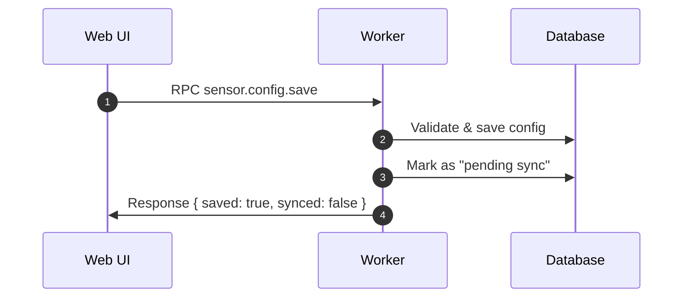
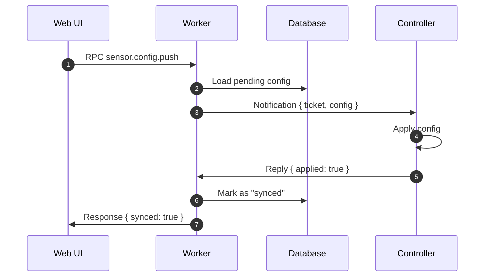
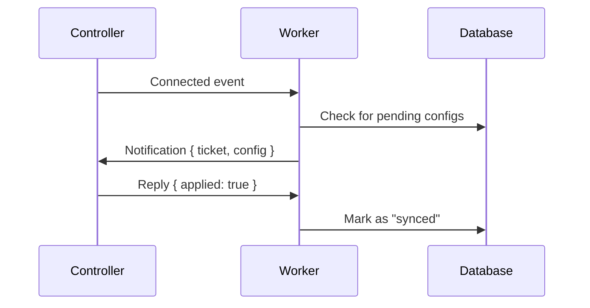
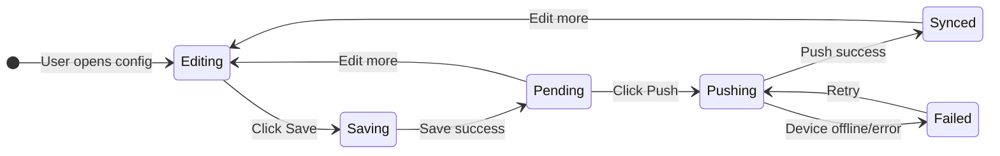

# Sensor Configuration Architecture

Manage sensor configuration with **offline-first save** and **on-demand push** to controllers.

---

## Design Principle

> [!IMPORTANT]
> **Save** and **Push** are separate operations:
> - **Save**: Always works, stores config in database
> - **Push**: Only works when device is online, syncs config to controller

This allows users to edit configuration anytime, even when devices are offline.

---

## Flow Overview

### Save Config (Offline-Safe)



### Push Config to Device



### Auto-Sync on Device Connect (Optional)



---

## Config States

| State | DB Field | Meaning |
|-------|----------|---------|
| `SYNCED` | `syncStatus` | Config matches what's on device |
| `PENDING` | `syncStatus` | Config saved but not pushed to device |
| `FAILED` | `syncStatus` | Push attempted but failed (device error) |

---

## Message Formats

### Save Request (Offline-Safe)

```json
{
  "op": "sensor.config.save",
  "params": {
    "sensorId": "...",
    "config": { "mode": "tracking", "sensitivity": 0.8, ... }
  }
}
```

### Save Response

```json
{
  "result": {
    "saved": true,
    "configVersion": 4,
    "syncStatus": "PENDING"
  }
}
```

### Push Request

```json
{
  "op": "sensor.config.push",
  "params": { "sensorId": "..." }
}
```

### Push Response

```json
{
  "result": {
    "synced": true,
    "syncStatus": "SYNCED",
    "appliedAt": "2024-12-22T10:00:00Z"
  },
  "error": null  // or { "code": "DEVICE_OFFLINE", "message": "..." }
}
```

---

## Topics

| Topic | Direction | Purpose |
|-------|-----------|---------|
| `user/<sub>/requests` | User → Worker | Save/Push RPC |
| `user/<sub>/response` | Worker → User | RPC response |
| `.../controller/.../notifications` | Worker → Controller | Config push |
| `.../controller/.../replies` | Controller → Worker | Push acknowledgment |

---

## UI States



**UI Button States:**

| Device Status | Save Button | Push Button |
|--------------|-------------|-------------|
| Online | ✅ Enabled | ✅ Enabled |
| Offline | ✅ Enabled | ⚠️ Disabled (tooltip: "Device offline") |

**Status Indicators:**
- 🟢 **Synced** - "Config synced with device"
- 🟡 **Pending** - "Changes saved, not pushed yet"
- 🔴 **Failed** - "Push failed, click to retry"

---

## Implementation Checklist

### Worker (Web)

| Item | Status | Notes |
|------|--------|-------|
| `sensor.config.save` RPC | ⬜ | Save to DB, mark pending |
| `sensor.config.push` RPC | ⬜ | Push to device, update status |
| Auto-sync on device connect | ⬜ | Listen for connection events |
| Config versioning | ⬜ | Increment on each save |

### Controller (Device)

| Item | Status | Notes |
|------|--------|-------|
| Handle `config.update` notification | ✅ | Already in radar.ts |
| Version acknowledgment | ⬜ | Include configVersion in reply |

### User (Browser)

| Item | Status | Notes |
|------|--------|-------|
| Save button → `sensor.config.save` | ⬜ | Always enabled |
| Push button → `sensor.config.push` | ⬜ | Enabled when online |
| Sync status indicator | ⬜ | Show SYNCED/PENDING/FAILED |
| Auto-push toggle | ⬜ | Push automatically on save |

---

## Error Handling

| Scenario | Behavior |
|----------|----------|
| Save while offline | Always succeeds (DB only) |
| Push while offline | Returns `DEVICE_OFFLINE` error |
| Push fails | Mark as `FAILED`, allow retry |
| Device connects | Auto-push pending configs (if enabled) |

---

## See Also

- [SENSOR_PREVIEW.md](./SENSOR_PREVIEW.md) - Live data streaming
- [RADAR.md](./RADAR.md) - Radar config schema
