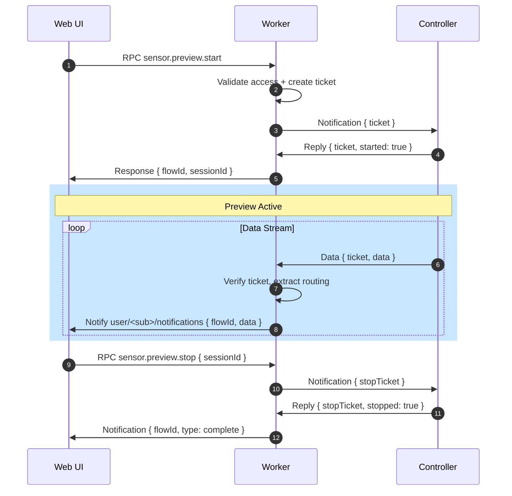

# Sensor Preview Architecture

Live sensor data streaming from controllers to web users via **Worker-Mediated Relay**.

---

## Flow Overview



---

## Message Formats

### Start Request (User → Worker)

```json
{
  "requestId": "uuid",
  "op": "sensor.preview.start",
  "params": { "deviceId": "...", "controllerId": "...", "sensorId": "...", "duration": 60 }
}
```

### Start Response

```json
{
  "requestId": "uuid",
  "flowId": "flow-uuid",
  "result": { "sessionId": "session-uuid", "status": "started", "expiresAt": "..." }
}
```

### Controller Notification (Worker → Controller)

```json
{ "ticket": "<signed-jwt>" }
```

**Ticket Claims**: `type`, `flowId`, `recipient`, `deviceId`, `controllerId`, `sensorId`, `sessionId`, `duration`, `exp`

### Data Frame (Controller → Worker)

```json
{
  "ticket": "<signed-jwt>",
  "type": "preview.frame",
  "timestamp": 1703264100000,
  "data": { "points": [...] }
}
```

### User Notification (Worker → User)

```json
{
  "flowId": "flow-uuid",
  "type": "preview.data",
  "timestamp": 1703264100000,
  "data": { "points": [...] }
}
```

---

## Stateless Routing

> [!IMPORTANT]
> Workers are **stateless**. The controller echoes the ticket with each data frame. Workers verify the ticket and extract routing from claims.

**Worker Logic**:
1. Receive data on `.../controller/<type>:<id>/data`
2. Verify `ticket` signature + check `exp`
3. Extract `recipient` and `flowId` from claims
4. Forward data to recipient

---

## Topics

| Topic | Direction | Purpose |
|-------|-----------|---------|
| `user/<sub>/requests` | User → Worker | Start/stop RPC |
| `user/<sub>/response` | Worker → User | RPC response |
| `user/<sub>/notifications` | Worker → User | Data stream |
| `.../controller/.../notifications` | Worker → Controller | Commands |
| `.../controller/.../replies` | Controller → Worker | Command responses |
| `.../controller/.../data` | Controller → Worker | Data frames |

---

## Security

- User access validated before starting
- Max 5 min duration, max 2 concurrent sessions per user
- Ticket signature verification on all data frames
- Auto-expiry via `exp` claim

---

## Implementation Checklist

### Worker (Web)

| Item | Status | Notes |
|------|--------|-------|
| `sensor.preview.start` RPC handler | ✅ | [handle_sensor_preview.ts](file:///Users/bernard/CascadeProjects/fs04/fs04_web/src/lib/server/mqtt/handlers/web/handle_sensor_preview.ts) |
| `sensor.preview.stop` RPC handler | ✅ | Same file |
| Ticket creation with routing claims | ✅ | `recipient`, `flowId`, `sessionId` in claims |
| Data forwarding from `.../data` | ✅ | [index.ts](file:///Users/bernard/CascadeProjects/fs04/fs04_web/src/lib/server/mqtt/handlers/index.ts) |
| Stateless ticket verification | ✅ | Ticket-based routing implemented, legacy fallback maintained |

> [!NOTE]
> Worker supports **both** routing methods:
> - **Ticket-based** (preferred): Controller echoes ticket in each data frame - stateless and horizontally scalable
> - **Session-based** (legacy): Uses in-memory session lookup - single worker only

### Controller (Device)

| Item | Status | Notes |
|------|--------|-------|
| Handle `preview.start` notification | ✅ | [radar.ts](file:///Users/bernard/CascadeProjects/fs04/fs04_device/emulators/node/devices/controllers/radar/radar.ts) |
| Handle `preview.stop` notification | ✅ | Same file |
| Echo ticket in each data frame | ✅ | `{ ticket, type: "preview.frame", data }` |
| Duration-based auto-stop | ✅ | Extracts duration from ticket claims |

### User (Browser)

| Item | Status | Notes |
|------|--------|-------|
| Connect to MQTT | ✅ | Via SvelteKit MQTT client |
| Call `sensor.preview.start` RPC | ✅ | [sensor-preview-store.ts](file:///Users/bernard/CascadeProjects/fs04/fs04_web/src/lib/stores/sensor-preview-store.ts) |
| Store `flowId` from response | ✅ | Same file |
| Listen for `preview.data` notifications | ✅ | Filters by `flowId` |
| Render data frames | ✅ | [RadarPreview.svelte](file:///Users/bernard/CascadeProjects/fs04/fs04_web/src/lib/components/ui_components_sveltekit/radar/RadarPreview.svelte) |
| Call `sensor.preview.stop` RPC | ✅ | Same store |
### Tests

| Item | Status | Notes |
|------|--------|-------|
| E2E test: start/stop flow | ✅ | [sensor_preview_e2e.test.ts](file:///Users/bernard/CascadeProjects/fs04/fs04_web/tests/integrations/sensor_preview_e2e.test.ts) |
| E2E test: legacy data forwarding | ✅ | Session-based routing for backwards compatibility |
| E2E test: ticket-based data forwarding | ✅ | Stateless routing with ticket verification |

---

## See Also

- [Device Notification Reply Pattern](../DEVICE_NOTIFICATION_REPLY.md) - Stateless ticket pattern
- [RADAR.md](./RADAR.md) - Radar controller configuration
