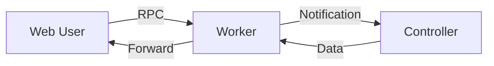
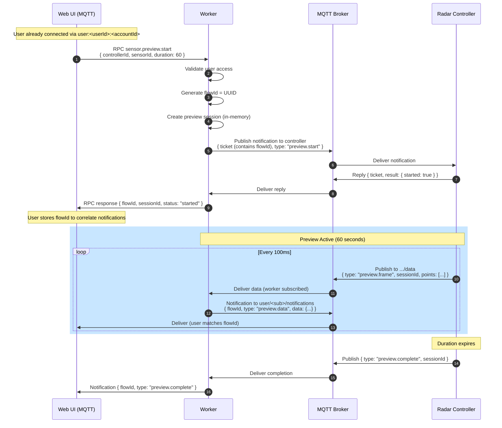

# Sensor Preview Architecture

This document describes how **web users** request and receive **live sensor data streams** from controllers (e.g., radar point clouds, camera frames).

---

## 1. Overview

The sensor preview flow enables a web user to temporarily receive real-time sensor data from a controller using a **Worker-Mediated Relay** pattern.



### 1.1 Design Goals

- **Bounded Duration**: Previews are time-limited (e.g., 60 seconds)
- **No New Connection**: Uses existing MQTT connection
- **Secure**: Worker validates user access before starting
- **Scalable**: Worker can throttle/aggregate data

---

## 2. Complete Flow



---

## 3. Message Formats

### 3.1 RPC: `sensor.preview.start`

**Request** (User → Worker via `user/<sub>/requests`):

```json
{
  "requestId": "uuid...",
  "op": "sensor.preview.start",
  "params": {
    "deviceId": "device-123",
    "controllerId": "ctrl-abc",
    "sensorId": "sensor-xyz",
    "duration": 60
  }
}
```

**Response**:

```json
{
  "requestId": "uuid...",
  "flowId": "flow-uuid...",
  "result": {
    "sessionId": "preview-session-123",
    "status": "started",
    "expiresAt": "2025-12-22T17:35:00Z"
  }
}
```

### 3.2 Notification: `preview.start`

**Worker → Controller** (via `.../notifications`):

```json
{
  "ticket": "<signed-jwt>",
  "type": "preview.start",
  "params": {
    "sensorId": "sensor-xyz",
    "duration": 60,
    "sessionId": "preview-session-123"
  }
}
```

**Ticket Claims**:
| Claim | Description |
|-------|-------------|
| `type` | `"preview.start"` |
| `flowId` | Correlation ID for entire flow |
| `deviceId` | Device the controller belongs to |
| `controllerId` | Target controller |
| `sensorId` | Sensor to preview |
| `userId` | Requesting user |
| `sessionId` | Unique session ID |
| `duration` | Duration in seconds |
| `exp` | Short expiry (5 min) |

**Controller Reply**:

```json
{
  "ticket": "<signed-jwt>",
  "result": { "started": true, "frequency": 100 }
}
```

### 3.3 Data Messages

**Controller → Worker** (via `.../data`):

```json
{
  "type": "preview.frame",
  "sessionId": "preview-session-123",
  "sensorId": "sensor-xyz",
  "timestamp": 1703264100000,
  "data": {
    "points": [{ "x": 1.2, "y": 3.4, "z": 0.5, "velocity": 1.1 }]
  }
}
```

**Worker → User** (via `user/<sub>/notifications`):

```json
{
  "flowId": "flow-uuid...",
  "type": "preview.data",
  "sessionId": "preview-session-123",
  "sensorId": "sensor-xyz",
  "timestamp": 1703264100000,
  "data": { "points": [...] }
}
```

### 3.4 RPC: `sensor.preview.stop`

User can stop early:

```json
{
  "op": "sensor.preview.stop",
  "params": { "sessionId": "preview-session-123" }
}
```

---

## 4. Worker Session Management

```typescript
type PreviewSession = {
  sessionId: string;
  flowId: string;       // Correlates entire flow
  userId: string;
  accountId: string;
  deviceId: string;
  controllerId: string;
  sensorId: string;
  startedAt: Date;
  expiresAt: Date;
  userTopic: string;    // user/<userId>:<accountId>/notifications
};

const activePreviews = new Map<string, PreviewSession>();
```

**Data Routing Logic**:
1. Data arrives on `.../controller/<type>:<id>/data`
2. Extract `sessionId` from payload
3. Look up session in map
4. If valid → forward to `userTopic`
5. If expired → send `preview.stop` to controller

---

## 5. Topic Summary

| Topic | Direction | Purpose |
|-------|-----------|---------|
| `user/<sub>/requests` | User → Worker | Start/stop RPC |
| `user/<sub>/response` | Worker → User | RPC response |
| `user/<sub>/notifications` | Worker → User | Preview data |
| `.../controller/.../notifications` | Worker → Controller | Start/stop |
| `.../controller/.../replies` | Controller → Worker | Replies |
| `.../controller/.../data` | Controller → Worker | Data stream |

---

## 6. Security

- **Authorization**: Worker validates user access before starting
- **Duration Caps**: Max 5 minutes per preview
- **Rate Limits**: Max 2 concurrent previews per user
- **Ticket Verification**: Controller verifies signature

---

## 7. Implementation Checklist

- [ ] Worker: `sensor.preview.start` RPC handler
- [ ] Worker: `sensor.preview.stop` RPC handler  
- [ ] Worker: Preview session management
- [ ] Worker: Data forwarding from `.../data`
- [ ] Controller: Handle `preview.start/stop` notifications
- [ ] Controller: Publish data frames with sessionId
- [ ] E2E test: `sensor_preview_e2e.test.ts`
