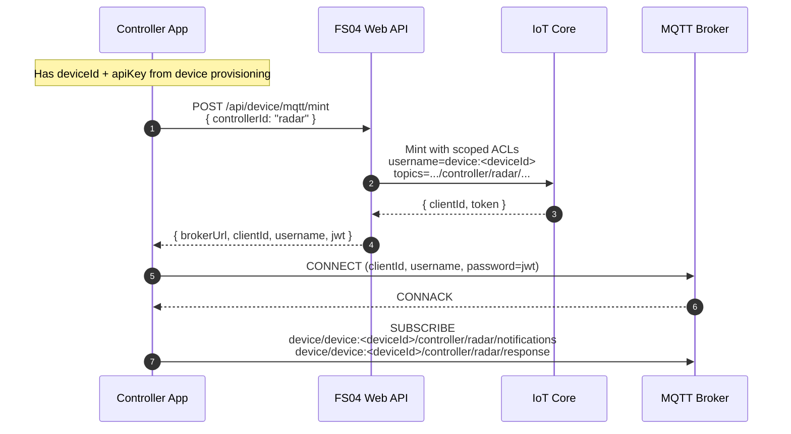
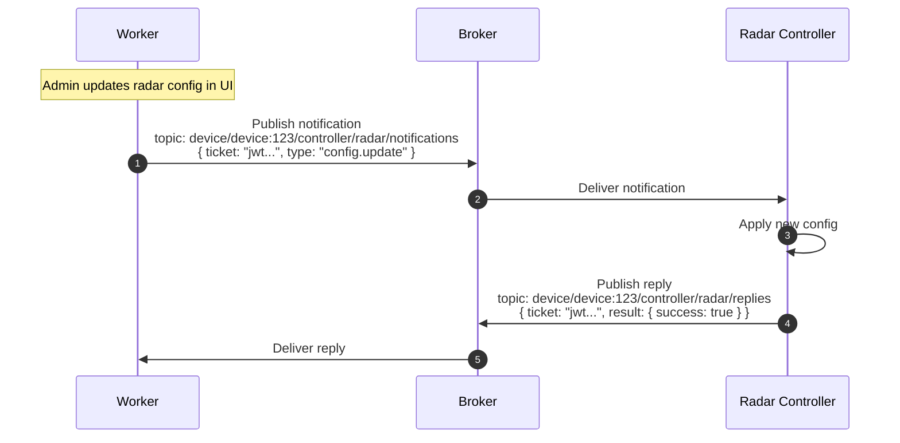
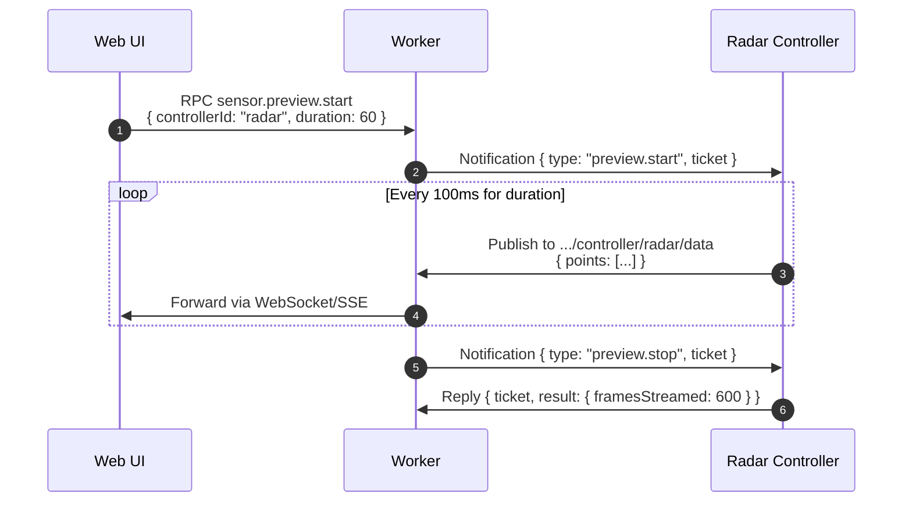
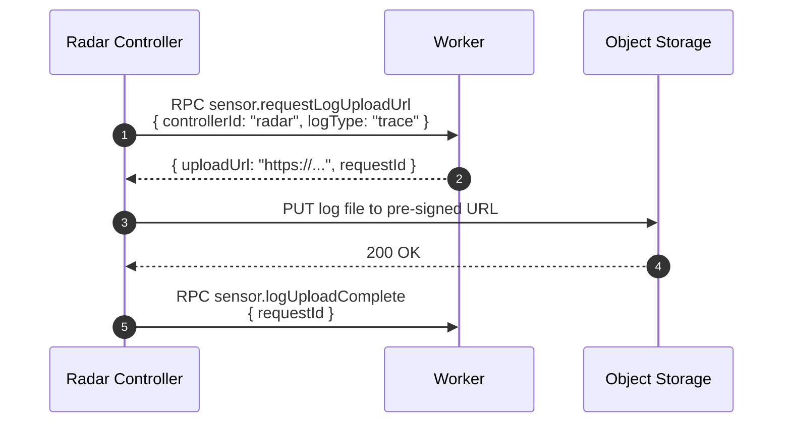

## Controller MQTT Architecture

This document describes how **Controller Apps** (e.g., Radar Sensor App, Camera
Sensor App) connect to FS04 over MQTT using the **same patterns** as claimed
devices, but with a scoped topic namespace. It extends the architecture defined
in `DEVICE_MQTT.md`, `DEVICE_CONNECT.md`, and `DEVICE_NOTIFICATION_REPLY.md`.

---

## 1. Background

A **Controller** is an app running on a client device that manages one or more
sensors (e.g., radar, camera, BLE scanner). Controllers may run:

- **Alongside the MDM Agent**: Both apps share the same physical device but
  connect independently to the broker.
- **Standalone**: The user installs only the Controller App (e.g., Radar App)
  without the MDM Agent.

Key principles:

- **Reuse device identity**: Controllers authenticate using the device's
  `apiKey`, just like the MDM Agent.
- **Scoped topics**: Controllers operate on a namespaced topic path
  `controller/<controllerId>/...` under the device root, preventing topic
  collisions and limiting blast radius.
- **Same channel pairs**: Controllers use the same RPC (`requests ↔ response`)
  and Notification (`notifications ↔ replies`) patterns as devices.

---

## 2. Topic Structure

Controller topics mirror the device topic structure but are namespaced by a
`controllerId` (e.g., `radar`, `camera`).

### 2.1 Controller Topic Patterns

For a claimed device `<deviceId>` and controller `<controllerId>`:

- RPC-style:
  - `device/device:<deviceId>/controller/<controllerId>/requests`
  - `device/device:<deviceId>/controller/<controllerId>/response`
  - `device/device:<deviceId>/controller/<controllerId>/loopback` *(diagnostic)*

- Notification-style:
  - `device/device:<deviceId>/controller/<controllerId>/notifications`
  - `device/device:<deviceId>/controller/<controllerId>/replies`

- Data stream (optional, QoS 0):
  - `device/device:<deviceId>/controller/<controllerId>/data`

**Example**: Radar controller on device `cmi123`:
- `device/device:cmi123/controller/radar/requests`
- `device/device:cmi123/controller/radar/notifications`

### 2.2 Comparison with Device Topics

| Actor | Topic Pattern |
| :--- | :--- |
| Claimed Device (MDM) | `device/device:<deviceId>/requests` |
| Controller (Radar) | `device/device:<deviceId>/controller/radar/requests` |
| Controller (Camera) | `device/device:<deviceId>/controller/camera/requests` |

This ensures the MDM Agent and Controllers do not interfere with each other's
message flows.

---

## 3. Minting Controller MQTT Credentials

Controllers use the same mint endpoint as claimed devices but request a scoped
credential by including a `controllerId` in the request.

### 3.1 Endpoint

`POST /api/device/mqtt/mint`

### 3.2 Request

Headers (same as claimed device):
- `X-API-Key: <apiKey>`
- `X-Device-Id: <deviceId>`
- `Content-Type: application/json`

Body:

```jsonc
{
  "controllerId": "radar"   // Controller scope identifier
}
```

### 3.3 Response

```jsonc
{
  "brokerUrl": "wss://mq.datarealities.com/mqtt",
  "clientId": "device:<deviceId>_radar_<suffix>",
  "username": "device:<deviceId>",
  "jwt": "<link-jwt>",
  "mqttUsername": "device:<deviceId>"
}
```

### 3.4 ACL Scoping

When `controllerId` is present, the mint endpoint generates ACLs restricted to
the controller namespace:

- `pubTopics`:
  - `device:<deviceId>/controller/<controllerId>/replies`
  - `device:<deviceId>/controller/<controllerId>/requests`
  - `device:<deviceId>/controller/<controllerId>/data`
  - `device:<deviceId>/controller/<controllerId>/loopback`

- `subTopics`:
  - `device:<deviceId>/controller/<controllerId>/response`
  - `device:<deviceId>/controller/<controllerId>/notifications`
  - `device:<deviceId>/controller/<controllerId>/loopback`

When `controllerId` is **not** present (legacy/MDM), the existing root device
topics are used as documented in `DEVICE_CONNECT.md`.

---

## 4. Controller Connection Sequence

This sequence is identical to `DEVICE_CONNECT.md` § 1.1, but the controller
requests scoped credentials.



---

## 5. Channel Pairs

Controllers use the same two channel pairs as devices (see `DEVICE_MQTT.md` § 2):

### 5.1 RPC Pair (requests ↔ response)

- Controller publishes RPC on `.../controller/<controllerId>/requests`.
- Worker responds on `.../controller/<controllerId>/response`.

Payload structure is identical to device RPCs:

```jsonc
{
  "requestId": "uuid...",
  "op": "sensor.getConfig",
  "params": { ... }
}
```

### 5.2 Notification Pair (notifications ↔ replies)

- Worker sends notifications on `.../controller/<controllerId>/notifications`.
- Controller replies on `.../controller/<controllerId>/replies`.

Uses the signed-ticket pattern from `DEVICE_NOTIFICATION_REPLY.md`:

```jsonc
// Notification (Worker → Controller)
{
  "ticket": "<signed-token>"
}

// Reply (Controller → Worker)
{
  "ticket": "<signed-token>",
  "result": { ... }
}
```

---

## 6. Controller Flows

### 6.1 Configuration Push

Server pushes sensor configuration to the controller.



### 6.2 Real-time Sensor Preview

User requests a live data stream from the sensor (e.g., radar point cloud).



### 6.3 Sensor Log Upload

Controller uploads diagnostic logs via pre-signed URL.



---

## 7. Worker Subscriptions

The worker subscribes to controller topics using shared subscription groups
(same pattern as `DEVICE_MQTT.md` § 5):

```
$share/server_10/device/+/controller/+/requests
$share/server_10/device/+/controller/+/replies
$share/server_10/device/+/controller/+/data
```

This ensures horizontal scaling across multiple worker instances while routing
all controller traffic through the same processing pipeline.

---

## 8. Security Considerations

- **Scoped ACLs**: A controller cannot subscribe to the root device
  notifications (`device/device:<id>/notifications`), preventing it from
  intercepting MDM commands (e.g., wipe, reboot).
- **Shared device identity**: Controllers still authenticate as the device, so
  the device's claim status and account association apply. A controller cannot
  connect for an unclaimed device.
- **Signed tickets**: All notification-based flows use the same ticket
  verification as `DEVICE_NOTIFICATION_REPLY.md`, preventing spoofing.

---

## 9. Standalone Controller (No MDM)

When a user installs **only** the Controller App (e.g., Radar App):

1. **Provisioning**: The Controller App must perform the device claim flow
   itself (using the factory JWT embedded in the app). This creates the
   `Device` record and issues `apiKey`, following `DEVICE_CLAIM.md`.
2. **Connection**: After claim, the Controller App calls
   `POST /api/device/mqtt/mint` with its `controllerId` to get scoped
   credentials.
3. **Behavior**: The device has no MDM Agent connected; only controller topics
   are active.

From the backend's perspective, there is no difference—a device is claimed and
a controller is connected. The MDM Agent's presence is optional.

---

## 10. Implementation Checklist

- [ ] Update `POST /api/device/mqtt/mint` to accept `controllerId` and scope
      ACLs accordingly.
- [ ] Add worker subscription patterns for `device/+/controller/+/...`.
- [ ] Implement controller-specific RPC handlers (e.g., `sensor.getConfig`,
      `sensor.preview.start`).
- [ ] Add E2E test: `tests/integrations/controller_mqtt_mint_e2e.test.ts`.