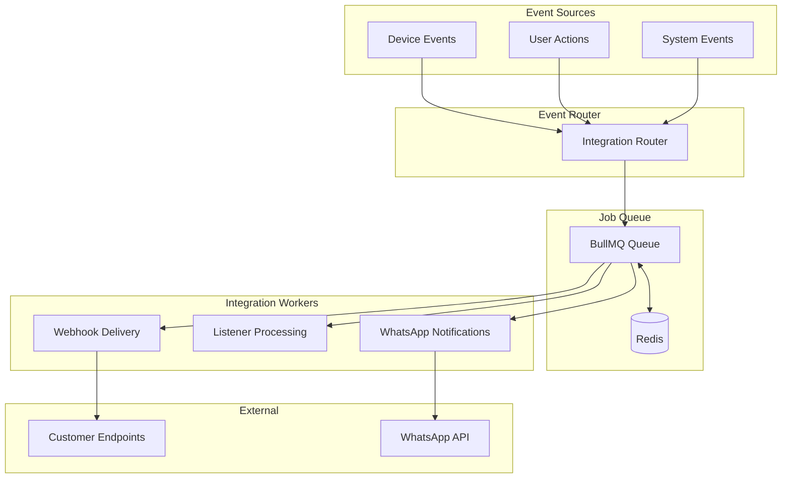
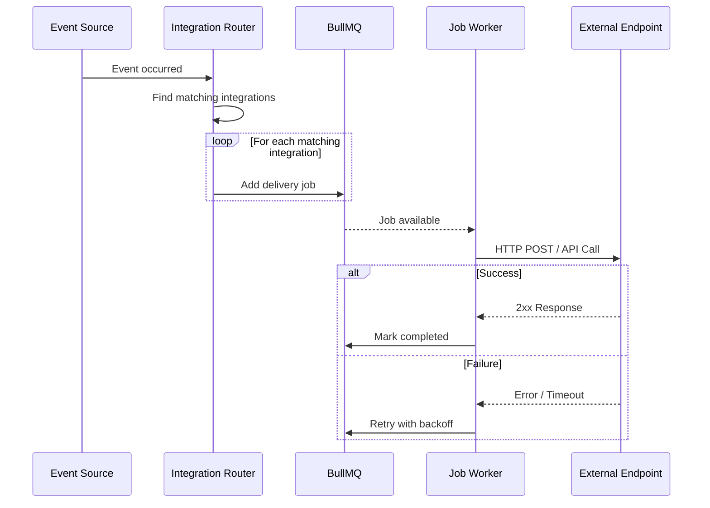

# Integrations Architecture

## Overview

This document outlines the design for external integrations in FS04, including webhooks, listeners, and third-party services. All integrations leverage the **Async Job System** for reliability, retries, and observability.

---

## High-Level Architecture



---

## Integration Types

### 1. Webhooks

Webhooks allow customers to receive real-time notifications when events occur in the system.

#### Status: 🟡 Planned (Currently Sync)

| Aspect | Current State | Target State |
|--------|---------------|--------------|
| Delivery | Synchronous in request | Async via BullMQ |
| Retries | None | Exponential backoff (3 attempts) |
| Monitoring | Logs only | Admin UI + Logs |
| Dead Letter | None | Failed jobs queue |

#### Proposed Job: `integrations:webhook-deliver`

```typescript
// Handler signature
export async function deliverWebhook(data: WebhookJobData): Promise<WebhookResult> {
    const { webhookId, eventType, payload, attempt } = data;
    
    const webhook = await prisma.webhook.findUnique({ where: { id: webhookId } });
    if (!webhook || !webhook.active) return { skipped: true };
    
    const response = await fetch(webhook.url, {
        method: 'POST',
        headers: {
            'Content-Type': 'application/json',
            'X-Webhook-Signature': sign(payload, webhook.secret),
            'X-Event-Type': eventType,
        },
        body: JSON.stringify(payload),
        signal: AbortSignal.timeout(10000), // 10s timeout
    });
    
    if (!response.ok) {
        throw new Error(`Webhook failed: ${response.status}`);
    }
    
    return { status: response.status, delivered: true };
}
```

#### Job Configuration

```typescript
await jobQueue.add('integrations:webhook-deliver', {
    webhookId: 'wh_123',
    eventType: 'device.online',
    payload: { deviceId: 'dev_456', timestamp: Date.now() },
}, {
    attempts: 3,
    backoff: { type: 'exponential', delay: 5000 }, // 5s, 10s, 20s
    removeOnComplete: { age: 86400 },  // 24h retention
    removeOnFail: { count: 1000 },      // Keep last 1000 failures
});
```

---

### 2. Listeners

Listeners are internal handlers that react to system events (e.g., send email on user signup).

#### Status: 🟡 Planned

| Aspect | Current State | Target State |
|--------|---------------|--------------|
| Execution | Direct function call | Async via BullMQ |
| Configuration | Code-based | Database-driven |
| Filtering | Hardcoded | Configurable rules |

#### Proposed Job: `integrations:listener-execute`

```typescript
export async function executeListener(data: ListenerJobData): Promise<void> {
    const { listenerId, event } = data;
    
    const listener = await prisma.listener.findUnique({ 
        where: { id: listenerId },
        include: { actions: true }
    });
    
    if (!listener || !listener.active) return;
    
    // Check filter conditions
    if (!matchesFilter(event, listener.filter)) return;
    
    // Execute configured actions
    for (const action of listener.actions) {
        await executeAction(action, event);
    }
}
```

---

### 3. WhatsApp Notifications

Integration with WhatsApp Business API for sending notifications.

#### Status: 🔴 Removed from UI (Pending Redesign)

The WhatsApp integration has been removed from the admin UI pending a redesign to use the async job system.

#### Future Design

```typescript
// Job: integrations:whatsapp-send
export async function sendWhatsAppMessage(data: WhatsAppJobData): Promise<void> {
    const { accountId, templateId, recipient, variables } = data;
    
    const account = await prisma.whatsAppAccount.findUnique({ 
        where: { id: accountId } 
    });
    
    await whatsappClient.sendTemplate({
        to: recipient,
        template: templateId,
        variables,
    });
}
```

---

## Event Flow



---

## Database Schema

### Webhook Table

```prisma
model Webhook {
    id          String    @id @default(cuid())
    accountId   String
    name        String
    url         String
    secret      String    // For HMAC signature
    active      Boolean   @default(true)
    
    // Event filtering
    events      String[]  // e.g., ["device.online", "device.offline"]
    
    // Delivery stats
    lastDeliveryAt    DateTime?
    lastDeliveryStatus String?
    successCount      Int       @default(0)
    failureCount      Int       @default(0)
    
    createdAt   DateTime  @default(now())
    updatedAt   DateTime  @updatedAt
    
    account     Account   @relation(fields: [accountId], references: [id])
    
    @@index([accountId])
    @@index([active])
}
```

### Listener Table

```prisma
model Listener {
    id          String    @id @default(cuid())
    accountId   String
    name        String
    eventType   String    // e.g., "device.online"
    filter      Json?     // Optional filter conditions
    active      Boolean   @default(true)
    
    // Actions to execute
    actions     ListenerAction[]
    
    createdAt   DateTime  @default(now())
    updatedAt   DateTime  @updatedAt
    
    account     Account   @relation(fields: [accountId], references: [id])
    
    @@index([accountId])
    @@index([eventType])
}

model ListenerAction {
    id          String    @id @default(cuid())
    listenerId  String
    type        String    // "email", "webhook", "notification"
    config      Json      // Action-specific configuration
    order       Int       @default(0)
    
    listener    Listener  @relation(fields: [listenerId], references: [id], onDelete: Cascade)
}
```

---

## Job Registry

Register integration handlers in the job registry:

```typescript
// src/lib/server/jobs/registry.ts
import { deliverWebhook } from './handlers/integrations/webhook';
import { executeListener } from './handlers/integrations/listener';
import { sendWhatsAppMessage } from './handlers/integrations/whatsapp';

registerHandler('integrations:webhook-deliver', deliverWebhook);
registerHandler('integrations:listener-execute', executeListener);
registerHandler('integrations:whatsapp-send', sendWhatsAppMessage);
```

---

## Rate Limiting

Protect external endpoints and third-party APIs:

| Integration | Limit | Scope |
|-------------|-------|-------|
| Webhook delivery | 100/min | Per endpoint URL |
| WhatsApp messages | 50/min | Per account |
| Listener execution | 500/min | Global |

Implemented via BullMQ's limiter:

```typescript
const worker = new Worker('main-jobs', processor, {
    limiter: { max: 100, duration: 60000 }, // 100 jobs per minute
});
```

---

## Observability

### Metrics to Track

| Metric | Description |
|--------|-------------|
| `webhook_deliveries_total` | Total webhooks attempted |
| `webhook_delivery_latency_ms` | Time to deliver |
| `webhook_failures_total` | Failed deliveries (after retries) |
| `listener_executions_total` | Listeners triggered |

### Admin UI Features (Future)

- [ ] View webhook delivery history
- [ ] Retry failed webhooks manually
- [ ] Pause/resume webhook endpoints
- [ ] View listener execution logs
- [ ] Test webhook endpoints

---

## Implementation Roadmap

| Phase | Scope | Status |
|-------|-------|--------|
| 1 | Define architecture & schema | ✅ Done |
| 2 | Implement webhook async delivery | 🔲 Planned |
| 3 | Implement listener async execution | 🔲 Planned |
| 4 | Admin UI for webhook management | 🔲 Planned |
| 5 | WhatsApp integration redesign | 🔲 Planned |

---

## Security Considerations

1. **Webhook Signatures**: All webhooks include HMAC-SHA256 signature in `X-Webhook-Signature` header
2. **Secret Rotation**: Support rotating webhook secrets without downtime
3. **URL Validation**: Prevent SSRF by validating webhook URLs (no internal IPs)
4. **Payload Sanitization**: Strip sensitive data before sending to external endpoints
5. **TLS Required**: Only HTTPS endpoints allowed for webhooks

---

## Related Documentation

- [Jobs Architecture](../jobs/JOBS.md) - Background job system
- [Events Architecture](../events/) - Internal event system (if exists)
