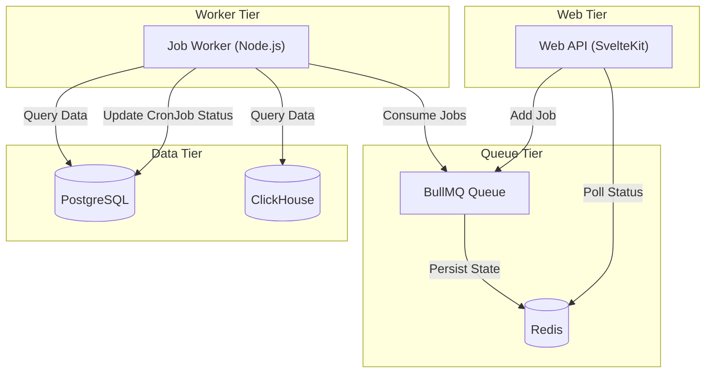
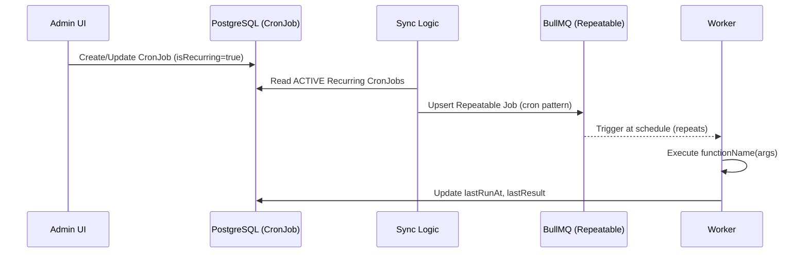
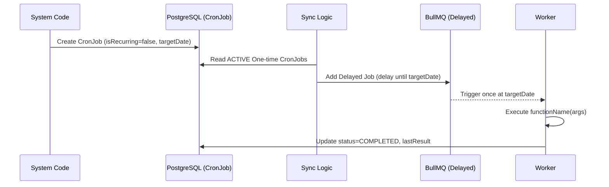
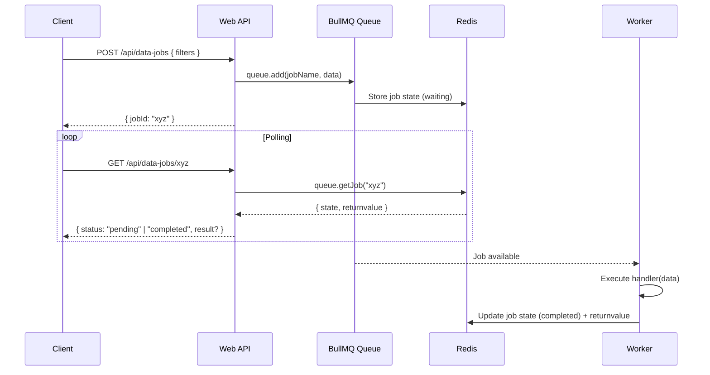
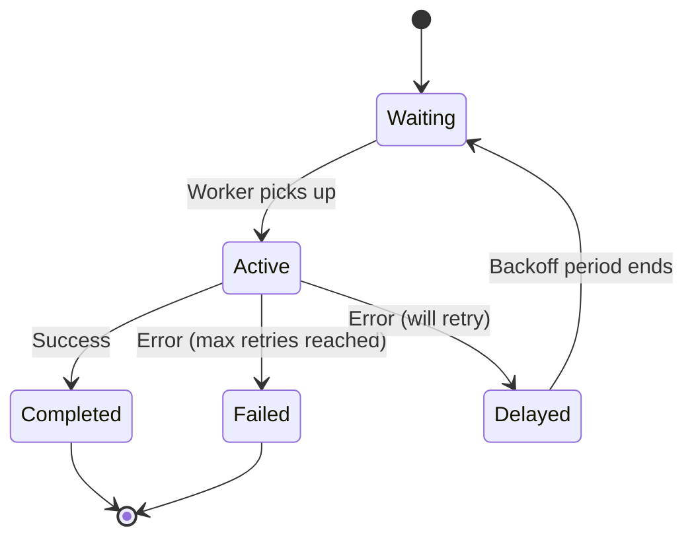
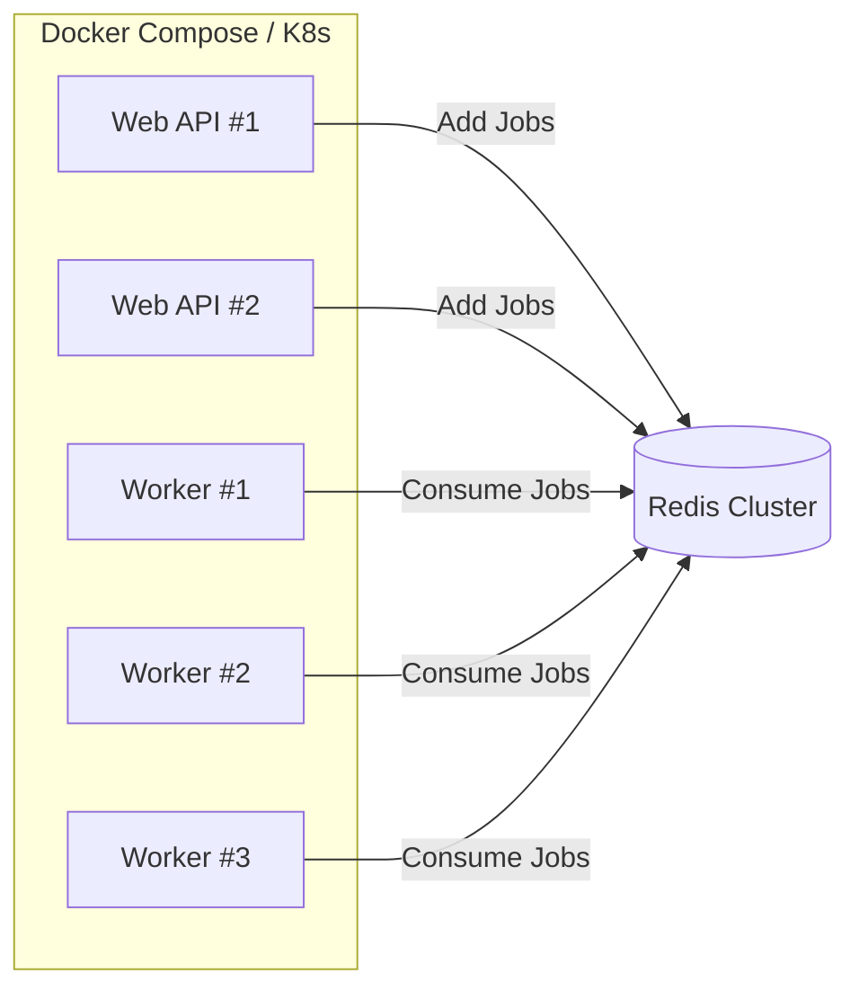
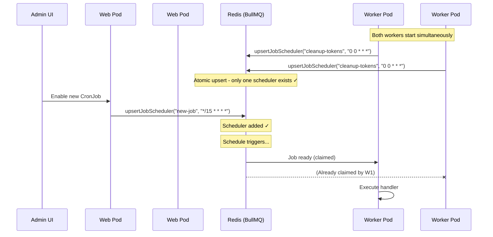

# Unified Background Job System Design

## Overview

This document outlines the design for a comprehensive background job system for the FS04 Web project. It unifies two key patterns:

1.  **CronJobs**: Database-driven, recurring scheduled tasks (e.g., daily reports, cleanup).
2.  **Async Jobs**: User-triggered, on-demand tasks with polling (e.g., heavy analytics, data prep).

Both patterns share the same underlying infrastructure (**BullMQ + Redis**) and Worker process, ensuring efficient resource usage and centralized management.

---

## High-Level Architecture



### Core Components

| Component        | Responsibility                                                              |
| :--------------- | :-------------------------------------------------------------------------- |
| **Redis**        | Central coordinator. Stores job queues, states, locks, and results.        |
| **BullMQ**       | Job queue engine for handling scheduling, retries, and prioritization.     |
| **Worker**       | Stateless Node.js process (`npm run job:worker`) that executes functions.  |
| **Web API**      | Enqueues jobs, exposes polling endpoints, manages CronJob definitions.     |
| **Prisma (PG)**  | Persists `CronJob` definitions for admin management and audit logging.     |

---

## Pattern 1: Database-Driven CronJobs

CronJobs are defined in the database and synced to BullMQ on worker startup. This ensures that job schedules are persistent and manageable via an Admin UI.

CronJobs come in two types:
- **Recurring Jobs**: Run on a schedule (e.g., daily cleanup, hourly reports)
- **One-time Jobs**: Run once at a specific time (e.g., entity expiration, scheduled notifications)

### CronJob Flow Diagrams

#### Recurring Jobs Flow



#### One-time Jobs Flow



### Source of Truth
-   **Database (`CronJob` table)**: Defines what jobs *should* run.
-   **BullMQ**: Manages the actual execution schedule.
  - **Recurring jobs**: Stored as **repeatable jobs** with cron patterns (e.g., `upsertJobScheduler()`)
  - **One-time jobs**: Stored as **delayed jobs** that run once (e.g., `queue.add()` with `delay` option)
-   **Sync Logic**: Runs on worker startup and on API hooks (create/update/delete) to keep them aligned.

### Job Type Examples

**Recurring Jobs:**
- Daily cleanup tasks (`system:cleanup-tokens`)
- Hourly reports
- Periodic health checks

**One-time Jobs:**
- Entity expiration (factory tokens, sessions, licenses)
- Scheduled notifications
- One-off data exports

### Prisma Schema

```prisma
model CronJob {
  id             String    @id @default(cuid())
  name           String    // Human-readable name
  functionName   String    // Maps to Function Registry key
  args           Json?     // Arguments passed to the function
  cronExpression String?   // Standard cron format (e.g., "0 0 * * *") - null for one-time jobs
  isRecurring    Boolean   @default(true) // false for one-time jobs
  status         String    @default("ACTIVE") // ACTIVE, INACTIVE, PAUSED, COMPLETED
  timezone       String?   @default("UTC")

  // Execution Tracking
  lastRunAt      DateTime?
  nextRunAt      DateTime?
  lastResult     String?   // "success" or "failed"
  lastError      String?   // Error details if failed
  isRunning      Boolean   @default(false)

  // Retry Configuration
  retryCount     Int       @default(0)
  maxRetries     Int       @default(3)
  timeout        Int?      // Execution timeout in ms

  // Statistics
  totalRuns      Int       @default(0)
  successCount   Int       @default(0)
  failureCount   Int       @default(0)

  // Audit Fields
  createdAt      DateTime  @default(now())
  updatedAt      DateTime  @updatedAt
  createdBy      String?
  accountId      String?

  @@index([status])
  @@index([nextRunAt])
  @@index([isRecurring])
}
```

---

## Pattern 2: Async Data Preparation (On-Demand)

Async Jobs are triggered by user actions (e.g., requesting a large analytics export). The API returns a `jobId` immediately, and the client polls for completion.

### Async Job Flow Diagram



### Source of Truth
-   **Redis (BullMQ)**: Stores job state, result data. Transient with TTL.

### API Contract

| Endpoint                  | Method | Request Body                     | Response                                        |
| :------------------------ | :----- | :------------------------------- | :---------------------------------------------- |
| `/api/data-jobs`          | `POST` | `{ type: string, params: {...} }`| `{ jobId: string }`                             |
| `/api/data-jobs/:jobId`   | `GET`  | -                                | `{ status: "pending" \| "completed" \| "failed", result?: any, error?: string }` |

---

## Infrastructure & Code Structure

### Directory Layout

```
src/
├── lib/
│   └── server/
│       └── jobs/                   # Core Job System Library
│           ├── client.ts           # BullMQ Queue instance & helper functions
│           ├── worker.ts           # BullMQ Worker setup & processor
│           ├── registry.ts         # Function name -> handler mapping
│           ├── cron-sync.ts        # Sync DB CronJobs <-> BullMQ Repeatables
│           └── handlers/           # Job Handler Implementations
│               ├── analytics/
│               │   └── prepare-report.ts
│               └── system/
│                   └── cleanup-tokens.ts
└── worker/
    └── jobs/
        └── index.ts                # Entry point: "npm run job:worker"
```

### Component Details

#### `client.ts`
Exports the shared BullMQ `Queue` instance and helper functions.
```typescript
import { Queue } from 'bullmq';
import { redisConnection } from '$lib/server/redis';

export const jobQueue = new Queue('main-jobs', { connection: redisConnection });

export async function addAsyncJob(name: string, data: object) {
  return jobQueue.add(name, data, { removeOnComplete: { age: 86400 } }); // Keep 24h
}
```

#### `registry.ts`
Maps job names to handler functions.
```typescript
import { prepareReport } from './handlers/analytics/prepare-report';
import { cleanupTokens } from './handlers/system/cleanup-tokens';

export const jobRegistry: Record<string, (data: any) => Promise<any>> = {
  'analytics:prepare-report': prepareReport,
  'system:cleanup-tokens': cleanupTokens,
};
```

#### `worker.ts`
Defines the BullMQ `Worker` and its processor.
```typescript
import { Worker, Job } from 'bullmq';
import { redisConnection } from '$lib/server/redis';
import { jobRegistry } from './registry';
import { adminPrisma } from '$lib/server/prisma';
import { logger } from '$lib/server/logger';

export function createWorker() {
  return new Worker('main-jobs', async (job: Job) => {
    const handler = jobRegistry[job.name];
    if (!handler) {
      throw new Error(`No handler registered for job: ${job.name}`);
    }

    logger.info({ jobId: job.id, jobName: job.name }, 'Processing job');

    // For CronJobs, update DB status
    const isCronJob = job.data.cronJobId !== undefined;
    if (isCronJob) {
      await adminPrisma.cronJob.update({
        where: { id: job.data.cronJobId },
        data: { isRunning: true },
      });
    }

    try {
      const result = await handler(job.data);
      // Update CronJob on success
      if (isCronJob) {
        const cronJob = await adminPrisma.cronJob.findUnique({
          where: { id: job.data.cronJobId }
        });
        
        const updateData: any = {
          isRunning: false,
          lastRunAt: new Date(),
          lastResult: 'success',
          lastError: null,
          totalRuns: { increment: 1 },
          successCount: { increment: 1 }
        };
        
        // One-time jobs: Mark as COMPLETED after successful execution
        if (cronJob && !cronJob.isRecurring) {
          updateData.status = 'COMPLETED';
        }
        
        await adminPrisma.cronJob.update({
          where: { id: job.data.cronJobId },
          data: updateData
        });
      }
      return result;
    } catch (error) {
      // Update CronJob on failure
      if (isCronJob) {
        await adminPrisma.cronJob.update({
          where: { id: job.data.cronJobId },
          data: {
            isRunning: false,
            lastResult: 'failed',
            lastError: error instanceof Error ? error.stack : String(error),
            totalRuns: { increment: 1 },
            failureCount: { increment: 1 }
          }
        });
      }
      throw error;
    }
  }, { connection: redisConnection, concurrency: 5 });
}
```

---

## Error Handling & Retries

BullMQ provides robust retry mechanisms. Configuration is set per-job or as queue defaults.



### Retry Strategy
-   **Default Attempts**: 3
-   **Backoff**: Exponential (e.g., 1s, 2s, 4s).
-   **Stalled Jobs**: BullMQ auto-detects stalled jobs (worker crashed) and re-queues them.

```typescript
// Example: Adding a job with custom retry options
await jobQueue.add('my-job', { ... }, {
  attempts: 5,
  backoff: { type: 'exponential', delay: 1000 },
});
```

---

## Rate Limiting

### API Level (Job Creation)
Prevent abuse by limiting how many jobs a user can create.
-   **Limit**: 20 jobs/minute per user.
-   **Response**: `429 Too Many Requests`.

### Worker Level (Execution Throughput)
Protect downstream databases (ClickHouse, Postgres) from being overwhelmed.
-   **BullMQ Limiter**: Max 50 jobs/second processed.

```typescript
const worker = new Worker('main-jobs', processor, {
  connection: redisConnection,
  limiter: { max: 50, duration: 1000 }, // 50 jobs per 1000ms
});
```

---

## Scaling & Deployment



-   **Horizontal Scaling**: Start multiple worker instances. BullMQ/Redis ensures atomic job claiming (no double processing).
-   **Graceful Shutdown**: Workers should handle `SIGTERM` to finish current jobs before exiting.

---

## Multi-Pod CronJob Synchronization

When running multiple Web and Worker pods, a common question is: **who syncs the cron schedule from DB to BullMQ?**

### Sync Triggers

| Trigger | Location | When |
|---------|----------|------|
| **Worker Startup** | `src/worker/jobs/index.ts` | Every worker pod on boot |
| **Admin Create** | `/admin/settings/cron-jobs` action | After `prisma.cronJob.create()` |
| **Admin Update** | `/admin/settings/cron-jobs` action | After `prisma.cronJob.update()` |
| **Admin Toggle** | `/admin/settings/cron-jobs` action | After status change |
| **Admin Delete** | `/admin/settings/cron-jobs` action | Calls `removeCronJob()` directly |

### Why It's Safe (No Race Conditions)

BullMQ's `upsertJobScheduler()` is **idempotent by design**:

```typescript
// cron-sync.ts
if (cronJob.isRecurring) {
  // Recurring jobs: Use repeatable scheduler
  await queue.upsertJobScheduler(
    cronJob.id,  // Unique scheduler ID
    { pattern: cronJob.cronExpression, tz: cronJob.timezone ?? 'UTC' },
    { name: cronJob.functionName, data: jobData, opts: { ... } }
  );
} else {
  // One-time jobs: Use delayed job
  const delay = Math.max(0, nextRunAt.getTime() - now.getTime());
  await queue.add(cronJob.functionName, jobData, {
    jobId: cronJob.id,
    delay,
    opts: { ... }
  });
}
```

**Recurring Jobs:**
- **Same ID + Same schedule** → No-op (already exists)
- **Same ID + Different schedule** → Updates atomically
- **New ID** → Creates new scheduler

**One-time Jobs:**
- Uses `jobId` to prevent duplicates if sync runs multiple times
- Automatically removed from queue after execution

Even if 5 worker pods start simultaneously and all call `syncCronJobs()`, they all attempt to upsert the same schedulers/add the same jobs, and Redis guarantees atomic execution.

### Coordination Flow



### Source of Truth

| Layer | Responsibility |
|-------|----------------|
| **PostgreSQL (`CronJob` table)** | What jobs *should* exist (admin-managed) |
| **Redis (BullMQ Schedulers)** | Actual scheduling and execution state |
| **Sync Logic** | Keeps them aligned via idempotent upserts |

> [!NOTE]
> No distributed locks or leader election are needed. BullMQ's idempotent operations and Redis's atomic guarantees handle all concurrency concerns.

### Alternative Patterns (Not Required)

For reference, other systems might use:

| Pattern | Use Case |
|---------|----------|
| **Distributed Lock** | When sync has expensive side effects |
| **Leader Election** | When only one node should perform admin tasks |
| **Dedicated Scheduler Pod** | Cleaner separation (single replica handles all scheduling) |

Our current approach (idempotent upsert on every sync) is the **recommended BullMQ pattern** and is production-ready.

---

## Deliverables

1.  **Prisma Migration**: Add `CronJob` table to `schema.prisma`.
2.  **Core Library**: `src/lib/server/jobs/` (client, worker, registry, cron-sync).
3.  **Worker Entry Point**: `src/worker/jobs/index.ts`.
4.  **npm Script**: `"job:worker": "dotenv -- tsx src/worker/jobs/index.ts"`.
5.  **API Routes**:
    -   `POST /api/data-jobs` & `GET /api/data-jobs/:jobId` for async jobs.
    -   CRUD at `src/routes/api/admin/crons/` for CronJob management.
6.  **Documentation**: This file + inline code comments.

---

## Operational Notes

| Topic             | Recommendation                                                                    |
| :---------------- | :-------------------------------------------------------------------------------- |
| **Polling**       | Clients poll `GET /api/data-jobs/:id` every 2-5 seconds.                          |
| **Redis Cleanup** | Use `removeOnComplete: { age: 86400 }` (24h) and `removeOnFail: { count: 1000 }`. |
| **Monitoring**    | Consider BullMQ Dashboard (e.g., `bull-arena` or `taskforce.sh`) for visibility.  |
| **Idempotency**   | Design job handlers to be idempotent where possible (safe to retry).             |

---

## Admin Dashboard

The Admin UI provides full visibility and management of CronJobs.

### Location
`/admin/settings/cron-jobs`

### Features

| Feature | Description |
|---------|-------------|
| **Table View** | Lists all CronJobs with status, schedule, last run, result, and stats |
| **Schedule Display** | Shows cron expression for recurring jobs, "One-time job" badge for one-time jobs |
| **Status Badges** | Visual indicators for ACTIVE/PAUSED/INACTIVE/COMPLETED and running state |
| **Run Now** | Trigger recurring jobs immediately (ad-hoc execution) - not available for one-time jobs |
| **Pause/Resume** | Toggle recurring job status without deleting - not available for one-time jobs |
| **Create/Edit** | Modal dialogs for job configuration (recurring jobs only) |
| **Delete** | Remove job from DB and BullMQ (recurring jobs only) |
| **Auto-managed** | One-time jobs show "Auto-managed" - no manual actions available |

### Default System Jobs

Seed with: `npx tsx scripts/seed-cron-jobs.ts`

| Job Name | Function | Schedule | Default Status |
|----------|----------|----------|----------------|
| Cleanup Expired Tokens | `system:cleanup-tokens` | Daily @ midnight | ACTIVE |
| Bundle Status Check | `system:bundle-status-check` | Every 15 min | INACTIVE |
| GCloud Orphan Cleanup | `system:gcloud-cleanup` | Weekly Sunday 3am | INACTIVE |
| Device Presence Reconcile | `system:device-presence-reconcile` | Every 5 min | INACTIVE |

> [!NOTE]
> INACTIVE jobs are placeholders. Implement the handler in `src/lib/server/jobs/handlers/` then enable via Admin UI.

