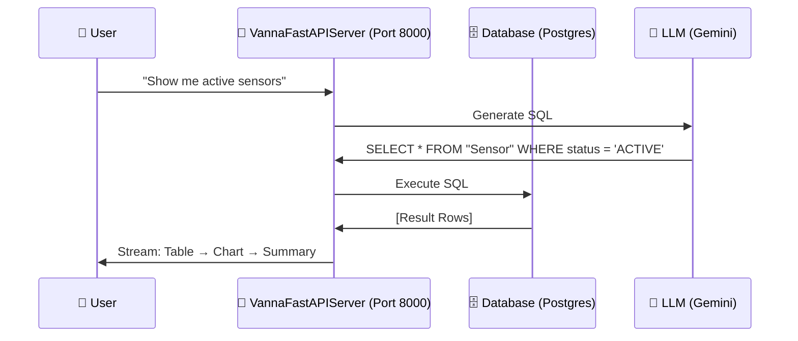

# LLM & Vanna Integration Architecture

## Overview
We are integrating **Vanna.ai 2.0** to enable natural language querying of our sensor data. Vanna provides an agent-based architecture with:
- User-aware permissions
- Rich streaming UI (tables, charts, summaries)
- Built-in FastAPI server with web UI

## Best Practice (Per Vanna Docs)

The **recommended** approach is:

1.  **Run `VannaFastAPIServer`**: A Python service that hosts both the API endpoints AND a pre-built web UI.
2.  **Access the UI directly**: Navigate to `http://localhost:8000` (the Vanna server) which has a full chat interface.
3.  **OR embed `<vanna-chat>` in SvelteKit**: Point the component to the Python backend's `/api/vanna/v2/chat_sse` endpoint.

### Why NOT proxy through SvelteKit?
Vanna's streaming is built around Server-Sent Events (SSE). Adding a SvelteKit proxy layer adds complexity without benefit. The recommended pattern is for the **browser to connect directly** to the Vanna server.

## Components

### 1. Backend (`fs04_agents`)
- **Technology**: Python (FastAPI via `VannaFastAPIServer`).
- **Library**: `vanna[google,fastapi]` (use Google Gemini as LLM).
- **Database**: `PostgresRunner` to connect to `fs04_web` database.
- **Location**: `src/vanna_app/main.py`.

### 2. Frontend Options

| Option | Description | Pros | Cons |
|--------|-------------|------|------|
| **A. Use Vanna's built-in UI** | Just navigate to `http://localhost:8000` | Zero frontend work | Separate URL from main app |
| **B. Embed `<vanna-chat>`** | Add component to SvelteKit page | Integrated experience | Need to handle CORS and auth forwarding |
| **C. Proxy via SvelteKit** | SvelteKit proxies requests to Vanna | Single origin | Complex, not recommended by Vanna |

**Recommendation**: Start with **Option A** (built-in UI) for prototyping. Move to **Option B** for production integration.

## Communication Flow

## Security & Auth
- **User Identity**: Configure `UserResolver` in Python to read JWT/Cookie from request.
- **Permissions**: Map our existing users/roles to Vanna's `group_memberships` for row-level security.

## Configuration
- **Environment Variables** (in `fs04_agents/.env`):
    - `DATABASE_URL`: Postgres connection string.
    - `GOOGLE_API_KEY` (or `OPENAI_API_KEY`): For the LLM.

