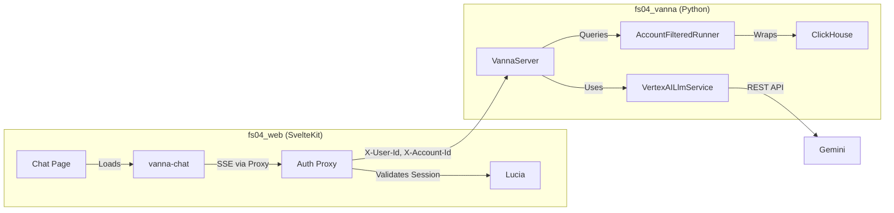
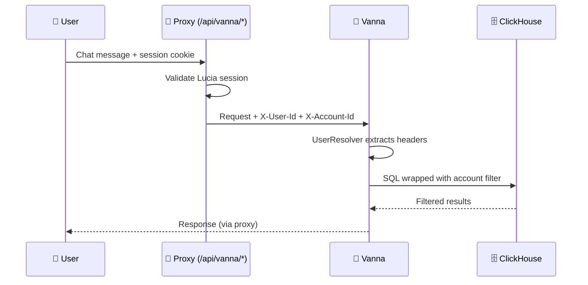

# LLM & Vanna Integration Architecture

## Overview
**Vanna.ai 2.0** enables natural language querying of sensor data with:
- User-aware permissions via proxy headers
- Rich streaming UI (tables, charts, summaries)
- Row-Level Security via SQL wrapper

## Architecture



## Security Design

### Authentication Flow


### Row-Level Security (RLS)

**Strategy: SQL Runner Wrapper** (Application-layer enforcement)

| Layer | Purpose | Implementation |
|-------|---------|----------------|
| System Prompt | Guide AI to filter | Include account context in prompt |
| SQL Wrapper | Enforce filtering | Wrap all queries with `WHERE account_id = ?` |
| Validation | Prevent bypass | Account ID from trusted headers only |

```python
# AccountFilteredRunner wraps queries
class AccountFilteredRunner:
    async def run_sql(self, sql: str) -> DataFrame:
        # Account ID comes from trusted proxy header, NOT user input
        account_id = self.get_account_id()
        
        filtered_sql = f"""
        SELECT * FROM ({sql.rstrip(';')}) AS subq
        WHERE account_id = '{account_id}'
        """
        return await self.base_runner.run_sql(filtered_sql)
```

**Security guarantees:**
- ✅ Account ID from authenticated session (not LLM or user input)
- ✅ Every query wrapped with account filter
- ✅ AI cannot bypass via prompt injection
- ✅ Auditable (log all queries + account context)

### Production Deployment

```
Internet → LB → fs04_web (public) → fs04_vanna (internal, 127.0.0.1)
```

| Config | Development | Production |
|--------|-------------|------------|
| `HOST` | `0.0.0.0` | `127.0.0.1` |
| Vanna accessible | Directly + Proxy | Proxy only |
| Demo login | Available | Not exposed |

## Key Components

| Component | Location | Description |
|-----------|----------|-------------|
| Auth Proxy | `fs04_web/src/routes/api/vanna/[...rest]/+server.ts` | Validates session, injects headers |
| UserResolver | `fs04_vanna/src/main.py` | Reads `X-User-Id`, `X-Account-Id` from proxy |
| LLM Service | `fs04_vanna/src/vertex_llm.py` | Vertex AI/Gemini streaming |
| Web Component | `thirdparty/vanna/.../webcomponent` | Custom FS04 theming |

## UI Features & Permissions

Vanna controls UI features by user group:

| Feature | Admin | User | Anonymous |
|---------|-------|------|-----------|
| See tool names | ✅ | ✅ | ❌ |
| See SQL/arguments | ✅ | ❌ | ❌ |
| See tool errors | ✅ | ❌ | ❌ |

Non-admin users won't see raw SQL queries.

## Environment Variables

#### fs04_vanna/.env
```env
VERTEX_AI_STUDIO_API_KEY=...  # Gemini API key
HOST=127.0.0.1                 # Production: internal only
PORT=8000
```

#### fs04_web/.env
```env
PUBLIC_VANNA_API_URL=http://localhost:8000  # For loading component
```

## Running Locally

```bash
# Terminal 1: Vanna
cd fs04_vanna && ./run.sh

# Terminal 2: SvelteKit
cd fs04_web && npm run dev

# Access: http://localhost:5173/user/analytics/chat
```

## Next Steps

- [x] Backend proxy for auth
- [x] UserResolver reads from headers
- [ ] Implement AccountFilteredRunner for ClickHouse
- [ ] Connect to production ClickHouse
- [ ] Add query logging/auditing
- [ ] Memory persistence (Redis/DB)
