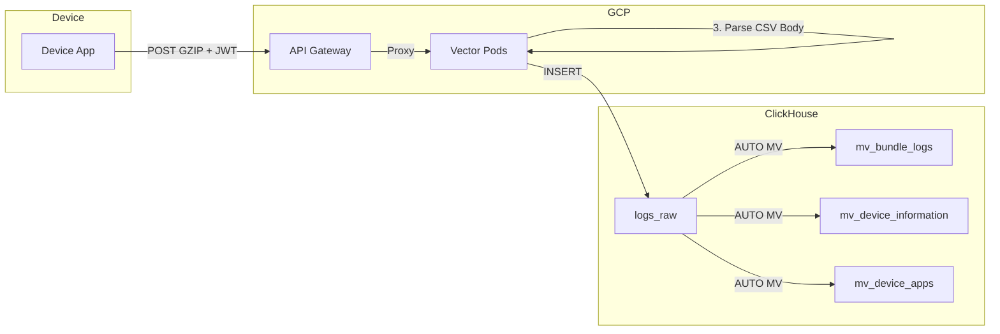
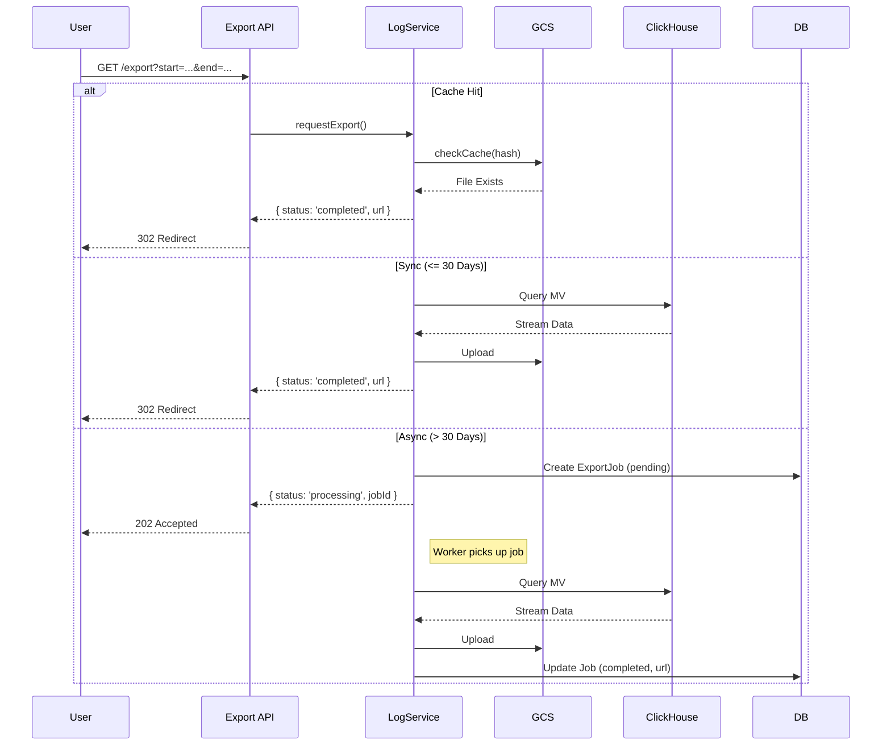

# Logs Table Component Design

## 1. Background & Existing Implementation

> [!IMPORTANT]
> This document builds upon **existing ClickHouse infrastructure** already in use by the platform. Understanding this context is essential before implementing the Logs Table.

### 1.1 Log Ingestion Pipeline

Logs are ingested from devices via a multi-stage pipeline before landing in ClickHouse.



**Pipeline Stages:**

| Stage | Component | Description |
|---|---|---|
| 1 | **GCP API Gateway** | Receives GZIP-compressed payloads with JWT auth |
| 2 | **Vector Pods** | Decompresses, parses JWT header, parses CSV body |
| 3 | **ClickHouse** | `logs_raw` wide table, MVs auto-filter by `log_type` |

#### System Columns (Transparent — Injected by Pipeline)

These columns are automatically populated from JWT claims and Vector processing. **Log posters do not control these values**.

| Column | Source | Type | Description |
|---|---|---|---|
| `c1` | `now()` in VRL | `DateTime` | Server-side processed timestamp |
| `c2` | JWT `accountId` | `String` | Account ownership |
| `c3` | JWT `userId` | `String` | User who initiated |
| `c4` | JWT `deviceId` | `String` | Source device |
| `c5` | JWT `deviceName` | `String` | Device display name |
| `c6` | JWT `iat` | `UInt64` | JWT Issued At (Unix) |
| `c7` | JWT `exp` | `UInt64` | JWT Expiration (Unix) |
| `c8` | JWT `aud` | `String` | Audience |
| `c9` | JWT `iss` | `String` | Issuer |

#### Log Columns (Poster-Controlled — CSV Body)

Log posters send a CSV payload. These map to columns `c10+`. For clarity, we use **L-notation** (L1 = c10, L2 = c11, etc.) to describe the log poster's perspective.

| L-Index | Column | Type | Required | Description |
|---|---|---|---|---|
| **L1** | `c10` | `String` | ✅ | `log_type` — Routing key (see enum below) |
| **L2** | `c11` | `String` | ✅ | `log_type_version` — Schema version (semver: `1.0`, `1.1`, `2.0`, etc.) |
| **L3** | `c12` | `DateTime` | ✅ | `log_creation_time` — When the log event occurred (**UTC**) |
| **L4** | `c13` | `Int16` | ✅ | `timezone_offset` — Device timezone offset in minutes (e.g., `480` for UTC+8) |
| **L5** | `c14` | `String` | ✅ | `timezone_label` — IANA timezone name (e.g., `America/New_York`) |
| **L6+** | `c15+` | `String` | Varies | Payload fields (varies by `log_type` × `version`) |

#### Log Type Enum

The `log_type` (L1/c10) value determines which Materialized View routes the log.

| `log_type` | Description | Target MV |
|---|---|---|
| `SYSTEM` | Platform/infrastructure events | `mv_system_logs` (TBD) |
| `DEVICE` | General device telemetry | `mv_device_information` |
| `DEVICE_APPS` | Installed app lists | `mv_device_apps` |
| `BUNDLE` | Bundle/OTA installation events | `mv_bundle_logs` |
| `SENSOR_RADAR_SESSION` | Radar session (1 row per target) | `mv_radar_session` |
| `SENSOR_RADAR_PATH` | Radar path samples (N rows per target) | `mv_radar_path` |
| `AUDIT` | User action audit trail | `mv_audit_logs` (TBD) |

---

#### Standard CSV Payload Format

All log payloads **MUST** follow this format:

```
L1,L2,L3,L4,L5,...
<log_type>,<version>,<creation_time>,<tz_offset>,<field1>,...
```

> [!TIP]
> **Example Payload (DEVICE_APPS, v2)**:
> ```csv
> DEVICE_APPS,2,2025-12-23 14:30:00,480,Asia/Singapore,com.example.app,Example App,1.0.0,Normal
> ```
> Maps to:
> - `c10`=DEVICE_APPS, `c11`=2, `c12`=2025-12-23 14:30:00, `c13`=480, `c14`=Asia/Singapore
> - `c15`=com.example.app, `c16`=Example App, `c17`=1.0.0, `c18`=Normal

---

### 1.1.1 Implementation Review

**Source**: [vector.yaml](file:///Users/bernard/CascadeProjects/fs04/fs04_cloud/deploy/gcp/iot/gke/apps/04_vector/vector.yaml)

| Aspect | Rating | Notes |
|---|---|---|
| **Security** | ⭐⭐⭐⭐⭐ | JWT validation via Envoy; claims extracted to headers; no raw JWT in logs |
| **Scalability** | ⭐⭐⭐⭐ | Vector batching (500 events / 2s); Envoy TLS termination; L4 LB |
| **Observability** | ⭐⭐⭐⭐ | Prometheus exporter on `:9598`; internal metrics source; console sink for debug |
| **Schema Flexibility** | ⭐⭐⭐⭐ | Wide table + L-notation + version field enables evolution |
| **Error Handling** | ⭐⭐ | `skip_unknown_fields: true` hides bad data; no dead-letter queue |
| **Versioning** | ⭐⭐⭐⭐ | `log_type_version` (L2) + `log_creation_time` (L3) now standardized |

**Overall: 4/5** — Solid design with clear conventions. Remaining gap: DLQ for malformed logs.

> [!WARNING]
> **Current Issue**: Some logs are uploaded **without the correct `log_type` (c10)** or with inconsistent CSV schemas. This causes:
> - Logs missing from expected MVs
> - Data landing only in `logs_raw` with no useful projection
> - Need for manual cleanup or schema normalization

### 1.2 Current ClickHouse Tables

| Table | Type | Purpose |
|---|---|---|
| `logs_raw` | Wide Table (~60 cols) | All ingested logs. **Never query directly.** |
| `mv_bundle_logs` / `bundle_logs` | MV + Target | Bundle installation events |
| `mv_device_information` / `device_information` | MV + Target | Device status snapshots |
| `mv_device_apps` / `device_apps` | MV + Target | Installed app lists |
| `radar` | Table | Radar sensor events |
| `device` | Table | Device registry (low volume) |

### 1.3 Existing Service Patterns

The codebase already has a **read-only service pattern** for ClickHouse:

| File | Purpose |
|---|---|
| [client.ts](file:///Users/bernard/CascadeProjects/fs04/fs04_web/src/lib/server/clickhouse/client.ts) | Singleton ClickHouse client, query helpers for bundle events & device info |
| [deviceAppService.ts](file:///Users/bernard/CascadeProjects/fs04/fs04_web/src/lib/server/clickhouse/deviceAppService.ts) | Reads `mv_device_apps` with pagination, filtering, search |

**Pattern:**
- Services are **classes** with methods for specific queries.
- They use `getClickHouseClient()` from `client.ts`.
- Parameterized queries are used (`query_params`).
- Data is **transformed** from ClickHouse types to API/UI types.

### 1.4 What `logsHandler.ts` is (and isn't)

[logsHandler.ts](file:///Users/bernard/CascadeProjects/fs04/fs04_web/src/lib/server/messaging/handlers/device/logsHandler.ts) handles **device log file retrieval** via MQTT (requesting and receiving a `.log` file from a device). It is **not** an analytics query service.


---

## 2. Goals for the Logs Table Component

| Goal | Description |
|---|---|
| **Reusable UI** | `LogsTable.svelte` usable in Admin, User, and Device detail contexts. |
| **Performance** | Query **specialized MVs** (not `logs_raw`). Paginate. |
| **Security** | Enforce `account_id` / `user_id` at the **service layer**. No client-side-only filtering. |
| **Consistency** | Follow existing UI patterns: `DataTable`, `Filters`, `Export`. |
| **Export Handling** | Sync for ≤30 days, Async for longer ranges. Cache in GCS. |

---

## 3. Assumptions & Constraints

> [!WARNING]
> These assumptions must be validated with the team/infra owner.

1.  **Target MV Does Not Exist Yet**: There is **no `mv_platform_logs`** or similar for general system logs. We may need to:
    - Query an existing MV (e.g., `mv_bundle_logs`) for a specific use case.
    - OR request a new MV from infra if a generalized "logs" view is needed.
2.  **Scoping Columns**: The target MV **must** have `account_id` and `device_id` columns for security filtering to work.
3.  **No Direct `logs_raw` Queries**: Due to performance, we will not query `logs_raw` unless filtering by a very specific `request_id` or short time window.
4.  **GCS Available**: The GCS storage service (`src/lib/server/storage`) is operational for export caching.
5.  **No Existing Export Job Queue**: There is no background job queue (e.g., BullMQ) for async exports. We may use a simple polling + DB status flag approach initially.

---

## 4. Proposed Architecture

### 4.1 Service Layer: `LogService.ts`

A new service following the `DeviceAppService` pattern.

**Location**: `src/lib/server/clickhouse/logService.ts`

```typescript
// Interface for query parameters
interface LogQueryParams {
  accountId?: string; // REQUIRED for non-admin
  deviceId?: string;
  page?: number;
  limit?: number;
  search?: string;
  level?: 'INFO' | 'WARN' | 'ERROR' | 'DEBUG';
  startTime?: Date;
  endTime?: Date;
  sortBy?: string;
  sortOrder?: 'asc' | 'desc';
}

class LogService {
  // Query the target MV with strict account scoping
  async getLogs(params: LogQueryParams): Promise<{ logs: LogEntry[], total: number }>;

  // Export handler with sync/async decision
  async requestExport(params: LogQueryParams): Promise<{ 
    status: 'completed' | 'processing'; 
    url?: string; 
    jobId?: string;
  }>;
}
```

### 4.2 API Layer

| Endpoint | Method | Description |
|---|---|---|
| `/api/logs` | GET | Paginated JSON response for UI table. |
| `/api/logs/export` | GET | Initiates export. Returns `302` (sync) or `202 Accepted` (async). |
| `/api/logs/export/[jobId]` | GET | Poll async job status. |

**Security Middleware**: All endpoints MUST extract `accountId` from `session.currentAccount` and pass it to the service. Admins may query across accounts.

### 4.3 UI Component

**Component**: `src/lib/components/logs/LogsTable.svelte`

Follows `DataTable` pattern from [radar/table.svelte](file:///Users/bernard/CascadeProjects/fs04/fs04_web/src/routes/user/controllers/radar/table.svelte).

| Feature | Implementation |
|---|---|
| **Columns** | Timestamp (relative), Level (badge), Message (truncated), Device |
| **Filters** | `DebouncedTextFilter` for search, `PopoverFilter` for level |
| **Pagination** | Server-side via `handleTablePagination` util |
| **Sorting** | Server-side via `handleTableSort` util |
| **Export** | `DropdownMenu` with CSV/JSON options |

### 4.4 Export Flow



---

## 5. Implementation Checklist

> [!NOTE]
> Items marked with 🔍 require validation with infra/DBA before proceeding.

- [ ] **🔍 Schema Validation**
    - [ ] Confirm target MV exists or request its creation.
    - [ ] Verify `account_id`, `device_id`, `timestamp` columns in target MV.

- [ ] **Data Access Layer (`logService.ts`)**
    - [x] Create service file (Initial version created).
    - [ ] Refactor `getLogs` to query the **correct, confirmed MV**.
    - [ ] Add robust error handling and logging.

- [ ] **API Layer**
    - [x] `GET /api/logs` created.
    - [x] `GET /api/logs/export` created.
    - [ ] Add `GET /api/logs/export/[jobId]` for async polling.
    - [ ] Harden security: validate `accountId` in all requests.

- [ ] **UI Components**
    - [x] `LogsTable.svelte` created.
    - [ ] Date Range Picker filter.
    - [ ] Async export toast/notification feedback.

- [ ] **GCS & Async Infrastructure**
    - [ ] Verify GCS Lifecycle policy for `exports/` prefix.
    - [ ] Implement simple async job processing (cron or message trigger).

---

## 6. Open Questions

1.  **Which MV for "general logs"?** — `mv_bundle_logs` is specific. Do we need a new `mv_action_logs` or `mv_audit_events`?
2.  **Admin Override Logic** — How should admins query across accounts? Super-admin flag in session?
3.  **Async Worker** — Use existing MQTT worker or a separate process?
