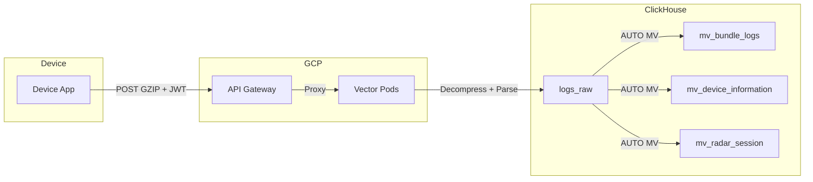

# Logs Schema Design

This document describes the **log ingestion pipeline** and **schema design** for ClickHouse logs.

For viewing logs (UI, API, exports), see [LOGS_VIEWER.md](./LOGS_VIEWER.md).

---

## 1. Log Ingestion Pipeline

Logs are ingested from devices via a multi-stage pipeline.



| Stage | Component | Description |
|-------|-----------|-------------|
| 1 | **GCP API Gateway** | Receives GZIP-compressed payloads with JWT auth |
| 2 | **Vector Pods** | Decompresses, parses JWT header, parses CSV body |
| 3 | **ClickHouse** | `logs_raw` wide table, MVs auto-filter by `log_type` |

---

## 2. Schema: System Columns (c1-c9)

These are **injected by the pipeline** from JWT claims. Log posters do NOT control these.

| Column | Source | Type | Description |
|--------|--------|------|-------------|
| `c1` | `now()` | DateTime | Server-side processed timestamp |
| `c2` | JWT `accountId` | String | Account ownership |
| `c3` | JWT `userId` | String | User who initiated |
| `c4` | JWT `deviceId` | String | Source device |
| `c5` | JWT `deviceName` | String | Device display name |
| `c6` | JWT `iat` | UInt64 | JWT Issued At (Unix) |
| `c7` | JWT `exp` | UInt64 | JWT Expiration (Unix) |
| `c8` | JWT `aud` | String | Audience |
| `c9` | JWT `iss` | String | Issuer |

---

## 3. Schema: Log Columns (c10+)

Log posters send a CSV payload. These map to columns `c10+`. We use **L-notation** (L1 = c10, L2 = c11, etc.).

### 3.1 Common Header (L1-L5)

All log types MUST include these:

| L-Index | Column | Type | Req | Description |
|---------|--------|------|-----|-------------|
| **L1** | c10 | String | ✅ | `log_type` — Routing key |
| **L2** | c11 | String | ✅ | `log_type_version` — Schema version (e.g., `1.0`) |
| **L3** | c12 | DateTime | ✅ | `log_creation_time` — Event timestamp (**UTC**) |
| **L4** | c13 | Int16 | ✅ | `timezone_offset` — Minutes (e.g., `480` for UTC+8) |
| **L5** | c14 | String | ✅ | `timezone_label` — IANA timezone (e.g., `Asia/Singapore`) |
| **L6+** | c15+ | String | Varies | Payload fields (per `log_type`) |

### 3.2 CSV Payload Format

```
L1,L2,L3,L4,L5,...
<log_type>,<version>,<creation_time>,<tz_offset>,<tz_label>,...
```

> [!TIP]
> **Example (DEVICE_APPS v2):**
> ```csv
> DEVICE_APPS,2,2025-12-23 14:30:00,480,Asia/Singapore,com.example.app,Example App,1.0.0
> ```

---

## 4. Log Type Enum

The `log_type` (L1/c10) determines which MV routes the log.

| `log_type` | Description | Target MV |
|------------|-------------|-----------|
| `SYSTEM` | Platform/infrastructure events | `mv_system_logs` (TBD) |
| `DEVICE` | General device telemetry | `mv_device_information` |
| `DEVICE_APPS` | Installed app lists | `mv_device_apps` |
| `BUNDLE` | Bundle/OTA installation events | `mv_bundle_logs` |
| `SENSOR_RADAR_SESSION` | Radar session (1 row per target) | `mv_radar_session` |
| `SENSOR_RADAR_PATH` | Radar path samples (N rows per target) | `mv_radar_path` |
| `AUDIT` | User action audit trail | `mv_audit_logs` (TBD) |

---

## 5. Specialized Schema Docs

For log-type specific schemas, see:

- [LOGS_RADAR.md](./LOGS_RADAR.md) — Radar sensor logs (`SENSOR_RADAR_SESSION`, `SENSOR_RADAR_PATH`)

---

## 6. ClickHouse Tables

| Table | Type | Purpose |
|-------|------|---------|
| `logs_raw` | Wide Table (~60 cols) | All ingested logs. **Never query directly.** |
| `mv_bundle_logs` | MV | Bundle installation events |
| `mv_device_information` | MV | Device status snapshots |
| `mv_device_apps` | MV | Installed app lists |
| `mv_radar_session` | MV | Radar session summary |
| `mv_radar_path` | MV | Radar path samples |

---

## 7. Existing Service Patterns

The codebase already has a **read-only service pattern**:

| File | Purpose |
|------|---------|
| [client.ts](file:///Users/bernard/CascadeProjects/fs04/fs04_web/src/lib/server/clickhouse/client.ts) | Singleton ClickHouse client |
| [deviceAppService.ts](file:///Users/bernard/CascadeProjects/fs04/fs04_web/src/lib/server/clickhouse/deviceAppService.ts) | Query `mv_device_apps` with pagination |

**Pattern:**
- Services are **classes** with query methods
- Use `getClickHouseClient()` singleton
- Parameterized queries (`query_params`)
- Transform ClickHouse types → API/UI types

