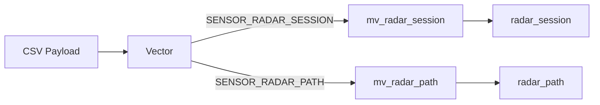

# Radar Log Formats

> [!IMPORTANT]
> This document defines the CSV payload schemas for radar logs. All payloads **MUST** adhere to the [L-notation standard](file:///Users/bernard/CascadeProjects/fs04/fs04_web/docs/architecture/logs/LOGS.md) established in the main LOGS.md document.

---

## Log Types

| Log Type | Description | Use Case |
|----------|-------------|----------|
| `SENSOR_RADAR_SESSION` | Complete target session | One row per person (entry → exit) |
| `SENSOR_RADAR_PATH` | Position samples | Multiple rows per target (10+ Hz) |

---

## 1. Session Log (`SENSOR_RADAR_SESSION`)

Records a complete target session (one person entering and exiting the tracking area).

### Schema: v1.0

| L-Index | Column | Name | Type | Req | Description |
|---------|--------|------|------|-----|-------------|
| L1 | c10 | `log_type` | String | ✅ | `SENSOR_RADAR_SESSION` |
| L2 | c11 | `log_type_version` | String | ✅ | `1.0` |
| L3 | c12 | `log_creation_time` | DateTime | ✅ | Event timestamp (**UTC**) |
| L4 | c13 | `timezone_offset` | Int16 | ✅ | Device local offset (minutes) |
| **L5** | c14 | `timezone_label` | String | ✅ | IANA timezone (e.g., `America/New_York`) |
| **L6** | c15 | `sensor_id` | String | ✅ | Radar controller identifier |
| **L7** | c16 | `sensor_name` | String | ✅ | Radar display name |
| **L8** | c17 | `mac_address` | String | ✅ | Radar hardware MAC |
| **L9** | c18 | `target_id` | String | ✅ | UUID for this tracking session |
| **L10** | c19 | `dwell_tracking_area_sec` | Float32 | ✅ | Total time in tracking area (seconds) |
| **L11** | c20 | `zone_dwell_times_json` | String | ⚪ | JSON object of zone dwell times (`{}` if none) |
| **L12** | c21 | `proximity_m` | Float32 | ⚪ | Closest approach distance (meters) |

#### Example Payload

```csv
SENSOR_RADAR_SESSION,1.0,2025-07-12T18:32:45Z,480,America/New_York,radar-001,Lobby Entrance,00:1A:2B:3C:4D:5E,550e8400-e29b-41d4-a716-446655440000,3.2,"{""Entrance"":1.8,""PromoArea"":0.7}",0.85
```

#### Notes

- One row = one person/target session (entry → exit).
- `zone_dwell_times_json` contains dwell times for user-defined zones (up to 5). If no zones are defined, value is `{}`.
- `proximity_m` is optional; omit or leave empty if sensor doesn't support it.

---

## 2. Path Tracking (`SENSOR_RADAR_PATH`)

Records individual position samples during a target's session. **Multiple rows per target.**

### Schema: v1.0

| L-Index | Column | Name | Type | Req | Description |
|---------|--------|------|------|-----|-------------|
| L1 | c10 | `log_type` | String | ✅ | `SENSOR_RADAR_PATH` |
| L2 | c11 | `log_type_version` | String | ✅ | `1.0` |
| L3 | c12 | `log_creation_time` | DateTime | ✅ | Sample timestamp (**UTC**) |
| L4 | c13 | `timezone_offset` | Int16 | ✅ | Device local offset (minutes) |
| **L5** | c14 | `timezone_label` | String | ✅ | IANA timezone (e.g., `America/New_York`) |
| **L6** | c15 | `sensor_id` | String | ✅ | Radar controller identifier |
| **L7** | c16 | `sensor_name` | String | ✅ | Radar display name |
| **L8** | c17 | `mac_address` | String | ✅ | Radar hardware MAC |
| **L9** | c18 | `target_id` | String | ✅ | UUID linking to session |
| **L10** | c19 | `x_m` | Float32 | ✅ | X coordinate (meters) |
| **L11** | c20 | `y_m` | Float32 | ✅ | Y coordinate (meters) |

#### Example Payload (3 samples for same target)

```csv
SENSOR_RADAR_PATH,1.0,2025-07-12T18:32:42Z,480,America/New_York,radar-001,Lobby Entrance,00:1A:2B:3C:4D:5E,550e8400-e29b-41d4-a716-446655440000,1.1,3.2
SENSOR_RADAR_PATH,1.0,2025-07-12T18:32:43Z,480,America/New_York,radar-001,Lobby Entrance,00:1A:2B:3C:4D:5E,550e8400-e29b-41d4-a716-446655440000,1.2,3.3
SENSOR_RADAR_PATH,1.0,2025-07-12T18:32:44Z,480,America/New_York,radar-001,Lobby Entrance,00:1A:2B:3C:4D:5E,550e8400-e29b-41d4-a716-446655440000,1.2,3.4
```

#### Notes

- High-frequency log (10+ Hz typical). **Batch uploads recommended**.
- No Z-axis in v1.0. Future v1.1 may add L12=`z_m`.
- `target_id` links path samples to the corresponding session.

---

## 3. ClickHouse Materialized Views

Each log type routes to its own materialized view with **named columns**.



### 3.1 Session MV: `mv_radar_session`

```sql
CREATE MATERIALIZED VIEW fs_04.mv_radar_session TO fs_04.radar_session AS
SELECT
    c1  AS processed_at,
    c2  AS account_id,
    c4  AS device_id,
    -- Parsed types for efficient queries
    parseDateTimeBestEffort(c12) AS log_creation_time,
    toInt16OrZero(c13)           AS timezone_offset,
    c14 AS timezone_label,
    c15 AS sensor_id,
    c16 AS sensor_name,
    c17 AS mac_address,
    c18 AS target_id,
    toFloat32OrZero(c19)         AS dwell_tracking_area_sec,
    c20 AS zone_dwell_times_json,
    toFloat32OrNull(c21)         AS proximity_m
FROM fs_04.logs_raw
WHERE c10 = 'SENSOR_RADAR_SESSION';
```

### 3.2 Path MV: `mv_radar_path`

```sql
CREATE MATERIALIZED VIEW fs_04.mv_radar_path TO fs_04.radar_path AS
SELECT
    c1  AS processed_at,
    c2  AS account_id,
    c4  AS device_id,
    -- Parsed types for efficient queries
    parseDateTimeBestEffort(c12) AS log_creation_time,
    toInt16OrZero(c13)           AS timezone_offset,
    c14 AS timezone_label,
    c15 AS sensor_id,
    c16 AS sensor_name,
    c17 AS mac_address,
    c18 AS target_id,
    toFloat32OrZero(c19)         AS x_m,
    toFloat32OrZero(c20)         AS y_m
FROM fs_04.logs_raw
WHERE c10 = 'SENSOR_RADAR_PATH';
```

> [!NOTE]
> The target tables (`radar_session`, `radar_path`) need matching column names. MVs transform the generic `c*` columns to semantic names for easier querying.

---

## 4. Future Considerations

- [ ] **v1.1 (PATH)** — Add Z-axis support (`z_m`)
- [ ] **v1.1 (SESSION)** — Add entry/exit timestamps separately
- [ ] **Batching guidance** — Document recommended batch sizes for path uploads
- [ ] **Compression** — Document GZIP expectations for high-frequency path data

