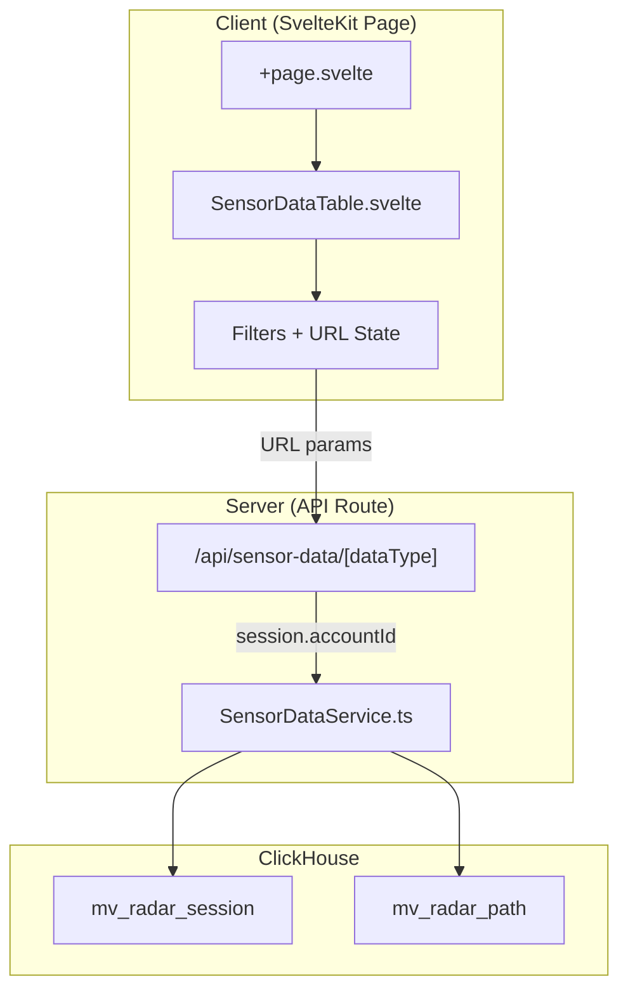

# Sensor Data Table — Detailed Design

## 1. Overview

A **reusable component** for viewing ClickHouse sensor data (radar sessions, paths, etc.) with:
- Server-side pagination, sorting, filtering via API
- Account-scoped security by default
- Follows existing `admin/users/table.svelte` pattern

---

## 2. Architecture



---

## 3. Security Model

> [!IMPORTANT]
> **Account scoping is enforced at the SERVICE layer, not the client.**

| Role | Behavior |
|------|----------|
| **User** | `accountId` auto-injected from session. Cannot query other accounts. |
| **Admin** | Can pass `?accountId=` to query specific accounts. Defaults to all. |

```typescript
// In API route
const accountId = session.isAdmin && url.searchParams.get('accountId')
  ? url.searchParams.get('accountId')
  : session.currentAccountId; // REQUIRED for non-admin

// In service
if (!accountId) throw new Error('Account ID required');
```

---

## 4. Component Structure

### 4.1 Directory Layout

```
src/lib/components/sensor-data/
├── SensorDataTable.svelte     # Main reusable component
├── columns/
│   ├── RadarSessionColumns.ts  # Column definitions for radar session
│   └── RadarPathColumns.ts     # Column definitions for radar path
└── types/
    └── index.ts                # Shared types
```

### 4.2 SensorDataTable Props

```typescript
interface SensorDataTableProps {
  // Required
  dataType: 'radar_session' | 'radar_path' | 'bundle_logs';
  
  // Optional scoping (auto-filled from session for users)
  accountId?: string;
  deviceId?: string;
  sensorId?: string;
  
  // Optional config
  columns?: ColumnDef[];        // Override default columns
  filters?: FilterConfig[];     // Additional filters
  pageSize?: number;            // Default: 25
  exportEnabled?: boolean;      // Default: true
}
```

### 4.3 Usage Example

```svelte
<!-- In +page.svelte -->
<script>
  import SensorDataTable from '$lib/components/sensor-data/SensorDataTable.svelte';
</script>

<SensorDataTable 
  dataType="radar_session"
  sensorId={$page.params.sensorId}
  pageSize={50}
/>
```

---

## 5. API Design

### 5.1 Endpoint: `GET /api/sensor-data/[dataType]`

| Parameter | Type | Required | Description |
|-----------|------|----------|-------------|
| `dataType` | path | ✅ | `radar_session`, `radar_path`, etc. |
| `accountId` | query | ⚪ (admin only) | Filter by account |
| `deviceId` | query | ⚪ | Filter by device |
| `sensorId` | query | ⚪ | Filter by sensor |
| `search` | query | ⚪ | Full-text search |
| `startTime` | query | ⚪ | ISO timestamp |
| `endTime` | query | ⚪ | ISO timestamp |
| `page` | query | ⚪ | Page number (default: 1) |
| `per_page` | query | ⚪ | Page size (default: 25, max: 100) |
| `sort_by` | query | ⚪ | Column to sort by |
| `sort_order` | query | ⚪ | `asc` or `desc` |

### 5.2 Response Format

```typescript
interface SensorDataResponse<T> {
  data: T[];
  pagination: {
    page: number;
    per_page: number;
    total_records: number;
    total_pages: number;
  };
  sort: {
    field: string;
    order: 'asc' | 'desc';
  };
}
```

---

## 6. Service Layer

### 6.1 SensorDataService

**Location**: `src/lib/server/clickhouse/sensorDataService.ts`

```typescript
class SensorDataService {
  private client: ClickHouseClient;
  
  // Registry of data types to MV names
  private readonly MV_REGISTRY = {
    radar_session: 'mv_radar_session',
    radar_path: 'mv_radar_path',
    bundle_logs: 'mv_bundle_logs',
  } as const;
  
  async query<T>(params: QueryParams): Promise<SensorDataResponse<T>> {
    const mv = this.MV_REGISTRY[params.dataType];
    if (!mv) throw new Error(`Unknown data type: ${params.dataType}`);
    
    // Build WHERE clause with account scoping
    const conditions = ['account_id = {accountId:String}'];
    if (params.deviceId) conditions.push('device_id = {deviceId:String}');
    if (params.sensorId) conditions.push('sensor_id = {sensorId:String}');
    if (params.startTime) conditions.push('log_creation_time >= {startTime:DateTime}');
    if (params.endTime) conditions.push('log_creation_time <= {endTime:DateTime}');
    
    // Execute with pagination
    const [data, countResult] = await Promise.all([
      this.queryPage(mv, conditions, params),
      this.queryCount(mv, conditions, params)
    ]);
    
    return {
      data,
      pagination: {
        page: params.page,
        per_page: params.perPage,
        total_records: countResult,
        total_pages: Math.ceil(countResult / params.perPage)
      },
      sort: { field: params.sortBy, order: params.sortOrder }
    };
  }
}
```

### 6.2 MV Registry Pattern

```typescript
// Add new data types by extending the registry
const MV_REGISTRY = {
  radar_session: {
    mv: 'mv_radar_session',
    defaultSort: 'log_creation_time',
    searchFields: ['target_id', 'sensor_id'],
    columns: RadarSessionColumns,
  },
  radar_path: {
    mv: 'mv_radar_path',
    defaultSort: 'log_creation_time',
    searchFields: ['target_id'],
    columns: RadarPathColumns,
  }
};
```

---

## 7. Column Definitions

### 7.1 Radar Session Columns

```typescript
// src/lib/components/sensor-data/columns/RadarSessionColumns.ts
export const RadarSessionColumns: ColumnDef[] = [
  {
    id: 'log_creation_time',
    label: 'Time',
    sortable: true,
    width: '20%',
    render: (row) => ({
      component: RelativeDate,
      props: { date: row.log_creation_time, showTooltip: true }
    })
  },
  {
    id: 'target_id',
    label: 'Target',
    sortable: true,
    width: '25%',
    render: (row) => row.target_id.slice(0, 8) + '...'
  },
  {
    id: 'dwell_tracking_area_sec',
    label: 'Dwell Time',
    sortable: true,
    width: '15%',
    render: (row) => `${row.dwell_tracking_area_sec.toFixed(1)}s`
  },
  {
    id: 'proximity_m',
    label: 'Proximity',
    sortable: true,
    width: '15%',
    render: (row) => row.proximity_m ? `${row.proximity_m.toFixed(2)}m` : '—'
  },
  {
    id: 'sensor_name',
    label: 'Sensor',
    sortable: true,
    width: '25%',
    render: (row) => ({
      component: NameWithIdLink,
      props: { 
        record: row, 
        baseUrl: '/user/controllers/radar',
        idField: 'sensor_id',
        nameField: 'sensor_name'
      }
    })
  }
];
```

---

## 8. Filter Configuration

### 8.1 URL State Management (like users/table.svelte)

```svelte
<script>
  import { page } from '$app/stores';
  import { writable } from 'svelte/store';
  
  // Sync filters with URL
  const dateRange = writable({
    start: $page.url.searchParams.get('startTime') || null,
    end: $page.url.searchParams.get('endTime') || null
  });
  
  const search = writable($page.url.searchParams.get('search') || '');
</script>

<DebouncedTextFilter paramName="search" bind:value={$search} />
<DateRangePicker paramName="dateRange" bind:value={$dateRange} />
```

### 8.2 Default Filters per Data Type

| Data Type | Default Filters |
|-----------|-----------------|
| `radar_session` | Date Range, Sensor, Min Dwell Time |
| `radar_path` | Date Range, Target ID |
| `bundle_logs` | Date Range, Status |

---

## 9. Pagination Pattern

Reuses existing `handleTableSort` and `handleTablePagination` from:
`$lib/components/ui_components_sveltekit/table/pagination/pagination-utils`

```svelte
<DataTable
  {columns}
  {props}
  on:sort={handleTableSort}
  on:pagination={handleTablePagination}
/>
```

These utilities update URL params, triggering a reactive `load()` to fetch new data.

---

## 10. Implementation Checklist

### Phase 1: Core
- [ ] Create `SensorDataService.ts` with MV registry
- [ ] Create `/api/sensor-data/[dataType]/+server.ts`
- [ ] Create `SensorDataTable.svelte` component
- [ ] Create `RadarSessionColumns.ts`

### Phase 2: Integration
- [ ] Add to user radar detail page
- [ ] Add date range filter component
- [ ] Add export functionality

### Phase 3: Extensions
- [ ] Add `RadarPathColumns.ts`
- [ ] Add `BundleLogColumns.ts`
- [ ] Add chart visualization option

---

## 11. Example Page Integration

```svelte
<!-- src/routes/user/controllers/radar/[id]/logs/+page.svelte -->
<script>
  import SensorDataTable from '$lib/components/sensor-data/SensorDataTable.svelte';
  export let data;
</script>

<SensorDataTable
  dataType="radar_session"
  sensorId={data.sensor.id}
/>
```

**Page Load:**
```typescript
// +page.server.ts
export const load: PageServerLoad = async ({ url, locals }) => {
  const response = await fetch(`/api/sensor-data/radar_session?${url.searchParams}`);
  return { tableData: await response.json() };
};
```
