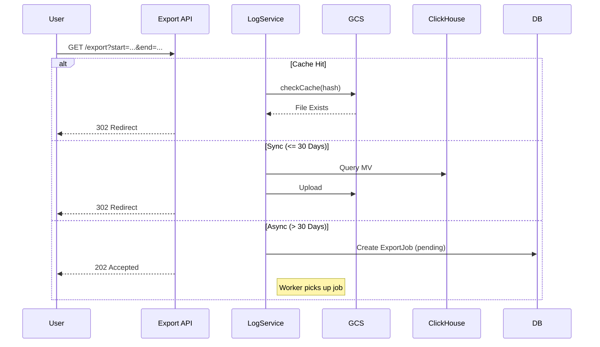

# Logs Viewer Component Design

## 1. Overview

This document describes the **UI component and API layer** for viewing logs from ClickHouse. For schema design and ingestion pipeline, see [LOGS.md](./LOGS.md).

---

## 2. Goals

| Goal | Description |
|------|-------------|
| **Reusable UI** | `LogsTable.svelte` usable in Admin, User, and Device detail contexts |
| **Performance** | Query **specialized MVs** (not `logs_raw`). Paginate |
| **Security** | Enforce `account_id` / `user_id` at the **service layer** |
| **Consistency** | Follow existing UI patterns: `DataTable`, `Filters`, `Export` |
| **Export Handling** | Sync for ≤30 days, Async for longer ranges. Cache in GCS |

---

## 3. Proposed Architecture

### 3.1 Service Layer: `LogService.ts`

A new service following the `DeviceAppService` pattern.

**Location**: `src/lib/server/clickhouse/logService.ts`

```typescript
interface LogQueryParams {
  accountId?: string; // REQUIRED for non-admin
  deviceId?: string;
  page?: number;
  limit?: number;
  search?: string;
  level?: 'INFO' | 'WARN' | 'ERROR' | 'DEBUG';
  startTime?: Date;
  endTime?: Date;
  sortBy?: string;
  sortOrder?: 'asc' | 'desc';
}

class LogService {
  async getLogs(params: LogQueryParams): Promise<{ logs: LogEntry[], total: number }>;
  async requestExport(params: LogQueryParams): Promise<{ 
    status: 'completed' | 'processing'; 
    url?: string; 
    jobId?: string;
  }>;
}
```

### 3.2 API Layer

| Endpoint | Method | Description |
|----------|--------|-------------|
| `/api/logs` | GET | Paginated JSON response for UI table |
| `/api/logs/export` | GET | Initiates export. Returns `302` (sync) or `202 Accepted` (async) |
| `/api/logs/export/[jobId]` | GET | Poll async job status |

**Security**: All endpoints extract `accountId` from `session.currentAccount`. Admins may query across accounts.

### 3.3 UI Component

**Component**: `src/lib/components/logs/LogsTable.svelte`

| Feature | Implementation |
|---------|----------------|
| **Columns** | Timestamp (relative), Level (badge), Message (truncated), Device |
| **Filters** | `DebouncedTextFilter` for search, `PopoverFilter` for level |
| **Pagination** | Server-side via `handleTablePagination` util |
| **Sorting** | Server-side via `handleTableSort` util |
| **Export** | `DropdownMenu` with CSV/JSON options |

---

## 4. Export Flow



---

## 5. Implementation Checklist

- [ ] **Data Access Layer (`logService.ts`)**
    - [ ] Create service file
    - [ ] Query correct MV per log type
    - [ ] Add robust error handling

- [ ] **API Layer**
    - [ ] `GET /api/logs`
    - [ ] `GET /api/logs/export`
    - [ ] `GET /api/logs/export/[jobId]` for async polling
    - [ ] Validate `accountId` in all requests

- [ ] **UI Components**
    - [ ] `LogsTable.svelte`
    - [ ] Date Range Picker filter
    - [ ] Async export toast/notification

- [ ] **GCS & Async Infrastructure**
    - [ ] Verify GCS Lifecycle policy for `exports/`
    - [ ] Implement async job processing

---

## 6. Open Questions

1. **Which MV for "general logs"?** — Do we need a new `mv_action_logs` or `mv_audit_events`?
2. **Admin Override Logic** — How should admins query across accounts?
3. **Async Worker** — Use existing MQTT worker or a separate process?
