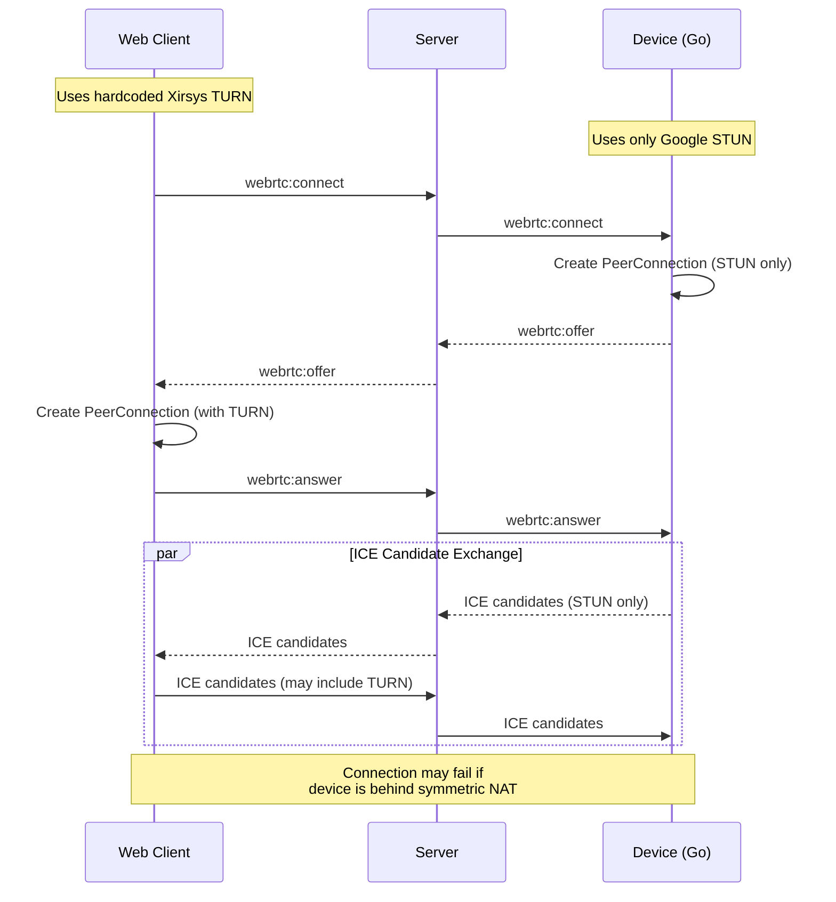
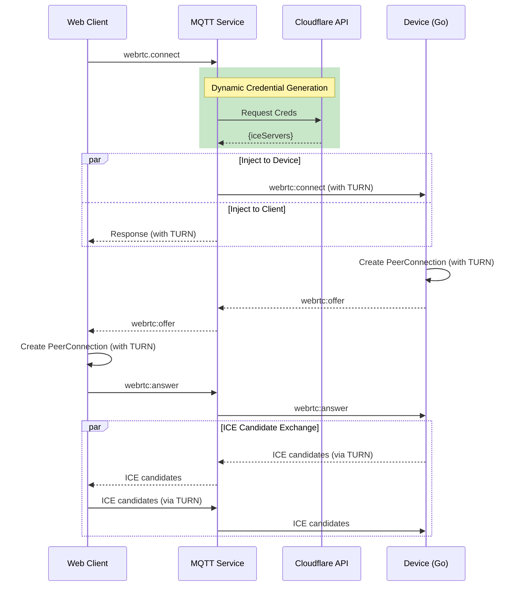
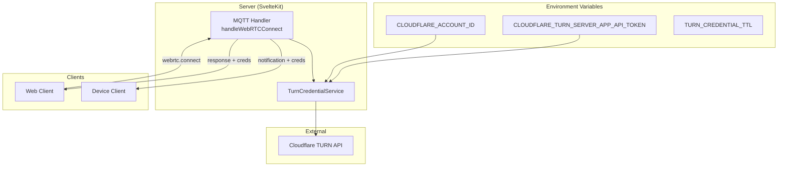
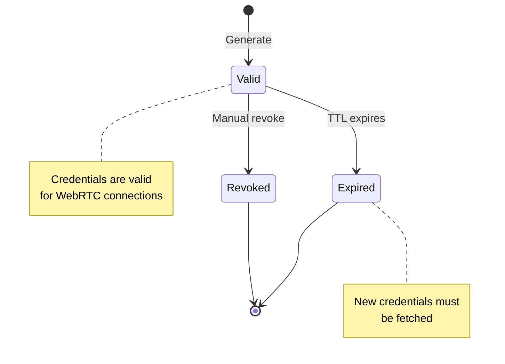
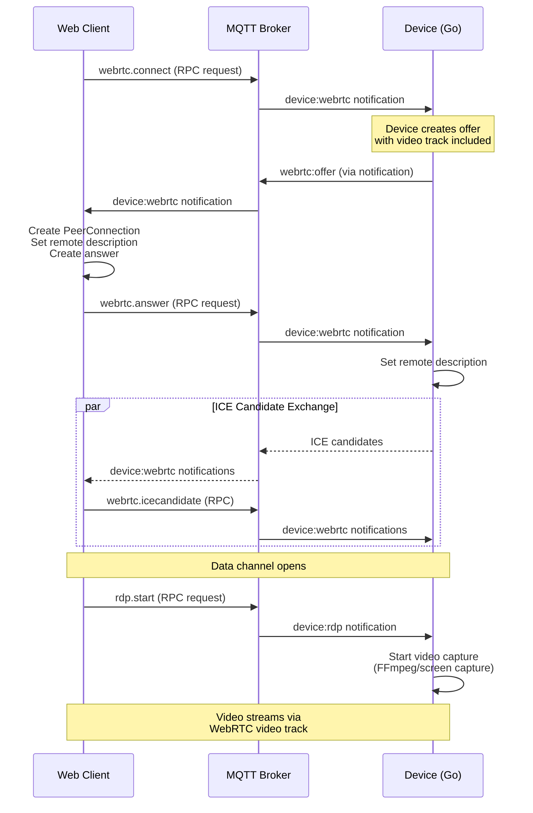

# Cloudflare TURN Service Migration

This document describes the migration from the current hardcoded Xirsys TURN service to Cloudflare's TURN service for improved security, scalability, and global coverage.

## Table of Contents

1. [Overview](#overview)
2. [Current Architecture](#current-architecture)
3. [Target Architecture](#target-architecture)
4. [Cloudflare TURN API](#cloudflare-turn-api)
5. [Implementation Plan](#implementation-plan)
6. [Migration Checklist](#migration-checklist)

---

## Overview

### Problem Statement

The current WebRTC implementation has critical security and scalability issues:

1. **Hardcoded Credentials**: Xirsys TURN credentials are hardcoded in client-side code (`WebRTCClient.ts`), exposing them to potential abuse
2. **No Credential Rotation**: Static credentials that never expire
3. **Limited Coverage**: Single Xirsys server region
4. **Device Gap**: Go device client (`fs04_device`) has no TURN support, only STUN

### Solution

Migrate to Cloudflare's TURN service with:
- **Server-side credential generation** using Cloudflare's API
- **Short-lived tokens** with configurable TTL
- **Global edge network** for better connectivity
- **Unified configuration** for both web and device clients

---

## Current Architecture

### Web Client (TypeScript/SvelteKit)

**File**: [WebRTCClient.ts](file:///Users/bernard/CascadeProjects/fs04/fs04_web/src/lib/webrtc/WebRTCClient.ts)

```typescript
// Current hardcoded configuration (lines 30-47)
this.config = {
  iceServers: [
    { urls: 'stun:stun.l.google.com:19302' },
    {
      urls: [
        "turn:ss-turn1.xirsys.com:80?transport=udp",
        "turn:ss-turn1.xirsys.com:3478?transport=udp",
        "turn:ss-turn1.xirsys.com:80?transport=tcp",
        "turn:ss-turn1.xirsys.com:3478?transport=tcp",
        "turns:ss-turn1.xirsys.com:443?transport=tcp",
        "turns:ss-turn1.xirsys.com:5349?transport=tcp"
      ],
      username: 'S2kFk44DqbzeOOJ03gLpLJ1512TN2tgH42g02QBLGyVZ8bmv47Zm6QsRqdu1KfnKAAAAAGjaCsdiYWNoc29kYTMyNg==',
      credential: 'a919482e-9cec-11f0-998a-0242ac140004'
    }
  ]
};
```

> [!CAUTION]
> **Security Risk**: These credentials are embedded in client-side JavaScript and visible to anyone inspecting the browser's network traffic or source code.

### Device Client (Go)

**File**: [client.go](file:///Users/bernard/CascadeProjects/fs04/fs04_device/internal/module/webrtc/client.go)

```go
// Current configuration (lines 190-206)
config := webrtc.Configuration{
    ICEServers: []webrtc.ICEServer{
        {
            URLs: []string{
                "stun:stun.l.google.com:19302",
                "stun:stun1.l.google.com:19302",
                "stun:stun2.l.google.com:19302",
                "stun:stun3.l.google.com:19302",
                "stun:stun4.l.google.com:19302",
            },
        },
    },
    ICECandidatePoolSize: 10,
    BundlePolicy:         webrtc.BundlePolicyMaxBundle,
    RTCPMuxPolicy:        webrtc.RTCPMuxPolicyRequire,
    ICETransportPolicy:   webrtc.ICETransportPolicyAll,
}
```

> [!WARNING]
> **Missing TURN**: The Go device client only uses public STUN servers and has no TURN configuration. This means connections may fail when devices are behind symmetric NATs or restrictive firewalls.

### Current Message Flow



---

## Target Architecture

### Design Goals

1. **Secure Credentials**: Generate short-lived TURN credentials on the server
2. **Dynamic Configuration**: Fetch fresh credentials before each WebRTC connection
3. **Unified Support**: Both web and device clients use the same TURN infrastructure
4. **Environment-Based Config**: All sensitive values in environment variables

### Target Message Flow


### Architecture Components



---

## Cloudflare TURN API

### Authentication

Cloudflare TURN uses a two-tier credential system:

1. **TURN Key** (Long-lived): API token stored server-side, used to generate credentials
2. **TURN Credentials** (Short-lived): Generated per-session with configurable TTL

### API Endpoint

```
POST https://rtc.live.cloudflare.com/v1/turn/keys/{keyId}/credentials/generate-ice-servers
```

### Request Headers

```
Authorization: Bearer {CLOUDFLARE_TURN_SERVER_APP_API_TOKEN}
Content-Type: application/json
```

### Request Body

```json
{
  "ttl": 86400
}
```

### Response

```json
{
  "iceServers": {
    "urls": [
      "stun:stun.cloudflare.com:3478",
      "turn:turn.cloudflare.com:3478?transport=udp",
      "turn:turn.cloudflare.com:3478?transport=tcp",
      "turns:turn.cloudflare.com:5349?transport=tcp"
    ],
    "username": "generated-username",
    "credential": "generated-credential"
  }
}
```

### Credential Lifecycle



---

## Implementation Plan

### Phase 1: Server-Side API Endpoint

#### Environment Variables

Add to `.env`:

```bash
# Cloudflare TURN Service
CLOUDFLARE_TURN_SERVER_APP_TOKEN_ID=your_turn_key_id
CLOUDFLARE_TURN_SERVER_APP_API_TOKEN=your_api_token
TURN_CREDENTIAL_TTL=86400
```

#### New Files

##### [NEW] `src/lib/server/services/turn-credential.service.ts`

```typescript
import { env } from '$env/dynamic/private';

export interface TurnCredentials {
  iceServers: RTCIceServer[];
  expiresAt: number;
}

export class TurnCredentialService {
  private readonly apiUrl: string;
  private readonly apiToken: string;
  private readonly ttl: number;

  constructor() {
    const keyId = env.CLOUDFLARE_TURN_SERVER_APP_TOKEN_ID;
    this.apiToken = env.CLOUDFLARE_TURN_SERVER_APP_API_TOKEN || '';
    this.ttl = parseInt(env.TURN_CREDENTIAL_TTL || '86400', 10);
    
    this.apiUrl = `https://rtc.live.cloudflare.com/v1/turn/keys/${keyId}/credentials/generate-ice-servers`;
  }

  async generateCredentials(): Promise<TurnCredentials> {
    const response = await fetch(this.apiUrl, {
      method: 'POST',
      headers: {
        'Authorization': `Bearer ${this.apiToken}`,
        'Content-Type': 'application/json'
      },
      body: JSON.stringify({ ttl: this.ttl })
    });

    if (!response.ok) {
      throw new Error(`Failed to generate TURN credentials: ${response.statusText}`);
    }

    const data = await response.json();
    
    return {
      iceServers: [
        { urls: 'stun:stun.cloudflare.com:3478' },
        {
          urls: data.iceServers.urls.filter((u: string) => u.startsWith('turn')),
          username: data.iceServers.username,
          credential: data.iceServers.credential
        }
      ],
      expiresAt: Date.now() + (this.ttl * 1000)
    };
  }
}
```

##### [NEW] `src/routes/api/webrtc/turn-credentials/+server.ts`

```typescript
import { json, error } from '@sveltejs/kit';
import type { RequestHandler } from './$types';
import { TurnCredentialService } from '$lib/server/services/turn-credential.service';

const turnService = new TurnCredentialService();

export const GET: RequestHandler = async ({ locals }) => {
  // Ensure user is authenticated
  if (!locals.user) {
    throw error(401, 'Unauthorized');
  }

  try {
    const credentials = await turnService.generateCredentials();
    return json(credentials);
  } catch (err) {
    console.error('Failed to generate TURN credentials:', err);
    throw error(500, 'Failed to generate TURN credentials');
  }
};
```

---

### Phase 2: Web Client Updates

#### Modify `WebRTCClient.ts`

Replace hardcoded config with dynamic fetching:

```typescript
// src/lib/webrtc/WebRTCClient.ts

export class WebRTCClient {
  private peerConnection: RTCPeerConnection | null = null;
  private config: RTCConfiguration | null = null;
  
  constructor(private deviceId: string) {
    // Config will be fetched dynamically
  }

  private async fetchTurnCredentials(): Promise<RTCConfiguration> {
    const response = await fetch('/api/webrtc/turn-credentials');
    if (!response.ok) {
      console.warn('[WebRTCClient] Failed to fetch TURN credentials, using STUN only');
      return {
        iceServers: [{ urls: 'stun:stun.l.google.com:19302' }]
      };
    }
    
    const { iceServers } = await response.json();
    return { iceServers };
  }

  async connect() {
    // Fetch fresh TURN credentials before connecting
    this.config = await this.fetchTurnCredentials();
    
    // ... rest of connection logic
    this.peerConnection = new RTCPeerConnection(this.config);
    // ...
  }
}
```

---

### Phase 3: Device Client Updates

#### Modify Go WebRTC Client

##### Update Message Handling

The device should receive TURN credentials in the `webrtc:connect` message:

```go
// internal/module/webrtc/client.go

type TurnCredentials struct {
    URLs       []string `json:"urls"`
    Username   string   `json:"username"`
    Credential string   `json:"credential"`
}

type ConnectMessage struct {
    TurnCredentials *TurnCredentials `json:"turnCredentials,omitempty"`
}

func (c *Client) HandleConnect(senderConnectionID string, credentials *TurnCredentials) error {
    config := webrtc.Configuration{
        ICEServers: []webrtc.ICEServer{
            {
                URLs: []string{
                    "stun:stun.l.google.com:19302",
                },
            },
        },
        ICECandidatePoolSize: 10,
        BundlePolicy:         webrtc.BundlePolicyMaxBundle,
        RTCPMuxPolicy:        webrtc.RTCPMuxPolicyRequire,
        ICETransportPolicy:   webrtc.ICETransportPolicyAll,
    }
    
    // Add TURN server if credentials provided
    if credentials != nil && len(credentials.URLs) > 0 {
        config.ICEServers = append(config.ICEServers, webrtc.ICEServer{
            URLs:       credentials.URLs,
            Username:   credentials.Username,
            Credential: credentials.Credential,
        })
        c.logger.Info("TURN credentials configured from server")
    }
    
    // ... rest of connection logic
}
```

##### Update Server-Side Message Handler

Inject TURN credentials when forwarding the connect message to the device:

```typescript
// Server-side handler modification
async function handleWebRTCConnect(message: InMessage) {
  const turnService = new TurnCredentialService();
  const credentials = await turnService.generateCredentials();
  
  // Add credentials to message for device
  message.payload.turnCredentials = credentials.iceServers[1]; // The TURN server config
  
  // Forward to device
  await forwardToDevice(message);
}
```

---

## Migration Checklist

### Server-Side

- [x] Add Cloudflare environment variables to `.env.example`
- [x] Add environment variables to `.env`
- [x] Create `TurnCredentialService` class
- [x] Implement Cloudflare API integration with STUN fallback
- [x] Update `handle_webrtc.ts` (MQTT) to inject credentials into RPC response (Web) and Notification (Device)
- [x] ~~Create `/api/webrtc/turn-credentials` endpoint~~ (Replaced by MQTT injection)

### Web Client

- [x] Remove hardcoded Xirsys credentials from `WebRTCClient.ts`
- [x] Update `connect()` to use credentials from MQTT `webrtc.connect` response
- [x] Handle credential fallback gracefully
- [x] Fix duplicate `device:webrtc` notification handlers (2025-12-30)
- [x] Store and cleanup MQTT notification handlers on page destroy (2025-12-30)
- [x] Handle renegotiation offers without closing existing peer connection (2025-12-30)

### Device Client (Go)

- [x] Update `ConnectMessage` struct with TURN credentials
- [x] Modify `HandleConnect` to accept credentials parameter
- [x] Update ICE server configuration logic to accept dynamic TURN servers
- [ ] Fix state transition error when receiving duplicate answers (pending - see "WebRTC RDP Signaling Fixes" section)
- [ ] Grant macOS screen recording permissions for FFmpeg

### Device Client (Node Emulator)

- [x] Implement WebRTC client with Perfect Negotiation pattern
- [x] Fix `@roamhq/wrtc` compatibility - explicit `createOffer()` before `setLocalDescription()`
- [x] ~~Removed SSE service from Go device~~ (renamed to `.bak` to unblock build)

### Testing

- [x] Integration tests for internal `TurnCredentialService`
- [x] E2E test: Web client with TURN (via simulated MQTT flow in `webrtc_turn_e2e.test.ts`)
- [x] E2E test: Device receiving keys (via simulated MQTT flow)
- [x] Implement WebRTC Terminal in Node Emulator (`fs04_device/emulators/node`) for TURN verification
- [x] WebRTC signaling verified with Go device (connection establishes, data channel opens)
- [ ] Performance test: Credential generation latency
- [ ] Security test: Credential expiration
- [ ] Video streaming E2E test (blocked by macOS screen recording permissions)

### Documentation

- [x] Create migration design document
- [x] Update `WEBRTC_ARCHITECTURE.md` with new flow
- [x] Document environment variables
- [x] Document WebRTC RDP signaling fixes for Go developer (2025-12-30)
- [ ] Add troubleshooting guide

### Deployment

- [ ] Add environment variables to staging
- [ ] Deploy and test in staging
- [ ] Add environment variables to production
- [ ] Deploy to production
- [ ] Monitor connection success rates
- [ ] Remove Xirsys account after verification

---

## Security Considerations

### Credential Protection

| Aspect | Before (Xirsys) | After (Cloudflare) |
|--------|-----------------|-------------------|
| Storage | Client-side | Server-side |
| Lifetime | Permanent | TTL-based |
| Rotation | Never | Per-session |
| Revocation | N/A | API supported |
| Exposure | Public | Authenticated |

### Rate Limiting

The `/api/webrtc/turn-credentials` endpoint should implement:
- Per-user rate limiting (e.g., 10 requests/minute)
- IP-based rate limiting as fallback
- Logging for abuse detection

### Audit Logging

Consider logging:
- Credential generation requests
- Failed authentication attempts
- Unusual usage patterns

---

## Related Documents

- [WEBRTC_ARCHITECTURE.md](file:///Users/bernard/CascadeProjects/fs04/fs04_web/docs/architecture/real-time/WEBRTC_ARCHITECTURE.md) - Current WebRTC architecture
- [device_webrtc.go](file:///Users/bernard/CascadeProjects/fs04/fs04_device/internal/module/device_webrtc.go) - Device WebRTC handler
- [client.go](file:///Users/bernard/CascadeProjects/fs04/fs04_device/internal/module/webrtc/client.go) - Go WebRTC client

---

## WebRTC RDP Signaling Fixes (2025-12-30)

This section documents fixes made to the web client WebRTC signaling for RDP, which the Go device should follow for consistency.

### Problem Summary

The WebRTC RDP connection was establishing but video was not displaying due to:
1. **Duplicate offer handling** - Multiple handlers were registered for `device:webrtc` notifications
2. **Race conditions** - Multiple peer connections being created from the same offer
3. **State transition errors** - Go device receiving duplicate answers causing `InvalidModificationError`

### Root Causes Identified

#### 1. Multiple Notification Handlers

The `device:webrtc` notification was being processed by multiple handlers:

| Handler | Location | Purpose |
|---------|----------|---------|
| `device-store.ts` | Global store | Stored messages for debugging |
| RDP page `onNotification` | On each connection | Processed offers/answers |

This caused each offer to be handled 2-4 times, creating multiple peer connections.

#### 2. Missing Handler Cleanup

The RDP page's `mqttClient.onNotification()` was called every time `connectToDevice()` ran, but the unsubscribe function was never stored or called on cleanup.

### Fixes Applied (Web Client)

#### Fix 1: Removed Global WebRTC Handler from Device Store

**File**: [device-store.ts](file:///Users/bernard/CascadeProjects/fs04/fs04_web/src/lib/stores/device-store.ts)

```diff
- // Listen for WebRTC messages
- mqttClient.onNotification('device:webrtc', (payload: any) => {
-   // ... handler code ...
- });

+ // Note: WebRTC messages are handled directly by the RDP page's WebRTCClient.
+ // We don't process them here to avoid duplicate handling.
```

#### Fix 2: Store and Cleanup MQTT Notification Handler

**Files**: 
- [admin RDP page](file:///Users/bernard/CascadeProjects/fs04/fs04_web/src/routes/admin/iot/devices/[id]/rdp/+page.svelte)
- [user RDP page](file:///Users/bernard/CascadeProjects/fs04/fs04_web/src/routes/user/iot/devices/[id]/rdp/+page.svelte)

```typescript
// Track the unsubscribe function
let unsubscribeMqttWebRTC: (() => void) | undefined;

// In connectToDevice():
if (!unsubscribeMqttWebRTC) {
  unsubscribeMqttWebRTC = mqttClient.onNotification("device:webrtc", async (payload) => {
    if (webrtcClient) {
      await webrtcClient.handleWebRTCMessage(payload);
    }
  });
}

// In onDestroy():
if (unsubscribeMqttWebRTC) {
  unsubscribeMqttWebRTC();
}
```

#### Fix 3: Handle Renegotiation in WebRTCClient

**File**: [WebRTCClient.ts](file:///Users/bernard/CascadeProjects/fs04/fs04_web/src/lib/webrtc/WebRTCClient.ts)

The `handleOffer` method now correctly handles renegotiation offers:

```typescript
private async handleOffer(message: any) {
  // Check if this is a renegotiation offer or initial offer
  const isRenegotiation = this.peerConnection && 
    ['stable', 'have-local-offer', 'have-remote-offer'].includes(this.peerConnection.signalingState);
  
  if (isRenegotiation) {
    console.log('[WebRTCClient] === RENEGOTIATION OFFER (video track added) ===');
    // Don't close existing connection - just update remote description
  } else {
    console.log('[WebRTCClient] === INITIAL OFFER ===');
    // Clean up existing peer connection for fresh start
  }
  
  // Set remote description and create answer
  await this.peerConnection!.setRemoteDescription(
    new RTCSessionDescription({ type: 'offer', sdp: message.sdp })
  );
  
  const answer = await this.peerConnection!.createAnswer();
  await this.peerConnection!.setLocalDescription(answer);
  
  // Send answer via MQTT
  await mqttClient.request('webrtc.answer', { ... });
}
```

### Go Device Signaling Flow

The Go device should follow this signaling pattern:



### Key Points for Go Device Implementation

1. **Single Offer Generation**: Device should generate ONE offer per connection request
2. **Wait for Answer Before Processing New Offers**: Track signaling state to avoid state machine violations
3. **Include Video Track in Initial Offer**: Video transceiver should be added before creating the offer
4. **Handle State Transitions**: Check `peerConnection.SignalingState()` before setting remote description

### Go Device Error Reference

The Go device was seeing this error:
```
ERRO[0013] Failed to handle WebRTC answer: failed to handle answer: 
  failed to set remote description: InvalidModificationError: 
  invalid proposed signaling state transition: stable->SetRemote(answer)->stable
```

This means the device received an answer when already in `stable` state (likely from duplicate answers caused by duplicate offer handling on the web side).

### macOS FFmpeg Screen Capture Requirements

For FFmpeg screen capture to work on macOS:

1. **Screen Recording Permission**: Grant permission in System Preferences > Privacy & Security > Screen & System Audio Recording
2. **Correct Device Index**: Use `ffmpeg -f avfoundation -list_devices true -i ""` to find the correct device
3. **Restart Terminal**: After granting permissions, restart the terminal application

Current FFmpeg command in Go device:
```bash
ffmpeg -f avfoundation -i 1:none -r 60 -vf scale=1280:720 \
  -c:v libvpx -b:v 1M -maxrate 1M -bufsize 2M \
  -deadline realtime -cpu-used 4 -error-resilient 1 \
  -threads 4 -auto-alt-ref 0 -lag-in-frames 0 \
  -f rtp rtp://127.0.0.1:5005
```

### Files Modified

| File | Change |
|------|--------|
| `src/lib/stores/device-store.ts` | Removed global `device:webrtc` handler |
| `src/routes/admin/iot/devices/[id]/rdp/+page.svelte` | Added handler cleanup |
| `src/routes/user/iot/devices/[id]/rdp/+page.svelte` | Added handler cleanup |
| `src/lib/webrtc/WebRTCClient.ts` | Fixed renegotiation handling |

