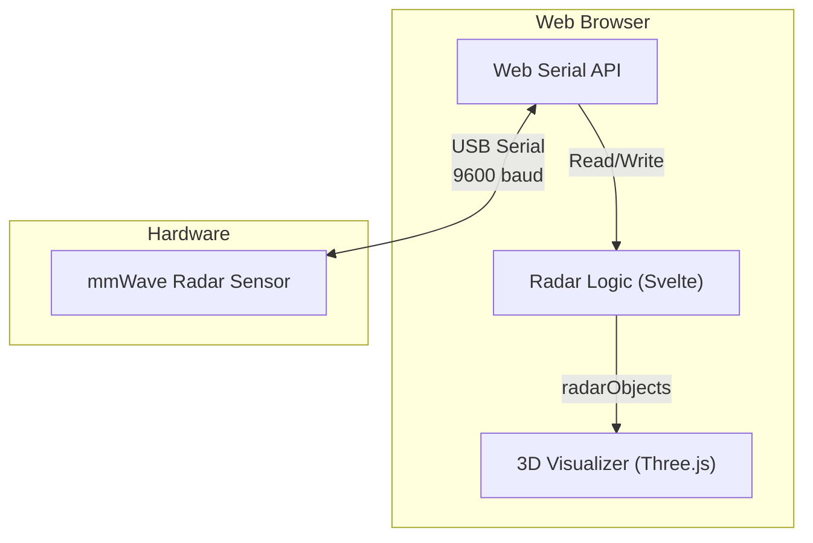
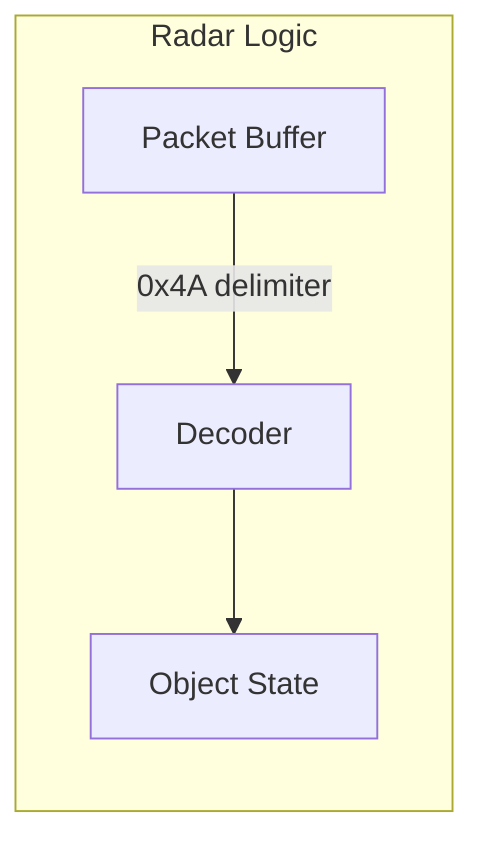
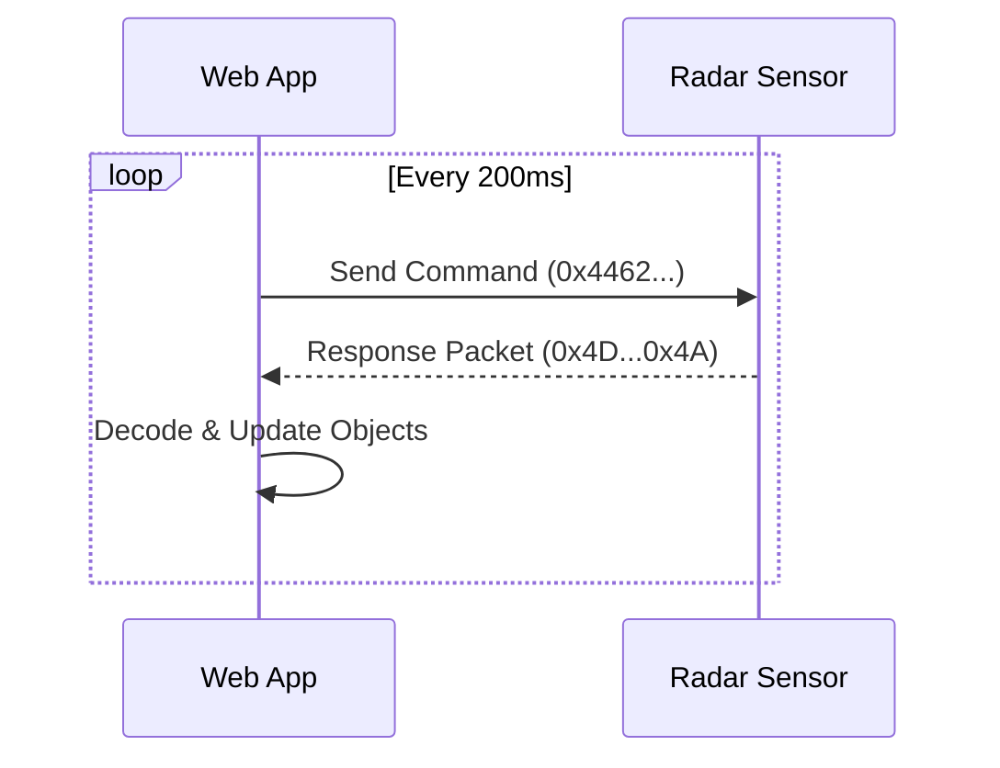

# Radar Sensor Architecture

## Overview

The radar sensor subsystem provides people detection and tracking using mmWave radar technology. It interfaces with hardware sensors via serial communication and provides real-time position data.

## Hardware

- **Sensor Model**: mmWave radar sensor (9600 baud, 8N1, even parity)
- **Interface**: USB Serial
- **Detection Range**: 0-8 meters depth, ±4 meters lateral
- **Max Concurrent Objects**: 8

## Protocol

### Command Format

The radar uses a binary protocol with hex-encoded commands:

```
Request:  446208001000000000000000BE4B
Response: Packet ending with 0x4A
```

### Packet Structure

| Offset | Length | Description |
|--------|--------|-------------|
| 0 | 1 | Header (0x4D) |
| 5 | 1 | Object count |
| 12+ | 8×N | Object data (N objects) |

### Object Data (8 bytes per object)

| Offset | Description | Unit |
|--------|-------------|------|
| 0 | Object ID | - |
| 1 | Distance | 0.1m |
| 6 | X coordinate (signed) | 0.1m |
| 7 | Y coordinate (signed) | 0.1m |

## Architecture





## Key Files

### Web Application

| File | Description |
|------|-------------|
| `src/routes/admin/debug/webserial/+page.svelte` | Debug UI with serial console and controls |
| `src/lib/components/radar/RadarVisualizer.svelte` | Three.js 3D visualization component |
| `src/lib/components/admin/AdminSidebar.svelte` | Sidebar menu (Debug > Web Serial) |

### BrightSign Implementation

| File | Description |
|------|-------------|
| `fs04_radar_bs/demo/lib/sensor/index.js` | RadarSensor class (Node.js) |
| `fs04_radar_bs/demo/lib/ui/radar-scene.js` | Three.js scene setup |
| `fs04_radar_bs/demo/lib/ui/people-tracker.js` | Marker management |

## Coordinate System

The radar uses a coordinate system where:
- **X axis (lateral)**: -4m (left) to +4m (right)
- **Y axis (depth)**: 0m (sensor) to 8m (far)
- **Origin**: At the radar sensor position

### Coordinate Mapping

```javascript
// Input from sensor: x (lateral), y (distance/depth)
// Three.js scene: visualX = depth, visualZ = -lateral
const visualX = obj.y;  // Depth along scene X
const visualZ = -obj.x; // Lateral along scene Z (inverted)
```

## Web Serial API

The debug page uses the Web Serial API (Chrome/Edge only):

```typescript
// Request port
const port = await navigator.serial.requestPort();

// Open with radar settings
await port.open({
    baudRate: 9600,
    dataBits: 8,
    stopBits: 1,
    parity: "even"
});

// Read loop
const reader = port.readable.getReader();
while (true) {
    const { value, done } = await reader.read();
    if (done) break;
    processData(value); // Uint8Array
}

// Write command
const writer = port.writable.getWriter();
await writer.write(hexToBytes("446208001000000000000000BE4B"));
writer.releaseLock();
```

## Polling

The sensor requires active polling at 200ms intervals:



## Visualization Features

- **3D Scene**: 8×8m floor grid with meter markers
- **Zones**: A (left/cyan) and B (right/violet) zones
- **Glass Walls**: Translucent boundary walls
- **Radar Sensor**: Mounted at origin with FOV lines
- **Holographic Markers**: Animated person representations
- **Position Trails**: Movement history lines
- **Auto-rotate**: Slow camera orbit for overview
