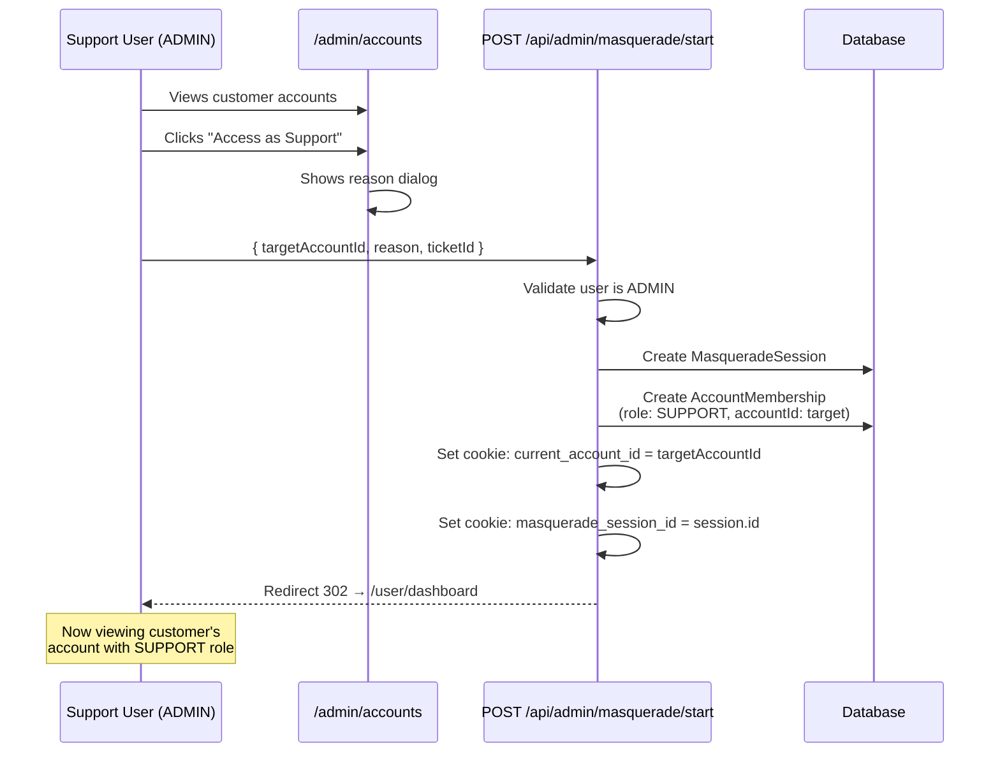
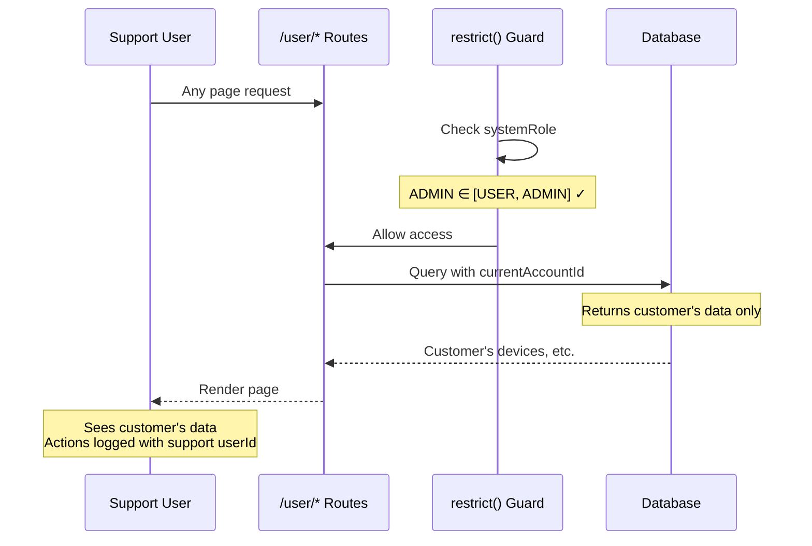
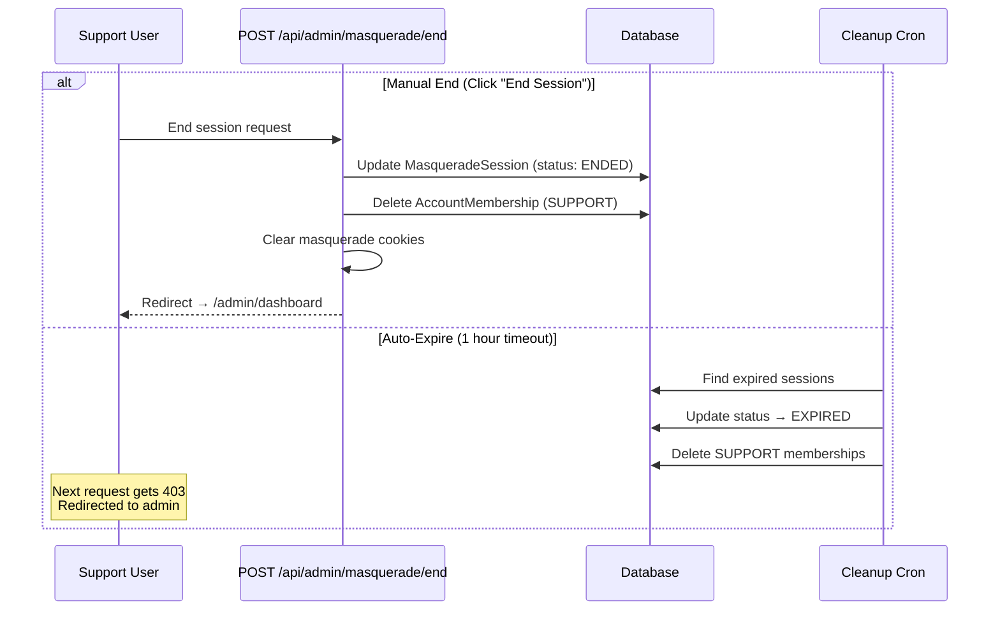
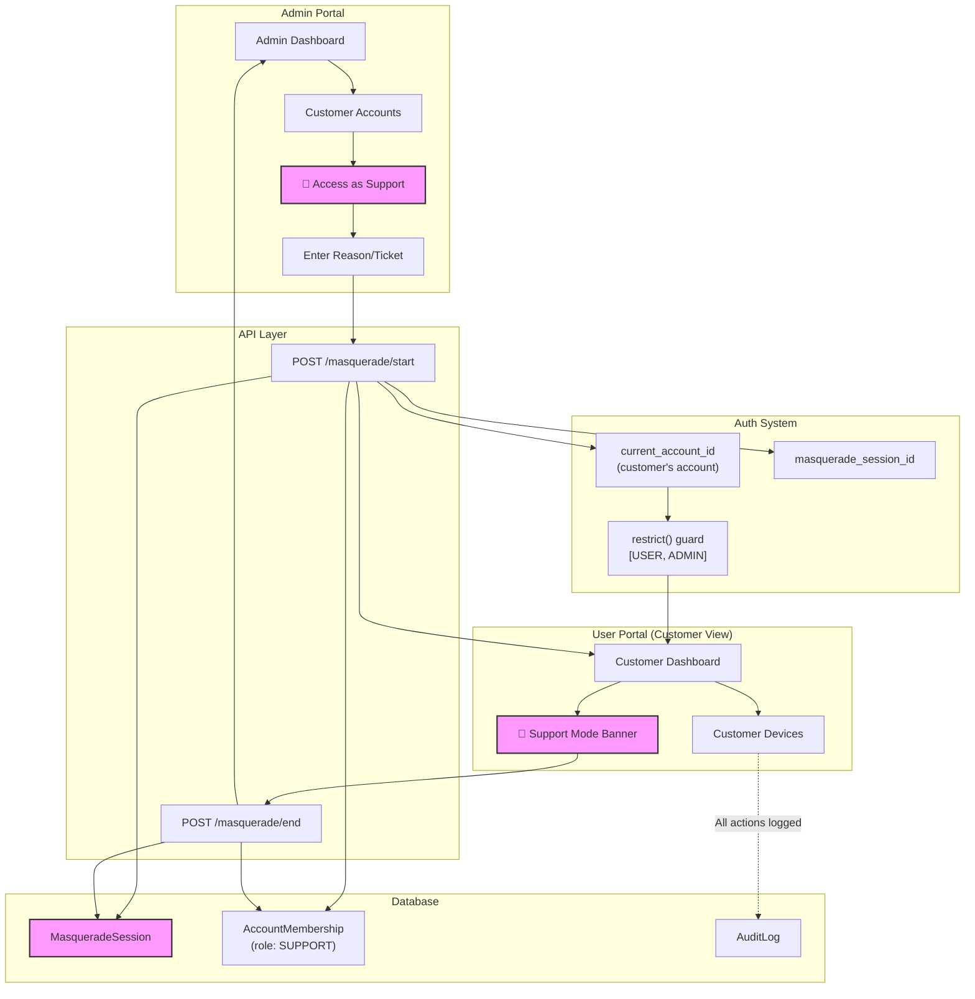

# Masquerade / Support Access Architecture

> Provide a way for support personnel to securely access user accounts for troubleshooting without compromising security or user trust.

---

## Design Rating: 8/10 🌟

**This design is validated as both possible and recommended.**

| Aspect | Status |
|--------|--------|
| Core Design | ✅ Sound - Uses existing `AccountMembership` with SUPPORT role |
| Minimal Changes | ✅ One-liner fix to route guards + new endpoints |
| Security | ✅ Data scoping already uses `currentAccountId` |
| Audit Trail | ✅ Feasible via `MasqueradeSession` table |
| Time-Limited | ✅ Achievable via auto-expiring memberships |

---

## Overview

The Masquerade system allows authorized support personnel (ADMIN users) to temporarily access customer accounts to diagnose and resolve issues. This is achieved by:

1. Creating a **temporary `AccountMembership`** with **SUPPORT** role
2. Setting the support user's **`currentAccountId`** cookie to the customer's account
3. Redirecting to `/user/dashboard` (which ADMINs can access)

### Key Insight

The support user **keeps their real identity** (`userId` stays the same). They simply switch their account context to view the customer's data. This means:

- ✅ No complex "impersonation" logic needed
- ✅ All audit logs naturally show the support user's real ID
- ✅ Existing data scoping queries work unchanged (they filter by `currentAccountId`)

---

## Prerequisites

### Required Change: Allow ADMIN in `/user/*` Routes

Currently, `/user/*` routes use `restrict()` with `[SystemRole.USER]` only:

```typescript
// Current (blocks ADMIN users)
export const load = restrict(handler, [SystemRole.USER]);

// Required change (allows ADMIN to access user routes)
export const load = restrict(handler, [SystemRole.USER, SystemRole.ADMIN]);
```

This change is **safe** because:
- ADMINs are more privileged than USERs, not less
- Data scoping is handled by `currentAccountId`, not `systemRole`
- ADMIN users already have their own accounts, so they can use `/user/*` normally too

---

## Authentication Context

The existing auth structure supports masquerade without modification:

```typescript
interface AuthContext {
  userId: string;           // Support user's REAL ID (never changes)
  currentAccountId: string; // Switches to customer's account during masquerade
  systemRole: 'ADMIN';      // Support user is an ADMIN
  
  // Via AccountMembership lookup
  accountRole: 'SUPPORT';   // Limited permissions in customer's account
}
```

No `originalUserId` needed - the support user's identity is always preserved.

---

## Data Model

### MasqueradeSession (New Table)

```prisma
model MasqueradeSession {
  id              String    @id @default(cuid())
  
  // Who is accessing
  supportUserId   String
  supportUser     User      @relation("SupportSessions", fields: [supportUserId], references: [id])
  
  // What they're accessing  
  targetAccountId String
  targetAccount   Account   @relation(fields: [targetAccountId], references: [id])
  
  // Why (for audit/compliance)
  reason          String                      // Required description
  ticketId        String?                     // External ticket reference
  
  // Lifecycle
  status          String    @default("ACTIVE") // ACTIVE, EXPIRED, ENDED, REVOKED
  startedAt       DateTime  @default(now())
  expiresAt       DateTime                     // Hard limit (default: 1 hour)
  endedAt         DateTime?                    // When manually ended
  
  // Context
  ipAddress       String?
  userAgent       String?
  
  // Links to the temporary membership
  membershipId    String?   @unique
  
  createdAt       DateTime  @default(now())
  updatedAt       DateTime  @updatedAt()
  
  @@index([supportUserId])
  @@index([targetAccountId])
  @@index([status])
  @@index([expiresAt])
}
```

### AccountMembership Role

Add `SUPPORT` to existing roles:

```typescript
// Existing: OWNER, ADMIN, MEMBER, VIEWER
// Add: SUPPORT
const ACCOUNT_ROLES = ['OWNER', 'ADMIN', 'MEMBER', 'VIEWER', 'SUPPORT'] as const;
```

---

## System Flow

### Starting Support Access



### During Support Session



### Ending Support Session



---

## Full Architecture



---

## SUPPORT Role Permissions

The SUPPORT role should have **read-heavy, very limited write** access:

| Resource | VIEW | CREATE | EDIT | DELETE |
|----------|------|--------|------|--------|
| Devices | ✅ | ❌ | ⚠️ Limited | ❌ |
| Device Profiles | ✅ | ❌ | ❌ | ❌ |
| Device Tags | ✅ | ❌ | ❌ | ❌ |
| Bundles | ✅ | ❌ | ❌ | ❌ |
| Resources | ✅ | ❌ | ❌ | ❌ |
| Users | ✅ | ❌ | ❌ | ❌ |
| Account Settings | ✅ | ❌ | ❌ | ❌ |
| Billing | ❌ | ❌ | ❌ | ❌ |
| API Keys | ❌ | ❌ | ❌ | ❌ |

*⚠️ Limited = Can trigger device commands for debugging (screenshot, sync, etc.)*

---

## UI Components

### Masquerade Banner

Always visible when in support mode:

```svelte
<!-- MasqueradeBanner.svelte -->
{#if masqueradeSessionId}
  <div class="masquerade-banner">
    <span class="icon">🔑</span>
    <span class="label">Support Access:</span>
    <span class="account">{targetAccountName}</span>
    <span class="timer">{formatTimeRemaining(expiresAt)}</span>
    <button class="end-btn" on:click={endSession}>End Session</button>
  </div>
{/if}

<style>
  .masquerade-banner {
    position: fixed;
    top: 0;
    left: 0;
    right: 0;
    background: linear-gradient(90deg, #f59e0b, #d97706);
    color: white;
    padding: 8px 16px;
    display: flex;
    align-items: center;
    gap: 12px;
    z-index: 9999;
    font-weight: 500;
  }
</style>
```

### Access Button (Admin Accounts List)

```svelte
<button 
  class="support-access-btn"
  on:click={() => openMasqueradeDialog(account.id)}
>
  🔑 Access as Support
</button>
```

---

## Implementation Checklist

### Phase 1: Foundation
- [ ] Add `MasqueradeSession` model to Prisma schema
- [ ] Add `SUPPORT` to AccountMembership role values
- [ ] Update `/user/*` routes: `[SystemRole.USER]` → `[SystemRole.USER, SystemRole.ADMIN]`

### Phase 2: API Endpoints
- [ ] Create `POST /api/admin/masquerade/start`
- [ ] Create `POST /api/admin/masquerade/end`
- [ ] Create `GET /api/admin/masquerade/sessions` (active sessions list)

### Phase 3: UI
- [ ] Create `MasqueradeBanner.svelte` component
- [ ] Add masquerade button to `/admin/accounts` list
- [ ] Create reason/ticket input dialog
- [ ] Wire up banner to end session API

### Phase 4: Automation & Security
- [ ] Add cron job for expired session cleanup
- [ ] Add audit log entries for masquerade start/end
- [ ] Add rate limiting (max 5 active sessions per support user)

### Phase 5: Polish
- [ ] Add "Support access history" view for account owners
- [ ] Add manager dashboard for viewing all active sessions
- [ ] Write E2E tests

---

## API Reference

### Start Session

```http
POST /api/admin/masquerade/start
Content-Type: application/json

{
  "targetAccountId": "clxxx...",
  "reason": "User reported device sync issues",
  "ticketId": "TICKET-12345",
  "durationMinutes": 60
}
```

**Response (redirects):**
```
302 Found
Location: /user/dashboard
Set-Cookie: current_account_id=clxxx...
Set-Cookie: masquerade_session_id=clyyy...
```

### End Session

```http
POST /api/admin/masquerade/end
Content-Type: application/json

{
  "notes": "Issue resolved - device was offline"
}
```

**Response (redirects):**
```
302 Found  
Location: /admin/dashboard
Set-Cookie: current_account_id=<original>
Set-Cookie: masquerade_session_id=; Max-Age=0
```

---

## Security Considerations

1. **No identity confusion**: Support user's `userId` is always their real ID
2. **Time-bound access**: Default 1 hour, max 8 hours
3. **Full audit trail**: All actions logged with support user's ID
4. **Easy revocation**: Delete membership = immediate access loss
5. **Visible to customers**: Account owners can see support access history
6. **Manager oversight**: Dashboard shows all active support sessions

---

## Related Documents

- [Authentication Flow](../auth/AUTHENTICATION.md)
- [Account Membership Roles](../accounts/ROLES.md)
- [Audit Logging](../security/AUDIT.md)