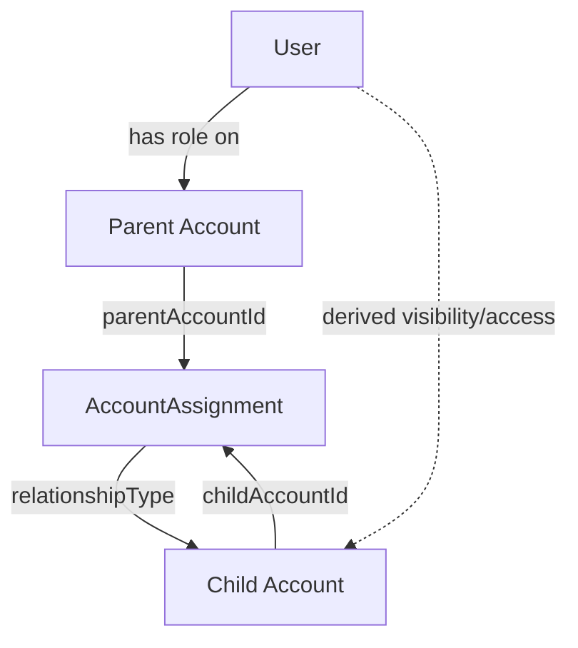

# Account-to-Account Assignment

Design for assigning **Accounts to Accounts** (parent/child and delegated relationships) in a flexible but secure way.

## 1. Goals

- **Model relationships** between accounts (ownership, delegation, visibility-only).
- **Derive visibility and access** for users across accounts based on these relationships.
- Keep the model **simple** (adjacency list), enforce **no cycles**, and align with **RLS/Zenstack**.

## 2. Data Model

### 2.1 Entities

- **Account**
  - Existing core entity (tenant / workspace / customer org).

- **AccountAssignment** (new)
  - Links one account to another.
  - Fields (conceptual):
    - `id`
    - `parentAccountId` → `Account.id`
    - `childAccountId` → `Account.id`
    - `relationshipType` (enum): `OWNERSHIP`, `DELEGATION`, `VISIBILITY_ONLY`
    - `status`: `ACTIVE`, `SUSPENDED`
    - `validFrom` / `validTo` (optional, for time-bounded links)
    - `createdBy`, `createdAt`, `updatedAt`
  - Constraints:
    - `UNIQUE(parentAccountId, childAccountId, relationshipType)`
    - `parentAccountId != childAccountId`
    - No cycles (enforced at application level when creating/updating).

- **AccountRoleBinding** (existing / implicit)
  - Binds a **user** to an **account** with a role.
  - Fields (conceptual): `userId`, `accountId`, `role` (`OWNER`, `ADMIN`, `EDITOR`, `VIEWER`, ...).

### 2.2 Visual overview

The `AccountAssignment` table is an **adjacency list** between accounts. Effective permissions for a user on a child account are computed from:

- Direct roles on that child (`AccountRoleBinding`), and
- Roles on ancestor accounts + `AccountAssignment.relationshipType`.

## 3. Relationship Semantics

We support three relationship types (extendable later):

| relationshipType   | Semantics                                                                                 |
| ------------------ | ----------------------------------------------------------------------------------------- |
| `OWNERSHIP`        | Parent fully manages child; parent admins can act as admins on the child.                |
| `DELEGATION`       | Parent can manage *some* aspects of child (e.g. devices, integrations) but not billing.  |
| `VISIBILITY_ONLY`  | Parent can see the child account and its resources, but cannot mutate them.              |

Propagation rules (high-level):

- Start from a user’s **direct roles** on accounts.
- Walk `AccountAssignment` edges from **parent → child** while `status = ACTIVE` and within `validFrom/validTo`.
- For each reachable child, compute **effective permissions** based on:
  - user’s role on the parent, and
  - `relationshipType`.

Example policy matrix:

| relationshipType  | Parent role      | On child: visibility | On child: access                              |
| ----------------- | ---------------- | -------------------- | --------------------------------------------- |
| `OWNERSHIP`       | `OWNER`/`ADMIN`  | Yes                  | Full admin/editor (except maybe global ops).  |
| `OWNERSHIP`       | `VIEWER`         | Yes                  | Read-only.                                    |
| `DELEGATION`      | `OWNER`/`ADMIN`  | Yes                  | Limited admin (no billing/user-management).   |
| `DELEGATION`      | `VIEWER`         | Yes                  | Read-only.                                    |
| `VISIBILITY_ONLY` | any              | Yes                  | No writes.                                    |

Direct roles on the **child** always take precedence (e.g. user is direct `OWNER` of child even if parent only has `VISIBILITY_ONLY`).

## 4. Security Rules

### 4.1 Visibility

A user can **see** an account if:

- They have a direct role on that account (AccountRoleBinding), **or**
- They have a role on a parent account, and there is an `AccountAssignment(parent → child)` where:
  - `status = ACTIVE`,
  - within `validFrom/validTo` (if set), and
  - `relationshipType` ∈ `{ OWNERSHIP, DELEGATION, VISIBILITY_ONLY }`.

This drives which accounts appear in:

- Account selectors (dropdowns).
- Admin lists.
- "Switch account" / masquerade‑style UIs.

### 4.2 Accessibility (mutating actions)

A user can **perform actions** on a child account if:

- They have a direct role on the child with sufficient permissions, **or**
- They have a role on a parent account and an active `AccountAssignment(parent → child)` whose `relationshipType` allows it:
  - `OWNERSHIP` → treat parent `OWNER`/`ADMIN` as admin/editor on child.
  - `DELEGATION` → allow a restricted command set (e.g. manage devices, integrations; no billing, no user invites).
  - `VISIBILITY_ONLY` → no write actions.

In code, this becomes a helper like: `getEffectiveAccountPermissions(userId, accountId)` that 
returns `{ canView: boolean, canManageBilling: boolean, canManageDevices: boolean, ... }`.

## 5. Controller / API Design (SvelteKit Actions)

Manage assignments primarily from the **parent account** context in the Admin UI.

### 5.1 Operations

- **List assignments for a parent account**
  - Input: `parentAccountId`.
  - Behavior: return:
    - Outgoing links: children with `relationshipType`, `status`, validity.
    - Optionally incoming links (other parents that point to this account) for debugging.

- **Create assignment**
  - Input: `parentAccountId`, `childAccountId`, `relationshipType`, optional `validFrom`/`validTo`.
  - Checks:
    - Caller has `ADMIN`/`OWNER` role on `parentAccountId`.
    - `parentAccountId != childAccountId`.
    - No existing identical ACTIVE assignment.
    - Creating this edge does **not** introduce a cycle.
  - Behavior: insert `AccountAssignment` with `status = ACTIVE`.

- **Update assignment**
  - Input: `id`, updatable fields (`relationshipType`, `status`, dates).
  - Checks similar to create (plus: only parent admins can change).

- **Soft delete assignment**
  - Prefer setting `status = SUSPENDED` over hard delete.
  - Used when relationships end but you want to keep audit history.

These should be implemented as **SvelteKit Actions** guarded by `restrict`, and use Zenstack‑backed services to enforce RLS.

## 6. UI / UX Flows

### 6.1 Admin: Account detail page

On the Admin account detail page (for a given parent account):

- **Section: "Linked accounts"**
  - Table of child accounts with columns:
    - Child account name / ID.
    - `relationshipType` (badge: Ownership / Delegation / Visibility).
    - `status` (Active / Suspended).
    - `validFrom` / `validTo` (if set).
    - Actions: `Edit`, `Suspend`, `Remove`.
  - "Add linked account" button opens a dialog:
    - Select child account (searchable dropdown restricted by RLS).
    - Select `relationshipType`.
    - Optional validity dates.

- **Section: "Parents"** (read-only)
  - Lists other accounts that point to this one as a child (to debug visibility/chains).

### 6.2 UX Guardrails

- Show clear badges/icons for **what the parent can do** on each child:
  - e.g. "Can manage devices", "Can manage billing", "View only".
- Prevent destructive actions in the UI when effective permissions do not allow them (buttons disabled with tooltip).
- Surface audit info (who created the assignment, when) in a details drawer.

This spec should be sufficient for an engineer to:

- Add/adjust Prisma + Zenstack models for `AccountAssignment`.
- Implement SvelteKit Actions for listing/creating/updating assignments.
- Build the Admin UI sections for managing linked accounts, using existing layout patterns.