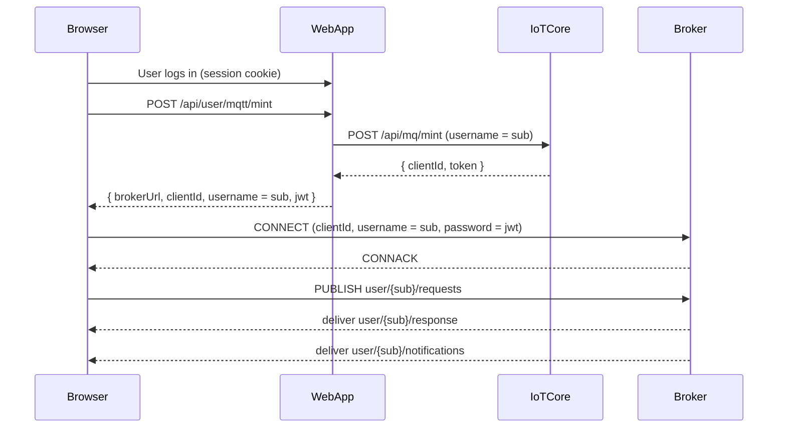

# User MQTT – Browser Client Design

## Goals

- Provide a single, consistent way for the browser to use MQTT for realtime updates.
- Keep the MQTT connection lifecycle tightly bound to the authenticated user session.
- Replace existing SSE/WebSocket usage incrementally, feature by feature.

## Topics and Subjects

- **Subject (`sub`)**: `user:{userId}:{accountId}`
- **User topics**:
  - `user/{sub}/requests` – user RPC requests (e.g. `user.claim.device`).
  - `user/{sub}/response` – RPC results correlated by `requestId`.
  - `user/{sub}/notifications` – async events (e.g. `claim.confirmed`, device status).

These topics must match the ACLs enforced by IoT Core and the broker.

## Design Decisions

### 1. Auth-gated connection

- The browser MQTT client **must only connect when the user is logged in**.
- Connection attempts are skipped when:
  - No valid auth session cookie is present.
  - The current route is under `/auth/*`.
- Internally, the client maintains an `allowConnections` flag. All `connect()` and reconnect logic checks this before doing any work.

### 2. Single shared client per browser session

- Use a single shared `userMqttClient` / `userMqttStore` instance in the browser.
- Features subscribe/unsubscribe to events on top of this client.
- Do **not** open multiple parallel MQTT connections per tab – this keeps resource usage, logs, and debugging manageable.

### 3. Mint on demand via REST

- The browser never talks directly to IoT Core.
- When a feature needs MQTT:
  - Call `connect()` on the shared client.
  - `connect()` performs `POST /api/user/mqtt/mint` using the current session.
  - The mint endpoint returns:
    - `brokerUrl`
    - `clientId`
    - `username = sub`
    - `jwt` (used as MQTT password)
- The client **caches** the mint result and reuses it until it expires or an auth-related error is detected.

### 4. Exponential backoff reconnection

- If the connection drops **while the user is still logged in**:
  - Schedule reconnect attempts with exponential backoff:
    - Base interval (e.g. 1s), doubling each time up to a max (e.g. 30s).
    - Add small random jitter to avoid thundering herd.
  - On network errors, reuse the last mint if still valid.
  - On auth/token errors (e.g. JWT expired), call `/api/user/mqtt/mint` again to obtain fresh credentials before reconnecting.
- If `allowConnections` is `false` (e.g. after logout), **no reconnect attempts are scheduled**.

### 5. Explicit teardown on logout

- The logout flow must explicitly tear down MQTT:
  - Flip `allowConnections = false`.
  - Close the MQTT connection cleanly.
  - Cancel all timers and reconnection attempts.
  - Clear pending request promises and subscriptions.
- After logout, any calls to `connect()` become no-ops until a new login occurs and `allowConnections` is re-enabled.

### 6. Request/response RPC pattern

- RPC-style calls use the **requests/response** topics:
  - Client publishes JSON messages to `user/{sub}/requests`:
    - `{ op, params, requestId, timestamp }`.
  - Client listens on `user/{sub}/response`.
  - Responses carry the same `requestId` so the client can resolve the right promise.
- The client maintains a `pendingRequests` map:
  - `requestId -> { resolve, reject, timeout }`.
  - Each request has a timeout; on expiry, the promise is rejected and the entry removed.

### 7. Notifications

- Async events (not tied to a specific request) are delivered on `user/{sub}/notifications`.
- The client exposes subscription helpers so features can register callbacks for specific event types (e.g. claim state changes, device connection updates).

### 8. Migration from SSE/WebSocket

- MQTT does **not** replace SSE/WebSocket in one step.
- Migration strategy:
  - Implement the shared browser MQTT client.
  - Port a small, well-scoped feature (e.g. a single device detail or bundle status stream) from SSE/WebSocket to MQTT.
  - Keep SSE/WebSocket as a fallback during early rollout.
  - Gradually move remaining realtime features once stability is validated.

## Sequence: REST mint then MQTT connect

The high-level flow for a logged-in browser user is:

