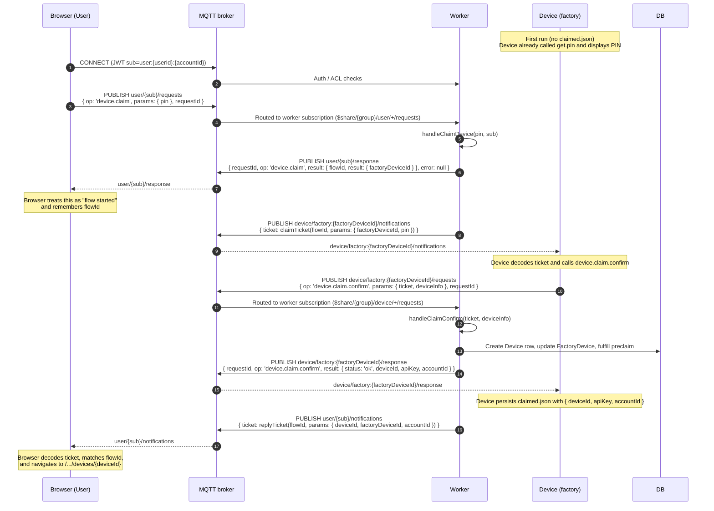

# User-side MQTT Device Claim Flow

This document describes how the **web client** participates in the MQTT-based
PIN claim flow. It is the user-facing counterpart to the factory/device claim
flow documented under `docs/architecture/device/mqtt/DEVICE_CLAIM.md`.

The key goals:

- **Single transport:** the browser uses MQTT, not SSE/WebSocket, for
  PIN-based claim.
- **Two-step claim:**
  - `device.claim` RPC from browser → kicks off claim flow.
  - `device.claim.confirm` from factory device → worker provisions Device and
    replies to user as a notification.
- **Flow ID correlation:** the browser treats the `device.claim` RPC as
  "flow started" and the **claim-confirm notification** (matched by `flowId`)
  as the source of truth for success and for the new `deviceId`.

## Topics and operations

User-side topics (for a given MQTT subject `sub = user:{userId}:{accountId}`):

- **RPC request:** `user/{sub}/requests`
- **RPC response:** `user/{sub}/response`
- **Notifications:** `user/{sub}/notifications`

Key operations:

- `device.claim` – user starts a claim given a PIN
  - Request: published by browser on `user/{sub}/requests` as a JSON RPC
    payload `{ requestId, op: 'device.claim', params: { pin } }`.
  - Response: worker replies on `user/{sub}/response` with
    `{ requestId, op: 'device.claim', result: { flowId, result: { factoryDeviceId } } }`.
- `device.claim.confirm` – factory device confirms ticket
  - Request: published by factory device on
    `device/factory:{factoryDeviceId}/requests` as a separate RPC.
  - Response to user: worker sends a **notification ticket** on
    `user/{sub}/notifications` that contains the **final `deviceId`**.

## End-to-end user claim sequence (browser perspective)



## Browser implementation details

### Connection and auth gating

- The browser uses `mqttStore` (`src/lib/stores/mqtt-store.ts`) to manage the
  MQTT connection.
- `AuthStateHandler.svelte` now only manages `mqttStore` based on auth state:
  - On login / initial mount with user → enable and connect.
  - On logout / auth routes / unauthenticated → disable and disconnect.

### RPC helper: `callUserRpc`

File: `src/lib/client/mqtt/userRpc.ts`

- Encapsulates the JSON RPC pattern on `user/{sub}/requests` and `/response`.
- Ensures the MQTT connection is open, then:
  - Generates `requestId`.
  - Publishes `{ requestId, op, params }` to `user/{sub}/requests`.
  - Subscribes to `user/{sub}/response` via `mqttStore.on(...)` and resolves the
    promise when it sees a matching `requestId`.

Usage for claims (simplified):

```ts
const response = await callUserRpc<{
  flowId?: string;
  result: { factoryDeviceId: string };
}>('device.claim', { pin }, { timeoutMs: 5000 });

const flowId = response.flowId; // used for correlation, not success
```

### Claim confirmation helper: `waitForClaimConfirmation`

File: `src/lib/client/mqtt/claimFlow.ts`

- Subscribes to `user/{sub}/notifications` using `mqttStore.on(...)`.
- For each message, expects a `{ ticket }` JWT payload created by
  `sendNotificationWithTicket` on the worker.
- Decodes the JWT **client-side** (base64 only, no secret required) and reads:

  ```ts
  const claims = {
    type,        // e.g. "reply:claim"
    flowId,      // from original claim flow
    params: {
      deviceId,
      factoryDeviceId,
      accountId
    }
  };
  ```

- Ignores any notification where:
  - `claims.flowId` is missing or does not match the expected `flowId`, or
  - `claims.type` does not start with `reply:`, or
  - `params.deviceId` is missing.
- On a matching notification, resolves with:

  ```ts
  { deviceId, factoryDeviceId, accountId }
  ```

- If no matching notification arrives before `timeoutMs` (default ~15–20s), it
  rejects with a timeout error.

### UI wiring (user + admin claim pages)

User page: `src/routes/user/iot/devices/new/+page.svelte`

- On "Claim Device" click:

  ```ts
  deviceStore.setClaimStatus('claiming');

  const response = await callUserRpc<{
    flowId?: string;
    result: { factoryDeviceId: string };
  }>('device.claim', { pin: $form.pin }, { timeoutMs: 5000 });

  const flowId = response?.flowId;
  if (!flowId) throw new Error('Missing flowId in claim response');

  toast.success('Device claim initiated, waiting for confirmation...');

  const confirmation = await waitForClaimConfirmation(flowId, { timeoutMs: 20000 });

  deviceStore.setClaimStatus('claimed');
  toast.success('Device claimed successfully!');
  goto(`/user/iot/devices/${confirmation.deviceId}`);
  ```

Admin page: `src/routes/admin/iot/devices/new/+page.svelte`

- Same pattern, but redirects to the admin device detail route:

  ```ts
  const confirmation = await waitForClaimConfirmation(flowId, { timeoutMs: 20000 });
  goto(`/admin/iot/devices/${confirmation.deviceId}`);
  ```

### Why `flowId` is the source of truth

- The `device.claim` RPC response only indicates that the **flow has been
  started** (PIN validated, claim ticket sent to factory device). It does **not
  guarantee** that:
  - The factory device is online.
  - `device.claim.confirm` has been called.
  - The `Device` row has been created.
- The claim-confirm notification is sent **only after** `handleClaimConfirm`
  successfully:
  - Creates the `Device` row and API key.
  - Updates the `FactoryDevice` (and preclaim rows, if applicable).
- Therefore, the browser uses:
  - RPC `device.claim` response → `flowId` + basic acknowledgement.
  - Notification `reply:claim` with matching `flowId` → actual success and
    the authoritative `deviceId`.

This separation keeps the browser logic simple, avoids polling, and cleanly
handles the asynchronous nature of the factory device’s `device.claim.confirm`
step.
