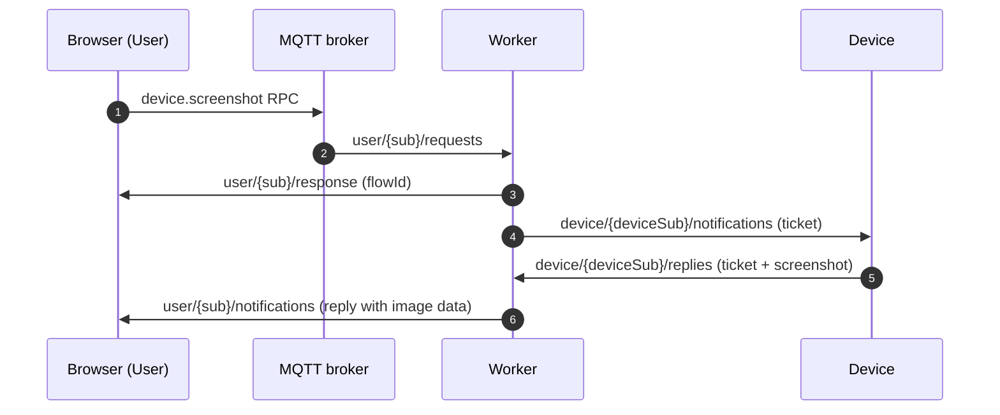

# How screenshot is implemented from browser to device and back using flowId

High-level flow:

- Browser UI sends a `device.screenshot` RPC over MQTT on `user/{sub}/requests`.
- Worker replies with `{ flowId }` on `user/{sub}/response` and sends a screenshot
  ticket to the device on `device/{deviceSub}/notifications`.
- Device captures a screenshot and replies on `device/{deviceSub}/replies` with
  `{ ticket, result: { data, format, width, height, ... } }`.
- Worker relays a reply-style ticket to the browser on `user/{sub}/notifications`
  with the same `flowId`; the UI decodes the ticket, matches `flowId`, and
  renders the base64 image.

Sequence (overview):

1. **Browser → Broker**: publish `device.screenshot` RPC on `user/{sub}/requests`.
2. **Broker → Worker**: route to `$share/{group}/user/+/requests`.
3. **Worker → Browser**: reply on `user/{sub}/response` with `result.flowId`.
4. **Worker → Device**: send screenshot ticket on `device/{deviceSub}/notifications`.
5. **Device → Worker**: reply on `device/{deviceSub}/replies` with ticket + screenshot data.
6. **Worker → Browser**: relay reply ticket on `user/{sub}/notifications` with image data.

