# GKE POC Cluster - Development Environment

> **Last Updated**: January 2026

## Quick Reference

| Property | Value |
|----------|-------|
| **Cluster Name** | `dr-iot-dev` |
| **Project ID** | `cs-poc-vlkpvg5seziflnwq2ni7x3l` |
| **Region/Zone** | `us-central1-a` (Zonal) |
| **Kubernetes Context** | `gke_cs-poc-vlkpvg5seziflnwq2ni7x3l_us-central1-a_dr-iot-dev` |
| **Node Pool** | `dr-iot-dev-node-pool` (2 × e2-medium, 20GB disk) |
| **Kubernetes Version** | v1.33.5-gke.1162000 |
| **Primary Namespace** | `fs04` |

---

## Cluster Architecture

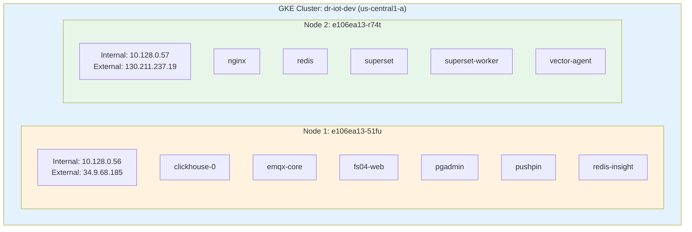

---

## Network Architecture

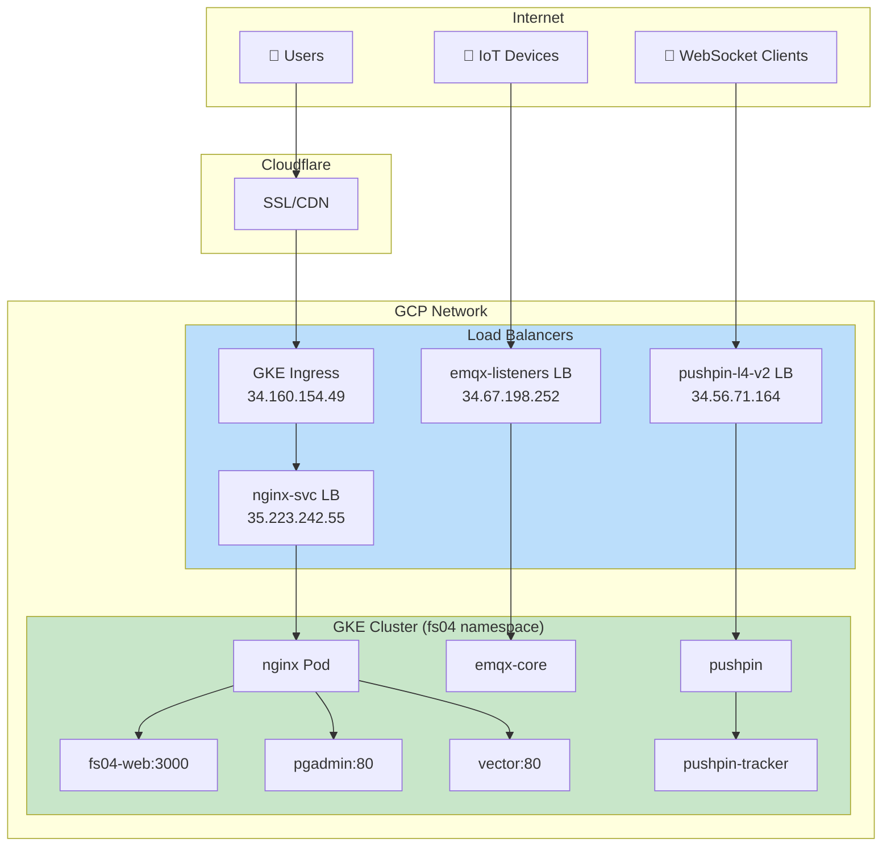

---

## DNS & Traffic Flow

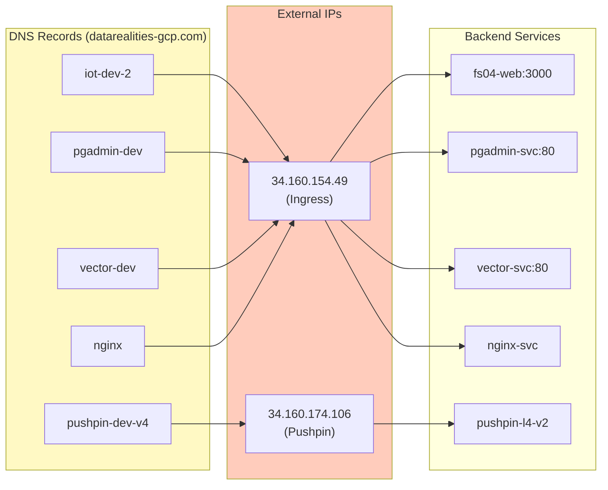

---

## Service Dependencies

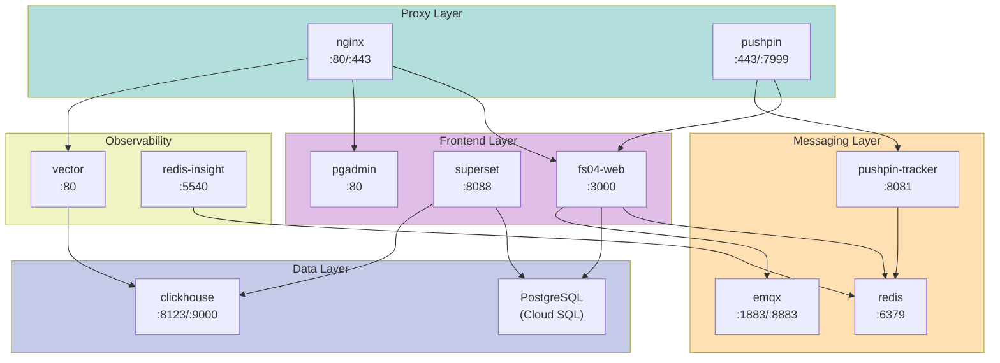

---

## External IPs & LoadBalancers

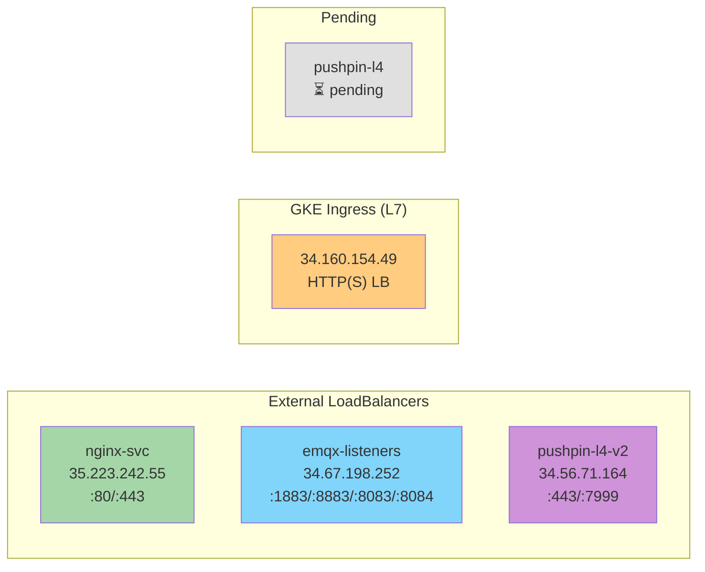

---

## Namespace Organization

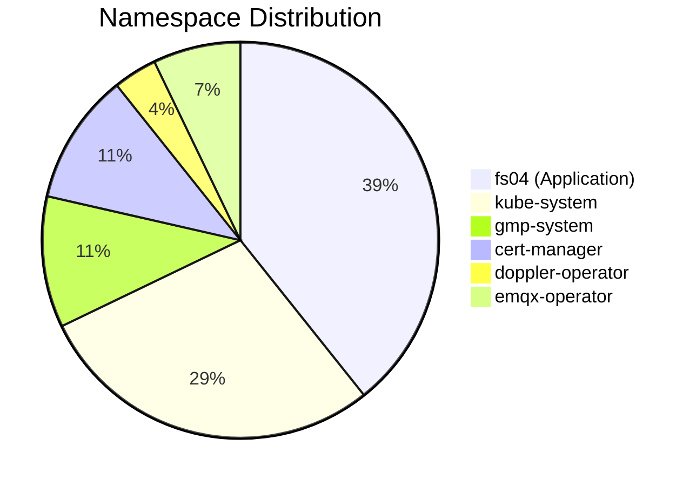

---

## Pod Status (fs04 Namespace)

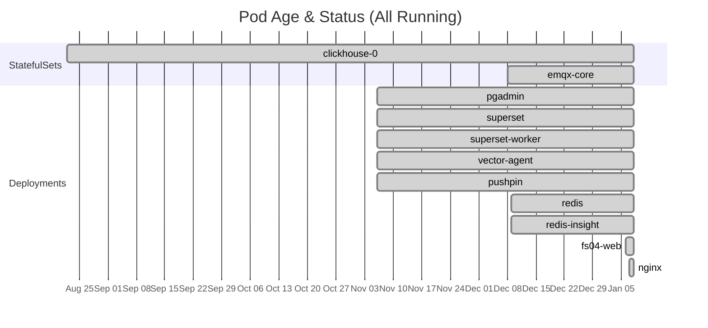

---

## Services Overview

| Service | Type | Cluster IP | Ports | Target |
|---------|------|------------|-------|--------|
| `fs04-web` | ClusterIP | 34.118.229.151 | 3000 | Main app |
| `nginx-svc` | **LoadBalancer** | 34.118.232.96 | 80, 443 | Reverse proxy |
| `emqx-listeners` | **LoadBalancer** | 34.118.239.4 | 1883, 8883, 8083, 8084 | MQTT |
| `pushpin-l4-v2` | **LoadBalancer** | 34.118.238.214 | 443, 7999 | WebSocket |
| `clickhouse` | ClusterIP | 34.118.236.12 | 8123, 9000, 9009 | Analytics DB |
| `redis` | ClusterIP | 34.118.226.207 | 6379 | Cache |
| `superset` | ClusterIP | 34.118.234.247 | 8088 | BI Dashboard |
| `pushpin` | ClusterIP | 34.118.229.237 | 443, 5561, 5662, 7999 | GRIP proxy |

---

## Storage (PVCs)

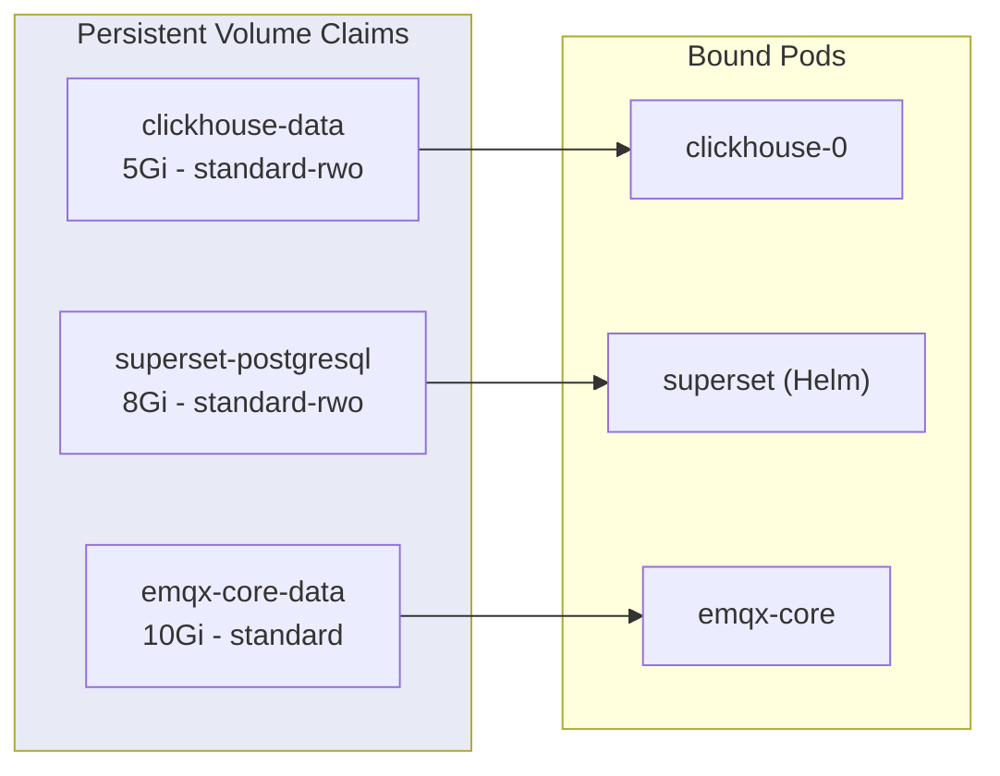

---

## Secrets & ConfigMaps

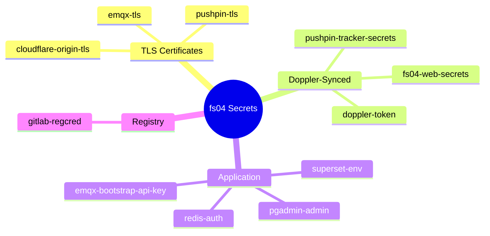

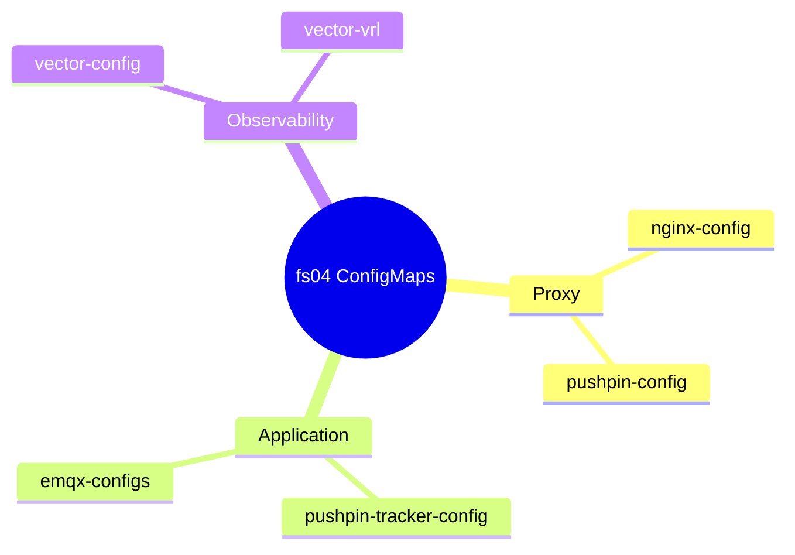

---

## MQTT Architecture (EMQX)

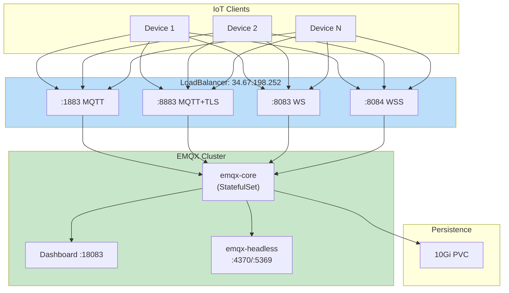

---

## WebSocket/SSE Flow (Pushpin)

```mermaid
sequenceDiagram
    participant Browser
    participant Cloudflare
    participant Pushpin LB as pushpin-l4-v2<br/>34.56.71.164
    participant Pushpin as pushpin Pod
    participant Tracker as pushpin-tracker
    participant Redis
    participant App as fs04-web
    
    Browser->>Cloudflare: WSS Connect
    Cloudflare->>Pushpin LB: Forward :443
    Pushpin LB->>Pushpin: Route
    Pushpin->>Tracker: Subscribe
    Tracker->>Redis: Track Connection
    
    Note over Pushpin,App: GRIP Protocol
    
    App->>Tracker: Publish Event
    Tracker->>Pushpin: Push via GRIP
    Pushpin->>Browser: SSE/WS Message
```

---

## Terraform Resources

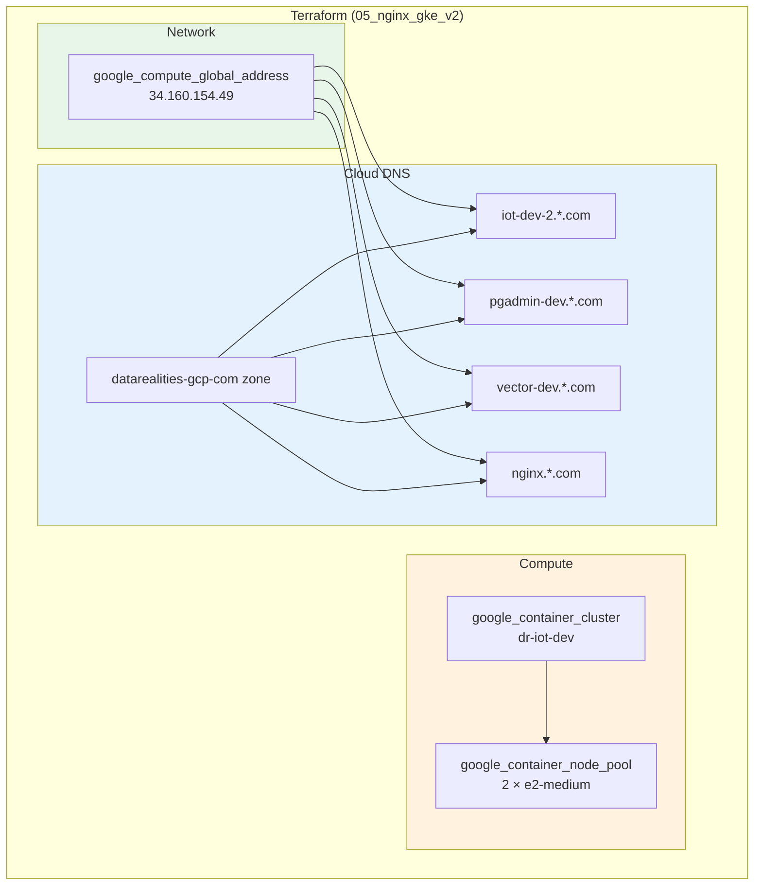

---

## Connecting to the Cluster

### Quick Switch to POC Context

```bash
# Switch to POC GKE context
kubectl config use-context gke_cs-poc-vlkpvg5seziflnwq2ni7x3l_us-central1-a_dr-iot-dev
```

### Available Contexts

| Context Name | Cluster | Environment |
|--------------|---------|-------------|
| `gke_cs-poc-vlkpvg5seziflnwq2ni7x3l_us-central1-a_dr-iot-dev` | dr-iot-dev | **POC (GCP)** |
| `gke_dr-iot-prd_us-central1-a_iot-prd-gke` | iot-prd-gke | Production (GCP) |
| `arn:aws:eks:us-west-2:781895395657:cluster/inreality-dev-eks` | inreality-dev-eks | Dev (AWS) |
| `arn:aws:eks:us-west-2:781895395657:cluster/inreality-sandbox-eks` | inreality-sandbox-eks | Sandbox (AWS) |
| `docker-desktop` | docker-desktop | Local |

### First-Time Setup

```bash
# Get credentials for POC cluster (run once)
gcloud container clusters get-credentials dr-iot-dev \
  --zone us-central1-a \
  --project cs-poc-vlkpvg5seziflnwq2ni7x3l

# Verify current context
kubectl config current-context

# List all available contexts
kubectl config get-contexts
```

---

## Common Commands

```bash
# View all pods
kubectl get pods -n fs04 -o wide

# Check resource usage
kubectl top pods -n fs04 --use-protocol-buffers

# View deployment logs
kubectl logs -n fs04 deployment/fs04-web -f

# Restart a deployment
kubectl rollout restart -n fs04 deployment/fs04-web

# Check ingress status
kubectl get ingress -n fs04

# Apply manifests
kubectl apply -f app/10_fs04_web/

# Check Doppler secret sync
kubectl get dopplersecrets -n doppler-operator-system
```

---

## Cost Optimization

| Strategy | Savings |
|----------|---------|
| Zonal cluster (vs regional) | ~66% control plane |
| 2× e2-medium (vs larger) | Variable |
| Shared nginx LoadBalancer | ~$36/month |
| Standard GKE (vs Autopilot) | Better for small workloads |

---

## Related Documentation

- [Terraform README](file:///Users/bernard/CascadeProjects/fs04/fs04_cloud/sandbox/gcp/05_nginx_gke_v2/README.md)
- [EMQX Manifests](file:///Users/bernard/CascadeProjects/fs04/fs04_cloud/sandbox/gcp/05_nginx_gke_v2/app/02_emqx/)
- [Pushpin Config](file:///Users/bernard/CascadeProjects/fs04/fs04_cloud/sandbox/gcp/05_nginx_gke_v2/app/07_pushpin/)
