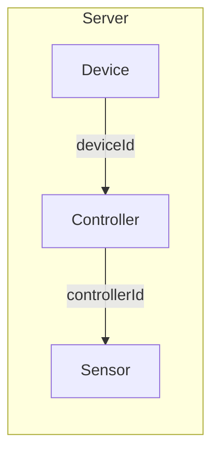
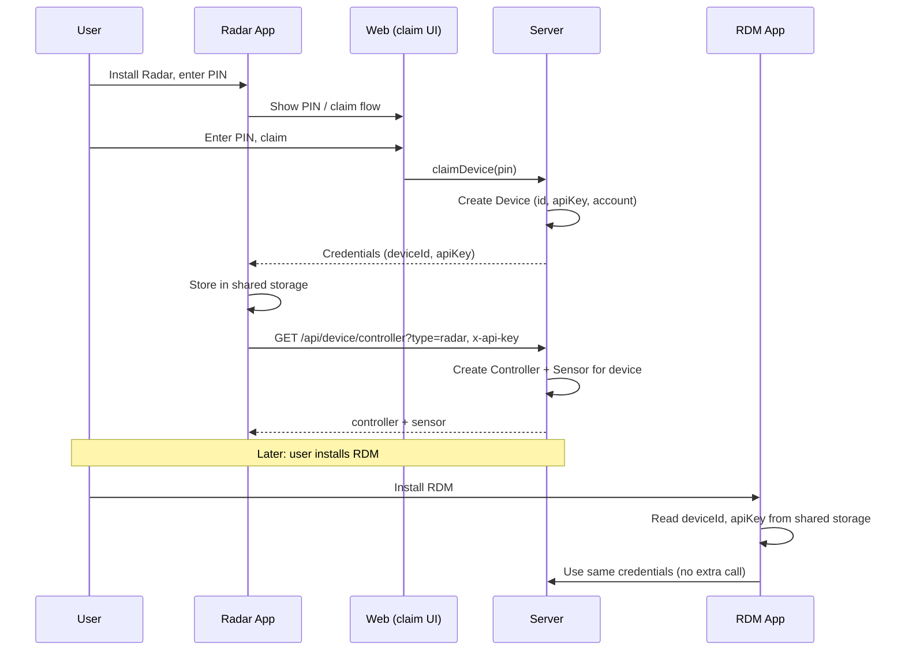
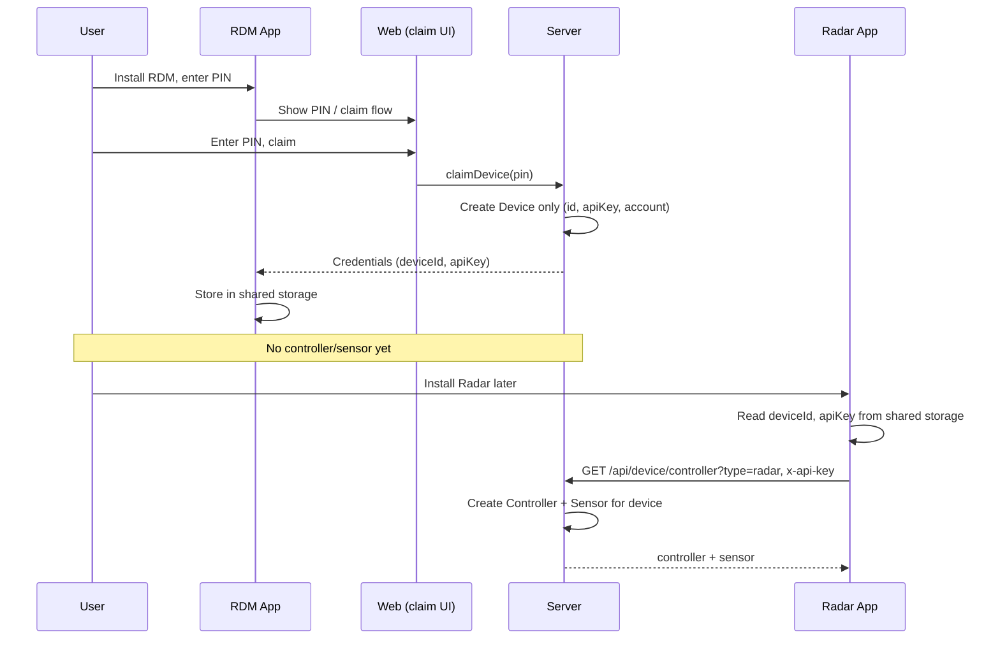
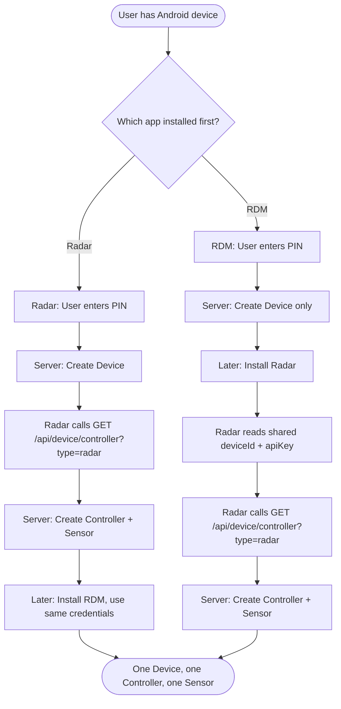

# RDM and Radar App on Same Android Device

Investigation: **Is it possible for RDM and Radar to share one device identity**, with either app claiming first, and for the Radar app to get a sensor created when it was not the one that claimed?

---

## Summary

| Question | Answer |
|----------|--------|
| **Is the desired flow possible?** | **Yes.** The server already supports both installation orders. |
| **Are sensor and device linked?** | **Indirectly.** Sensor → Controller → Device. There is no direct Device–Sensor relation. |

---

## 1. How Device and Sensor Are Linked (Current Model)

**Sensor and device are not directly linked.** The chain is:

```
Device (1) ──────< Controller (N) ──────< Sensor (N)
     │                     │
     └── deviceId          └── controllerId
```



- **Device**: One record per physical device (created at **claim**). Has `id`, `apiKey`, `accountId`, `user`, etc. Has many `controllers`.
- **Controller**: Belongs to one **device** (`deviceId`) and one **account**. Has a `type` (e.g. `radar`, `camera`, `ble`). Has many `sensors`.
- **Sensor**: Belongs to one **controller** (`controllerId`) and one **account**. Has `type`, `config`, etc.

So: **Device ↔ Controller ↔ Sensor**. To have a “radar sensor” for a device, the device must have a **Controller** of type `radar`, and that controller has one or more **Sensors**.

---

## 2. Two Installation Orders

### Scenario A: Radar app installed first → claim

1. User installs **Radar app**, enters PIN, **claim** runs.
2. **Server:** One **Device** is created (or updated) with `apiKey` and `accountId`; credentials are sent to the device.
3. **Radar app** (or device client) calls:
   - `GET /api/device/controller?type=radar`
   - With header: `x-api-key: <device apiKey>`
4. **Server:** Device already exists (from step 2). No controller for this device + `type=radar` → **auto-creates** one **Controller** and one **Sensor** (only these two; **device is not created here**).
5. Later, user installs **RDM**. RDM uses the **same** `deviceId` and `apiKey` (see §4). It does **not** need a sensor; it only needs the device. **No extra server call is required** for RDM to “create” anything; the device already exists.

**Result:** One device, one radar controller, one radar sensor. RDM works with the same credentials.

**Process flow (Scenario A — Radar first):**



---

### Scenario B: RDM app installed first → claim

1. User installs **RDM**, enters PIN, **claim** runs.
2. **Server:** One **Device** is created (same as above). No controller or sensor is created at claim time.
3. Later, user installs **Radar**. Radar reads the **same** `deviceId` and `apiKey` from shared storage (see §4).
4. **Critical:** The **Radar app must call the server** when it starts (or when it needs controller config). It is not automatic. Radar app code must send:
   - `GET /api/device/controller?type=radar`
   - With header: `x-api-key: <device apiKey>`
5. **Server:** Receives that request. Device already exists (from step 2). No controller for this device + `type=radar` yet → **creates** Controller + Sensor in response to this request.

**Result:** Same end state: one device, one radar controller, one radar sensor. The sensor is created **because the Radar app made the API call**, not because the server “detected” Radar. If the Radar app never calls `GET /api/device/controller?type=radar`, no controller or sensor is created.

**Process flow (Scenario B — RDM first):**



**Summary flowchart (which path):**



---

## 3. Server APIs Involved

| API | When / Who | Effect |
|-----|------------|--------|
| **Claim (PIN)** | User enters PIN in web; backend runs `claimDevice()` | Creates/updates **Device**, generates `apiKey`, associates user/account. Does **not** create Controller or Sensor. **Only place where a Device is created.** |
| **POST /api/device/add** | Device client after “registered” | **Updates** existing device (e.g. system info, MAC, model). Does **not** create Controller or Sensor. |
| **GET /api/device/controller?type=radar** | Device client (Radar app) with `x-api-key` | Authenticates by `x-api-key` → **device must already exist**. **Does NOT create a device.** Only finds or creates **Controller** + **Sensor** for that existing device. |

**Important:** `GET /api/device/controller` does **not** create a device. It requires a valid `x-api-key` (looked up in the Device table). If the device does not exist, the request fails with 400 (no API key) or 401 (invalid key). Controller and Sensor are created only when the device already exists and has an account.

So:

- **Device** is created only at **claim** (when user enters PIN).
- **Controller + Sensor** are created only when the **Radar app (or any client) actually calls** the controller API with the device's `x-api-key`. The server does not detect "Radar was installed"—the Radar app must make that HTTP request.

No separate “create only a sensor” endpoint is required for the Radar-second case; the existing controller endpoint handles it.

---

## 4. What Must Be True on the Android Device

For both orders to work, **both apps must use the same device identity**:

- Same **device ID** (`id`)
- Same **API key** (`apiKey`)

So on the same Android device:

- **Either** both apps read credentials from a **shared storage** (e.g. a shared file or Android account / content provider that the first-installed app writes after claim, and the second reads).
- **Or** the second app gets credentials from the first app via some **inter-app** mechanism (e.g. Intent, shared file in a known location).

If RDM and Radar each maintained their own device ID and API key, you would get two different Device records and the “same device, two apps” behavior would not hold. So the **feasibility on the server is already there**; the critical part is **Android-side**: one place to store and share `deviceId` + `apiKey` between RDM and Radar.

---

## 5. Conclusion

- **Radar first:** Claim → device created. Radar app **calls** `GET /api/device/controller?type=radar` → server creates controller + sensor. RDM later reuses same credentials → works.
- **RDM first:** Claim → device created only. When user installs Radar, **Radar app must call** `GET /api/device/controller?type=radar` (with the shared apiKey) when it starts; then the server creates controller + sensor. Without that call, no sensor is created.

**Sensor and device are linked via Controller** (Device → Controller → Sensor). The server does **not** need changes. The **Radar app must call** the controller endpoint when it runs; that request is what triggers controller + sensor creation. It is not automatic—the app has to make the request.
