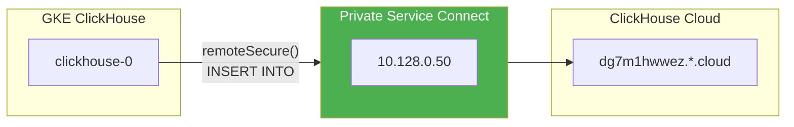
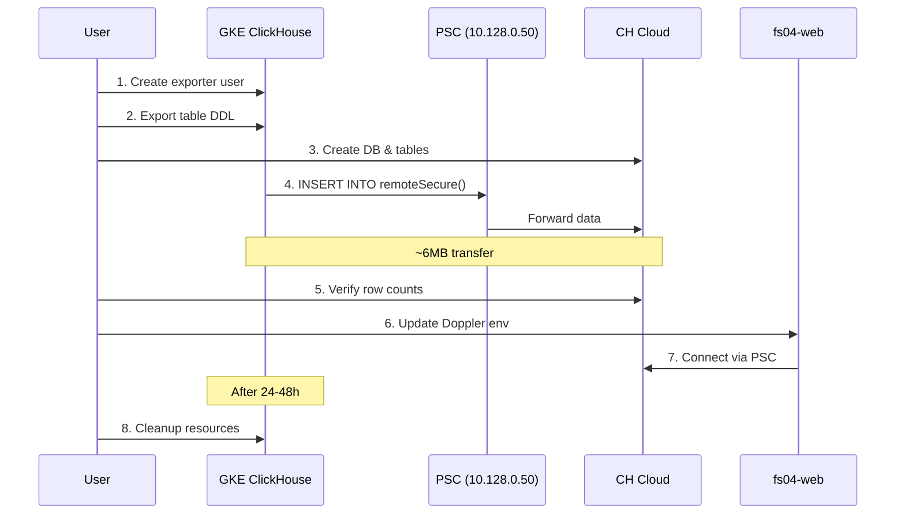

# ClickHouse Cloud Migration Guide

> **Last Updated**: January 2026  
> **Status**: Ready to Execute  
> **Source**: [Official ClickHouse Docs](https://clickhouse.com/docs/en/cloud/migration/clickhouse-to-cloud)

Migrate from self-managed ClickHouse (GKE pod) to ClickHouse Cloud using `remoteSecure()`.

---

## Quick Reference

| Property | Source (GKE) | Target (Cloud) |
|----------|--------------|----------------|
| **Host** | `clickhouse-0` pod | `dg7m1hwwez.us-central1.p.gcp.clickhouse.cloud` |
| **Port** | 8123 (HTTP), 9000 (Native) | 8443 (HTTPS), 9440 (Native TLS) |
| **Database** | `fs_04` | `fs_04` |
| **Data Size** | ~6 MB | ~6 MB |

---

## Migration Overview



---

## Step-by-Step Migration

### Step 1: Create Read-Only User on Source (GKE)

```bash
kubectl exec -n fs04 clickhouse-0 -- clickhouse-client --query "
CREATE USER IF NOT EXISTS exporter
IDENTIFIED WITH SHA256_PASSWORD BY 'export-password-123'
SETTINGS readonly = 1;

GRANT SELECT ON fs_04.* TO exporter;
"
```

### Step 2: Export Table Definitions

```bash
# Get all table DDL
kubectl exec -n fs04 clickhouse-0 -- clickhouse-client --query "
SELECT create_table_query
FROM system.tables
WHERE database = 'fs_04'
ORDER BY name
" > table_schemas.sql
```

### Step 3: Create Database & Tables on Cloud

Connect to ClickHouse Cloud and run:

```sql
-- Create database
CREATE DATABASE IF NOT EXISTS fs_04;

-- Create tables (from exported DDL)
-- IMPORTANT: Change ENGINE to ReplicatedMergeTree() without parameters
-- ClickHouse Cloud handles replication automatically

-- Example:
CREATE TABLE fs_04.logs_raw (
    c1 DateTime,
    c2 String,
    -- ... other columns
)
ENGINE = ReplicatedMergeTree()  -- No parameters needed!
ORDER BY (toDate(c1), c2, c4);
```

> [!TIP]
> ClickHouse Cloud automatically replicates tables. Remove any explicit `Replicated*` parameters and just use `ReplicatedMergeTree()`.

### Step 4: Pull Data Using remoteSecure()

**Option A: Run FROM ClickHouse Cloud** (Pull data)

```sql
-- Connect to ClickHouse Cloud, then run:
INSERT INTO fs_04.logs_raw 
SELECT * FROM remoteSecure(
    'source-gke-ip-or-hostname:9440',
    'fs_04.logs_raw',
    'exporter',
    'export-password-123'
);
```

**Option B: Run FROM GKE** (Push data via PSC) ✅ **Recommended**

```bash
kubectl exec -n fs04 clickhouse-0 -- clickhouse-client --query "
INSERT INTO FUNCTION remoteSecure(
    'dg7m1hwwez.us-central1.p.gcp.clickhouse.cloud:9440',
    'fs_04.logs_raw',
    'default',
    'YOUR_CLOUD_PASSWORD'
)
SELECT * FROM fs_04.logs_raw;
"
```

### Step 5: Repeat for All Tables

```bash
# Tables to migrate (base tables only, not MVs)
TABLES="logs_raw radar device device_apps device_information bundle_logs"

for table in $TABLES; do
    echo "Migrating $table..."
    kubectl exec -n fs04 clickhouse-0 -- clickhouse-client --query "
    INSERT INTO FUNCTION remoteSecure(
        'dg7m1hwwez.us-central1.p.gcp.clickhouse.cloud:9440',
        'fs_04.$table',
        'default',
        'YOUR_CLOUD_PASSWORD'
    )
    SELECT * FROM fs_04.$table;
    "
done
```

### Step 6: Verify Row Counts

```sql
-- Run on BOTH source and destination
SELECT 'logs_raw' as tbl, count() FROM fs_04.logs_raw
UNION ALL SELECT 'radar', count() FROM fs_04.radar
UNION ALL SELECT 'device_apps', count() FROM fs_04.device_apps
UNION ALL SELECT 'device_information', count() FROM fs_04.device_information
UNION ALL SELECT 'bundle_logs', count() FROM fs_04.bundle_logs
UNION ALL SELECT 'device', count() FROM fs_04.device
ORDER BY tbl;
```

### Step 7: Update Application Config

Update Doppler `fs04_iot/dev`:

| Variable | New Value |
|----------|-----------|
| `CLICKHOUSE_URL` | `https://dg7m1hwwez.us-central1.p.gcp.clickhouse.cloud:8443` |
| `CLICKHOUSE_USER_NAME` | `default` |
| `CLICKHOUSE_PASSWORD` | `<cloud_password>` |

```bash
kubectl rollout restart deployment/fs04-web -n fs04
```

### Step 8: Cleanup (After 24-48h)

```bash
# Remove exporter user from source
kubectl exec -n fs04 clickhouse-0 -- clickhouse-client --query "DROP USER exporter"

# Delete GKE resources (after verification)
kubectl delete statefulset clickhouse -n fs04
kubectl delete svc clickhouse -n fs04
kubectl delete pvc clickhouse-data-clickhouse-0 -n fs04
```

---

## Complete Migration Script

```bash
#!/bin/bash
# migrate_to_cloud.sh

CH_CLOUD_HOST="dg7m1hwwez.us-central1.p.gcp.clickhouse.cloud"
CH_CLOUD_USER="default"
CH_CLOUD_PASS="YOUR_PASSWORD"  # Set this!

TABLES="logs_raw radar device device_apps device_information bundle_logs"

echo "🚀 Starting migration to ClickHouse Cloud..."

for table in $TABLES; do
    echo "📦 Migrating fs_04.$table..."
    
    kubectl exec -n fs04 clickhouse-0 -- clickhouse-client --query "
    INSERT INTO FUNCTION remoteSecure(
        '${CH_CLOUD_HOST}:9440',
        'fs_04.$table',
        '${CH_CLOUD_USER}',
        '${CH_CLOUD_PASS}'
    )
    SELECT * FROM fs_04.$table;
    "
    
    echo "✅ $table migrated"
done

echo "🎉 Migration complete!"
```

---

## Sequence Diagram



---

## Troubleshooting

### Connection Timeout
Ensure PSC Connection ID is approved in ClickHouse Cloud console (Settings → Private Endpoints).

### SSL Certificate Error
Use port `9440` for native TLS, not `9000`.

### Permission Denied
Verify the Cloud user has INSERT privileges on the target tables.

---

## Related

- [PSC Terraform](file:///Users/bernard/CascadeProjects/fs04/fs04_cloud/sandbox/gcp/12_clickhouse_com/main.tf)
- [Official CH Migration Docs](https://clickhouse.com/docs/en/cloud/migration/clickhouse-to-cloud)
