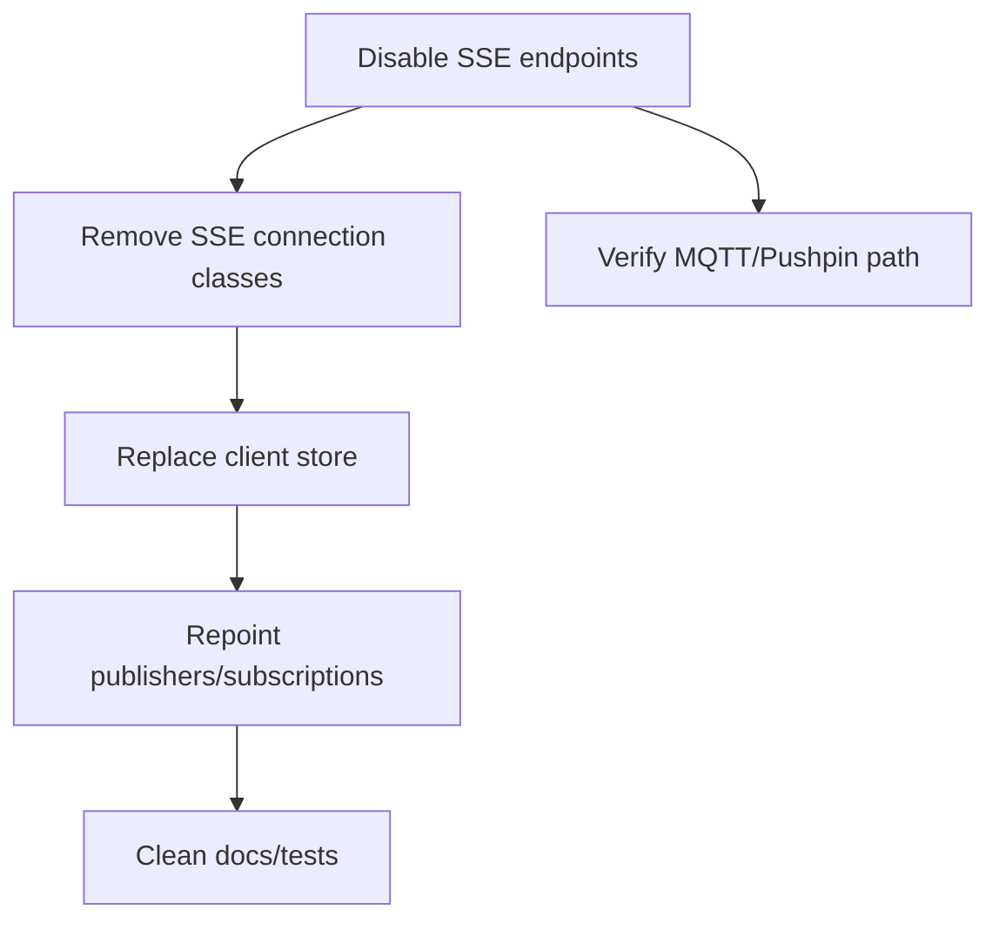

## Sunset plan for SSE

### What to remove
- Endpoints: `/api/sse/+server.ts`, `/api/device/listen/+server.ts`, `/api/device/register/+server.ts`, `/api/device/pushpin/register/+server.ts`, `/api/device/pushpin/listen/+server.ts` (SSE/pushpin streams).
- Server connection: `SSEConnection` @/src/lib/server/messaging/connections/sse_connection.ts and its registration in `ConnectionManager`.
- Client store: `sse-store.ts` @/src/lib/stores/sse-store.ts and any imports/usages.
- Routing: Any SSE-specific subscription wiring in `subscriptionRegistry` and `ConnectionManager.send/sendToUser` calls targeting SSE connections.

### Replacement checklist (MQTT)
- Use `mqttStore` for browser clients (connect/publish/on) @/src/lib/stores/mqtt-store.ts.
- Use MQTT worker/transport for server publish/consume @/src/lib/server/mqtt/**.
- Device topics: `subscription/device/{deviceId}` for commands, `device:{id}` pushpin-equivalent channels.
- User topics: `user/{sub}/requests|response|notifications` for RPC/notifications.
- Payload shape: keep `{ type, scope, payload, requestId }` semantics.
- Claim/registration: reuse MQTT claim flows (`waitForClaimConfirmation`) and device registration messaging; drop SSE registration streams.
- Heartbeat: rely on MQTT keepalive or publish heartbeat topic instead of SSE ping.

### SSE message handling (current)

| Location | Incoming | Sends/replies |
| --- | --- | --- |
| `SSEConnection.sendStandardized` @/src/lib/server/messaging/connections/sse_connection.ts | n/a (server push) | Enqueues `channel_message` envelope `{ channel: device:<id>, payload: BaseResponse }`, pings as system response `event: 'ping'` |
| `SSEConnection.send` | n/a (server push) | Legacy `data: { ...payload, timestamp }` (skips device status/data echoes to same device) |
| `SSEConnection.handleMessage` | Logs inbound client data, marks alive | No structured reply |
| `ConnectionManager.sendTo/sendToUser` | Routes payloads to SSEConnection.send | Emits SSE data event |
| `/api/sse/+server.ts` (user-facing) | Receives SSE requests; dispatches incoming `type/scope/payload` via `MessageDispatcher` | Sends initial connected + downstream publishes via ConnectionManager |
| `/api/device/listen/+server.ts` | Device authenticated listen; auto-subscribes `subscription:device:{id}` | Sends `connected`, publishes device connection events, relays published messages |
| `/api/device/register/+server.ts` | Factory JWT + PIN; registers device | Sends `registered`, waits for claim via publishes |
| `/api/device/pushpin/register/+server.ts` | Factory JWT + PIN via pushpin-style SSE | Sends `registered`, claims, emits registration info |
| `/api/device/pushpin/listen/+server.ts` | Device listen over pushpin/Redis fanout | Sends `connected`, heartbeats, forwards Redis channel messages, publishes connect/disconnect |

### Function-level replacement guide (SSE → MQTT)

| SSE location/function | Purpose | MQTT replacement |
| --- | --- | --- |
| `SSEConnection` send/ping/cleanup | Encapsulates SSE stream, pings, cleanup | Remove; use MQTT transport publish (worker) + client mqttStore subscription for keepalive/msgs |
| `/api/sse/+server.ts` handlers | User SSE channel, dispatches to MessageDispatcher | Remove; rely on MQTT (user topics) or pushpin MQTT bridge if needed |
| `/api/device/listen/+server.ts` | Device listen SSE with auth, auto-subscribe | Replace with MQTT device listener on `subscription/device/{deviceId}`; device connects via MQTT broker |
| `/api/device/register/+server.ts` & `pushpin/register` | Registration/claim over SSE | Use MQTT claim flow; send registration/claim info via device/user topics |
| `/api/device/pushpin/listen/+server.ts` | Pushpin SSE/Redis fanout | Replace with MQTT direct fanout (broker subscriptions) |
| `sse-store` connect/on/sendRequest | Browser SSE client | Remove; use `mqttStore` + `callUserRpc` |

### Migration steps
1) Delete SSE endpoints and `SSEConnection`; remove registrations in `ConnectionManager`.
2) Remove `sse-store` usage from UI; swap to `mqttStore`/`callUserRpc` topic-based listeners.
3) Convert device listen/register flows to MQTT topics (`subscription/device/{deviceId}`) and claim replies to `user/{sub}/notifications`.
4) Move server-side publishes to MQTT (`mqtt-messaging` transport) instead of SSE enqueue.
5) Drop SSE heartbeat; rely on MQTT keepalive or publish heartbeat topic if needed.

### SSE RPC & reply matrix

| Flow | Client request (type / scope / payload.action) | Server handler(s) | Reply / events (labels) |
| --- | --- | --- | --- |
| **WhatsApp QR request** | `type: 'whatsapp'`, `scope: 'user:self'`, `payload.action: 'request_qr'` (sent via `sseStore.sendRequest`) | `whatsappHandler.handle` → `handleQRRequest` | Immediate RPC reply: `type: 'whatsapp'`, `payload.action: 'qrCode'`, `payload.content: { qrCode: null, clientId }`, preserves `requestId`. Later events via subscription: SSE events `whatsapp:qrCode`, `whatsapp:connected`, `whatsapp:authenticated`, `whatsapp:disconnected` handled by `onSSEEvent(...)` and `whatsAppSSEStore` / form code. |
| **WhatsApp cleanup (unsubscribe connection)** | `type: 'whatsapp'`, `scope: 'user:self'`, `payload.action: 'cleanup'`, `payload.content.clientId` | `whatsappHandler.handle` → `handleCleanup` | Removes subscription `subscription:whatsapp:{clientId}` / `subscriber:connection:{connectionId}`. RPC reply: `type: 'whatsapp'`, `payload.action: 'cleanup_complete'`, preserves `requestId`. |
| **WhatsApp cleanup_client (delete unused client)** | `type: 'whatsapp'`, `scope: 'user:self'`, `payload.action: 'cleanup_client'`, `payload.clientId` | `whatsappHandler.handleCleanupClient` | Cleans up WhatsApp client in `whatsAppAccountManager`. RPC reply via `MessageFactory.createResponse`: `type: 'whatsapp'`, payload `{ success: true }` or `{ success: false, error, details }`, preserves `requestId`. |
| **WhatsApp generic message** | `type: 'whatsapp'`, `scope: 'user:self'`, `payload.action: 'message'`, `payload.content` | `whatsappHandler.handleMessage` | Echo-style RPC reply: `type: 'whatsapp'`, `payload.action: 'message_response'`, `payload.content: 'Echo: ...'`, preserves `requestId`. On error: `payload.action: 'error'`. |
| **Device getLogs (admin → device)** | `type: 'device'`, `scope: 'subscription:device:{deviceId}'`, `payload.action: 'getLogs'`, `payload.deviceId`, `payload.format: 'zip'` | `deviceHandler.handle` → `handleGetLogs` (request to device) | Device reply over same SSE channel: `type: 'device'`, `payload.action: 'getLogs'` with `payload.logsData` / `logs` / `logId` / `chunkData`. `deviceHandler` detects response shape and routes to `handleGetLogsResponse`, which ultimately returns `responsePayload.logsData` to `/api/admin/iot/devices/[id]/logs`. |
| **Device claim / register / status / progressUpdate / message** | `type: 'device'`, `scope: 'subscription:device:{deviceId}'`, `payload.action ∈ { 'claim','register','status','progressUpdate','message' }` | `deviceHandler.handle` → specific helpers (`handleClaim`, `handleRegistration`, `handleStatusUpdate`, `handleProgressUpdate`, `handleDeviceMessage`) | Replies are handler-specific, always preserving `requestId` when using `MessageFactory` helpers. `getLogs` is the main RPC with explicit request/response correlation; other actions typically emit notifications to user/device scopes. |
| **Admin SSE debug message** | `type: 'message'`, `scope: 'connection:{connectionId}'`, `payload.content` | `messageHandler.handle` via `MessageDispatcher` | No strict RPC contract; messages may echo back or be used for diagnostics. Useful only for manual testing and should not be carried to MQTT as a formal API surface. |

### Related MQTT RPC operations (for parity)

These labels already exist on the MQTT side and should be treated as the **authoritative RPC surface** when porting SSE/WS flows:

| Context | MQTT RPC op / label | Handler | Notes |
| --- | --- | --- | --- |
| **Device factory PIN** | `op: 'get.pin'` on topic `device/{factoryDevice}/requests` | `handleGetPin` @`lib/server/mqtt/handlers/device/handle_get_pin.ts` | Issues factory registration PINs; performs preclaim side-effects via `handlePreclaimAutoClaim`; returns `{ pin }`. This replaces any SSE-based PIN flows. |
| **Device claim confirm** | `op: 'device.claim.confirm'` | `handleClaimConfirm` @`lib/server/mqtt/handlers/device/handle_claim_confirm.ts` | Confirms device claim from device side, aligned with MQTT preclaim/claim architecture. |
| **Test / diagnostics** | `op: 'ping'`, `op: 'echo'`, `op: 'add'` | Inline handlers in `lib/server/mqtt/handlers/device/index.ts` | Used for connectivity tests and examples; can mirror SSE debug flows if needed but should not be treated as public API. |

