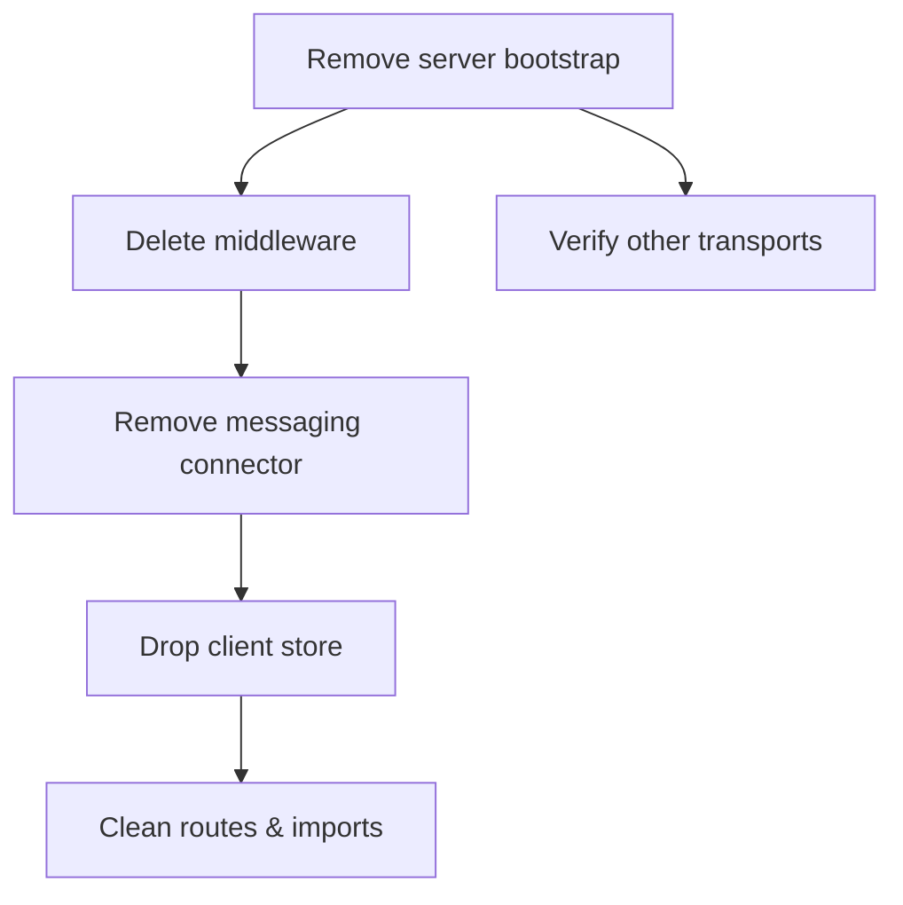

## Sunset plan for native WebSocket

- **Remove server bootstrap**: delete `WebSocketUtils` (`startupWebsocketServer`, `onHttpServerUpgrade`, global WSS symbol).
- **Delete middleware**: remove `websocketMiddleware` wiring from `hooks.server.ts` and the middleware file itself.
- **Remove messaging connector**: delete `WSConnection` and any registration in `ConnectionManager`; remove `WSManager`/`WebSocketManager`.
- **Drop client store**: delete `src/lib/stores/websocket-store.ts` and replace usages with SSE/Pushpin.
- **Clean routes & imports**: remove `/websocket` endpoint expectations and stray WS imports/tests.
- **Verify other transports**: ensure Pushpin/SSE path remains functional and documented.

### MQTT replacement checklist
- **Client wrapper (already present)**: use `mqttStore` @/src/lib/stores/mqtt-store.ts (connect/disconnect, publish, on, request via callUserRpc). Do not add new WebSocket stores.
- **User RPC helper**: reuse `callUserRpc` @/src/lib/client/mqtt/userRpc.ts for request/response flows (maps old `sendRequest` semantics).
- **Notifications/claim flows**: reuse `waitForClaimConfirmation` @/src/lib/client/mqtt/claimFlow.ts and general `mqttStore.on(topic, cb)` subscriptions.
- **Auth**: mqttStore mints via `/api/user/mqtt/mint`; ensure auth state drives `setAuthEnabled/resetForNewUser`.
- **Topics**: reuse helpers under `src/lib/server/mqtt-messaging` and existing user/device topic patterns (`user/{sub}/requests|response|notifications`, `subscription/device/{deviceId}`, etc.).
- **Message shape**: keep `{ type, scope, payload, requestId }` inside MQTT payloads so downstream handlers stay consistent.
- **Server publishing**: use mqtt publish via `mqtt-messaging` utilities; drop ConnectionManager WS registrations entirely.
- **WebRTC/device signaling**: publish offer/answer/ICE to device topics (e.g., `subscription/device/{deviceId}`) instead of `/websocket`.
- **Cleanup**: remove WS tests/docs; add MQTT usage notes pointing to mqttStore and mqttClient helpers.

### WebSocket → MQTT mapping

| Responsibility | WebSocket behavior | MQTT replacement |
| --- | --- | --- |
| Session-aware connect/keepalive | `/websocket` upgrade, ping/pong; session cookie in query; `socketStore` backoff | `mqttStore.connect()` (JWT mint via `/api/user/mqtt/mint`, MQTT keepalive); optional heartbeat `user/{sub}/heartbeat` |
| Fire-and-forget messages | `socketStore.send({ type, scope, payload })` | `mqttStore.publish(topic, { type, scope, payload })`; topics via mqtt-messaging helpers (e.g., `subscription/device/{deviceId}`, `user/{sub}/notifications`) |
| Request/response RPC | `socketStore.sendRequest` with `requestId`; WS dispatcher replies | `callUserRpc` publishes to `user/{sub}/requests`, listens on `user/{sub}/response` for matching `requestId`; server handles via `handleIncoming`/`registerRpcHandler` |
| Notifications | `socketStore.on(type, cb)` for `message.type` | `mqttStore.on(topic, cb)` on `user/{sub}/notifications` (or device topics); dispatch by `payload.type` |
| WebRTC/device signaling | WS message `{ type: 'webrtc:*', scope }` to device | Publish `{ type: 'webrtc:*', payload }` to `subscription/device/{deviceId}`; device replies same topic |
| Broadcast/unicast | wsManager.broadcast/unicast to socketIds | Publish to fanout topics (account/user/device) instead of socketId addressing |
| Auth/session reset | WS validated cookie; `resetForNewUser` | `mqttStore.setAuthEnabled` / `resetForNewUser` already in store; reconnect after auth change |

### Function-level replacement guide

| WebSocket location / function | Purpose | MQTT replacement |
| --- | --- | --- |
| `src/lib/server/websocket/middleware.ts` (upgrade/auth, registers WSConnection) | Handles `/websocket` upgrade, validates session, registers connection | Remove; rely on MQTT mint endpoint `/api/user/mqtt/mint` and client-side `mqttStore.connect()` |
| `WSConnection.start/handleMessage/send` @`src/lib/server/messaging/connections/ws_connection.ts` | Attach ws listeners, parse JSON, dispatch to MessageDispatcher | Drop; use MQTT worker dispatcher `handleIncoming` @`src/lib/server/mqtt/handlers/index.ts` for all inbound MQTT messages |
| `WSManager` / `WebSocketManager` | Track clients, broadcast/unicast by socketId | Drop; publish to topics via MQTT transport (`getMqttTransport().publish`) |
| `socketStore.connect` @`src/lib/stores/websocket-store.ts` | Opens WS, backoff, ping/pong | Replace with `mqttStore.connect()` (already handles mint + backoff) |
| `socketStore.send` | Fire-and-forget send over WS | `mqttStore.publish(topic, payload)` using topic builders (`subscription/device/{deviceId}`, `user/{sub}/notifications`, etc.) |
| `socketStore.sendRequest` | WS request/response with `requestId` | `callUserRpc(op, params)` @`src/lib/client/mqtt/userRpc.ts` (publishes to `user/{sub}/requests`, listens on `user/{sub}/response`) |
| `socketStore.on(type, cb)` | Listen by message.type | `mqttStore.on(topicFilter, cb)`; filter by topic and dispatch by `payload.type` if needed |
| WebRTC signaling via WS messages (type `webrtc:*`) | Offer/answer/ICE over WS | Publish `{ type, payload }` to `subscription/device/{deviceId}` MQTT topics; device replies same topic |
| Claim/reply flows over WS | Await claim confirmation messages | `waitForClaimConfirmation` @`src/lib/client/mqtt/claimFlow.ts` listens on `user/{sub}/notifications` for JWT ticket replies |
| Auth/session-driven reset (`resetConnection`, `setAuthEnabled`) | Reset WS on auth changes | Use `mqttStore.resetForNewUser()` and `mqttStore.setAuthEnabled()` to reconnect with fresh mint |

### WebSocket message handling (current)

| Location | Incoming messages it handles | Sends/replies |
| --- | --- | --- |
| `WebSocketManager.handleMessage` @`src/lib/server/websocket/WebSocketManager.ts` | `ping`, `register`, `webrtc`, `room` (else warns) | For `ping` replies `{ type: 'pong', timestamp }`; forwards `webrtc` → `handleWebRTCMessage`; `room` → `handleRoomMessage` |
| `WSConnection.handleMessage` @`src/lib/server/messaging/connections/ws_connection.ts` | Parses `{ type, scope, payload, requestId }` JSON; special-cases `ping` | For `ping` replies `{ type: 'pong' }`; otherwise dispatches to `MessageDispatcher.dispatch(message)` (which will produce downstream replies/notifications) |
| `socketStore` (client) @`src/lib/stores/websocket-store.ts` | Receives arbitrary `{ type, scope, payload, requestId }`; routes to listeners by `type` | Sends via `send` and `sendRequest` (adds `requestId`, `timestamp`); `sendRequest` expects matching payload.requestId in response |

### WebSocket RPC & reply matrix

> Note: Most higher-level flows (WhatsApp, device logs, claim, etc.) have already been moved to SSE/MQTT. The WebSocket path is now primarily generic messaging, WebRTC signaling, and room messaging.

| Flow | Client request (type / scope / payload) | Server handler(s) | Reply / events (labels) |
| --- | --- | --- | --- |
| **Generic ping/pong** | `type: 'ping'` over WS | `WebSocketManager.handleMessage` | Immediate reply: `{ type: 'pong', timestamp: Date.now() }` to same socket. This becomes MQTT-level heartbeat or is replaced entirely by MQTT keepalive. |
| **Client register** | `type: 'register'` | `WebSocketManager.handleMessage` | Logs registration only; no structured reply. MQTT has no direct equivalent; connection identification is implicit in MQTT client ID and JWT claims. |
| **WebRTC signaling (legacy WS)** | `type: 'webrtc'` with signaling payload (`offer`, `answer`, `ice`, etc.) | `WebSocketManager.handleMessage` → `handleWebRTCMessage` @`lib/server/webrtc/WebrtcSignalingUtils.ts` | Forwards offers/answers/ICE between peers via `wsManager`/ConnectionManager. Replaced by MQTT topics like `subscription/device/{deviceId}` carrying `{ type: 'webrtc:*', payload }` and using existing WebRTC/aiortc logic on device side. |
| **Room messages** | `type: 'room'`, `payload` with room actions | `WebSocketManager.handleMessage` → `handleRoomMessage` @`lib/server/room/RoomManager.ts` | Broadcasts/unicasts room updates to WS clients. To be replaced by MQTT room topics (e.g. `room/{roomId}`) and MQTT-based presence/notification. |
| **Generic routing via WSConnection** | Arbitrary `{ type, scope, payload, requestId }` | `WSConnection.handleMessage` → `MessageDispatcher.dispatch` | Dispatcher routes by `type` (`webrtc`, `terminal`, `message`, `whatsapp`, `device`, etc.) and uses `publisher` to reach other live connections. Request/response correlation relies on `requestId`; MQTT replacement is `callUserRpc` / `registerRpcHandler` over `user/{sub}/requests|response`. |

### Related MQTT RPC/signal operations (for parity)

These are the MQTT primitives that replace WebSocket responsibilities:

| WebSocket responsibility | MQTT primitive | Notes |
| --- | --- | --- |
| WS ping/pong keepalive | MQTT keepalive (broker-level) + optional heartbeat topics (e.g. `user/{sub}/heartbeat`, `device/{id}/heartbeat`) | No RPC needed; use broker config and, if required, periodic publishes. |
| WS request/response via `socketStore.sendRequest` | `callUserRpc` over `user/{sub}/requests` / `user/{sub}/response` | Uses `requestId` correlation and `registerRpcClient`/`handleIncoming` in `lib/server/mqtt/handlers`. |
| WS WebRTC signaling | MQTT publishes on `subscription/device/{deviceId}` with `{ type: 'webrtc:offer|answer|ice', payload }` | Device MQTT client consumes signaling and feeds local WebRTC stack (already implemented in device project). |
| WS room broadcast/unicast | MQTT room/fanout topics (e.g. `room/{roomId}`, `account/{accountId}/events`) | Router uses topic naming instead of socket IDs. |
| WS generic `message` type | MQTT notifications on `user/{sub}/notifications` / device topics | Handled via MQTT notification handlers and ticket-based flows. |

