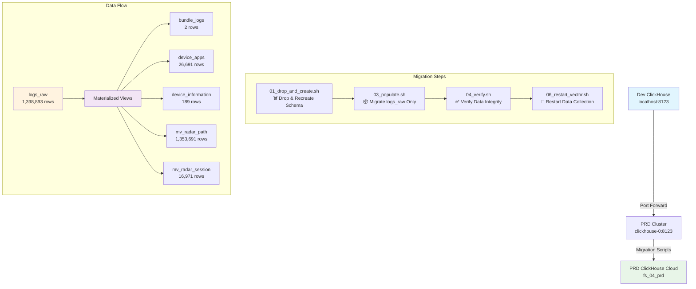

# ClickHouse Migration Progress: Dev → PRD

## Migration Overview

Successfully migrated data from development ClickHouse to production ClickHouse cloud instance.

## Migration Flow



## Key Issues Resolved

### ❌ Original Problem
- **Table Duplication**: Migrating both base tables AND letting materialized views process the same data
- **Result**: Target tables had 2x the expected rows

### ✅ Solution Applied
- **Modified Migration**: Only migrate `logs_raw` table
- **Let MVs Work**: Materialized views automatically populate other tables
- **Perfect Match**: All tables now match source exactly

## Migration Results

| Table/View | Source Rows | Target Rows | Status |
|------------|-------------|-------------|---------|
| `logs_raw` | 1,398,893 | 1,398,893 | ✅ |
| `bundle_logs` | 2 | 2 | ✅ |
| `device_apps` | 26,691 | 26,691 | ✅ |
| `device_information` | 189 | 189 | ✅ |
| `mv_radar_path` | 1,353,691 | 1,353,691 | ✅ |
| `mv_radar_session` | 16,971 | 16,971 | ✅ |

## Technical Details

### Source Configuration
- **URL**: `http://localhost:8123`
- **Database**: `fs_04`
- **User**: `admin`

### Target Configuration
- **URL**: `https://dg7m1hwwez.us-central1.gcp.clickhouse.cloud:8443`
- **Database**: `fs_04_prd`
- **User**: `fs04_prd`

### Migration Scripts Used
1. `02_drop_and_create.sh` - Schema recreation
2. `03_populate.sh` - Data migration (modified for logs_raw only)
3. `04_verify.sh` - Data verification
4. `06_restart_vector.sh` - Resume data collection

### Port Forwarding Command
```bash
kubectl port-forward clickhouse-0 8123:8123 --namespace=fs04
```

## Post-Migration Actions

- ✅ Vector agent restarted and collecting data
- ✅ All materialized views active and processing
- ✅ Data integrity verified across all tables
- ✅ Port forwarding established for ongoing access

## Migration Timeline

- **15:32** - Schema recreation completed
- **15:35** - Data migration completed (logs_raw: 1,398,893 rows)
- **15:36** - Verification completed (all tables match)
- **15:41** - Vector agent restarted

---

**Status**: 🎉 **MIGRATION COMPLETE**