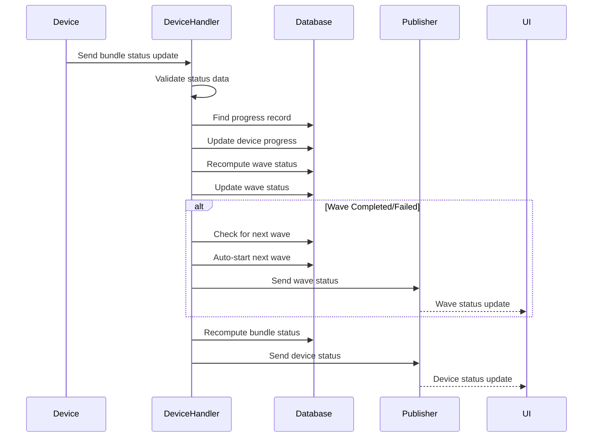

# Bundle Status Action Handler

## Overview

The Bundle Status Action Handler (`handleBundleStatus`) manages bundle installation status updates from devices. This handler tracks installation progress, computes wave and bundle statuses, handles automatic wave progression, and provides real-time updates to the UI.

## Handler Location

- **File**: `bundleHandler.ts`
- **Function**: `handleBundleStatus(message: InMessage): Promise<void>`

## Message Flow



## Request Payload

```typescript
interface BundleStatusRequest {
  action: 'bundleStatus';
  deviceId: string;
  status: 'IN_PROGRESS' | 'COMPLETED' | 'FAILED';
  progress?: number; // 0-100 percentage
  sessionId: string; // wave:<waveId>
  batchId?: string; // Alternative to sessionId
  // ... other InMessage fields
}
```

## Status Values

### Device Status
- `IN_PROGRESS` - Installation in progress
- `COMPLETED` - Installation completed successfully
- `FAILED` - Installation failed

### Wave Status
- `PENDING` - Wave waiting to start
- `IN_PROGRESS` - Wave currently running
- `COMPLETED` - All devices in wave completed successfully
- `FAILED` - At least one device in wave failed
- `CANCELLED` - Wave was cancelled

### Bundle Status
- `PUBLISHED` - Bundle published, waves pending
- `IN_PROGRESS` - At least one wave in progress
- `COMPLETED` - All waves completed successfully
- `FAILED` - At least one wave failed
- `CANCELLED` - Bundle deployment cancelled

## Validation Logic

### 1. Required Fields Validation
```typescript
if (!deviceId || !status || !sessionId) {
  logger.warn(`[DeviceHandler] bundleStatus missing required fields`, { deviceId, status, sessionId });
  return;
}
```

### 2. Wave ID Extraction
```typescript
// sessionId/batchId are encoded as wave:<waveId>
const waveId = String(sessionId).startsWith('wave:') ? String(sessionId).slice(5) : sessionId;
```

### 3. Progress Record Lookup
```typescript
// Find the BundleDeviceProgress record for this device in the wave
const bdp = await prisma.bundleDeviceProgress.findFirst({
  where: { waveId, bundle: { id: bundleId || undefined } },
  include: { bundleDevice: true }
});

// If not found by relation, try by joining bundleDevice via deviceId
if (!targetProgress) {
  targetProgress = await prisma.bundleDeviceProgress.findFirst({
    where: { waveId, bundleDevice: { deviceId } },
    include: { bundleDevice: true }
  });
}
```

## Progress Update Logic

### Status Normalization
```typescript
const newStatus = status === 'COMPLETED' ? 'COMPLETED' : 
                 status === 'FAILED' ? 'FAILED' : 'IN_PROGRESS';
```

### Progress Data Update
```typescript
const update: any = { status: newStatus };

if (newStatus === 'IN_PROGRESS' && typeof progress === 'number') {
  update.progress = progress;
  if (!targetProgress.startedAt) update.startedAt = new Date();
}

if (newStatus === 'COMPLETED' || newStatus === 'FAILED') {
  update.completedAt = new Date();
}

await prisma.bundleDeviceProgress.update({ 
  where: { id: targetProgress.id }, 
  data: update 
});
```

## Wave Status Computation

### Wave Aggregation
```typescript
const allForWave = await prisma.bundleDeviceProgress.findMany({ where: { waveId } });
const devicesTotal = allForWave.length;
const devicesCompleted = allForWave.filter(r => r.status === 'COMPLETED').length;
const devicesFailed = allForWave.filter(r => r.status === 'FAILED').length;

// Progress represents percentage of devices that have been processed (completed + failed)
const waveProgress = devicesTotal > 0 ? 
  Math.round(((devicesCompleted + devicesFailed) / devicesTotal) * 100) : 0;

const waveStatus = devicesCompleted + devicesFailed >= devicesTotal && devicesTotal > 0
  ? (devicesFailed > 0 ? 'FAILED' : 'COMPLETED')
  : 'IN_PROGRESS';
```

### Wave Status Update
```typescript
await prisma.bundleWave.update({
  where: { id: waveId },
  data: { 
    status: waveStatus, 
    endTime: waveStatus !== 'IN_PROGRESS' ? new Date() : undefined 
  }
});
```

## Bundle Status Computation

### Wave Analysis
```typescript
const waves = await prisma.bundleWave.findMany({ 
  where: { bundleId }, 
  select: { status: true } 
});

const waveCounts = {
  PENDING: waves.filter(w => w.status === 'PENDING').length,
  IN_PROGRESS: waves.filter(w => w.status === 'IN_PROGRESS').length,
  COMPLETED: waves.filter(w => w.status === 'COMPLETED').length,
  FAILED: waves.filter(w => w.status === 'FAILED').length,
  CANCELLED: waves.filter(w => w.status === 'CANCELLED').length
};
```

### Bundle Status Decision Logic
```typescript
let bundleStatus;
let reason = '';

if (anyInProgress) {
  bundleStatus = 'IN_PROGRESS';
  reason = 'Wave(s) currently in progress';
} else if (anyFailed) {
  bundleStatus = 'FAILED';
  reason = 'At least one wave failed';
} else if (anyCancelled && allTerminal) {
  bundleStatus = 'CANCELLED';
  reason = 'Deployment was cancelled';
} else if (allCompleted) {
  bundleStatus = 'COMPLETED';
  reason = 'All waves completed successfully';
} else if (anyPending) {
  bundleStatus = 'PUBLISHED';
  reason = 'Waves pending to start';
} else {
  bundleStatus = 'PUBLISHED';
  reason = 'Fallback status';
}
```

## Auto-Start Next Wave

### Wave Progression Logic
```typescript
export async function checkAndAutoStartNextWave(bundleId: string, currentWaveId: string) {
  // Get all waves for this bundle ordered by creation time
  const allWaves = await prisma.bundleWave.findMany({
    where: { bundleId },
    orderBy: { createdAt: 'asc' },
    select: { id: true, status: true, name: true }
  });
  
  // Find the current wave index
  const currentWaveIndex = allWaves.findIndex(w => w.id === currentWaveId);
  
  // Check if there's a next wave that's pending
  if (currentWaveIndex >= 0 && currentWaveIndex + 1 < allWaves.length) {
    const nextWave = allWaves[currentWaveIndex + 1];
    
    if (nextWave.status === 'PENDING') {
      // Start the next wave automatically
      await prisma.bundleWave.update({
        where: { id: nextWave.id },
        data: {
          status: 'IN_PROGRESS',
          startTime: new Date(),
          updatedBy: 'system'
        }
      });
      
      // Send install commands to devices in the next wave
      await sendInstallCommandsToNextWave(bundleId, nextWave.id);
    }
  }
}
```

### Device Command Dispatch
```typescript
// Send install commands to devices in the next wave
const nextWaveProgresses = await prisma.bundleDeviceProgress.findMany({
  where: { bundleId, waveId: nextWave.id },
  include: { bundleDevice: true }
});

const bundle = await prisma.bundle.findUnique({
  where: { id: bundleId },
  include: { 
    apps: { 
      include: { resource: true }, 
      orderBy: { order: 'asc' } 
    } 
  }
});

for (const prog of nextWaveProgresses) {
  const deviceId = prog.bundleDevice.deviceId;
  
  // Check if device is online first
  const device = await prisma.device.findUnique({ 
    where: { id: deviceId }, 
    select: { connected: true, name: true } 
  });
  
  if (device && device.connected === false) {
    // Mark device as failed immediately if offline
    await prisma.bundleDeviceProgress.update({ 
      where: { id: prog.id }, 
      data: { 
        status: 'FAILED', 
        completedAt: new Date(), 
        errorDetails: 'device_offline' 
      } 
    });
    continue;
  }
  
  // Send bundle_install command to device
  const command = {
    action: 'message',
    type: 'bundle_install',
    sessionId: `wave:${nextWave.id}`,
    batchId: `wave:${nextWave.id}`,
    deviceId,
    bundles: [/* bundle data */],
    options: { 
      reboot: !!bundle?.reboot, 
      autoOpen: anyAutoOpen, 
      forceUpdate: !!bundle?.forceUpdate 
    }
  };
  
  const routing = MessageFactory.createSystemMessage(
    'device', 
    `subscription:device:${deviceId}`, 
    command, 
    SystemUser, 
    { echoToSender: false }
  );
  await publisher.publish(routing);
}
```

## Status Broadcasting

### Wave Status Broadcast
```typescript
const waveStatusMsg = MessageFactory.createSystemMessage(
  'bundle:waveStatus',
  `subscription:bundle:${bundleId}`,
  { 
    action: 'waveStatus', 
    bundleId, 
    waveId,
    status: waveStatus,
    devicesTotal,
    devicesCompleted,
    devicesFailed,
    progress: waveProgress,
    endTime: waveStatus !== 'IN_PROGRESS' ? new Date().toISOString() : undefined
  },
  SystemUser,
  { echoToSender: false }
);
await publisher.publish(waveStatusMsg);
```

### Device Status Broadcast
```typescript
const routing = MessageFactory.createSystemMessage(
  'device:bundleStatus',
  `subscription:device:${deviceId}`,
  {
    action: 'bundleStatus',
    deviceId,
    waveId,
    status: newStatus,
    // Always send wave-level progress so UI aggregates are correct
    progress: waveProgress,
    devicesTotal,
    devicesCompleted,
    devicesFailed
  },
  SystemUser,
  { echoToSender: false }
);
await publisher.publish(routing);
```

## Error Scenarios

### 1. Missing Required Fields
- **Error**: Missing deviceId, status, or sessionId
- **Response**: Warning logged, operation skipped

### 2. Progress Record Not Found
- **Error**: No progress row found for wave and device
- **Response**: Still broadcast to UI for visibility

### 3. Database Errors
- **Error**: Database operation failure
- **Response**: Error logged, operation continues

### 4. Auto-Start Failure
- **Error**: Failed to auto-start next wave
- **Response**: Error logged, manual intervention required

## Success Flow

1. **Status Validation**: Validate required fields and status values
2. **Progress Lookup**: Find device progress record in wave
3. **Progress Update**: Update device progress and timestamps
4. **Wave Computation**: Recompute wave status and progress
5. **Wave Update**: Update wave status in database
6. **Auto-Start Check**: Check and start next wave if current completed
7. **Bundle Update**: Recompute and update bundle status
8. **Status Broadcast**: Send status updates to UI

## Logging

### Info Level
```typescript
logger.info(`[WaveStatus] Wave ${waveId} status computation:`, {
  devicesTotal, devicesCompleted, devicesFailed, waveProgress, computedWaveStatus
});
logger.info(`[AutoStart] Starting next wave ${nextWave.id} (${nextWave.name})`);
```

### Warning Level
```typescript
logger.warn(`[DeviceHandler] bundleStatus missing required fields`, { deviceId, status, sessionId });
logger.warn(`[DeviceHandler] bundleStatus: No progress row found for wave ${waveId} and device ${deviceId}`);
```

### Error Level
```typescript
logger.error(`[DeviceHandler] Failed to process bundleStatus: ${String(e?.message || e)}`);
```

## Integration Points

### Database (Prisma)
- **Purpose**: Progress tracking and status management
- **Operations**: Update progress, compute statuses, manage waves
- **Schema**: BundleDeviceProgress, BundleWave, Bundle tables

### Publisher
- **Purpose**: Status broadcasting and command dispatch
- **Scopes**: Device-specific and bundle-specific subscriptions

### MessageFactory
- **Purpose**: Status message creation
- **Features**: System messages, status updates

## Security Considerations

1. **Device Authentication**: Verify device identity
2. **Status Validation**: Validate status values and transitions
3. **Rate Limiting**: Prevent status spam
4. **Audit Logging**: Track all status changes
5. **Authorization**: Check device ownership

## Performance Notes

- **Database Queries**: Multiple queries for status computation
- **Response Time**: Immediate response
- **Memory Usage**: Minimal (status data only)
- **Concurrency**: Thread-safe status updates
- **Batch Operations**: Efficient database updates

## Testing Scenarios

### Valid Status Updates
1. Device progress updates
2. Wave completion scenarios
3. Bundle completion scenarios
4. Auto-start next wave
5. Multiple concurrent updates

### Invalid Status Updates
1. Missing required fields
2. Invalid status values
3. Non-existent progress records
4. Database errors
5. Auto-start failures

## Related Handlers

- **Firmware Handler**: Manages firmware updates
- **Message Handler**: Handles device communication
- **Status Handler**: Manages device status updates

## Dependencies

```typescript
import { MessageFactory } from '../../interfaces/message';
import { publisher } from '../../core/publisher';
import { logger } from '$lib/server/logger';
import prisma from '$lib/server/prisma';
import { SystemUser } from '../../interfaces/message';
```
