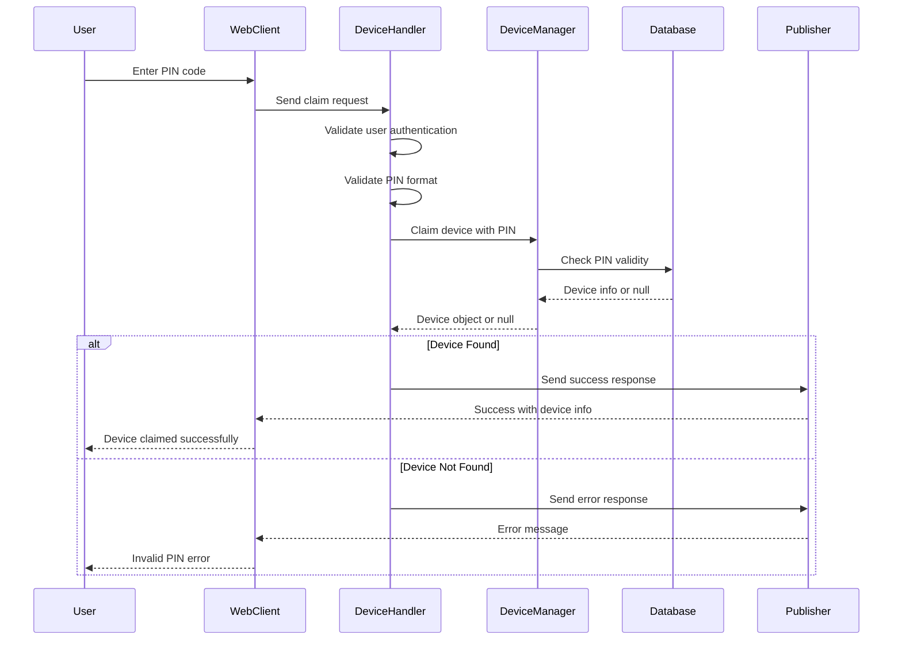

# Claim Action Handler

## Overview

The Claim Action Handler (`handleClaim`) manages the device claiming process where users claim devices using PIN codes. This handler validates PIN codes, authenticates users, and associates devices with user accounts.

## Handler Location

- **File**: `claimHandler.ts`
- **Function**: `handleClaim(message: InMessage): Promise<void>`

## Message Flow



## Request Payload

```typescript
interface ClaimRequest {
  action: 'claim';
  pin: string; // 6-digit PIN code
  // ... other InMessage fields
}
```

## Response Payloads

### Success Response

```typescript
interface ClaimSuccessResponse {
  action: 'claim';
  success: true;
  message: {
    type: 'success';
    text: 'Device claimed successfully!';
    timestamp: string; // ISO string
  };
  device: {
    id: string;
    name: string;
    deviceType: string;
    status: string;
  };
  timestamp: string; // ISO string
}
```

### Error Response

```typescript
interface ClaimErrorResponse {
  action: 'claim';
  success: false;
  error: string; // Error title
  details: string; // Detailed error message
  code: string; // Error code
  timestamp: string; // ISO string
}
```

## Validation Logic

### 1. User Authentication
```typescript
if (!userInfo?.id) {
  throw new Error('Authentication Required');
}
```

### 2. PIN Validation
```typescript
if (!pin || typeof pin !== 'string') {
  throw new Error('PIN is required');
}
```

### 3. Device Claiming
```typescript
const device = await DeviceManager.claimDevice(
  pin, 
  userInfo, 
  accountId, 
  connectionId, 
  protocol
);
```

## Error Scenarios

### 1. Authentication Failure
- **Error**: `Authentication Required`
- **Cause**: Missing or invalid user context
- **Response**: 401 Unauthorized

### 2. Invalid PIN Format
- **Error**: `PIN is required`
- **Cause**: PIN is missing, null, or not a string
- **Response**: Validation error

### 3. Device Not Found
- **Error**: `Verification Failed`
- **Details**: `The PIN you entered doesn't match any available device. Please verify the 6-digit PIN and try again.`
- **Code**: `INVALID_PIN`
- **Cause**: PIN doesn't match any unclaimed device

### 4. Device Already Claimed
- **Error**: `Device Already Claimed`
- **Cause**: PIN matches a device that's already associated with another user
- **Response**: Conflict error

## Success Flow

1. **PIN Validation**: Verify PIN format and presence
2. **User Authentication**: Confirm user is logged in
3. **Device Lookup**: Find device by PIN using DeviceManager
4. **Association**: Link device to user account
5. **Response**: Send success response with device information

## Logging

### Info Level
```typescript
logger.info(`[DeviceHandler] User ${userInfo.id} attempting to claim device with PIN: ${pin}`);
logger.info(`[DeviceHandler] Device registered, next step wait for device to connect: ${device.id} by user ${userInfo.id}`);
```

### Warning Level
```typescript
logger.warn(`[DeviceHandler] No device found with PIN ${pin}`);
```

### Error Level
```typescript
logger.error(`[DeviceHandler] Device claim failed:`, { error: errorMessage });
```

## Integration Points

### DeviceManager
- **Method**: `claimDevice(pin, userInfo, accountId, connectionId, protocol)`
- **Purpose**: Core device claiming logic
- **Returns**: Device object or null

### Publisher
- **Purpose**: Message routing and delivery
- **Scopes**: Connection-specific routing for responses

### MessageFactory
- **Purpose**: Response message creation
- **Features**: Request ID preservation, echo settings

## Security Considerations

1. **PIN Validation**: PINs are validated server-side
2. **User Authentication**: All claims require authenticated users
3. **Rate Limiting**: Consider implementing PIN attempt limits
4. **Audit Logging**: All claim attempts are logged
5. **Session Management**: Connection IDs are tracked for responses

## Performance Notes

- **Database Queries**: Single device lookup by PIN
- **Response Time**: Immediate response (no async operations)
- **Memory Usage**: Minimal (device object only)
- **Concurrency**: Thread-safe device claiming

## Testing Scenarios

### Valid Claims
1. Valid PIN with unclaimed device
2. Valid PIN with different device types
3. Multiple users claiming different devices

### Invalid Claims
1. Invalid PIN format
2. Non-existent PIN
3. Already claimed device PIN
4. Unauthenticated user
5. Malformed request payload

## Related Handlers

- **Registration Handler**: Handles device registration after claiming
- **Status Handler**: Manages device status updates
- **Message Handler**: Handles device communication

## Dependencies

```typescript
import { DeviceManager } from '$lib/server/device/deviceManager';
import { MessageFactory } from '../../interfaces/message';
import { publisher } from '../../core/publisher';
import { logger } from '$lib/server/logger';
```
