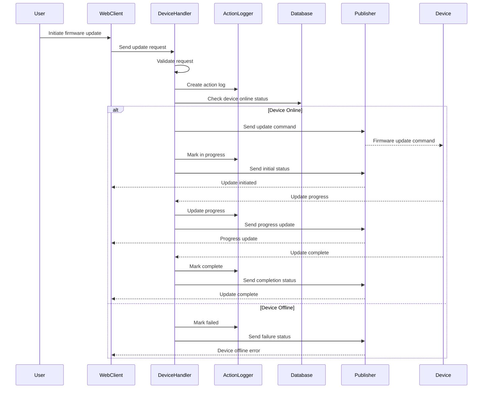

# Firmware Update Action Handler

## Overview

The Firmware Update Action Handler (`handleFirmwareUpdate`) manages firmware update operations for devices. This handler validates update requests, tracks progress, handles timeouts, and provides real-time status updates to the UI.

## Handler Location

- **File**: `firmwareHandler.ts`
- **Function**: `handleFirmwareUpdate(message: InMessage): Promise<void>`

## Message Flow



## Request Payload

```typescript
interface FirmwareUpdateRequest {
  action: 'updateFirmware';
  deviceId: string;
  firmware: {
    resourceId: string;
    resourceName: string;
    size: number; // Size in bytes
    path: string;
    packageName?: string;
    version?: string;
    format?: string;
  };
  options?: {
    // Update options
    forceUpdate?: boolean;
    reboot?: boolean;
    // ... other options
  };
  // ... other InMessage fields
}
```

## Response Payloads

### Success Response (Acknowledgment)

```typescript
interface FirmwareUpdateAckResponse {
  action: 'updateFirmware';
  success: true;
  deviceId: string;
  firmware: {
    resourceId: string;
  };
  timestamp: string; // ISO string
}
```

### Error Response

```typescript
interface FirmwareUpdateErrorResponse {
  action: 'updateFirmware';
  success: false;
  error: string; // Error title
  details: string; // Detailed error message
  deviceId: string;
  firmware: {
    resourceId: string;
  };
  timestamp: string; // ISO string
}
```

## Status Updates

### Status Message Types

```typescript
interface FirmwareStatusUpdate {
  action: 'firmwareStatus';
  deviceId: string;
  status: 'in_progress' | 'success' | 'failed';
  progress?: number; // 0-100
  message: string;
  firmwareResourceId: string;
  logId: string;
  error?: string; // For failed status
  timestamp: string; // ISO string
}
```

### Status Values
- `in_progress` - Update initiated and in progress
- `success` - Update completed successfully
- `failed` - Update failed with error
- `offline` - Device is offline

## Validation Logic

### 1. User Authentication
```typescript
if (!userInfo?.id) {
  await publishAck(message, false, 'Unauthorized', 'Missing user context');
  return;
}
```

### 2. Required Fields Validation
```typescript
if (!deviceId || !firmware) {
  await publishAck(message, false, 'Validation Failed', 'deviceId and firmware are required');
  return;
}
```

### 3. Firmware Data Validation
```typescript
if (!firmware.resourceId || !firmware.resourceName || 
    typeof firmware.size !== 'number' || !firmware.path) {
  await publishAck(message, false, 'Validation Failed', 
    'Firmware fields missing (resourceId, resourceName, size, path)');
  return;
}
```

### 4. Scope Consistency Check
```typescript
const [kind, type, id] = scope?.split(':') || [];
if (!(kind === 'subscription' && type === 'device' && id === deviceId)) {
  logger.warn(`[DeviceHandler] Scope/deviceId mismatch: scope=${scope}, deviceId=${deviceId}`);
}
```

## Action Logging

### Log Creation
```typescript
const created = await ActionLogger.createInitiated({
  deviceId,
  actionType: 'firmware_update',
  initiatedBy: userInfo.id,
  requestId,
  connectionId,
  protocol,
  metadata: {
    firmware: {
      resourceId: firmware.resourceId,
      resourceName: firmware.resourceName,
      packageName: firmware.packageName ?? null,
      sizeBytes: firmware.size,
      path: firmware.path,
      version: firmware.version ?? null,
      format: firmware.format ?? null
    },
    options: options ?? null
  },
  initialMessage: 'Queued firmware update dispatch'
});
```

### Log States
- `initiated` - Update request received
- `in_progress` - Update command sent to device
- `success` - Update completed successfully
- `failed` - Update failed or timed out

## Offline Device Handling

### Fast-Fail for Offline Devices
```typescript
const device = await prisma.device.findUnique({ 
  where: { id: deviceId }, 
  select: { connected: true } 
});

if (device && device.connected === false) {
  await ActionLogger.finalize(logId, 'failed', 'Device is offline');
  // Publish immediate failure status
  await publishFirmwareStatus(deviceId, 'failed', 0, 'Device is offline', 'offline');
  await publishAck(message, false, 'Device is offline');
  return;
}
```

## Timeout Handling

### 10-Minute Timeout
```typescript
setTimeout(async () => {
  try {
    const current = await prisma.deviceActionLog.findUnique({ 
      where: { id: logId }, 
      select: { status: true } 
    });
    
    if (current && (current.status === 'initiated' || current.status === 'in_progress')) {
      await ActionLogger.finalize(logId, 'failed', 'Timed out after 10 minutes');
      await publishFirmwareStatus(deviceId, 'failed', 0, 'Timed out after 10 minutes');
    }
  } catch (timeoutErr) {
    logger.warn(`[DeviceHandler] Failed to process firmware timeout for ${logId}: ${String(timeoutErr)}`);
  }
}, 10 * 60 * 1000); // 10 minutes
```

## Error Scenarios

### 1. Authentication Failure
- **Error**: `Unauthorized`
- **Cause**: Missing user context
- **Response**: 401 Unauthorized

### 2. Validation Errors
- **Error**: `Validation Failed`
- **Cause**: Missing required fields or invalid data
- **Response**: 400 Bad Request

### 3. Device Offline
- **Error**: `Device is offline`
- **Cause**: Device not connected
- **Response**: Immediate failure with status update

### 4. Dispatch Failure
- **Error**: `Dispatch Failed`
- **Cause**: Message publishing failure
- **Response**: 500 Internal Server Error

### 5. Timeout
- **Error**: `Timed out after 10 minutes`
- **Cause**: Device didn't respond within timeout
- **Response**: Automatic failure after timeout

## Success Flow

1. **Request Validation**: Validate user, device, and firmware data
2. **Action Logging**: Create action log for tracking
3. **Device Check**: Verify device is online
4. **Command Dispatch**: Send firmware update command to device
5. **Progress Tracking**: Monitor update progress
6. **Status Updates**: Send real-time status to UI
7. **Completion**: Handle success/failure responses

## Logging

### Info Level
```typescript
logger.info(`[DeviceHandler] Firmware update initiated for device ${deviceId}`);
```

### Warning Level
```typescript
logger.warn(`[DeviceHandler] Device online check failed: ${String(checkErr)}`);
logger.warn(`[DeviceHandler] Failed to publish initial firmware status: ${String(e)}`);
```

### Error Level
```typescript
logger.error(`[DeviceHandler] Failed to create action log: ${String(e)}`);
logger.error(`[DeviceHandler] Firmware dispatch failed: ${String(err)}`);
```

## Integration Points

### ActionLogger
- **Purpose**: Track firmware update operations
- **Operations**: Create, update, finalize action logs
- **Features**: Timeout handling, progress tracking

### Database (Prisma)
- **Purpose**: Device status checking
- **Operations**: Query device connection status
- **Schema**: Device table with connected field

### Publisher
- **Purpose**: Message routing and status updates
- **Scopes**: Device-specific and user-specific subscriptions

### MessageFactory
- **Purpose**: Response message creation
- **Features**: ACK responses, status updates

## Security Considerations

1. **User Authentication**: All updates require authenticated users
2. **Device Ownership**: Verify user owns the device
3. **Firmware Validation**: Validate firmware resource exists
4. **Rate Limiting**: Prevent update spam
5. **Audit Logging**: Track all update attempts

## Performance Notes

- **Database Queries**: Single device status check
- **Response Time**: Immediate acknowledgment
- **Memory Usage**: Minimal (firmware metadata only)
- **Concurrency**: Thread-safe update operations
- **Timeout Protection**: 10-minute timeout prevents hanging

## Testing Scenarios

### Valid Updates
1. Online device with valid firmware
2. Different firmware formats
3. Various device types
4. Multiple concurrent updates

### Invalid Updates
1. Offline device
2. Invalid firmware resource
3. Unauthenticated user
4. Malformed request payload
5. Timeout scenarios

## Related Handlers

- **Status Handler**: Manages device status updates
- **Message Handler**: Handles device communication
- **Bundle Handler**: Manages bundle installations

## Dependencies

```typescript
import { ActionLogger } from '$lib/server/action-logger';
import { MessageFactory } from '../../interfaces/message';
import { publisher } from '../../core/publisher';
import { logger } from '$lib/server/logger';
import prisma from '$lib/server/prisma';
import { SystemUser } from '../../interfaces/message';
```
