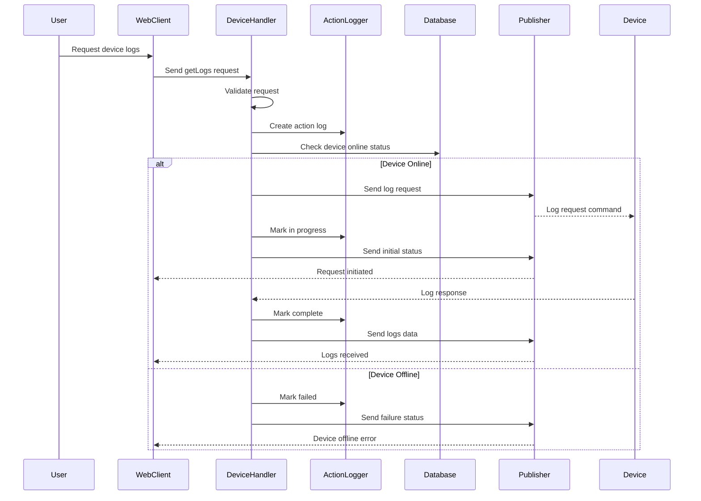

# Get Logs Action Handler

## Overview

The Get Logs Action Handler (`handleGetLogs` / `handleGetLogsResponse`) manages device log retrieval requests and responses. This handler processes log requests, tracks progress, handles timeouts, and manages log data delivery to clients.

## Handler Location

- **File**: `logsHandler.ts`
- **Functions**: 
  - `handleGetLogs(message: InMessage): Promise<void>`
  - `handleGetLogsResponse(message: InMessage): Promise<void>`

## Message Flow



## Request Payload

```typescript
interface GetLogsRequest {
  action: 'getLogs';
  deviceId: string;
  format?: string; // Default: 'zip'
  // ... other InMessage fields
}
```

## Response Payloads

### Success Response (Acknowledgment)

```typescript
interface GetLogsAckResponse {
  action: 'getLogs';
  success: true;
  deviceId: string;
  timestamp: string; // ISO string
}
```

### Error Response

```typescript
interface GetLogsErrorResponse {
  action: 'getLogs';
  success: false;
  error: string; // Error title
  details: string; // Detailed error message
  deviceId: string;
  timestamp: string; // ISO string
}
```

### Logs Response (from Device)

```typescript
interface GetLogsResponse {
  action: 'getLogs';
  deviceId: string;
  success: boolean;
  message: string;
  format: string; // 'zip', 'text', etc.
  logsData?: any; // Base64 encoded logs
  logs?: any[]; // Log entries
  requestId: string;
  logId: string;
  durationMs?: number; // Time taken to generate logs
  timestamp: string; // ISO string
}
```

## Status Updates

### Status Message Types

```typescript
interface LogsStatusUpdate {
  action: 'logsStatus';
  deviceId: string;
  status: 'in_progress' | 'success' | 'failed';
  message: string;
  format?: string;
  logs?: any[];
  logsData?: any;
  logId: string;
  durationMs?: number;
  error?: string; // For failed status
  timestamp: string; // ISO string
}
```

### Status Values
- `in_progress` - Request sent to device
- `success` - Logs retrieved successfully
- `failed` - Request failed or timed out
- `offline` - Device is offline

## Validation Logic

### 1. User Authentication
```typescript
if (!userInfo?.id) {
  await publishLogsAck(message, false, 'Unauthorized', 'Missing user context');
  return;
}
```

### 2. Required Fields Validation
```typescript
if (!deviceId) {
  await publishLogsAck(message, false, 'Validation Failed', 'deviceId is required');
  return;
}
```

## Action Logging

### Log Creation
```typescript
const created = await ActionLogger.createInitiated({
  deviceId,
  actionType: 'logs',
  initiatedBy: userInfo.id,
  requestId,
  connectionId,
  protocol,
  metadata: {
    format: format || 'zip'
  },
  initialMessage: 'Requesting device logs'
});
```

### Log States
- `initiated` - Log request received
- `in_progress` - Request sent to device
- `success` - Logs retrieved successfully
- `failed` - Request failed or timed out

## Offline Device Handling

### Fast-Fail for Offline Devices
```typescript
const device = await prisma.device.findUnique({ 
  where: { id: deviceId }, 
  select: { connected: true } 
});

if (device && device.connected === false) {
  await ActionLogger.finalize(logId, 'failed', 'Device is offline');
  // Publish immediate failure status
  await publishLogsStatus(deviceId, 'failed', 'Device is offline', 'offline');
  await publishLogsAck(message, false, 'Device is offline');
  return;
}
```

## Timeout Handling

### 5-Minute Timeout
```typescript
setTimeout(async () => {
  try {
    const current = await prisma.deviceActionLog.findUnique({ 
      where: { id: logId }, 
      select: { status: true } 
    });
    
    if (current && (current.status === 'initiated' || current.status === 'in_progress')) {
      await ActionLogger.finalize(logId, 'failed', 'Timed out after 5 minutes');
      await publishLogsStatus(deviceId, 'failed', 'Timed out after 5 minutes');
    }
  } catch (timeoutErr) {
    logger.warn(`[DeviceHandler] Failed to process logs timeout for ${logId}: ${String(timeoutErr)}`);
  }
}, 5 * 60 * 1000); // 5 minutes
```

## Response Handling

### Log Response Processing
```typescript
export async function handleGetLogsResponse(message: InMessage): Promise<void> {
  const { deviceId, success, message: responseMessage, logs, logsData, format, durationMs } = payload;
  
  // Find the original action log by requestId
  const originalLog = await prisma.deviceActionLog.findFirst({
    where: { 
      requestId: requestId || message.requestId,
      actionType: 'logs'
    },
    orderBy: { initiatedAt: 'desc' }
  });
  
  if (originalLog) {
    if (success) {
      await ActionLogger.finalize(originalLog.id, 'success', responseMessage || 'Logs retrieved successfully');
      await publishLogsStatus(deviceId, 'success', responseMessage, format, logs, logsData, durationMs);
    } else {
      await ActionLogger.finalize(originalLog.id, 'failed', responseMessage || 'Failed to retrieve logs');
      await publishLogsStatus(deviceId, 'failed', responseMessage, undefined, undefined, undefined, durationMs, 'device_error');
    }
  }
}
```

### Direct Response Routing
```typescript
// Send a direct response back to the original request (for sendRequest)
if (originalLog && originalLog.connectionId) {
  const directResponsePayload = {
    action: 'getLogs',
    deviceId,
    success: success,
    message: responseMessage || (success ? 'Logs generated successfully' : 'Failed to generate logs'),
    format: format || 'zip',
    logsData: logsData || null,
    logs: logs || [],
    requestId: requestId || message.requestId,
    logId: originalLog.id,
    durationMs: durationMs || null,
    timestamp: new Date().toISOString()
  };
  
  const directResponse = MessageFactory.createSystemMessage(
    'device:response',
    `connection:${originalLog.connectionId}`,
    directResponsePayload,
    SystemUser,
    { echoToSender: true }
  );
  await publisher.publish(directResponse);
}
```

## Error Scenarios

### 1. Authentication Failure
- **Error**: `Unauthorized`
- **Cause**: Missing user context
- **Response**: 401 Unauthorized

### 2. Validation Errors
- **Error**: `Validation Failed`
- **Cause**: Missing deviceId
- **Response**: 400 Bad Request

### 3. Device Offline
- **Error**: `Device is offline`
- **Cause**: Device not connected
- **Response**: Immediate failure with status update

### 4. Dispatch Failure
- **Error**: `Dispatch Failed`
- **Cause**: Message publishing failure
- **Response**: 500 Internal Server Error

### 5. Timeout
- **Error**: `Timed out after 5 minutes`
- **Cause**: Device didn't respond within timeout
- **Response**: Automatic failure after timeout

### 6. Device Error
- **Error**: `Failed to retrieve logs`
- **Cause**: Device failed to generate logs
- **Response**: Device error with details

## Success Flow

1. **Request Validation**: Validate user and device data
2. **Action Logging**: Create action log for tracking
3. **Device Check**: Verify device is online
4. **Command Dispatch**: Send log request to device
5. **Progress Tracking**: Monitor request progress
6. **Response Handling**: Process device response
7. **Data Delivery**: Send logs to client
8. **Status Updates**: Send real-time status to UI

## Logging

### Info Level
```typescript
logger.info(`[DeviceHandler] Received logs response from device ${deviceId}: success=${success}`);
logger.info(`[DeviceHandler] Sending direct response to connection: ${originalLog.connectionId}`);
```

### Warning Level
```typescript
logger.warn(`[DeviceHandler] Device online check failed: ${String(checkErr)}`);
logger.warn(`[DeviceHandler] No original log found for requestId: ${requestId}`);
```

### Error Level
```typescript
logger.error(`[DeviceHandler] Failed to create logs action log: ${String(e)}`);
logger.error(`[DeviceHandler] Logs dispatch failed: ${String(err)}`);
logger.error(`[DeviceHandler] Failed to process logs response: ${String(err)}`);
```

## Integration Points

### ActionLogger
- **Purpose**: Track log retrieval operations
- **Operations**: Create, update, finalize action logs
- **Features**: Timeout handling, progress tracking

### Database (Prisma)
- **Purpose**: Device status checking and log tracking
- **Operations**: Query device connection status, find action logs
- **Schema**: Device table with connected field, DeviceActionLog table

### Publisher
- **Purpose**: Message routing and status updates
- **Scopes**: Device-specific and connection-specific subscriptions

### MessageFactory
- **Purpose**: Response message creation
- **Features**: ACK responses, status updates, direct responses

## Security Considerations

1. **User Authentication**: All requests require authenticated users
2. **Device Ownership**: Verify user owns the device
3. **Log Data Sanitization**: Sanitize log data before delivery
4. **Rate Limiting**: Prevent log request spam
5. **Audit Logging**: Track all log requests

## Performance Notes

- **Database Queries**: Single device status check, log lookup
- **Response Time**: Immediate acknowledgment
- **Memory Usage**: Log data size dependent
- **Concurrency**: Thread-safe log operations
- **Timeout Protection**: 5-minute timeout prevents hanging

## Testing Scenarios

### Valid Log Requests
1. Online device with valid logs
2. Different log formats (zip, text)
3. Various device types
4. Multiple concurrent requests

### Invalid Log Requests
1. Offline device
2. Unauthenticated user
3. Malformed request payload
4. Timeout scenarios
5. Device log generation failure

## Related Handlers

- **Firmware Handler**: Manages firmware updates
- **Status Handler**: Manages device status updates
- **Message Handler**: Handles device communication

## Dependencies

```typescript
import { ActionLogger } from '$lib/server/action-logger';
import { MessageFactory } from '../../interfaces/message';
import { publisher } from '../../core/publisher';
import { logger } from '$lib/server/logger';
import prisma from '$lib/server/prisma';
import { SystemUser } from '../../interfaces/message';
```
