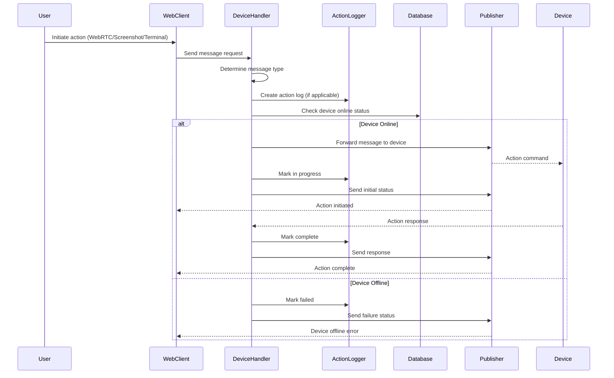

# Message Action Handler

## Overview

The Message Action Handler (`handleDeviceMessage`) manages general device messaging including WebRTC connections, screenshot capture, and terminal operations. This handler routes different message types, handles action logging, and manages real-time device communication.

## Handler Location

- **File**: `messageHandler.ts`
- **Function**: `handleDeviceMessage(message: InMessage): Promise<void>`

## Message Flow



## Supported Message Types

### WebRTC Messages
- `webrtc:connect` - WebRTC connection initiation
- `webrtc:answer` - WebRTC answer
- `webrtc:ice-candidate` - ICE candidate exchange
- `webrtc:response` - WebRTC response

### Screenshot Messages
- `screenshot:request` - Screenshot capture request
- `screenshot:response` - Screenshot response with image

### Terminal Messages
- `terminal:connected` - Terminal connection established
- `terminal:response` - Terminal response

## Request Payloads

### WebRTC Connect Request
```typescript
interface WebRTCConnectRequest {
  action: 'message';
  type: 'webrtc:connect';
  deviceId: string;
  // WebRTC connection data
  // ... other InMessage fields
}
```

### Screenshot Request
```typescript
interface ScreenshotRequest {
  action: 'message';
  type: 'screenshot:request';
  deviceId: string;
  quality?: number; // Image quality setting
  // ... other InMessage fields
}
```

### Screenshot Response
```typescript
interface ScreenshotResponse {
  action: 'message';
  type: 'screenshot:response';
  deviceId: string;
  image?: string; // Base64 encoded image
  success: boolean;
  // ... other InMessage fields
}
```

## Message Type Detection

### Known Message Types
```typescript
const isKnown = typeof type === 'string' && (
  type.startsWith('webrtc:') || 
  type.startsWith('screenshot:') || 
  type.startsWith('terminal:')
);

if (!isKnown) {
  logger.info(`[DeviceHandler] Delegating to messageHandler for non-WebRTC/screenshot message`);
  await messageHandler.handle(message);
  return;
}
```

### Response Detection
```typescript
const isResponse = type.endsWith(':response');
const isConnScoped = String(scope || '').startsWith('connection:') && type.startsWith('webrtc:');
```

## Echo Settings Computation

### Connection Scoping
```typescript
function computeEchoSettings(base: InMessage, isResponse: boolean, isConnectionScoped: boolean) {
  const scopeStr = String(base?.scope || '');
  const echo = isResponse || isConnectionScoped;
  const senderConn = base?.senderConnectionId || 
                    base?.connectionId ||
                    (scopeStr.startsWith('connection:') ? scopeStr.split(':')[1] : undefined);
  return echo ? { echoToSender: true, senderConnectionId: senderConn } : {};
}
```

## WebRTC Connection Handling

### Connection Initiation
```typescript
if (type === 'webrtc:connect') {
  try {
    const deviceId = payload?.deviceId as string | undefined;
    const connId = message.connectionId as string | undefined;
    const prot = message.protocol as any;
    
    if (deviceId) {
      // Create action log for terminal connection
      const created = await ActionLogger.createInitiated({
        deviceId,
        actionType: 'terminal',
        initiatedBy: message.userInfo.id,
        requestId: message.requestId,
        connectionId: connId,
        protocol: prot,
        initialMessage: 'Opening terminal…'
      });
      
      await ActionLogger.markInProgress(created.id, 'Connecting to terminal…');
      
      // Offline fast-fail
      try {
        const device = await prisma.device.findUnique({ 
          where: { id: deviceId }, 
          select: { connected: true } 
        });
        
        if (device && device.connected === false) {
          const fin = await ActionLogger.finalize(created.id, 'failed', 'Device is offline', 'offline');
          await publishDeviceStatus('terminal', deviceId, {
            deviceId,
            status: 'failed',
            message: 'Device is offline',
            logId: fin?.id ?? created.id,
            completedAt: fin?.completedAt,
            durationMs: fin?.durationMs,
            timestamp: new Date().toISOString()
          });
        }
      } catch {}
      
      // 3-minute timeout
      setTimeout(async () => {
        try {
          const current = await prisma.deviceActionLog.findUnique({ 
            where: { id: created.id }, 
            select: { status: true } 
          });
          
          if (current && (current.status === 'initiated' || current.status === 'in_progress')) {
            const finTO = await ActionLogger.finalize(created.id, 'failed', 'Timed out after 3 minutes');
            await publishDeviceStatus('terminal', deviceId, {
              deviceId,
              status: 'failed',
              message: 'Timed out after 3 minutes',
              logId: finTO?.id ?? created.id,
              completedAt: finTO?.completedAt,
              durationMs: finTO?.durationMs,
              timestamp: new Date().toISOString()
            });
          }
        } catch (timeoutErr) {
          logger.warn(`[DeviceHandler] Failed to process terminal timeout for ${created.id}: ${String(timeoutErr)}`);
        }
      }, 3 * 60 * 1000); // 3 minutes
    }
  } catch (e: any) {
    logger.warn(`[DeviceHandler] Failed to create terminal action log: ${String(e)}`);
  }
  
  // Forward webrtc:connect message to device immediately
  const routingMessage: RoutingMessage = MessageFactory.toRoutingMessage(message, overrides);
  await publisher.publish(routingMessage);
  return; // Don't process further
}
```

## Screenshot Handling

### Screenshot Request
```typescript
if (type === 'screenshot:request') {
  try {
    const connId = message.connectionId as string | undefined;
    const prot = message.protocol as any;
    const deviceId = payload?.deviceId as string | undefined;
    
    const created = await ActionLogger.createInitiated({
      deviceId: deviceId || 'unknown',
      actionType: 'snapshot',
      initiatedBy: message.userInfo.id,
      requestId: message.requestId,
      connectionId: connId,
      protocol: prot,
      metadata: { quality: payload?.quality ?? null },
      initialMessage: 'Initiating device snapshot'
    });
    
    await ActionLogger.markInProgress(created.id, 'Capturing screenshot…');
    
    // 2-minute timeout for screenshot
    setTimeout(async () => {
      try {
        const current = await prisma.deviceActionLog.findUnique({ 
          where: { id: created.id }, 
          select: { status: true } 
        });
        
        if (current && (current.status === 'initiated' || current.status === 'in_progress')) {
          const finTO = await ActionLogger.finalize(created.id, 'failed', 'Timed out after 2 minutes');
          await publishDeviceStatus('snapshot', deviceId!, {
            deviceId,
            status: 'failed',
            message: 'Timed out after 2 minutes',
            logId: finTO?.id ?? created.id,
            completedAt: finTO?.completedAt,
            durationMs: finTO?.durationMs,
            timestamp: new Date().toISOString()
          });
        }
      } catch (timeoutErr) {
        logger.warn(`[DeviceHandler] Failed to process screenshot timeout for ${created.id}: ${String(timeoutErr)}`);
      }
    }, 2 * 60 * 1000); // 2 minutes
  } catch (e: any) {
    logger.warn(`[DeviceHandler] Failed to create snapshot action log: ${String(e)}`);
  }
  
  // Forward screenshot:request message to device immediately
  const routingMessage: RoutingMessage = MessageFactory.toRoutingMessage(message, overrides);
  await publisher.publish(routingMessage);
  return; // Don't process further
}
```

### Screenshot Response
```typescript
if (type === 'screenshot:response') {
  try {
    const deviceId = payload?.deviceId as string | undefined;
    const hasImage = !!payload?.image;
    
    const updated = await ActionLogger.finalizeByRequestId(
      deviceId || 'unknown',
      message.requestId || '',
      hasImage ? 'success' : 'failed',
      hasImage ? 'Snapshot received' : 'Snapshot response missing image',
      hasImage ? undefined : 'No image'
    );
    
    // Add status information to the screenshot response payload
    const enhancedPayload = {
      ...payload,
      status: hasImage ? 'success' : 'failed',
      message: hasImage ? 'Snapshot received' : 'Snapshot response missing image',
      logId: updated?.id,
      completedAt: updated?.completedAt,
      durationMs: updated?.durationMs
    };
    
    // Create enhanced message with status info
    const enhancedMessage = {
      ...message,
      payload: enhancedPayload
    };
    
    // Forward the enhanced screenshot response (with image data + status) back to the client
    const routingMessage: RoutingMessage = MessageFactory.toRoutingMessage(enhancedMessage, {
      systemGenerated: true,
      sudo: true,
      // Don't override scope - keep the original connection scope from device
      ...computeEchoSettings(message, isResponse, isConnScoped)
    });
    await publisher.publish(routingMessage);
    
    // Also publish status update for UI (for action history, etc.)
    await publishDeviceStatus('snapshot', deviceId!, {
      deviceId,
      status: hasImage ? 'success' : 'failed',
      message: hasImage ? 'Snapshot received' : 'Snapshot response missing image',
      requestId: message.requestId,
      logId: updated?.id,
      completedAt: updated?.completedAt,
      durationMs: updated?.durationMs
    });
  } catch (e: any) {
    logger.warn(`[DeviceHandler] Failed to finalize snapshot action log: ${String(e)}`);
  }
}
```

## Terminal Connection Handling

### Terminal Connected
```typescript
if (type === 'terminal:connected') {
  try {
    const deviceId = payload?.deviceId as string | undefined;
    
    // Finalize last in-progress terminal action if present (avoid duplicate create)
    try {
      const updated = await prisma.deviceActionLog.findFirst({
        where: { 
          deviceId, 
          actionType: 'terminal', 
          OR: [{ status: 'initiated' }, { status: 'in_progress' }] 
        },
        orderBy: { initiatedAt: 'desc' },
        select: { id: true }
      });
      
      if (updated?.id) {
        const fin = await ActionLogger.finalize(updated.id, 'success', 'Terminal session established');
        await publishDeviceStatus('terminal', deviceId!, {
          deviceId,
          status: 'success',
          message: 'Terminal session established',
          logId: fin?.id ?? updated.id,
          completedAt: fin?.completedAt,
          durationMs: fin?.durationMs,
          timestamp: new Date().toISOString()
        });
        return;
      }
    } catch {}
    
    // Fallback: create and finalize if none in progress
    const created = await ActionLogger.createInitiated({
      deviceId: deviceId || 'unknown',
      actionType: 'terminal',
      initiatedBy: message.userInfo.id,
      connectionId: message.senderConnectionId || message.connectionId,
      protocol: message.protocol,
      initialMessage: 'Opening terminal'
    });
    
    await ActionLogger.markInProgress(created.id, 'Terminal connected');
    const fin = await ActionLogger.finalize(created.id, 'success', 'Terminal session established');
    
    await publishDeviceStatus('terminal', deviceId!, {
      deviceId,
      status: 'success',
      message: 'Terminal session established',
      logId: fin?.id ?? created.id,
      completedAt: fin?.completedAt,
      durationMs: fin?.durationMs,
      timestamp: new Date().toISOString()
    });
  } catch (e: any) {
    logger.warn(`[DeviceHandler] Failed to log terminal connected: ${String(e)}`);
  }
}
```

## Status Publishing

### Device Status Publishing
```typescript
async function publishDeviceStatus(topic: 'snapshot' | 'terminal', deviceId: string, data: Record<string, unknown>) {
  const type = topic === 'snapshot' ? 'device:snapshotStatus' : 'device:terminalStatus';
  const payload = topic === 'snapshot' ? { action: 'snapshotStatus', ...data } : { action: 'terminalStatus', ...data };
  
  const routing = MessageFactory.createSystemMessage(
    type,
    `subscription:device:${deviceId}`,
    payload,
    SystemUser,
    { echoToSender: false }
  );
  await publisher.publish(routing);
}
```

## Timeout Values

- **Terminal**: 3 minutes
- **Screenshot**: 2 minutes

## Error Scenarios

### 1. Unknown Message Type
- **Error**: Delegated to general message handler
- **Cause**: Message type not recognized
- **Response**: Handled by fallback handler

### 2. Device Offline
- **Error**: `Device is offline`
- **Cause**: Device not connected
- **Response**: Immediate failure with status update

### 3. Timeout
- **Error**: `Timed out after X minutes`
- **Cause**: Device didn't respond within timeout
- **Response**: Automatic failure after timeout

### 4. Action Log Failure
- **Error**: Action logging failure
- **Cause**: Database or logging system error
- **Response**: Operation continues with warning

## Success Flow

1. **Message Type Detection**: Determine message type and routing
2. **Action Logging**: Create action logs for trackable operations
3. **Device Check**: Verify device is online (for requests)
4. **Message Forwarding**: Forward message to device
5. **Progress Tracking**: Monitor operation progress
6. **Response Handling**: Process device responses
7. **Status Updates**: Send real-time status to UI

## Logging

### Info Level
```typescript
logger.info(`[DeviceHandler] Handling ${type.split(':')[0]} message: ${type}`);
logger.info(`[DeviceHandler] Delegating to messageHandler for non-WebRTC/screenshot message`);
```

### Warning Level
```typescript
logger.warn(`[DeviceHandler] Failed to create terminal action log: ${String(e)}`);
logger.warn(`[DeviceHandler] Failed to process terminal timeout for ${created.id}: ${String(timeoutErr)}`);
```

## Integration Points

### ActionLogger
- **Purpose**: Track device operations
- **Operations**: Create, update, finalize action logs
- **Features**: Timeout handling, progress tracking

### Database (Prisma)
- **Purpose**: Device status checking and log management
- **Operations**: Query device connection status, manage action logs
- **Schema**: Device table with connected field, DeviceActionLog table

### Publisher
- **Purpose**: Message routing and status updates
- **Scopes**: Device-specific and connection-specific subscriptions

### MessageFactory
- **Purpose**: Response message creation
- **Features**: System messages, status updates, echo settings

## Security Considerations

1. **Message Validation**: Validate message types and payloads
2. **Device Authentication**: Verify device identity
3. **Connection Scoping**: Proper connection and scope management
4. **Rate Limiting**: Prevent message spam
5. **Audit Logging**: Track all device operations

## Performance Notes

- **Database Queries**: Device status checks, action log operations
- **Response Time**: Immediate forwarding
- **Memory Usage**: Message payload dependent
- **Concurrency**: Thread-safe message handling
- **Timeout Protection**: Prevents hanging operations

## Testing Scenarios

### Valid Messages
1. WebRTC connection requests
2. Screenshot capture requests
3. Terminal connection requests
4. Various message types
5. Multiple concurrent operations

### Invalid Messages
1. Unknown message types
2. Offline devices
3. Malformed payloads
4. Timeout scenarios
5. Action log failures

## Related Handlers

- **Firmware Handler**: Manages firmware updates
- **Status Handler**: Manages device status updates
- **Logs Handler**: Manages log retrieval

## Dependencies

```typescript
import { ActionLogger } from '$lib/server/action-logger';
import { MessageFactory } from '../../interfaces/message';
import { publisher } from '../../core/publisher';
import { logger } from '$lib/server/logger';
import prisma from '$lib/server/prisma';
import { SystemUser } from '../../interfaces/message';
import { messageHandler } from '../messageHandler';
```
