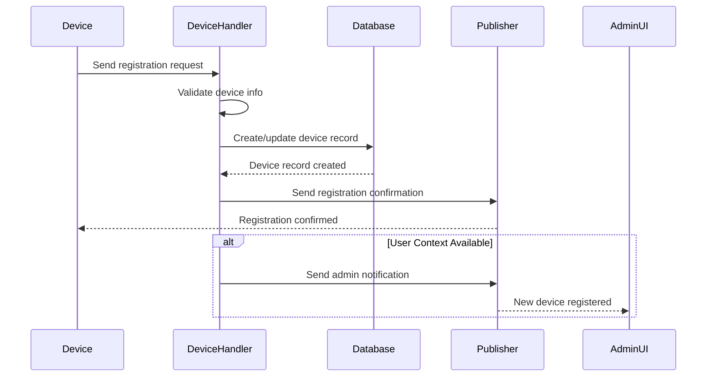

# Register Action Handler

## Overview

The Register Action Handler (`handleRegistration`) manages device registration when devices connect to the system. This handler processes device registration requests, validates device information, and creates/updates device records in the database.

## Handler Location

- **File**: `registrationHandler.ts`
- **Function**: `handleRegistration(message: InMessage): Promise<void>`

## Message Flow



## Request Payload

```typescript
interface RegistrationRequest {
  action: 'register';
  deviceId: string;
  pin: string;
  deviceInfo: {
    // Device-specific information
    name?: string;
    deviceType?: string;
    version?: string;
    capabilities?: string[];
    // ... other device properties
  };
  // ... other InMessage fields
}
```

## Response Payloads

### Success Response

```typescript
interface RegistrationSuccessResponse {
  action: 'registered';
  deviceId: string;
  timestamp: string; // ISO string
}
```

### Error Response

```typescript
interface RegistrationErrorResponse {
  action: 'device:register_error';
  success: false;
  error: 'Registration Failed';
  details: string; // Detailed error message
  code: string; // Error code
  requestId: string;
  timestamp: string; // ISO string
}
```

## Current Implementation Status

### ✅ Implemented Features
- Basic message routing
- Response message creation
- Admin notification system
- Error handling framework

### 🚧 TODO Items
- **PIN Validation**: Verify PIN is valid and not expired
- **Duplicate Check**: Check if device is already registered
- **Database Operations**: Create/update device record in database
- **Device Information Validation**: Validate device info format
- **Registration State Management**: Handle registration states

## Validation Logic

### 1. Device Information Validation
```typescript
// TODO: Implement comprehensive validation
// - Verify PIN is valid and not expired
// - Check if device is already registered
// - Validate device information format
```

### 2. Database Operations
```typescript
// TODO: Implement database operations
// - Create/update device record
// - Handle duplicate registrations
// - Update device status
```

## Error Scenarios

### 1. Validation Errors
- **Error**: `Validation Failed`
- **Cause**: Missing required fields or invalid format
- **Response**: 400 Bad Request

### 2. Database Errors
- **Error**: `Database Error`
- **Cause**: Database operation failure
- **Response**: 500 Internal Server Error

### 3. Duplicate Registration
- **Error**: `Device Already Registered`
- **Cause**: Device already exists in database
- **Response**: 409 Conflict

## Success Flow

1. **Request Validation**: Validate device information
2. **PIN Verification**: Check PIN validity and expiration
3. **Duplicate Check**: Verify device not already registered
4. **Database Update**: Create/update device record
5. **Confirmation**: Send registration confirmation to device
6. **Notification**: Notify admin UI of new device

## Logging

### Info Level
```typescript
logger.info(`[DeviceHandler] Device registered: ${deviceId}`);
```

### Error Level
```typescript
logger.error(`[DeviceHandler] Registration failed for device ${deviceId}:`, { error: errorMessage });
```

## Integration Points

### Database (Prisma)
- **Purpose**: Device record management
- **Operations**: Create, update, query device records
- **Schema**: Device table with registration fields

### Publisher
- **Purpose**: Message routing and delivery
- **Scopes**: Device-specific and admin notifications

### MessageFactory
- **Purpose**: Response message creation
- **Features**: Error handling, timestamp generation

## Security Considerations

1. **PIN Validation**: Server-side PIN verification
2. **Device Authentication**: Validate device identity
3. **Rate Limiting**: Prevent registration spam
4. **Audit Logging**: Track all registration attempts
5. **Data Validation**: Sanitize device information

## Performance Notes

- **Database Queries**: Single device record operation
- **Response Time**: Immediate response
- **Memory Usage**: Minimal (device info only)
- **Concurrency**: Thread-safe registration

## Testing Scenarios

### Valid Registrations
1. New device with valid PIN
2. Device re-registration with updated info
3. Different device types registration

### Invalid Registrations
1. Invalid PIN format
2. Expired PIN
3. Already registered device
4. Malformed device information
5. Missing required fields

## Related Handlers

- **Claim Handler**: Handles device claiming before registration
- **Status Handler**: Manages device status after registration
- **Message Handler**: Handles device communication

## Dependencies

```typescript
import { MessageFactory } from '../../interfaces/message';
import { publisher } from '../../core/publisher';
import { logger } from '$lib/server/logger';
```

## Future Enhancements

1. **Device Fingerprinting**: Unique device identification
2. **Registration Tokens**: Secure registration process
3. **Bulk Registration**: Support for multiple devices
4. **Registration Templates**: Predefined device configurations
5. **Auto-Configuration**: Automatic device setup after registration
