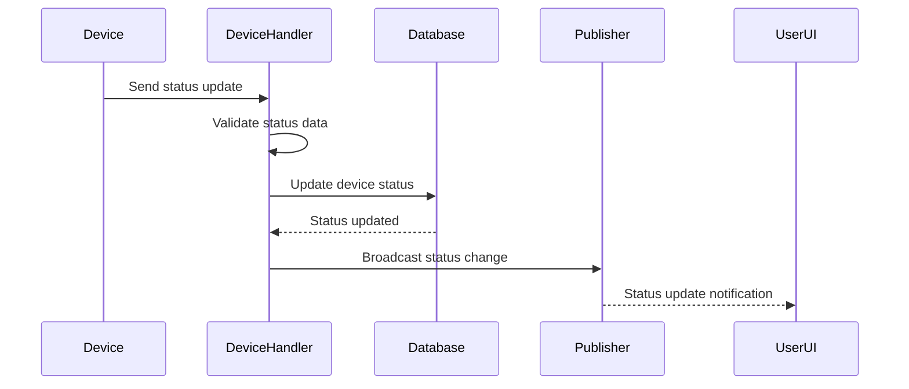

# Status Action Handler

## Overview

The Status Action Handler (`handleStatusUpdate`) manages device status updates from connected devices. This handler processes status change notifications, logs status updates, and manages device state transitions.

## Handler Location

- **File**: `statusHandler.ts`
- **Function**: `handleStatusUpdate(message: InMessage): Promise<void>`

## Message Flow



## Request Payload

```typescript
interface StatusUpdateRequest {
  action: 'status';
  deviceId: string;
  status: string; // New status value
  // ... other InMessage fields
}
```

## Current Implementation Status

### ✅ Implemented Features
- Basic message routing
- Status change logging
- Message payload extraction

### 🚧 TODO Items
- **Database Updates**: Update device status in database
- **User Notifications**: Notify relevant users about status changes
- **Status Validation**: Validate status transitions
- **Status History**: Track status change history
- **Real-time Updates**: Broadcast status changes to connected clients

## Validation Logic

### 1. Status Data Validation
```typescript
const { deviceId, status } = message.payload as any;
// TODO: Implement status validation
// - Validate status value against allowed states
// - Check device ownership
// - Verify status transition is valid
```

### 2. Database Operations
```typescript
// TODO: Implement database operations
// - Update device status in database
// - Create status change audit log
// - Update last seen timestamp
```

## Status Values

### Common Device Statuses
- `online` - Device is connected and operational
- `offline` - Device is disconnected
- `busy` - Device is processing a request
- `error` - Device encountered an error
- `maintenance` - Device is in maintenance mode
- `updating` - Device is updating firmware/software

### Status Transitions
```typescript
// TODO: Define valid status transitions
const validTransitions = {
  'online': ['offline', 'busy', 'error', 'maintenance'],
  'offline': ['online'],
  'busy': ['online', 'error'],
  'error': ['online', 'offline'],
  'maintenance': ['online', 'offline'],
  'updating': ['online', 'error']
};
```

## Error Scenarios

### 1. Invalid Status
- **Error**: `Invalid Status Value`
- **Cause**: Status not in allowed values list
- **Response**: 400 Bad Request

### 2. Invalid Transition
- **Error**: `Invalid Status Transition`
- **Cause**: Status change not allowed from current state
- **Response**: 400 Bad Request

### 3. Device Not Found
- **Error**: `Device Not Found`
- **Cause**: Device ID doesn't exist
- **Response**: 404 Not Found

### 4. Database Error
- **Error**: `Database Update Failed`
- **Cause**: Database operation failure
- **Response**: 500 Internal Server Error

## Success Flow

1. **Status Validation**: Validate new status value
2. **Transition Check**: Verify status transition is valid
3. **Database Update**: Update device status in database
4. **Audit Logging**: Create status change audit log
5. **Notification**: Broadcast status change to relevant users
6. **Response**: Send confirmation to device

## Logging

### Info Level
```typescript
logger.info(`[DeviceHandler] Status update from ${deviceId}:`, { status });
```

### Debug Level
```typescript
logger.debug(`[DeviceHandler] Status transition: ${oldStatus} -> ${newStatus} for device ${deviceId}`);
```

### Error Level
```typescript
logger.error(`[DeviceHandler] Status update failed for device ${deviceId}:`, { error: errorMessage });
```

## Integration Points

### Database (Prisma)
- **Purpose**: Device status persistence
- **Operations**: Update device status, create audit logs
- **Schema**: Device table with status field, status history table

### Publisher
- **Purpose**: Status change notifications
- **Scopes**: Device-specific and user-specific subscriptions

### MessageFactory
- **Purpose**: Status notification messages
- **Features**: Real-time status broadcasts

## Security Considerations

1. **Device Authentication**: Verify device identity
2. **Status Validation**: Validate status values and transitions
3. **Rate Limiting**: Prevent status spam
4. **Audit Logging**: Track all status changes
5. **Authorization**: Check device ownership

## Performance Notes

- **Database Queries**: Single device update operation
- **Response Time**: Immediate response
- **Memory Usage**: Minimal (status data only)
- **Concurrency**: Thread-safe status updates

## Testing Scenarios

### Valid Status Updates
1. Online to offline transition
2. Offline to online transition
3. Online to busy transition
4. Busy to online transition
5. Error state transitions

### Invalid Status Updates
1. Invalid status value
2. Invalid status transition
3. Non-existent device
4. Malformed request payload
5. Unauthorized device

## Related Handlers

- **Claim Handler**: Handles device claiming
- **Registration Handler**: Handles device registration
- **Message Handler**: Handles device communication

## Dependencies

```typescript
import { logger } from '$lib/server/logger';
// TODO: Add additional dependencies as needed
```

## Future Enhancements

1. **Status History**: Track status change history
2. **Status Analytics**: Analyze status patterns
3. **Status Alerts**: Alert on critical status changes
4. **Status Scheduling**: Scheduled status changes
5. **Status Dependencies**: Status changes based on other devices
